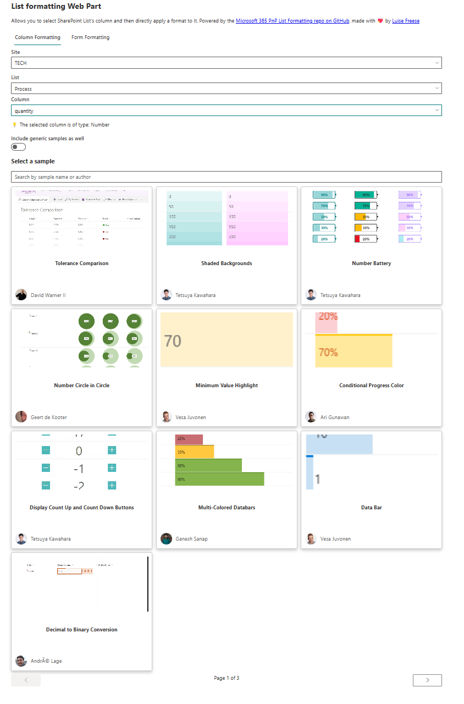
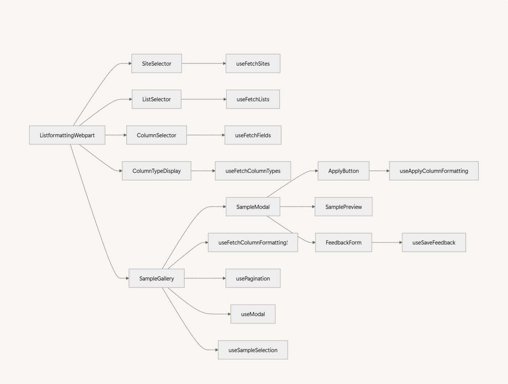

## Introduction

If you're a little bit like me and love working with SharePoint, you know how powerful it can be to format lists to make data more readable and visually appealing. But let's be honest, the process of finding and applying column formatting samples can be a bit tedious. That's why I decided to create an SPFx Web Part that simplifies this process. In this blog post, I'll walk you through how I built this web part using React, PnP.js, and Octokit.

## The Usual Process

Before I show you my the solution, let's talk about the usual process for applying column formatting:

1. Find the [Sample Solution Gallery](https://adoption.microsoft.com/sample-solution-gallery/) or the [List Formatting GitHub repo](https://github.com/pnp/List-Formatting): This is where you can find a gazillion of formatting samples contributed by the community
2. Find a sample that is applicable to your column type: Not all samples work for all column types, so you need to find the right one
Copy the code: Once you find the right sample, you copy the JSON code
3. Go back to your library: Navigate back to your SharePoint library
4. Paste the code: Finally, you paste the JSON code into the column formatting settings

## My Idea

I thought, *Wouldn't it be great if we could choose from all the cool column formatting samples and apply them directly to a column without all the back-and-forth?* So, I built a web part that integrates these samples seamlessly into SharePoint, where the work actually happens. This improves the user experience by making it easier and faster to apply column formatting.

To not make you scroll down, how this would look like: This is your sneak peek:



## Project Structure

Here's a mermaid diagram that illustrates the architecture of the web part:



### Explanation

* ListformattingWebpart: The main component that ties everything together
* SiteSelector: Allows users to select a SharePoint site
* ListSelector: Allows users to select a list from the selected site
* ColumnSelector: Allows users to select a column from the selected list
* ColumnTypeDisplay: Displays the type of the selected column
* SampleGallery: Displays a gallery of formatting samples
* SampleModal: Shows a preview of the selected sample
* ApplyButton: Allows users to apply the selected column format
* FeedbackForm: Allows users to submit feedback on the samples

Each component uses specific hooks to fetch data and manage state. For example, `useFetchSites` fetches the list of sites, `useFetchLists` fetches the lists, and so on. Using hooks makes my code modular, reusable, and easier to maintain. (Also I love that the individual files don't get to long this way)

## How to build this

### Selecting the Site, List, and Column

#### Fetching Sites

We start by allowing users to select a SharePoint site. We use the `useFetchSites` hook to fetch the list of sites using the SharePoint Search API. Here's how we integrate it into our SiteSelector component:

```typescript
import * as React from 'react';
import { useFetchSites } from './useFetchSites';
import { Dropdown, MessageBar } from '@fluentui/react';
import * as strings from 'ListformattingWebpartWebPartStrings';
import { WebPartContext } from '@microsoft/sp-webpart-base';

interface SiteSelectorProps {
  context: WebPartContext;
  onSiteChange: (siteUrl: string) => void;
  className?: string;
}

const SiteSelector: React.FC<SiteSelectorProps> = ({ context, onSiteChange, className }) => {
  const { sites, message, messageType } = useFetchSites(context);

  return (
    <div className={className}>
      {message && <MessageBar messageBarType={messageType}>{message}</MessageBar>}
      <Dropdown
        placeholder={strings.SelectSite}
        options={sites}
        label={strings.Sites}
        onChange={(event, option) => onSiteChange(option?.key as string)}
      />
    </div>
  );
};

export default SiteSelector;
```

#### Fetching Lists

Once a site is selected, we fetch the lists within that site using the `useFetchLists` hook. This hook uses the `sp.web.lists()` method from PnP.js to retrieve the lists.

#### Fetching Columns

After selecting a list, we fetch the columns using the `useFetchFields` hook. This hook uses the `sp.web.lists.getById(listId).fields()` method from PnP.js to retrieve the columns.

#### Displaying Column Type

We display the type of the selected column using the `useFetchColumnType` hook. This hook uses the `sp.web.lists.getById(listId).fields.getByInternalNameOrTitle(columnName)()` method from PnP.js to retrieve the column type.

#### Fetching Column Formatting Samples from GitHub

We use the `useFetchColumnFormattingSamples` hook to fetch column formatting samples from the GitHub repository. This hook leverages the **Octokit** library to interact with the GitHub API.

```typescript
import { useFetchColumnFormattingSamples } from './useFetchColumnFormattingSamples';
// ...other imports...

const SampleGallery: React.FC<SampleGalleryProps> = ({ columnType, includeGenericSamples, searchQuery }) => {
  const { samples, message, messageType, totalSamples } = useFetchColumnFormattingSamples(columnType, includeGenericSamples, searchQuery);

  return (
    <div>
      {message && <MessageBar messageBarType={messageType}>{message}</MessageBar>}
      <div>
        {samples.map(sample => (
          <SampleCard key={sample.key} sample={sample} />
        ))}
      </div>
    </div>
  );
};

export default SampleGallery;
```

#### Applying the Selected Formatting to the Column

We use the `useApplyColumnFormatting` hook to apply the selected column formatting. This hook uses the `sp.web.lists.getById(selectedList).fields.getByInternalNameOrTitle(selectedColumn).update()` method from PnP.js to apply the formatting.

```typescript
import { useApplyColumnFormatting } from './useApplyColumnFormatting';
// ...other imports...

const ApplyButton: React.FC<ApplyButtonProps> = ({ selectedList, selectedColumn, selectedSample, selectedSite, context, selectedListName, resetInputs }) => {
  const { applyColumnFormatting, message, messageType } = useApplyColumnFormatting(selectedList, selectedColumn, selectedSample, selectedSite, context, selectedListName, resetInputs);

  return (
    <div>
      {message && <MessageBar messageBarType={messageType}>{message}</MessageBar>}
      <PrimaryButton text={strings.Apply} onClick={applyColumnFormatting} />
    </div>
  );
};

export default ApplyButton;
```

#### Recording Feedback in a SharePoint List

We use the `useSaveFeedback` hook to save feedback submitted by users. This hook uses the `sp.web.lists.getByTitle('Listformatting-Feedback').items.add()` method from PnP.js to save the feedback.

```typescript
import { useSaveFeedback } from './useSaveFeedback';
// ...other imports...

const FeedbackForm: React.FC<FeedbackFormProps> = ({ context }) => {
  const { saveFeedback, feedbackSaved, error } = useSaveFeedback(context);

  const handleSubmit = (sampleName: string, rating: number, feedback: string, linkToSample: string) => {
    saveFeedback(sampleName, rating, feedback, linkToSample);
  };

  return (
    <div>
      {error && <MessageBar messageBarType={MessageBarType.error}>{error}</MessageBar>}
      {feedbackSaved && <MessageBar messageBarType={MessageBarType.success}>{strings.FeedbackSaved}</MessageBar>}
      <form onSubmit={handleSubmit}>
        {/* Form fields for sample name, rating, feedback, and link */}
        <PrimaryButton text={strings.SubmitFeedback} type="submit" />
      </form>
    </div>
  );
};

export default FeedbackForm;
```

## Conclusion

In this blog post, I showed how to create a powerful SPFx Web Part that allows users to select a site, list, and column, fetch column formatting samples from GitHub, apply the selected formatting to the column, and record feedback in a SharePoint list. Next up: Applying Form formats!

Happy coding!
