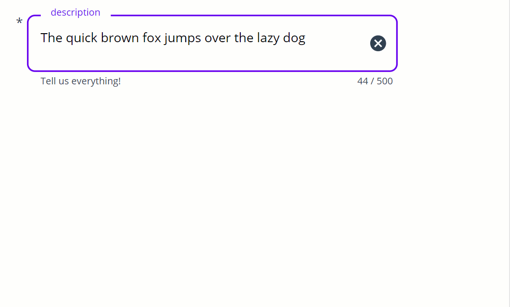
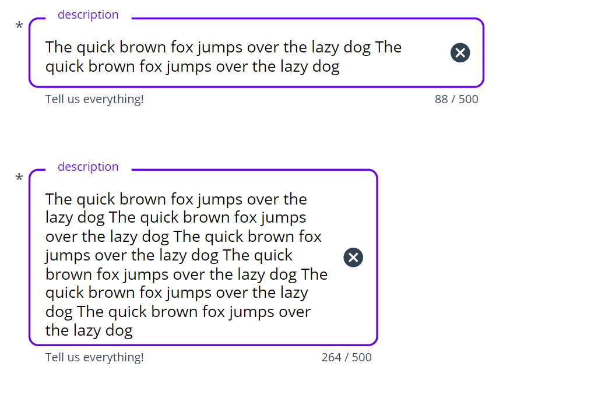

Some controls in Power Apps do not have an auto height property, which means that we can't get the **Height** of a control to automagically ✨ adjust to its content. Especially for the textinput control, this is a real bummer, as we a user's input a pretty much unpredictable. On the one hand, we do not want to waste precious screen estate by making the box as big as possible, on the other hand, a too small box will result in an endless scrollbar which is a bad user experience.

## Build a component with me

If you follow my blog posts then you might know that I love to componentize everything that I'd like to use again, and an auto-height textinput seems to tick that box as well.

1. Open [make.powerapps.com](https://make.powerapps.com)
2. Create a new component `cmp_textinput`
3. Create a custom input property **outsideMargin** (Number), `20` - determines the margin around the component
4. Create a custom output property **userText** (Text), `txt_userInput.Text` so that we can pass this value back to our app

### Make magic work

1. Insert a text label `lbl_autoHeightHelper` and a textinput `txt_userInput`
2. Make sure that the textinput sits on top
3. Set the **Mode** of the textinput to `Multiline`
4. Set the **X** and **Y** of the textinput to `cmp_textinput.outsideMargin`
5. Set the **Width** of the textinput to `cmp_textinput.Width-2*cmp_textinput.outsideMargin` - this makes sure, that when you horizontally resize the component, this also applies to the textinput as well
6. Set **Height** of the textinput to `Max(42, lbl_autoHeightHelper.Height)`
7. Set the **Text** of the text label to `txt_userInput1.Text`
8. Set **X** of the text label to `txt_userInput1.X` and **Y** to `txt_userInput1.Y`
9. Set **Width** of the text label to `txt_userInput1.Width`
10. Set the **Height** of the text label to `cmp_textinput.Height-2*cmp_textinput.outsideMargin`
11. Set the **auto height** of the text label to `true`
12. Set the **Color** of the text label to `Transparent`
13. For the text label, set **Font** to  `txt_userinput.Font`, **FontWeight** to `txt_userinput.FontWeight`, and **Size** to `txt_userinput.Size`
14. Set the **Width** of the text label to `txt_userInput.Width` and the **Height** to `Max(42, lbl_autoHeightHelper.Height)`

### Understand the magic

1. We utilize the auto height property of the text label and hook it to the **Height** property of the text input. The text label will get exactly the text in the Font, Size, FontWeight of the textinput, but as we set the **Color** to `Transparent`, it won't show up.
2. For the Width of the text input, we reference the width of the component itself so that we can make the textinput as wide as necessary by adjusting the size of the component instance in an app
3. The `Max(42, lbl_autoHeightHelper.Height)` for the **Height** of the textinput ensures that we always have 42 as a minimum Height and the **Height** of the text label (which has auto height enabled) as maximum Height

## Feedback and what's next

That's it!

a little hack to bring auto-height to controls that don't come with it out of the box. [Let me know what you think on twitter](https://twitter.com/LuiseFreese/status/1578056178323570694) or in the comments below!

Maybe you could spot in the screenshot above, that I added some more cool features to my component, such as a trailing icon (delete, error), a label, an asterisk. a helper and an error text, and an indicator of how many characters are still left. This is a sweet sneak preview on a Material design component library that I am building together with my dear friend and partner in crime [Robin Rosengrün](https://twitter.com/power_r2).

*First published on [m365princess.com](https://m365princess.com)*
