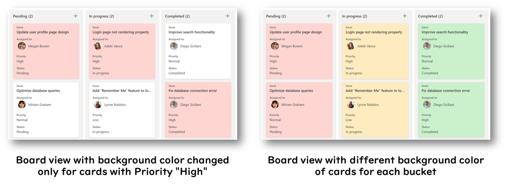
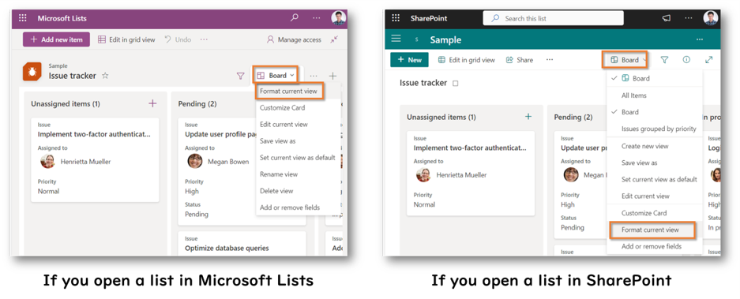

## Introduction

In a previous article, I wrote about [how to change the background color of cards in the Gallery View](https://pnp.github.io/blog/post/how-to-change-the-background-color-of-cards-in-the-gallery-view). In this article, I will show you how to change the background color of cards in the Board View. By changing the background color of certain cards to make them stand out, or by changing the background color of each classification, you can easily distinguish between cards.



The following describes how to change the background color of cards in the Board View of Microsoft Lists in advanced mode (formatting by coding).

## How to change the background color of cards in the Board View

1. Open the Board view
2. Select on the name of the view displayed on the command bar > Select **Format current view**

    

3. Select **Edit card**
4. Sort and show/hide content
5. Select **Advance mode**

    

6. Edit the JSON

   - If you want to set the background color of the cards by HTML color code or color name, add the following code to the div containing the `sp-card-subContainer` class (between lines 14 and 15).

        ```json
        "style": {
            "background-color": "*** HTML color code or name ***"
        },
        ```

        

        **Sample Code:** To set the background color to `pink` for cards with Priority "High" and `#87cefa` for cards with Priority "Normal":

        ```json
        "style": {
            "background-color": "=if([$Priority]=='High','pink',if([$Priority]=='Normal','#87cefa',''))"
        },
        ```

        

    - If you want to change the background color of the card using the [predefined CSS classes](https://learn.microsoft.com/sharepoint/dev/declarative-customization/column-formatting#predefined-classes), change the class value (line 13) of the div containing the `sp-card-subContainer` class as the following.

        ```json
        "class": "='sp-css-borderColor-neutralLight sp-card-borderHighlight sp-card-subContainer sp-card-subContainer-borderRadius '+'*** CSS Class name ***'"
        ```

        

        **Sample Code:** To set `sp-css-backgroundColor-BgGold` for the CSS of cards with Priority "High" and `ms-bgColor-white` for the other cards:

        ```json
        "class": "='sp-css-borderColor-neutralLight sp-card-borderHighlight sp-card-subContainer sp-card-subContainer-borderRadius '+if([$Priority]=='High','sp-css-backgroundColor-BgGold','ms-bgColor-white')"
        ```

        

7. Select **Preview** to see if the background color of the cards has changed
8. Select **Save**

This completes the background color change of the cards!

If you want to fix the JSON, select the name of the view displayed in the command bar, then select **Format current view** again.

## Additional notes

- If you want to use a column value as a condition, the column does not have to be visible on the card, but it must be included in the view. You can see which columns are included in a view by clicking on **Add or remove fields**.

  

- To use a column value as a condition, write something like `[$FieldName]`, where FieldName should be set to the internal name of the column, not the display name of the column. The internal name of the column can be found in the URL of the Edit Column screen.

  

- You can find a list and preview of the predefined CSS classes at [SharePoint Online CSS Classes](https://zerg00s.github.io/sp-modern-classes/) (created by [Denis Molodtsov](https://github.com/Zerg00s)). Also, you can view samples using the predefined CSS classes at [List Formatting Samples](https://pnp.github.io/List-Formatting/groupings/classes/sp-css-backgroundColor) (created by [Chris Kent](https://github.com/thechriskent)).

## References

- [List Formatting Samples](https://pnp.github.io/List-Formatting/)
- [Formatting syntax reference | Microsoft Learn](https://learn.microsoft.com/sharepoint/dev/declarative-customization/formatting-syntax-reference)
- [Board view customizations | Microsoft Learn](https://learn.microsoft.com/sharepoint/dev/declarative-customization/view-board-formatting)