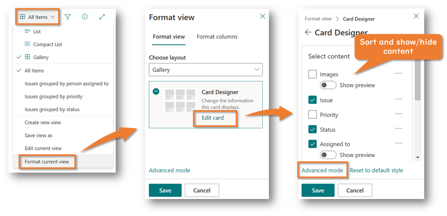

## Introduction

Have you ever used the Gallery View in Microsoft Lists? The Gallery View allows you to list items in a list in a card format, making it easy to see items visually.


And have you ever wanted to change the background color of these cards? Changing the background color makes it easier to distinguish between items. For example, color-coding by category or priority column value can help you quickly identify items and potentially increase your work efficiency.


The following describes how to change the background color of cards in the gallery view of Microsoft Lists in advanced mode (formatting by coding).

## How to change the background color of cards in the Gallery View

1. Open the Gallery view in Microsoft Lists
2. Select on the name of the view displayed on the command bar > Select **Format curret view**
3. Select **Edit card**
4. Sort and show/hide content
5. Select **Advance mode**

    

6. Add the following code to the `div` containing the `sp-card-subContainer` class (between lines 24 and 25)

    

    ``` json
    "style": {
      "background-color": "*** HTML color code or name ***"
    },
    ```

    - Sample 1 : If you want to make the background color of all cards `MistyRose`

        

        ``` json
        "style": {
          "background-color": "MistyRose"
        },
        ```

    - Sample 2 : If you want to change the background color of the cards for each value in the `Priority` column

        

        ``` json
        "style": {
          "background-color": "=if([$Priority]=='Low','#d5ffd5',if([$Priority]=='Normal','#ffffd5',if([$Priority]=='High','#ffd5ea','#ffffff')))"
        },
        ```

    - Sample 3 : If you want to change the background color of the cards alternately

        

        ``` json
        "style": {
          "background-color": "=if(@rowIndex%2==0,'#dddddd','#ffffff')"
        },
        ```

7. Select **Preview** to see if the background color of the cards has changed
8. Select **Save**

This completes the background color change of the cards!

## Additional notes

- If you want to use a column value as a condition, the column does not have to be visible on the card, but it must be included in the view. You can see which columns are included in a view selecting **Edit Current View**.

    

- To use a column value as a condition, write something like `[$FieldName]` (e.g., `[$Priority]`, `[$Category]`). FieldName must be set to the internal name of the column, not the display name of the column. The internal name of the column can be found in the URL of the Edit Column screen.

    

## References

- [List Formatting Samples](https://pnp.github.io/List-Formatting/)
- [Formatting syntax reference | Microsoft Learn](https://learn.microsoft.com/sharepoint/dev/declarative-customization/formatting-syntax-reference)
- [Format gallery view to customize SharePoint | Microsoft Learn](https://learn.microsoft.com/sharepoint/dev/declarative-customization/view-gallery-formatting)
