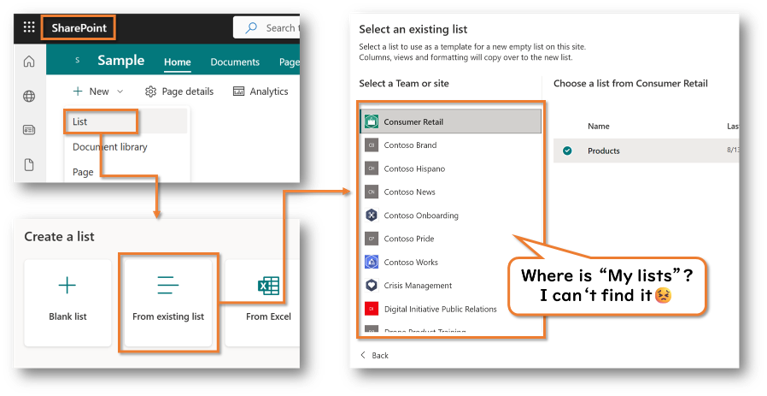
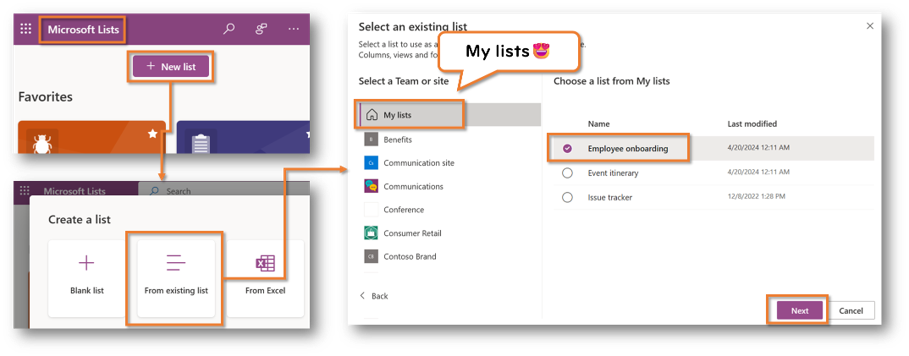

## Introduction

This article documents a Microsoft Lists operation that I had a little trouble with.

## What I had trouble with

I wanted to create a copy of a list created in My lists (lists in OneDrive for Business) on a SharePoint site. However, when I opened the list creation screen **on the SharePoint site** and opened the "From existing list" screen, "My lists" did not appear in the list of the source site of the copy.

## Solution

Instead, when I opened the list creation screen **in Microsoft Lists** and opened the "From existing list" screen, "My lists" appeared in the list of the source site, and I could copy the list of My lists to the SharePoint site.

