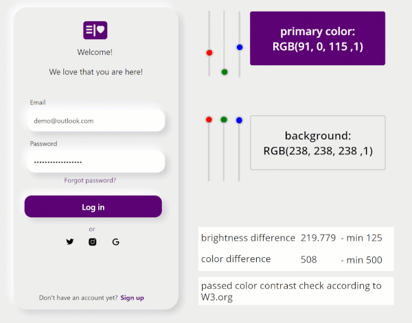

## tl:dr

Color contrast ratio is important for accessibility - here is how to build an in-app checker to build more accessible Power Apps

## What is an color-contrast-ratio checker and why would I care?

Although [Power Apps studio](https://make.powerapps.com) has a built-in Accessibility checker, which warns makers if they for example forgot an `AccessibleLabel` which is used by screen reader applications to announce what a control is about, it doesn't cover any issues that might occur regarding the contrast of used colors.

This means, that makers don't get a warning when they choose colors that don't match accessibility standards. The [Power Apps documentation](https://docs.microsoft.com/power-apps/maker/canvas-apps/accessible-apps-color) recommends a color contrast ratio for texts and backgrounds of at least 4.5:1 and for large text of at least 3:1, however there is no guidance on how to calculate this ratio and even then, the information is not where makers need them - in their app.

> Accessibilty is one of the most crucial design goals for every app and every website as we do not aim to proactively exclude people because we do not match their needs with appropriate features.

## Idea: Color-Contrast-Ratio checker for Power Apps -in Power Apps

What if makers had an app or even a hidden screen in all of their apps where they can check contrast ratio in the early stage of app development to avoid accessibility issues that are not addressed by the Power Apps Accessibility Checker?

### Requirements

- Let makers easily change the primary color and background color of their app
- Automatically calculates if the color contrast ratio is sufficient to fulfill [WCAG 2.1 Success Criteria](https://www.w3.org/WAI/WCAG21/Understanding/understanding-techniques)
- Informs maker about the outcome of that calculation

### How to let makers easily change the primary color and background color of their app

1. Insert some controls (buttons, TextLabels, Icons, TextInput, etc.) on your screen
2. Insert 3 slider controls reflecting the RGB values for the primary color
3. Set the `Max` property of all 3 sliders to 255
4. Rename the sliders to **sli_Red**, **sli_Green**, and **sli_Blue**
5. Insert a Button on the screen, rename it to **btn_primaryColor**
6. Set its `Fill` property to `RGBA(sli_Red.Value, sli_Green.Value, sli_Blue.Value,1)` - This button will now be our reference for the primary color the entire app
7. Insert another 3 slider controls reflecting the RGB values for the Background
8. Set the `Max` property of all 3 sliders to 255
9. Rename them accordingly
10. Insert another button on the screen, rename it to  **btn_backgroundColor**
11. Set its `Fill` property to `RGBA(sli_Red_1.Value, sli_Green_1.Value, sli_Blue_1.Value,1)` - This button will now be our reference for background color in the entire app
12. Set the `Text` property of the **btn_primaryColor** to `"primary color: RGB(" & sli_Red.Value & ", " & sli_Green.Value & ", " & sli_Blue.Value & " ,1) "`
13. Set the `text` property of the **btn_backgroundColor** to `"background: RGB(" & sli_Red_1.Value & ", " & sli_Green_1.Value & ", " & sli_Blue_1.Value & " ,1) "`
14. Set the `Fill` property of your screens background to `btn_backgroundColor.Fill`
15. Set the `Fill` property of the buttons you inserted in step 1 to `btn_primaryColor.Fill`
16. Set the `Color` property of the TextLabel  you inserted in step 1 to `btn_primaryColor.Fill`

If you now use the sliders for background color and primary color, you can see that the color of your two reference buttons changes and with them the entire color scheme of your app.

### How to automatically calculate if the color contrast ratio is sufficient to fulfill WCAG 2.1 Success Criteria

Let's first understand what needs to happen so that we can implement this in our app: For matching the WCAG 2.1 Success Criteria we need to take care of two important values:

1. brightness difference
2. color difference

The brightness difference is calculated as `(299*R_pc + 587*G_pc + 114*B_pc)/1000 - (299*R_bg + 587*G_bg + 114*B_bg)/1000`, where as `R` , `G`, `B` stands for Red, Green, Blue and `_pc` stand for primaryColor and `_bg` stands for BackgroundColor. The result of this calculation needs to be a number > 125.

In our app we will therefore calculate the brightness difference with  `(299*sli_Red.Value + 587*sli_Green.Value + 114*sli_Blue.Value)/1000 - (299*sli_Red_1.Value + 587*sli_Green_1.Value + sli_Blue_1.Value*237)/10

The color difference is calculated as `-((R_pc - R_bg) + (G_pc - G_bg + (B_pc - B_bg))`. The result of this calculation needs to be a number > 500.

In our app we will therefore calculate the color difference with  `-((sli_Red.Value -sli_Red_1.Value) + (sli_Green.Value-sli_Green_1.Value ) + (sli_Blue.Value-sli_Blue_1.Value))`

💡 **Important: Both conditions need to be fulfilled.**

### How to indicate the outcome of that calculation

Easiest part is now to make the result of these calculations visible to makers:

1. Insert a text label for `lblbrightnessDifference` and set the `Text` property to the brightness formula shown above
2. Set the `Color` property to `If(Value(Self.Text) < 125, Red, Black)`
3. Insert a text label for `lblColorDifference` and set the `Text` property to the color formula shown above
4. Set the `If(Value(Self.Text) < 500, Red, Black)`
5. Insert another text label and set the `Text` property to `If(Value(lblColorDifference.Text) < 500  Or Value(lblBrightnessDifference.Text) <125, "failed color contrast check according to W3.org", "passed color contrast check according to W3.org")`

## What are your thoughts?

How do you improve color contrast ratio in your apps and make sure that you comply to WCAG 2.1 Success Criteria? [Let me know on twitter](https://twitter.com/LuiseFreese/status/1543608968551043073) or comment below.
