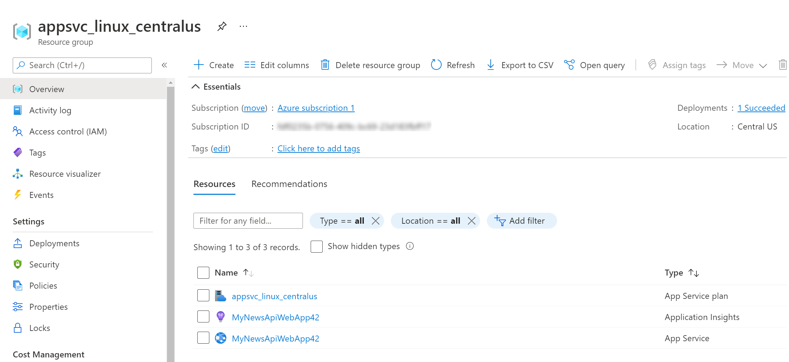
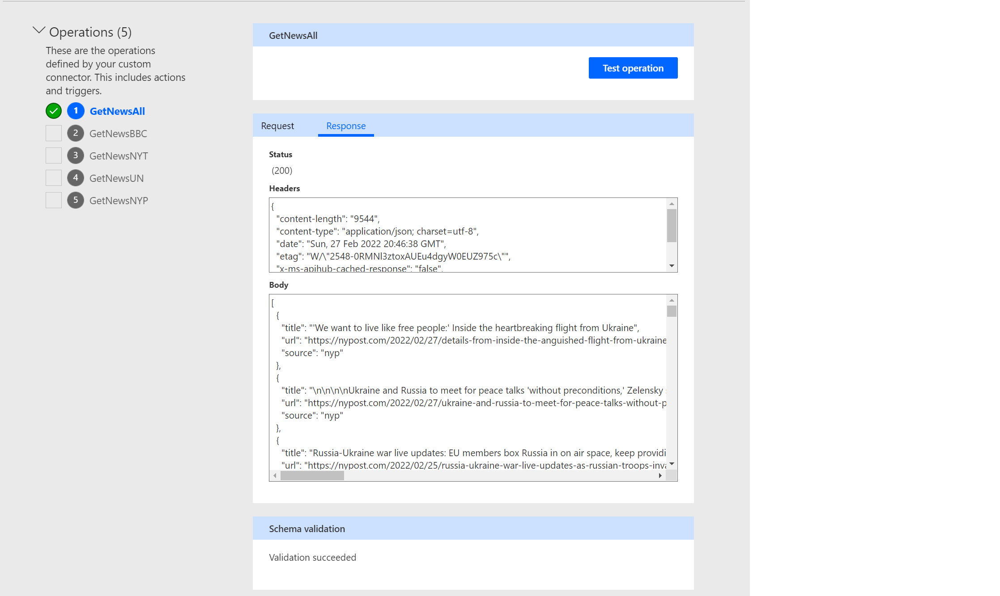
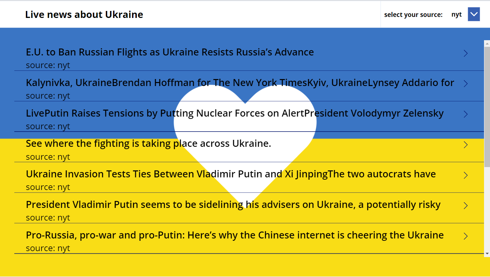

In this blog post I am going to cover

*   How to create an API with JavaScript
*   How to deploy this to Azure
*   How to wrap the API into a custom connector
*   How to use the connector in Power Apps

Don’t know what is an API? Don’t worry, here is help:

> Imagine, you are dining in a restaurant (this is the app/client). You do not talk to the kitchen (server/database) directly, but you can send requests to the API, which is our waiter\*waitress. They will request dishes from the kitchen and get them in return and then respond back to you.

Operations you could do are

*   GET (request data from a server)
*   POST (send new information to a server)
*   PUT (make changes to existing data on a server by replacing the entire entity)
*   PATCH (make changes to existing data on a server by updating provided fields)
*   DELETE (remove existing information from a server)

## How to approach things

In this example, we only want to do GET requests, as we want to read news from different newspaper websites such as BBC, New York Times and New York Post. In order to achieve that, we will scrape the websites of these sources and extract title and URL of the articles. We will later deploy this to Azure as a web app and wrap the API into a custom connector for Power Platform. Last thing is then consuming this custom connector in a Canvas app.

### 1\. make it work on your machine

*   Create a new directory on your computer and navigate into it
*   Make sure you have [node.js](https://nodejs.org/en/) installed
*   Run `npm init`, which prompts you to answer some questions about your project (you can just hit return). It will then create a `package.json` file in your project for you. It contains some metadata about your app such as your name, the version and the license. You can change the file according to your needs.
*   Create an `index.js` file as an entrypoint for the app
*   Install the following dependencies
    *   [cheerio](https://www.npmjs.com/package/cheerio), which allows us to parse HTML to get exactly the data we need from a website
    *   [axios](https://www.npmjs.com/package/axios), to ease the process of HTTP requests for CRUD operation
    *   [express](https://www.npmjs.com/package/express), as backend framework for node.js - this will be our listener 

Dependencies will show up in your `package.json` file

You can also see now, that you have a `package-lock.json` file - you may want to have a look, but we won’t touch this file

We will now go ahead, open our `index.js` file and first create the listener:

```typescript
const PORT = process.env.PORT || 8000 

const axios = require('axios')
const cheerio = require('cheerio')
const express = require('express')

const app = express()

app.listen(PORT, () => console.log(`my server is running on PORT ${PORT} 🚀`))
```

You can of course use a port of your choice.

We can now create our first endpoint:

```typescript
app.get('/', (req, res) => {
    res.json('Welcome to my 📰 News API')
})
```

This endpoint sits at the root `/` and displays just a little welcome message. You can later delete that, it’s just to see if things already work.

Now we want to create an array of newspapers/sources that we later want to loop over.

As some of them don’t provide their baseURL when linking to an article on their website but only a relative path, it’s a good idea to have a baseURL property.

```typescript
const newspapers = [
    {
        name: 'nyt',
        address: 'https://www.nytimes.com/',
        baseURL: ''
    },
    {
        name: 'un',
        address: 'https://www.un.org/',
        baseURL: ''
    },
    {
        name: 'bbc',
        address: 'https://www.bbc.co.uk/news/',
        baseURL: 'https://www.bbc.co.uk'
    },
    {
        name: 'nyp',
        address: 'https://nypost.com/',
        baseURL: ''
    }
]
```

Next step is to create an empty array of articles and then loop over all newspapers to fill the array with articles

*   Visit the address using axios,
*   Save the response (this is the entire HTML of the website)
*   Pass this HTML into cheerio
*   Look for elements with an `a` tag that contains “Ukraine”
*   Grab the title (text) and the URL (which us the `href` attribute)
*   Push this as an object into our articles array

```typescript
const articles = []

newspapers.forEach(newspaper => {
    axios.get(newspaper.address)
        .then(response => {
            const pageHTML = response.data
            const $ = cheerio.load(pageHTML)

            $('a:contains("Ukraine")', pageHTML).each(function () {
                const title = $(this).text()
                const url = $(this).attr('href')

                articles.push({
                    title,
                    url: newspaper.baseURL + url,
                    source: newspaper.name
                })
            })

        })
})
```

We now want to see this work in action - and create an endpoint `/news` for it:

```typescript
app.get('/news', (req, res) => {
    res.json(articles)
})
```

If you now visit `localhost:8000/news` ,you should see an array of of objects displaying title, source and URL of articles of all your sources. So far, so good. but what if we want to filter the sources with `/news/nyt` or `/news/bbc`?

Let’s introduce the `newspaperId`. We will again do the same axios and cheerio magic once again - Our new array is now called `specificArticles` and will also contain the id of the source.

```typescript
app.get('/news/:newspaperId', (req, res) => {
    const newspaperId = req.params.newspaperId

    const newspaperAddress = newspapers.filter(newspaper => newspaper.name == newspaperId)[0].address
    const newspaperBase = newspapers.filter(newspaper => newspaper.name == newspaperId)[0].base

    
    axios.get(newspaperAddress)
        .then(response => {
            const pageHTML= response.data
            const $ = cheerio.load(pageHTML)
            const specificArticles = []

            $('a:contains("Ukraine")', pageHTML).each(function () {
                const title = $(this).text()
                const url = $(this).attr('href')
                specificArticles.push({
                    title,
                    url: newspaperBase + url,
                    source: newspaperId
                })
            })
            res.json(specificArticles)
        }).catch(err => console.log(err))
})
```   

You can now test this with `localhost:8000/news/bbc` or `localhost:8000/news/nyt`

Please do yourself a favor and create a `.gitignore` file with

```
node_modules
```

so that you later on don’t commit the node modules.

### 2\. Make it work on Azure

Cool, we made a service work on our machine, but more people could benefit if we deployed this API now to Azure. The service we will be using here is an Azure Web app. As I am a Windows person, I’d like to try more things on Linux, so we will be creating a Linux app :nerd\_face:

1.  Open VS Code or the terminal of your choice
2.  make sure you have [Azure CLI](https://docs.microsoft.com/cli/azure/install-azure-cli) installed
3.  Create a new web app with the following command: `az webapp up --sku F1 --name <mywebapp42> --location <location-name>`

please note:

*   the name of the webapp needs to be globally unique
*   the location is optional - if you don’t know which region you want to use, you can get a list with `az appservice list-locations --sku F1`
*   if you don’t like Linux, use `--os-type Windows`

The web app will be created for you, this can take a few moments, as it does not only create the web app for you, but also automatically creates a resource group and an App service plan. It also packs and deploys your local project.

In the output, you will see something like:

    Starting zip deployment. This operation can take a while to complete ...
    Deployment endpoint responded with status code 202
    You can launch the app at http://<mywebapp42>.azurewebsites.net
    

Select that link! In case you didn’t delete the root endpoint, you should now see the greeting ❤ Test your other endpoints as well! Also go to the [Azure portal](https://portal.azure.com/) and check the resources that have been created for you.

It should look something like this:



### 3\. Wrap your API into a custom connector

Now that we have a cool API, let’s use it in Power Platform!

1.  Open [flow.microsoft.com](https://flow.microsoft.com/)
2.  Select **Data**, select **Custom Connectors**
3.  Select **New**
4.  in the **General** for **Host** enter your new app URL `http://<mywebapp42>.azurewebsites.net`
5.  Don’t do anything in the Security tab - this is a public API and we don’t need authenticated access
6.  On the **Definition** tab, select **New action**
7.  For **Summary**, **Description**, and **Operation ID** enter something like `GetNewsAll`
8.  Select **Import from sample** for **Request**
9.  Select **Get** and paste in the URL `http://<mywebapp42>.azurewebsites.net/news`
10.  Select **Add a default response** and paste an array in it - you don’t need actual values, the schema is enough.

```json
[
    {
        "title": "string",
        "url": "string",
        "source": "string"
    },
    {
        "title": "string",
        "url": "string",
        "source": "string"
    }
]
```

11.  Select **Create connector**
12.  you may want to test your connector on the **Test** tab. To do so, select **New Connection** and then select **Test operation** \- This should return an HTTP code 200 and you should see some real data.



Repeat the steps 6-12 for the other endpoints that you created (i.e. `/news/bbc)` You can also pass in the newspaperId as a parameter.

### 4\. Consume the custom connector in a Canvas app

1.  Open [make.powerapps.com](https://make.powerapps.com/)
2.  Create a new canvas app from blank - don’t forget to save it
3.  In the left hand bar, select **Data** and add your custom connector
4.  Create a gallery and set its **Items** property to `Defaulttitle.GetNewsAll()`
5.  Set the
    *   **Text** property of the **Title** label of the gallery to `ThisItem.title`,
    *   **Text** property of the **Subtitle** label of the gallery to `ThisItem.source`,
    *   **Onselect** property of the icon of the gallery to `Launch(ThisItem.url)`

You can even create a dropdown menu that holds the different sources so that users can change what they want to consume.



## Conclusion

You can wrap ANY API into a custom connector for Power Platform - even the ones that you create. 

## Resources

Some helpful resources:   
  
[Quickstart: Create a Node.js web app - Azure App Service | Microsoft Docs](https://docs.microsoft.com/azure/app-service/quickstart-nodejs?pivots=development-environment-cli&tabs=linux)

[How to Scrape Websites with Node.js and Cheerio (freecodecamp.org)](https://www.freecodecamp.org/news/how-to-scrape-websites-with-node-js-and-cheerio/)

[Create a custom connector from scratch | Microsoft Docs](https://docs.microsoft.com/connectors/custom-connectors/define-blank)

[How to use a custom connector in Power Automate (m365princess.com)](https://www.m365princess.com/blogs/2021-02-23-how-to-use-a-custom-connector-in-power-automate/)

[Working with Custom Connectors in Power Platform for beginners (michaelroth42.com)](https://www.michaelroth42.com/post/2022-01-03-working-with-apis-in-power-platform-for-beginners-part-2/)

First published on [https://m365princess.com](https://m365princess.com)
