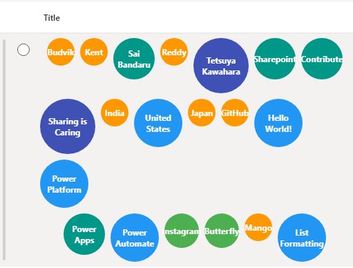
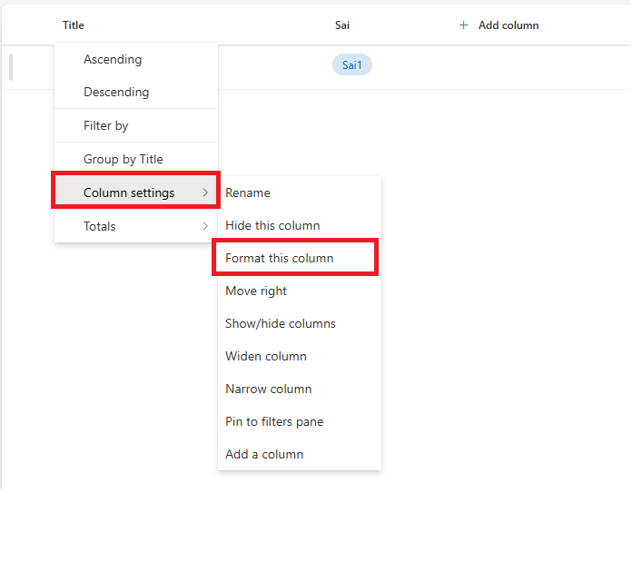
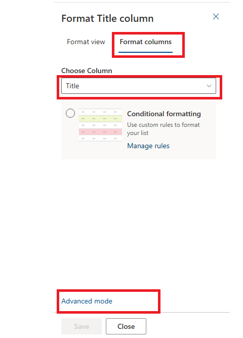
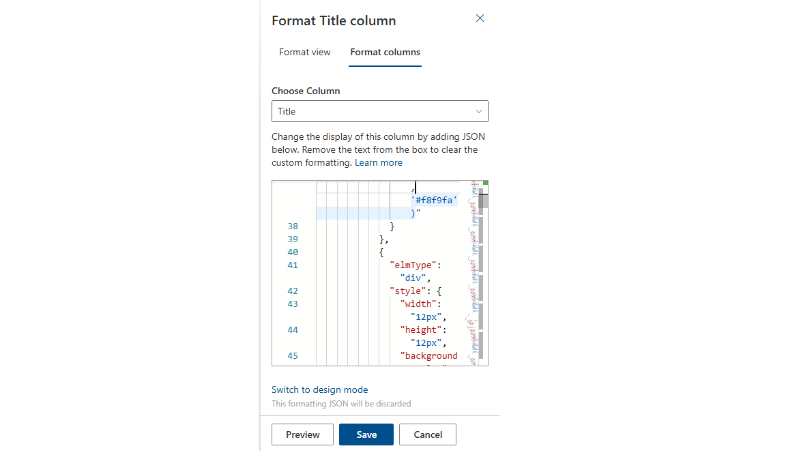
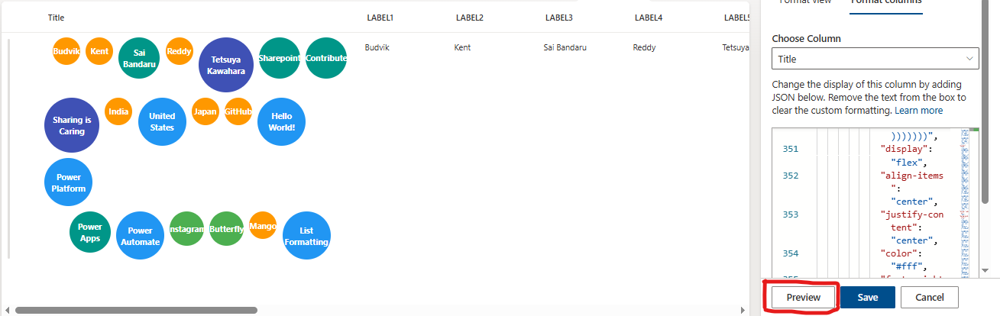
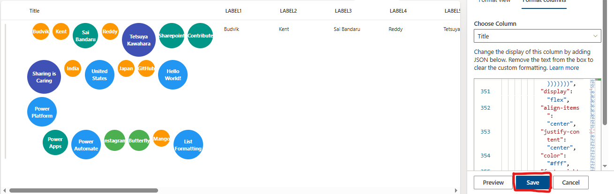

# Microsoft Lists: How to Create Dynamic Bubble Charts Using Column Formatting

## Introduction

Data visualization transforms raw information into compelling visual narratives that users can understand at a glance. While Microsoft Lists provides excellent organizational capabilities, creating engaging visual representations often requires creative approaches. In this post, we'll explore how to build dynamic bubble charts within SharePoint lists using column formatting JSON, where each bubble's size and color automatically adapt based on the content length of your data.

Bubble charts are powerful visualization tools that use circular elements of varying sizes to represent data relationships and hierarchies. By implementing dynamic bubble charts in Microsoft Lists, you can create intuitive interfaces for survey analysis, keyword visualization, skill assessment, or any scenario where multiple data points need proportional visual representation.



## What We're Building

Our solution creates a responsive, multi-row bubble chart that displays content from up to 20 label columns. Each bubble features:

- **Dynamic sizing** based on character length (30px to 120px diameter)
- **Intelligent color coding** using a vibrant 9-color palette
- **Perfect circular shape** with centered text alignment
- **Multi-row layout** preventing horizontal overcrowding
- **Responsive design** that adapts to different screen sizes
- **White text on colored backgrounds** for optimal contrast

The bubble chart uses sophisticated mathematical expressions to calculate visual properties, ensuring that longer text content receives larger, more prominent bubbles while maintaining visual harmony across the entire chart.

## View Requirements

Create a SharePoint list with the following column structure:

| Internal Name | Type                |
|---------------|---------------------|
| **Title**     | Single line of text |
| LABEL1    | Single Line of Text |
| LABEL2    | Single Line of Text |
| LABEL3    | Single Line of Text |
| LABEL4    | Single Line of Text |
| LABEL5    | Single Line of Text |
| LABEL6    | Single Line of Text |
| LABEL7    | Single Line of Text |
| LABEL8    | Single Line of Text |
| LABEL9    | Single Line of Text |
| LABEL10   | Single Line of Text |
| LABEL11   | Single Line of Text |
| LABEL12   | Single Line of Text |
| LABEL13   | Single Line of Text |
| LABEL14   | Single Line of Text |
| LABEL15   | Single Line of Text |
| LABEL16   | Single Line of Text |
| LABEL17   | Single Line of Text |
| LABEL18   | Single Line of Text |
| LABEL19   | Single Line of Text |
| LABEL20   | Single Line of Text |


> **Note:** You can extend beyond 20 labels by adding more columns and corresponding JSON bubble elements. Each LABEL column represents a data point that will appear as a bubble in the chart.

## Sample Data

| LABEL1 | LABEL2 | LABEL3 | LABEL4 | LABEL5 |
|-------|--------|--------|--------|--------|--------|
| Sharing is Caring | Mango      | Banana    | Apple  | Sai Bandaru |

The bubble chart automatically calculates appropriate sizes and colors based on each label's character count, creating immediate visual hierarchy.

## The Mathematics Behind Bubble Generation

The bubble chart uses nested conditional logic to create proportional visual relationships between content length and bubble properties:

### Size Calculation Algorithm
Bubbles are sized using a comprehensive 8-tier system:

- **>25 characters** → `120px` (largest, for detailed descriptions)
- **>20 characters** → `100px` (large phrases)
- **>17 characters** → `90px` (medium-large terms)
- **>15 characters** → `80px` (medium terms)
- **>11 characters** → `70px` (standard terms)
- **>9 characters** → `60px` (short phrases)
- **>6 characters** → `50px` (short words)
- **>3 characters** → `40px` (brief terms)
- **≤3 characters** → `30px` (smallest, for abbreviations)

### Color Mapping System
The color palette uses Material Design-inspired colors for visual appeal and differentiation:

- **Tier 1 (>25 chars):** `#448aff` (Light Blue)
- **Tier 2 (>20 chars):** `#e91e63` (Pink)
- **Tier 3 (>17 chars):** `#9c27b0` (Purple)
- **Tier 4 (>15 chars):** `#3f51b5` (Indigo)
- **Tier 5 (>11 chars):** `#2196f3` (Blue)
- **Tier 6 (>9 chars):** `#009688` (Teal)
- **Tier 7 (>6 chars):** `#4caf50` (Green)
- **Tier 8 (>3 chars):** `#ff9800` (Orange)
- **Tier 9 (≤3 chars):** `#795548` (Brown)

### Layout Architecture

#### Main Container Structure
The bubble chart uses a hierarchical layout with multiple rows:

```json
{
  "elmType": "div",
  "style": {
    "display": "flex",
    "flex-wrap": "wrap",
    "gap": "8px",
    "padding": "6px",
    "flex-direction": "column"
  }
}
```

#### Row-Based Organization
Each row contains multiple bubbles using horizontal flex layout:

```json
{
  "elmType": "div",
  "style": {
    "display": "flex",
    "flex-wrap": "wrap",
    "gap": "8px"
  }
}
```

#### Individual Bubble Construction
Each bubble is a perfectly centered circular element:

```json
{
  "elmType": "div",
  "style": {
    "width": "=if(indexOf([$LABEL1]+'@','@')>25,'120px',if(indexOf([$LABEL1]+'@','@')>20,'100px',if(indexOf([$LABEL1]+'@','@')>17,'90px',if(indexOf([$LABEL1]+'@','@')>15,'80px',if(indexOf([$LABEL1]+'@','@')>11,'70px',if(indexOf([$LABEL1]+'@','@')>9,'60px',if(indexOf([$LABEL1]+'@','@')>6,'50px',if(indexOf([$LABEL1]+'@','@')>3,'40px','30px'))))))))",
    "height": "=if(indexOf([$LABEL1]+'@','@')>25,'120px',if(indexOf([$LABEL1]+'@','@')>20,'100px',if(indexOf([$LABEL1]+'@','@')>17,'90px',if(indexOf([$LABEL1]+'@','@')>15,'80px',if(indexOf([$LABEL1]+'@','@')>11,'70px',if(indexOf([$LABEL1]+'@','@')>9,'60px',if(indexOf([$LABEL1]+'@','@')>6,'50px',if(indexOf([$LABEL1]+'@','@')>3,'40px','30px'))))))))",
    "border-radius": "50%",
    "background-color": "=if(indexOf([$LABEL1]+'@','@')>25,'#448aff',if(indexOf([$LABEL1]+'@','@')>20,'#e91e63',if(indexOf([$LABEL1]+'@','@')>17,'#9c27b0',if(indexOf([$LABEL1]+'@','@')>15,'#3f51b5',if(indexOf([$LABEL1]+'@','@')>11,'#2196f3',if(indexOf([$LABEL1]+'@','@')>9,'#009688',if(indexOf([$LABEL1]+'@','@')>6,'#4caf50',if(indexOf([$LABEL1]+'@','@')>3,'#ff9800','#795548'))))))))",
    "display": "flex",
    "align-items": "center",
    "justify-content": "center",
    "color": "#fff",
    "font-weight": "bold",
    "text-align": "center"
  },
  "txtContent": "[$LABEL1]"
}
```

### Character Length Detection Method
The expression `indexOf([$LABEL1]+'@','@')` efficiently calculates string length by:
1. Concatenating '@' to the field value
2. Finding the index position of the '@' character
3. Using that position as the accurate character count

This technique works within SharePoint's expression limitations where direct length functions aren't available in column formatting contexts.

## How to Implement

### Step 1: Prepare Your SharePoint Environment
1. Navigate to your SharePoint site or Microsoft Lists
2. Create a new list or open an existing one
3. Add the required LABEL columns (LABEL1 through LABEL20)
4. Populate your list with sample data of varying lengths to test the visualization

### Step 2: Apply the Bubble Chart Formatting
1. Click on the column header for the "Title" column
2. Select "Column settings" > "Format this column"
    
3. Choose "Advanced mode"
    
4. Replace the existing JSON with the provided code
    
    
5. Click "Preview" to see the results
    
6. Click "Save" to apply the formatting
    

### Step 3: Testing and Validation
Create multiple list items with labels of different lengths to observe:
- Size variations across the 9-tier system
- Color distribution across the spectrum
- Multi-row layout behavior
- Text centering within circular boundaries
- Responsive behavior at different screen sizes

## Advanced Customization Techniques

### Expanding the Bubble Count
To add more bubbles beyond the default 20, extend the JSON structure:

```json
{
  "elmType": "div",
  "style": {
    "width": "=if(indexOf([$LABEL21]+'@','@')>25,'120px',if(indexOf([$LABEL21]+'@','@')>20,'100px',if(indexOf([$LABEL21]+'@','@')>17,'90px',if(indexOf([$LABEL21]+'@','@')>15,'80px',if(indexOf([$LABEL21]+'@','@')>11,'70px',if(indexOf([$LABEL21]+'@','@')>9,'60px',if(indexOf([$LABEL21]+'@','@')>6,'50px',if(indexOf([$LABEL21]+'@','@')>3,'40px','30px'))))))))",
    "height": "=if(indexOf([$LABEL21]+'@','@')>25,'120px',if(indexOf([$LABEL21]+'@','@')>20,'100px',if(indexOf([$LABEL21]+'@','@')>17,'90px',if(indexOf([$LABEL21]+'@','@')>15,'80px',if(indexOf([$LABEL21]+'@','@')>11,'70px',if(indexOf([$LABEL21]+'@','@')>9,'60px',if(indexOf([$LABEL21]+'@','@')>6,'50px',if(indexOf([$LABEL21]+'@','@')>3,'40px','30px'))))))))",
    "border-radius": "50%",
    "background-color": "=if(indexOf([$LABEL21]+'@','@')>25,'#448aff',if(indexOf([$LABEL21]+'@','@')>20,'#e91e63',if(indexOf([$LABEL21]+'@','@')>17,'#9c27b0',if(indexOf([$LABEL21]+'@','@')>15,'#3f51b5',if(indexOf([$LABEL21]+'@','@')>11,'#2196f3',if(indexOf([$LABEL21]+'@','@')>9,'#009688',if(indexOf([$LABEL21]+'@','@')>6,'#4caf50',if(indexOf([$LABEL21]+'@','@')>3,'#ff9800','#795548'))))))))",
    "display": "flex",
    "align-items": "center",
    "justify-content": "center",
    "color": "#fff",
    "font-weight": "bold",
    "text-align": "center"
  },
  "txtContent": "[$LABEL21]"
}
```

### Custom Color Schemes

**Corporate Professional Theme:**
```json
"background-color": "=if(indexOf([$LABEL1]+'@','@')>25,'#1f4e79',if(indexOf([$LABEL1]+'@','@')>20,'#2f5f8f',if(indexOf([$LABEL1]+'@','@')>17,'#4472c4',if(indexOf([$LABEL1]+'@','@')>15,'#5b9bd5',if(indexOf([$LABEL1]+'@','@')>11,'#70ad47',if(indexOf([$LABEL1]+'@','@')>9,'#ffc000',if(indexOf([$LABEL1]+'@','@')>6,'#ff9900',if(indexOf([$LABEL1]+'@','@')>3,'#c65911','#7f7f7f'))))))))"
```

**Warm Sunset Theme:**
```json
"background-color": "=if(indexOf([$LABEL1]+'@','@')>25,'#d63031',if(indexOf([$LABEL1]+'@','@')>20,'#e84393',if(indexOf([$LABEL1]+'@','@')>17,'#fd79a8',if(indexOf([$LABEL1]+'@','@')>15,'#fdcb6e',if(indexOf([$LABEL1]+'@','@')>11,'#f39c12',if(indexOf([$LABEL1]+'@','@')>9,'#e67e22',if(indexOf([$LABEL1]+'@','@')>6,'#d35400',if(indexOf([$LABEL1]+'@','@')>3,'#8b4513','#2c3e50'))))))))"
```

### Size Customization Options

**Compact Bubbles:**
```json
"width": "=if(indexOf([$LABEL1]+'@','@')>25,'80px',if(indexOf([$LABEL1]+'@','@')>20,'70px',if(indexOf([$LABEL1]+'@','@')>17,'60px',if(indexOf([$LABEL1]+'@','@')>15,'55px',if(indexOf([$LABEL1]+'@','@')>11,'50px',if(indexOf([$LABEL1]+'@','@')>9,'45px',if(indexOf([$LABEL1]+'@','@')>6,'40px',if(indexOf([$LABEL1]+'@','@')>3,'35px','30px'))))))))"
```

**Large Display Bubbles:**
```json
"width": "=if(indexOf([$LABEL1]+'@','@')>25,'160px',if(indexOf([$LABEL1]+'@','@')>20,'140px',if(indexOf([$LABEL1]+'@','@')>17,'120px',if(indexOf([$LABEL1]+'@','@')>15,'105px',if(indexOf([$LABEL1]+'@','@')>11,'90px',if(indexOf([$LABEL1]+'@','@')>9,'75px',if(indexOf([$LABEL1]+'@','@')>6,'60px',if(indexOf([$LABEL1]+'@','@')>3,'50px','40px'))))))))"
```

### Layout Modifications

**Single Row Layout:**
```json
{
  "elmType": "div",
  "style": {
    "display": "flex",
    "flex-wrap": "wrap",
    "gap": "8px",
    "padding": "6px"
  }
}
```

**Tighter Spacing:**
```json
"gap": "4px",
"padding": "4px"
```

**Generous Spacing:**
```json
"gap": "16px",
"padding": "12px"
```

## Use Cases and Real-World Applications

### Project Management Dashboards
Visualize project components, tasks, or deliverables where bubble size indicates complexity or scope. Larger bubbles immediately highlight major project elements requiring attention.

### Survey and Feedback Analysis
Transform survey responses, comments, or feedback categories into bubble charts where response length naturally creates visual emphasis for detailed feedback versus brief comments.

### Skill and Competency Visualization
Display employee skills, certifications, or areas of expertise where specialized (longer-named) skills receive visual prominence through larger bubbles.

### Product Feature Mapping
Showcase product features, capabilities, or specifications where comprehensive features naturally appear larger than basic ones, creating intuitive feature hierarchies.

### Content Tag Analysis
Visualize content tags, keywords, or metadata where descriptive tags automatically receive more visual weight than simple category labels.

### Performance Metrics Display
Present KPIs, metrics, or performance indicators where detailed metric names get appropriate visual emphasis compared to simple numeric identifiers.

## Technical Performance and Considerations

### Rendering Efficiency
- All calculations performed client-side using SharePoint's native expression engine
- No external API calls or additional resource loading required
- Efficient rendering with hundreds of list items
- Compatible with all modern browsers and SharePoint Online
- Optimized mathematical expressions for minimal processing overhead

### Browser Compatibility
- Full CSS3 flexbox support required (IE11 minimum)
- Border-radius support for circular shapes
- Modern font rendering for optimal text centering

## Troubleshooting Common Issues

### Bubbles Not Displaying
**Problem**: Column formatting doesn't appear or shows errors
**Solutions**:
- Verify you're in "Advanced mode" when applying JSON
- Check that all LABEL column names match exactly (case-sensitive)
- Validate JSON syntax using an online JSON validator
- Ensure target column exists with correct internal name

### Incorrect Bubble Sizes
**Problem**: Bubbles don't size appropriately for content length
**Solutions**:
- Test with known character lengths to verify size calculations
- Check that the `indexOf` expression calculates correctly
- Verify special characters aren't interfering with length detection
- Confirm nested if statements are properly structured

### Layout Problems
**Problem**: Bubbles don't arrange properly or overflow
**Solutions**:
- Ensure container divs have proper flex properties
- Check gap and padding values are appropriate for screen size
- Test responsiveness by resizing browser window
- Verify row-based div structure is correct

### Color Issues
**Problem**: Colors don't display or appear incorrectly
**Solutions**:
- Verify hex color codes are properly formatted (#rrggbb)
- Check browser compatibility for CSS color support
- Test with different color values to isolate issues
- Ensure conditional color logic matches size logic

## Advanced Implementation Strategies

### Dynamic Content-Based Coloring
Combine length-based sizing with content-based coloring:

```json
"background-color": "=if([$LABEL1]=='Critical','#dc3545',if([$LABEL1]=='Important','#fd7e14',if(indexOf([$LABEL1]+'@','@')>15,'#448aff','#6c757d')))"
```

### Integration with Choice Fields
Modify bubble properties based on related choice column values:

```json
"border": "=if([$Priority]=='High','3px solid #dc3545','2px solid transparent')",
"box-shadow": "=if([$Status]=='Complete','0 0 10px rgba(40,167,69,0.5)','none')"
```

### Multi-Language Considerations
Adjust character thresholds for languages with different average word lengths:

```json
"width": "=if(indexOf([$LABEL1]+'@','@')>30,'120px',if(indexOf([$LABEL1]+'@','@')>25,'100px',if(indexOf([$LABEL1]+'@','@')>20,'90px',if(indexOf([$LABEL1]+'@','@')>15,'80px',if(indexOf([$LABEL1]+'@','@')>12,'70px',if(indexOf([$LABEL1]+'@','@')>10,'60px',if(indexOf([$LABEL1]+'@','@')>7,'50px',if(indexOf([$LABEL1]+'@','@')>4,'40px','30px'))))))))"
```

## Security and Accessibility Guidelines

### Data Privacy Considerations
- Bubble charts display all label content visually
- Ensure sensitive information isn't included in displayed columns
- Consider data classification requirements before implementation
- Review SharePoint permissions for formatted content

### Accessibility Compliance
- Ensure sufficient color contrast ratios for all bubble colors
- Consider color-blind users when selecting color palettes
- Test with screen readers for proper content accessibility
- Provide alternative text descriptions where appropriate
- Ensure keyboard navigation works properly with formatted content

### Content Guidelines
- Keep label text concise for optimal display within circular boundaries
- Consider text wrapping behavior for longer content
- Test with various content lengths to ensure readability
- Provide hover tooltips for truncated content when necessary

## Future Enhancement Possibilities

While SharePoint column formatting has inherent limitations, potential improvements could include:

- **Interactive bubble selection** with click-through actions
- **Animation effects** for bubble appearance and size changes
- **Dynamic bubble positioning** based on data relationships
- **Integration with Power BI** for advanced bubble chart analytics
- **Real-time data updates** with automatic bubble recalculation

## Conclusion

Dynamic bubble charts represent an innovative approach to data visualization within SharePoint's native formatting capabilities. By combining mathematical precision with intuitive visual design, we can transform static label data into engaging, proportional displays that immediately communicate data relationships and hierarchies.

This solution demonstrates how creative application of SharePoint's column formatting can produce sophisticated visualizations without requiring custom development, third-party tools, or complex SharePoint Framework solutions. The mathematical approach to sizing and coloring ensures consistency while providing meaningful visual differentiation that enhances data comprehension and user engagement.

Whether you're managing project portfolios, analyzing survey data, tracking skills and competencies, visualizing product features, or displaying any collection of categorized information, dynamic bubble charts can significantly improve the visual impact and analytical value of your Microsoft Lists.

The multi-row layout prevents interface overcrowding while maintaining the proportional relationships that make bubble charts effective. The result is a clean, professional visualization that scales well across different screen sizes and data volumes.

## GitHub Code

- [sharepoint-bubble-chart-column-formatting](https://github.com/pnp/List-Formatting/tree/master/column-samples/generic-bubble-chart)

## Additional Resources

- [SharePoint Column Formatting Documentation](https://docs.microsoft.com/en-us/sharepoint/dev/declarative-customization/column-formatting)
- [SharePoint JSON Schema Reference](https://developer.microsoft.com/json-schemas/sp/v2/column-formatting.schema.json)
- [PnP Community - List Formatting Samples](https://github.com/pnp/List-Formatting)
- [Microsoft Lists Advanced Formatting Examples](https://docs.microsoft.com/en-us/sharepoint/dev/declarative-customization/column-formatting#examples)
- [CSS Flexbox Guide](https://developer.mozilla.org/en-US/docs/Web/CSS/CSS_Flexible_Box_Layout/Basic_Concepts_of_Flexbox)

Try implementing this bubble chart solution in your Microsoft Lists and experiment with different color schemes, sizing algorithms, and layout configurations to create visualizations that perfectly match your organization's data visualization needs!