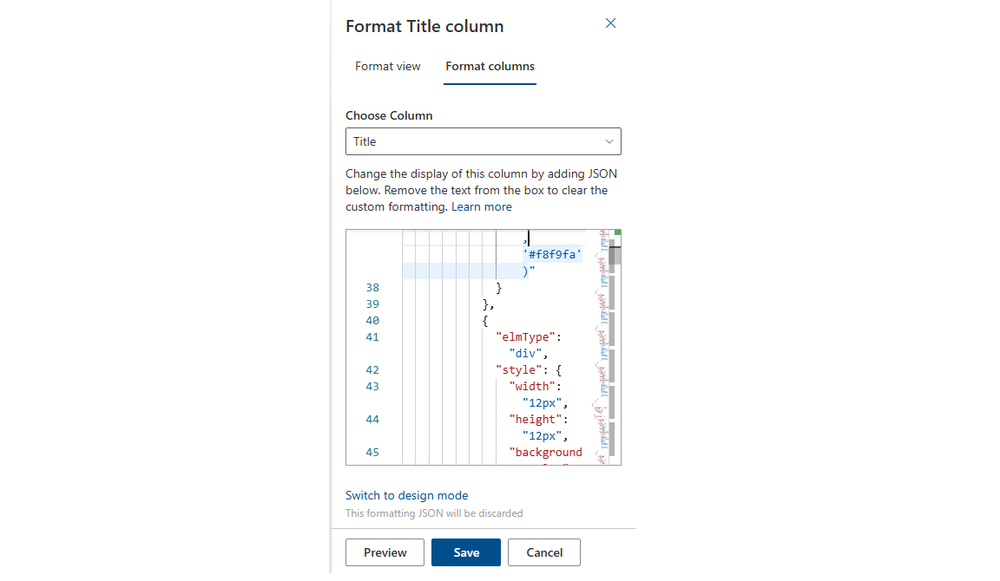

# Microsoft Lists: How to Create Dynamic Identicons Based on Title Length

## Introduction

Visual elements play a crucial role in making data more engaging and easier to identify at a glance. While Microsoft Lists provides powerful functionality for organizing and managing information, sometimes you need that extra visual flair to make your lists stand out. In this post, we'll explore how to create dynamic identicons (visual representations) that change based on the length of your list item titles using SharePoint column formatting.

Identicons are geometric patterns that serve as visual identifiers, commonly used in applications like GitHub for user avatars. By implementing dynamic identicons in Microsoft Lists, you can create a more visually appealing and functional interface that helps users quickly identify and differentiate list items.


## What We're Building

Our solution creates a 6x7 grid of colored squares that form unique patterns based on the character count of the title field. Each identicon will be symmetrical and use a mathematical approach to determine which squares are colored, ensuring that items with the same title length will have identical identicons while different lengths create distinct patterns.


## View Requirements

Create a SharePoint list with the following columns:

| Internal Name   | Type                     |
|-----------------|--------------------------|
| **Title**       | Single line of text      |
| **TitleLength** | Calculated (Number)      |

> **TitleLength formula:**  
> ```
> =LEN([Title])
> ```  
> This calculates the number of characters in the `Title` and is used to generate the identicon pattern.

## Sample Data

| Title          | TitleLength |
|----------------|------------|
| Sai            | 3         |
| Megh           | 2         |
| Budvik         | 5         |

The identicon pattern automatically updates based on `TitleLength`.


## The Mathematics Behind the Pattern

The identicon generation uses modular arithmetic to create symmetrical patterns. Here's how it works:

- We create a 6x7 grid of 12x12 pixel squares
- The pattern is determined by the title length (`[$TitleLength]`)
- Each square's color is determined by checking if the title length modulo various numbers (2, 3, 4, 5, 6, 7, 8) is greater than 0
- Blue squares (`#3498db`) appear when the condition is true, light gray squares (`#f8f9fa`) when false
- The pattern is symmetrical both horizontally and vertically

### Main Container
The root element is a flexbox container that holds both the identicon and the title text side by side:
```json
{
  "elmType": "div",
  "style": {
    "display": "flex",
    "align-items": "center",
    "gap": "8px",
    "padding": "4px"
  }
}
```

### Identicon Grid
The identicon itself is built as a column of 6 rows, each containing 6 squares:
```json
{
  "elmType": "div",
  "style": {
    "display": "flex",
    "flex-direction": "column"
  }
}
```

### Individual Squares
Each square uses conditional formatting to determine its color:
```json
{
  "elmType": "div", 
  "style": { 
    "width": "12px", 
    "height": "12px", 
    "background-color": "=if(Number([$TitleLength])%2>0,'#3498db','#f8f9fa')" 
  }
}
```

The `Number([$TitleLength])%X>0` expression checks if the title length divided by X has a remainder, creating different patterns based on divisibility.


## How to Implement

### Step 1: Create or Access Your Microsoft List
1. Navigate to your SharePoint site
2. Create a new Microsoft List or open an existing one
3. Ensure you have a "Title" column (this is standard in most lists)

### Step 2: Add the Column Formatting
1. Click on the column header for the "Title" column
2. Select "Column settings" > "Format this column"
    
3. Choose "Advanced mode"
    
4. Replace the existing JSON with the provided code
    
    
5. Click "Preview" to see the results
    
6. Click "Save" to apply the formatting
    

### Step 3: Test the Results
Create several list items with titles of different lengths to see how the identicons change:
- titles (1-6 characters) will create simpler patterns

## Customization Options

### Color Scheme
You can easily modify the color scheme by changing the color values:
- `#3498db` - Current blue color for active squares
- `#f8f9fa` - Current light gray for inactive squares

For example, to use a green and white theme:
```json
"background-color": "=if(Number([$TitleLength])%2>0,'#27ae60','#ffffff')"
```

### Pattern Complexity
Adjust the modular arithmetic to create different patterns:
- Use smaller divisors (2, 3, 4) for simpler patterns
- Use larger divisors (7, 8, 9) for more complex patterns
- Mix prime numbers for more unique distributions

### Size Adjustments
Modify the square dimensions and spacing:
```json
"width": "16px",    // Larger squares
"height": "16px",
"gap": "12px"       // More spacing between identicon and title
```

Modify the square dimensions and spacing:
```json
"width": "8px",    // small squares
"height": "8px",
"gap": "6px"       // less spacing between identicon and title
```

## Use Cases and Benefits

### Project Management
In project tracking lists, identicons help quickly distinguish between different project types or categories based on naming conventions.

### Document Libraries
When combined with document libraries, identicons can provide visual cues for document types or categories based on title length patterns.

### Team Collaboration
Team members can quickly identify their items in shared lists, especially when consistent naming conventions create recognizable patterns.

### Data Visualization
Identicons add a layer of visual information that can help users process large amounts of data more efficiently.

## Performance Considerations

The identicon generation is lightweight and doesn't impact list performance significantly:
- All calculations are done client-side using SharePoint's built-in column formatting
- No external API calls or complex JavaScript required
- Renders quickly even with hundreds of list items
- Compatible with all modern browsers

## Troubleshooting

### Identicon Not Appearing
- Ensure you're in "Advanced mode" when adding the JSON
- Verify the JSON syntax is correct (use a JSON validator if needed)
- Check that the Title column exists and has the internal name "Title"

### Patterns Look Wrong
- Confirm that `[$TitleLength]` is calculating correctly
- Test with known title lengths to verify pattern generation
- Check browser compatibility (modern browsers required)

### Formatting Errors
- Copy the JSON carefully to avoid character encoding issues
- Use a plain text editor if copying from formatted documents
- Validate JSON structure before applying

## Advanced Techniques

### Using Hash Functions
For more sophisticated pattern generation, you could extend the concept to use hash-like functions based on the actual title content rather than just length.

### Multiple Field Dependencies
The pattern could incorporate multiple fields by using expressions like:
```json
"=if((Number([$TitleLength]) + Number([$Priority]))%3>0,'#3498db','#f8f9fa')"
```

### Conditional Color Schemes
Different color schemes could be applied based on other field values:
```json
"=if([$Status]=='Complete','#27ae60',if(Number([$TitleLength])%2>0,'#3498db','#f8f9fa'))"
```

## Conclusion

Dynamic identicons provide a creative and functional way to enhance Microsoft Lists with visual elements that adapt to your content. By leveraging SharePoint's column formatting capabilities, you can create unique, mathematically-generated patterns that help users quickly identify and differentiate list items.

This approach demonstrates the power of SharePoint's formatting engine and shows how creative use of basic mathematical operations can produce sophisticated visual results. The symmetrical, deterministic nature of these identicons ensures consistency while providing meaningful visual variety.

Whether you're managing projects, organizing documents, or tracking any kind of structured data, dynamic identicons can add both aesthetic appeal and functional value to your Microsoft Lists experience.

## Github Code

- [how-to-create-dynamic-identicons-based-on-title-length](https://github.com/pnp/List-Formatting/tree/master/column-samples/generic-identicon)

## Additional Resources

- [SharePoint Column Formatting Documentation](https://docs.microsoft.com/en-us/sharepoint/dev/declarative-customization/column-formatting)
- [SharePoint JSON Schema Reference](https://developer.microsoft.com/json-schemas/sp/v2/column-formatting.schema.json)
- [PnP Community - List Formatting Samples](https://github.com/pnp/List-Formatting)

Try implementing this solution in your own Microsoft Lists and experiment with different patterns and color schemes to match your organization's branding and functional needs!
