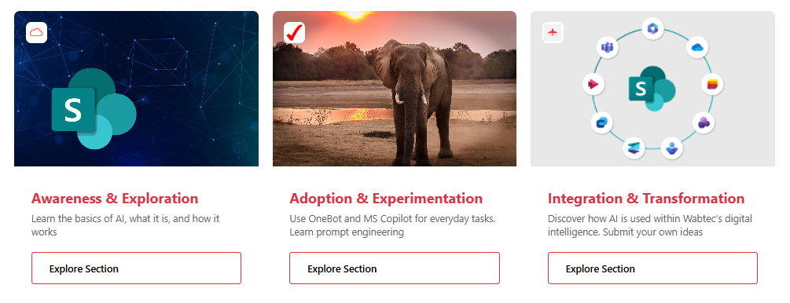

## Introduction

Creating visually appealing and interactive content displays is essential for engaging users and improving information accessibility. Microsoft Lists offers powerful formatting capabilities that go beyond basic data tables. In this post, we'll explore how to transform your list items into modern, professional content cards featuring image headers, icon overlays, and interactive buttons using SharePoint tile formatting.

These interactive content cards are perfect for showcasing resources, highlighting content sections, or creating visual navigation experiences. Each card combines visual impact with functional elements to create an engaging user interface that encourages exploration and interaction.



## What We're Building

Our solution creates polished content cards with the following features:
- **Fixed 365x400px card dimensions** for consistent layout
- **220px image header** as the visual focal point
- **Circular icon badge overlay** for branding or categorization
- **Title and description content area** with clear typography
- **"Explore Section" call-to-action button** linking to external resources
- **Modern card design** with rounded corners and professional styling

Each card maintains a clean, consistent appearance while displaying unique content, creating a gallery-like experience that's both functional and visually appealing.

## View Requirements

Create a SharePoint list with the following columns:

| Internal Name   | Type                     | Description |
|-----------------|--------------------------|-------------|
| **Title**       | Single line of text      | Card title/heading |
| **Description** | Multiple lines of text   | Card description/summary |
| **Image**       | Single line of text      | Main card background image URL |
| **IconUrl**     | Single line of text      | Small icon for overlay badge |
| **Url**         | Hyperlink                | Target URL for the button |

### Setup Tips
- **Image field**: Upload images to your site assets library and use the full URL
- **IconUrl field**: Use 24x24px PNG or SVG icons for best results
- **Url field**: Use the Hyperlink column type for proper link formatting

## Sample Data

| Title                  | Description                                      | Image URL | IconUrl | Url |
|------------------------|--------------------------------------------------|-----------|---------|-----|
| Product Documentation  | Comprehensive guides for all our products        | [image-url] | [icon-url] | https://docs.example.com |
| Training Resources     | Video tutorials and interactive learning paths   | [image-url] | [icon-url] | https://training.example.com |
| Community Forum        | Connect with peers and get support               | [image-url] | [icon-url] | https://community.example.com |

The cards automatically render with consistent styling regardless of content length.

## The Architecture Behind the Card

The card uses SharePoint's tile formatting schema to create a structured, visually rich experience. Let's break down the key components:

### Card Container
The root element establishes the card's foundation with rounded corners and overflow management:
```json
{
  "elmType": "div",
  "style": {
    "border-radius": "8px",
    "overflow": "hidden",
    "font-family": "Segoe UI, Arial, sans-serif",
    "display": "flex",
    "flex-direction": "column",
    "margin-right": "20px"
  }
}
```

### Image Header with Icon Overlay
The header section combines a full-width image with a positioned icon badge:
```json
{
  "elmType": "img",
  "attributes": {
    "src": "[$Image.displayValue]"
  },
  "style": {
    "width": "100%",
    "height": "220px",
    "object-fit": "cover"
  }
}
```

The circular icon overlay uses absolute positioning:
```json
{
  "elmType": "div",
  "style": {
    "position": "absolute",
    "top": "16px",
    "left": "16px",
    "background-color": "#ffffff",
    "border-radius": "25%",
    "width": "30px",
    "height": "30px"
  }
}
```

### Content Section
The content area displays title and description with carefully chosen typography:
```json
{
  "elmType": "span",
  "style": {
    "font-size": "20px",
    "font-weight": "700",
    "color": "#dc3545",
    "margin": "12px 0 6px 0"
  },
  "txtContent": "[$Title]"
}
```

### Call-to-Action Button
The interactive button uses border styling and opens links in new tabs:
```json
{
  "elmType": "a",
  "attributes": {
    "href": "[$Url]",
    "target": "_blank"
  },
  "style": {
    "padding": "12px 24px",
    "border": "1px solid #dc3545",
    "border-radius": "4px",
    "font-weight": "600"
  },
  "txtContent": "Explore Section"
}
```

## How to Implement

### Step 1: Prepare Your Assets
1. Upload background images to your SharePoint site assets library
2. Upload icon images (24x24px recommended)
3. Copy the full URLs for each image

### Step 2: Create Your List
1. Navigate to your SharePoint site
2. Create a new list or use an existing one
3. Add all required columns as specified in the View Requirements section

### Step 3: Add Sample Data
1. Create a few list items with complete information
2. Include full URLs for images and links
3. Write concise descriptions (2-3 sentences work best)

### Step 4: Apply Tile Formatting
1. Navigate to your list view
2. Click All items → **Add view**.
3. Select **Gallery** as the layout and give it a name of your choice.
4. Click on the view dropdown and select "Format current view"
5. Click "Advanced mode" at the bottom
6. Paste the provided JSON code
7. Click "Preview" to see the results
8. Click "Save" to apply the formatting

### Step 5: Optimize Your View
1. Adjust the view to show the desired number of cards per row
2. Consider hiding unnecessary column headers
3. Test all links to ensure they open correctly

## Customization Options

### Color Scheme
Modify the accent color to match your brand:
```json
"color": "#0078d4"  // Microsoft blue
"border": "1px solid #0078d4"
```

Or use your corporate colors:
```json
"color": "#00a65a"  // Green theme
"border": "1px solid #00a65a"
```

### Button Text
Customize the call-to-action text:
```json
"txtContent": "Learn More"
"txtContent": "View Details"
"txtContent": "Get Started"
"txtContent": "Read More"
```

### Card Dimensions
Adjust the card size for different layouts:
```json
"width": 300,    // Narrower cards
"height": 350    // Shorter cards
```

Or create wider cards:
```json
"width": 450,    // Wider cards
"height": 450    // Taller cards
```

### Image Header Height
Modify the visual balance:
```json
"height": "180px"  // Shorter header, more content space
"height": "260px"  // Taller header, more visual impact
```

### Border Radius
Change the corner style:
```json
"border-radius": "4px"   // Subtle rounded corners
"border-radius": "16px"  // More pronounced curves
"border-radius": "0"     // Sharp corners
```

## Use Cases and Benefits

### Knowledge Base Portal
Create an engaging knowledge base where each card represents a different documentation section or topic area, making it easy for users to find and access information.

### Resource Directory
Build a visual directory of tools, applications, or services available to your organization, with each card linking to the respective resource.

### Training Hub
Showcase different training modules or learning paths with compelling visuals and direct links to course materials or registration pages.

### Product Showcase
Highlight different products or services with attractive images and descriptions, allowing users to explore detailed information through the action button.

### Event Catalog
Display upcoming events, webinars, or conferences with promotional images and registration links accessible through the explore button.

### News and Updates
Create a modern news feed where each card represents a news article or announcement, with images and links to full content.

## Performance Considerations

The card formatter is optimized for performance:
- **Client-side rendering** using SharePoint's native formatting engine
- **No external dependencies** beyond image URLs
- **Efficient DOM structure** with minimal nesting
- **Fast loading** even with multiple cards displayed
- **Responsive to user interactions** with smooth link navigation

### Image Optimization Tips
- Use compressed JPEG or WebP formats for photos
- Keep image file sizes under 200KB when possible
- Use consistent aspect ratios for better visual harmony
- Consider lazy loading for lists with many items

## Troubleshooting

### Images Not Displaying
- Verify image URLs are accessible and not restricted by permissions
- Check that URLs are complete (including https://)
- Ensure images are stored in accessible SharePoint locations
- Try uploading images directly to site assets

### Icons Not Appearing
- Confirm icon URLs are valid and accessible
- Check icon dimensions (24x24px recommended)
- Verify circular background is displaying (white circle should be visible)
- Use PNG format with transparency for best results

### Links Not Working
- Ensure the Url column is formatted as a Hyperlink type
- Verify target URLs are accessible to users
- Check for any organization restrictions on external links
- Test links in a new browser tab

### Formatting Not Applied
- Confirm you're using tile view formatting (not column formatting)
- Validate JSON syntax using a JSON validator
- Check that all column internal names match exactly
- Ensure no special characters in column names

### Layout Issues
- Verify the width and height values in the JSON
- Check margin-right spacing between cards
- Adjust padding values if content appears cramped
- Test in different browsers for consistency

## Advanced Techniques

### Conditional Styling Based on Content
Apply different colors based on field values:
```json
"color": "=if([$Category] == 'Important', '#dc3545', '#000000')"
```

### Dynamic Button Text
Change button text based on content type:
```json
"txtContent": "=if([$Type] == 'Video', 'Watch Now', 'Explore Section')"
```

### Icon Badge Colors
Use conditional colors for the icon background:
```json
"background-color": "=if([$Priority] == 'High', '#dc3545', '#ffffff')"
```

### Hover Effects
Add CSS for enhanced interactivity (requires custom CSS):
- Button color changes on hover
- Card elevation on hover
- Image zoom effects
- Smooth transitions

## Accessibility Considerations

Ensure your cards are accessible to all users:
- **Color Contrast**: The red accent (#dc3545) provides good contrast on white
- **Link Descriptions**: Use descriptive link text in the Url column
- **Alt Text**: Consider adding an alt text column for images
- **Keyboard Navigation**: All links are keyboard accessible
- **Screen Readers**: Semantic HTML structure supports screen readers

## Design Best Practices

### Visual Hierarchy
- Use high-quality, relevant images that support the content
- Keep titles concise (3-8 words ideal)
- Limit descriptions to 2-3 sentences
- Ensure icon badges complement the design

### Content Guidelines
- Write action-oriented button text
- Use consistent tone across all cards
- Provide meaningful descriptions that preview content
- Choose images that represent the linked content

### Layout Strategy
- Group related cards together
- Use consistent image styles (photos vs. illustrations)
- Maintain uniform spacing between cards
- Consider the user's reading flow (left to right, top to bottom)


## Conclusion

Interactive content cards transform Microsoft Lists from simple data tables into engaging visual experiences. By combining image headers, branded icons, descriptive content, and action buttons, you create an interface that invites exploration and improves information discovery.

This tile formatting approach demonstrates the versatility of SharePoint's formatting capabilities and shows how thoughtful design can significantly enhance user engagement. The fixed-dimension cards ensure consistency while the customizable elements allow each card to maintain its unique identity.

Whether you're building a knowledge portal, resource directory, or content showcase, these interactive cards provide a professional and user-friendly solution that makes information more accessible and engaging.

## Github Code

- [interactive-content-card](https://github.com/pnp/List-Formatting/tree/master/view-samples/interactive-content-card)

## Additional Resources

- [SharePoint Tile Formatting Documentation](https://docs.microsoft.com/en-us/sharepoint/dev/declarative-customization/view-formatting)
- [SharePoint JSON Schema Reference](https://developer.microsoft.com/json-schemas/sp/v2/tile-formatting.schema.json)
- [PnP Community - List Formatting Samples](https://github.com/pnp/List-Formatting)
- [Column Formatting vs View Formatting Guide](https://docs.microsoft.com/en-us/sharepoint/dev/declarative-customization/formatting-syntax-reference)

Try implementing this solution in your Microsoft Lists and experiment with different images, colors, and button text to create a content showcase that perfectly matches your organization's needs and branding!
