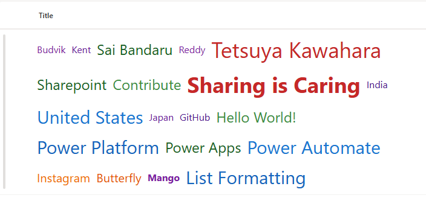
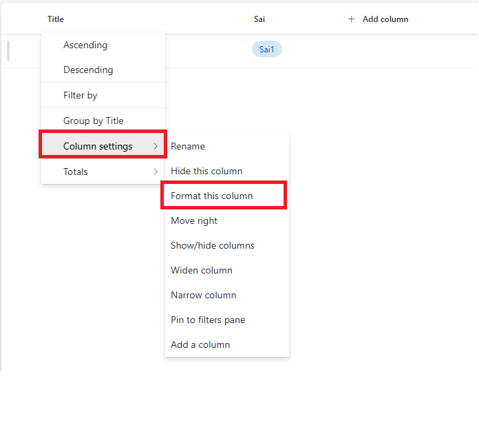
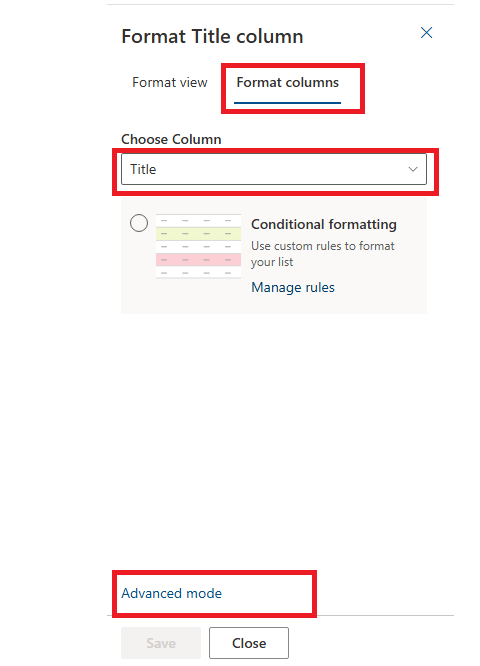
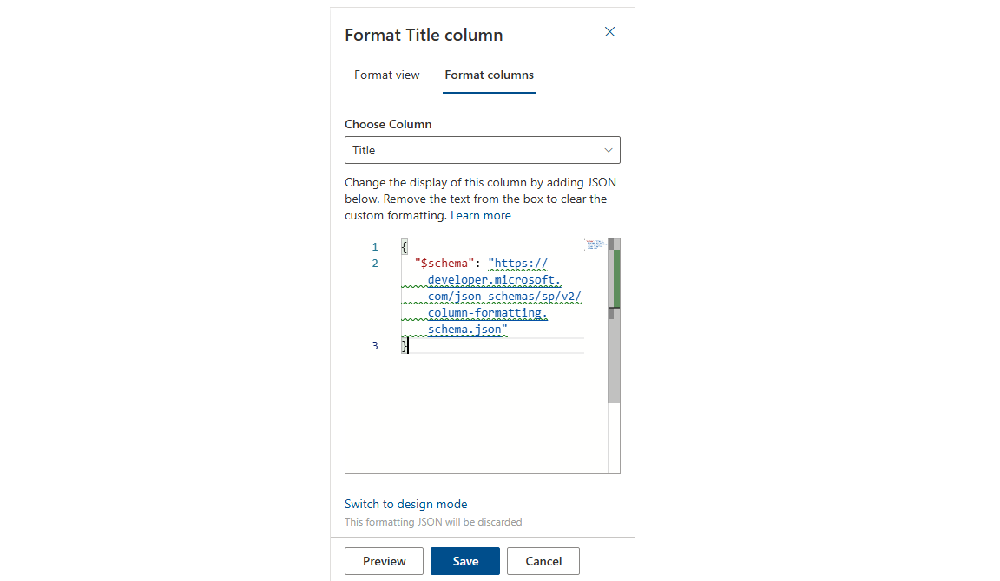
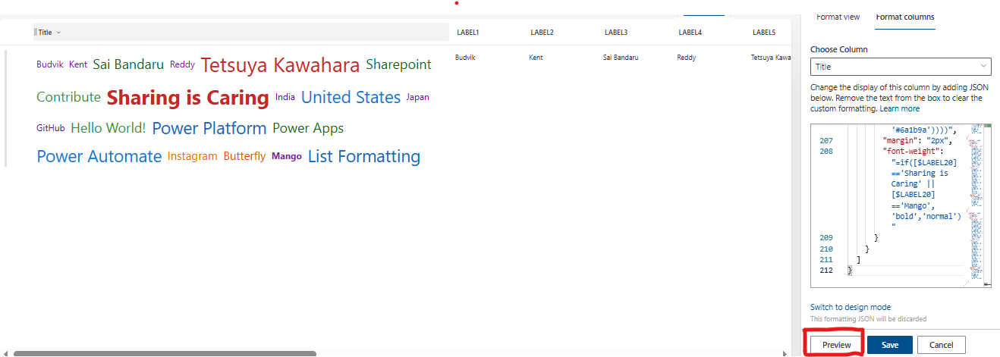
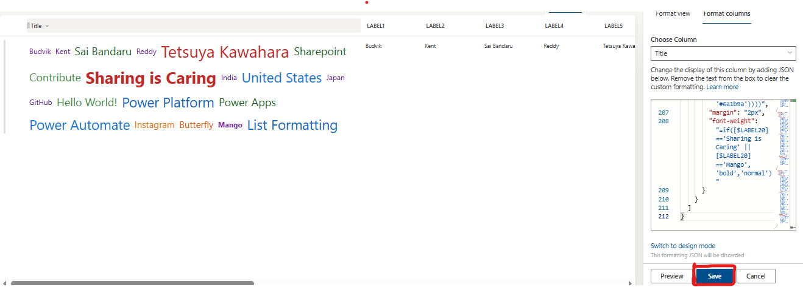

# Microsoft Lists: How to Create Dynamic Word Clouds Using Column Formatting

## Introduction

Data visualization is crucial for making information more digestible and engaging. While Microsoft Lists excels at organizing structured data, sometimes you need creative visual representations to help users quickly grasp patterns and insights. In this post, we'll explore how to create dynamic word clouds within SharePoint lists using column formatting JSON, transforming multiple text columns into visually appealing, size-varied word displays.

Word clouds are powerful visualization tools that emphasize important words through size, color, and positioning. By implementing dynamic word clouds in Microsoft Lists, you can create engaging interfaces for survey data, keyword analysis, tag visualization, or any scenario where multiple text labels need visual prominence based on their characteristics.



## What We're Building

Our solution creates a flexible, responsive word cloud that displays content from up to 20 label columns. Each word in the cloud features:

- **Dynamic font sizing** based on character length (16px to 36px)
- **Color variation** using a sophisticated palette system  
- **Conditional bold formatting** for highlighted terms
- **Responsive flex layout** that wraps automatically
- **Multi-column support** for comprehensive data visualization

The word cloud uses mathematical expressions to determine visual properties, ensuring consistency while providing meaningful visual hierarchy.

## View Requirements

Create a SharePoint list with the following column structure:

| Internal Name | Type                |
|---------------|---------------------|
| **Title**     | Single line of text |
| LABEL1    | Single Line of Text |
| LABEL2    | Single Line of Text |
| LABEL3    | Single Line of Text |
| LABEL4    | Single Line of Text |
| LABEL5    | Single Line of Text |
| LABEL6    | Single Line of Text |
| LABEL7    | Single Line of Text |
| LABEL8    | Single Line of Text |
| LABEL9    | Single Line of Text |
| LABEL10   | Single Line of Text |
| LABEL11   | Single Line of Text |
| LABEL12   | Single Line of Text |
| LABEL13   | Single Line of Text |
| LABEL14   | Single Line of Text |
| LABEL15   | Single Line of Text |
| LABEL16   | Single Line of Text |
| LABEL17   | Single Line of Text |
| LABEL18   | Single Line of Text |
| LABEL19   | Single Line of Text |
| LABEL20   | Single Line of Text |

> **Note:** You can extend beyond 20 labels by adding more columns and corresponding JSON elements. Each LABEL column represents a word or short phrase that will appear in the word cloud.

## Sample Data

| LABEL1 | LABEL2 | LABEL3 | LABEL4 | LABEL5 |
|-------|--------|--------|--------|--------|--------|
| Sharing is Caring | Mango      | Banana    | Apple  | Sai Bandaru |

The word cloud automatically adapts the visual properties based on each word's characteristics.

## The Mathematics Behind the Visualization

The word cloud generation uses sophisticated conditional logic to create visual hierarchy and variety:

### Font Size Calculation
Words are sized based on character length using nested conditional expressions:
- **>15 characters** → `36px` (largest, for phrases)
- **>12 characters** → `30px` (large words)
- **>9 characters** → `24px` (medium-large)
- **>7 characters** → `20px` (medium)
- **≤7 characters** → `16px` (smallest, for short words)

### Color Assignment System
The color palette uses a tiered system with different shades for visual variety:
- **Tier 1 Colors:** `#d32f2f`, `#1976d2`, `#388e3c`, `#f57c00`, `#7b1fa2`
- **Tier 2 Colors:** `#c62828`, `#1565c0`, `#2e7d32`, `#ef6c00`, `#6a1b9a`
- **Tier 3 Colors:** `#b71c1c`, `#0d47a1`, `#1b5e20`, `#e65100`, `#4a148c`

Colors are assigned based on the same character length thresholds as font sizes, creating visual coherence.

### Layout Architecture

#### Main Container
The root element uses flexbox for responsive word arrangement:
```json
{
  "elmType": "div",
  "style": {
    "display": "flex",
    "flex-wrap": "wrap",
    "gap": "6px",
    "padding": "6px"
  }
}
```

#### Individual Word Elements
Each word is rendered as a span with dynamic styling:
```json
{
  "elmType": "span",
  "txtContent": "[$LABEL1]",
  "style": {
    "font-size": "=if(indexOf([$LABEL1]+'@','@')>15,'36px',if(indexOf([$LABEL1]+'@','@')>12,'30px',if(indexOf([$LABEL1]+'@','@')>9,'24px',if(indexOf([$LABEL1]+'@','@')>7,'20px','16px'))))",
    "color": "=if(indexOf([$LABEL1]+'@','@')>15,'#d32f2f',if(indexOf([$LABEL1]+'@','@')>12,'#1976d2',if(indexOf([$LABEL1]+'@','@')>9,'#388e3c',if(indexOf([$LABEL1]+'@','@')>7,'#f57c00','#7b1fa2'))))",
    "margin": "2px",
    "font-weight": "=if([$LABEL1]=='Sharing is Caring' || [$LABEL1]=='Mango','bold','normal')"
  }
}
```

### Character Length Detection
The expression `indexOf([$LABEL1]+'@','@')` cleverly calculates string length by:
1. Appending '@' to the field value
2. Finding the index position of '@' 
3. Using that position as the character count

This approach works within SharePoint's expression limitations where direct `LEN()` functions aren't available in column formatting.

## How to Implement

### Step 1: Prepare Your SharePoint List
1. Navigate to your SharePoint site or Microsoft Lists
2. Create a new list or open an existing one
3. Add the required LABEL columns (LABEL1 through LABEL20)
4. Populate your list with sample data to test the visualization

### Step 2: Apply Column Formatting
1. Click on the column header for the "Title" column
2. Select "Column settings" > "Format this column"
    
3. Choose "Advanced mode"
    
4. Replace the existing JSON with the provided code
    
    
5. Click "Preview" to see the results
    
6. Click "Save" to apply the formatting
    

### Step 3: Test and Validate
Create several list items with varying word lengths and content to observe:
- Font size variations based on character length
- Color diversity across different words
- Bold formatting for specified highlight terms
- Responsive wrapping behavior

## Advanced Customization Options

### Expanding Beyond 20 Labels
To add more label columns, extend the JSON by copying existing span blocks:

```json
{
  "elmType": "span",
  "txtContent": "[$LABEL21]",
  "style": {
    "font-size": "=if(indexOf([$LABEL21]+'@','@')>15,'36px',if(indexOf([$LABEL21]+'@','@')>12,'30px',if(indexOf([$LABEL21]+'@','@')>9,'24px',if(indexOf([$LABEL21]+'@','@')>7,'20px','16px'))))",
    "color": "=if(indexOf([$LABEL21]+'@','@')>15,'#d32f2f',if(indexOf([$LABEL21]+'@','@')>12,'#1976d2',if(indexOf([$LABEL21]+'@','@')>9,'#388e3c',if(indexOf([$LABEL21]+'@','@')>7,'#f57c00','#7b1fa2'))))",
    "margin": "2px",
    "font-weight": "=if([$LABEL21]=='Your Highlighted Term','bold','normal')"
  }
}
```

### Custom Color Schemes
Modify the color palette to match your organization's branding:

**Corporate Blue Theme:**
```json
"color": "=if(indexOf([$LABEL1]+'@','@')>15,'#003f7f',if(indexOf([$LABEL1]+'@','@')>12,'#0056b3',if(indexOf([$LABEL1]+'@','@')>9,'#007bff',if(indexOf([$LABEL1]+'@','@')>7,'#28a745','#6c757d'))))"
```

**Warm Sunset Theme:**
```json
"color": "=if(indexOf([$LABEL1]+'@','@')>15,'#d63031',if(indexOf([$LABEL1]+'@','@')>12,'#e17055',if(indexOf([$LABEL1]+'@','@')>9,'#f39c12',if(indexOf([$LABEL1]+'@','@')>7,'#f1c40f','#e67e22'))))"
```

### Font Size Adjustments
Fine-tune the size hierarchy for your specific use case:

**Subtle Sizing:**
```json
"font-size": "=if(indexOf([$LABEL1]+'@','@')>15,'22px',if(indexOf([$LABEL1]+'@','@')>12,'20px',if(indexOf([$LABEL1]+'@','@')>9,'18px',if(indexOf([$LABEL1]+'@','@')>7,'16px','14px'))))"
```

**Dramatic Sizing:**
```json
"font-size": "=if(indexOf([$LABEL1]+'@','@')>15,'48px',if(indexOf([$LABEL1]+'@','@')>12,'36px',if(indexOf([$LABEL1]+'@','@')>9,'28px',if(indexOf([$LABEL1]+'@','@')>7,'22px','16px'))))"
```

### Conditional Highlighting
Customize which words appear in bold:

```json
"font-weight": "=if([$LABEL1]=='Priority' || [$LABEL1]=='Important' || [$LABEL1]=='Critical','bold','normal')"
```

### Layout Modifications
Adjust spacing and arrangement:

**Compact Layout:**
```json
"gap": "3px",
"padding": "3px"
```

**Spacious Layout:**
```json
"gap": "12px",
"padding": "12px"
```

## Use Cases and Applications

### Survey Data Visualization
Transform survey responses into engaging word clouds where frequently mentioned terms appear prominently, helping identify common themes and sentiments.

### Tag and Category Management
Visualize content tags, categories, or keywords with automatic sizing based on tag length, making it easier to spot comprehensive vs. concise descriptors.

### Skills and Competency Tracking
Display employee skills, certifications, or competencies with visual emphasis on specialized (longer) skill names versus general (shorter) ones.

### Product Feature Highlighting
Showcase product features, benefits, or specifications where detailed features get visual prominence through larger sizing.

### Content Metadata Display
Present document or content metadata (tags, keywords, categories) in an engaging visual format that's more appealing than traditional list views.

## Performance and Technical Considerations

### Rendering Performance
- All calculations are performed client-side using SharePoint's built-in expression engine
- No external dependencies or API calls required
- Efficient rendering even with hundreds of list items
- Compatible with all modern browsers and SharePoint versions

### Limitations and Workarounds

**No True Randomization:**
SharePoint column formatting doesn't support random positioning or rotation. Words appear in a structured grid layout using flex wrap.

**Character Limit Constraints:**
Each column can hold up to SharePoint's single line of text limits (255 characters), which is typically sufficient for word cloud applications.

**JSON Size Limitations:**
For extremely large numbers of labels (50+), consider splitting the visualization across multiple columns or views.

## Troubleshooting Guide

### Word Cloud Not Displaying
- Verify you're in "Advanced mode" when applying the JSON
- Check that all LABEL column names match exactly (case-sensitive)
- Validate JSON syntax using an online JSON validator
- Ensure the target column exists and has the correct internal name

### Incorrect Font Sizes
- Test with known character lengths to verify the sizing logic
- Check that the `indexOf` expression is calculating correctly
- Ensure special characters aren't interfering with length calculation

### Colors Not Appearing
- Verify color hex codes are properly formatted (#rrggbb)
- Check browser compatibility for CSS color support
- Test with different color values to isolate issues

### Layout Problems
- Ensure the container div has proper flex properties set
- Check that gap and padding values are appropriate
- Test responsiveness by resizing the browser window

## Advanced Implementation Patterns

### Multi-Language Support
For international deployments, consider character encoding and length variations:

```json
"font-size": "=if(indexOf([$LABEL1]+'@','@')>20,'36px',if(indexOf([$LABEL1]+'@','@')>15,'30px',if(indexOf([$LABEL1]+'@','@')>12,'24px',if(indexOf([$LABEL1]+'@','@')>8,'20px','16px'))))"
```

### Conditional Color Based on Content
Apply different color schemes based on word content:

```json
"color": "=if([$LABEL1]=='Urgent','#dc3545',if([$LABEL1]=='Important','#fd7e14',if(indexOf([$LABEL1]+'@','@')>12,'#1976d2','#6c757d')))"
```

### Integration with Other Column Types
Combine word cloud formatting with choice columns or lookup fields:

```json
"font-weight": "=if([$Priority]=='High','bold','normal')",
"text-decoration": "=if([$Status]=='Complete','underline','none')"
```

## Security and Compliance Considerations

### Data Privacy
- Word clouds display all configured label content visually
- Consider data classification requirements before implementation

### Accessibility Compliance
- Color-only information should be supplemented with other visual cues
- Ensure sufficient contrast ratios for all color combinations
- Test with screen readers and accessibility tools

## Future Enhancements and Roadmap

While SharePoint column formatting has limitations, future possibilities could include:

- **Dynamic word frequency analysis** based on occurrence across multiple items
- **Interactive filtering** by clicking on individual words
- **Export capabilities** for word cloud visualizations
- **Integration with Power BI** for advanced analytics

## Conclusion

Dynamic word clouds represent a powerful fusion of data visualization and SharePoint's native formatting capabilities. By leveraging mathematical expressions and conditional logic, we can transform static text columns into engaging, informative visual displays that help users quickly identify patterns, emphasis, and relationships within their data.

This solution demonstrates how creative application of SharePoint's column formatting can produce sophisticated visualizations without requiring custom development or external tools. The mathematical approach to sizing and coloring ensures consistency while providing meaningful visual hierarchy that enhances data comprehension.

Whether you're managing survey responses, organizing content metadata, tracking skills and competencies, or visualizing any collection of text labels, dynamic word clouds can significantly improve the user experience and data insight capabilities of your Microsoft Lists.

## GitHub Code

- [sharepoint-word-cloud-column-formatting](https://github.com/pnp/List-Formatting/tree/master/column-samples/generic-word-cloud)

## Additional Resources

- [SharePoint Column Formatting Documentation](https://docs.microsoft.com/en-us/sharepoint/dev/declarative-customization/column-formatting)
- [SharePoint JSON Schema Reference](https://developer.microsoft.com/json-schemas/sp/v2/column-formatting.schema.json)  
- [PnP Community - List Formatting Samples](https://github.com/pnp/List-Formatting)
- [Microsoft Lists Column Formatting Examples](https://docs.microsoft.com/en-us/sharepoint/dev/declarative-customization/column-formatting#examples)

Try implementing this word cloud solution in your Microsoft Lists and experiment with different color schemes, sizing algorithms, and highlighting patterns to create visualizations that perfectly match your organization's needs and branding!