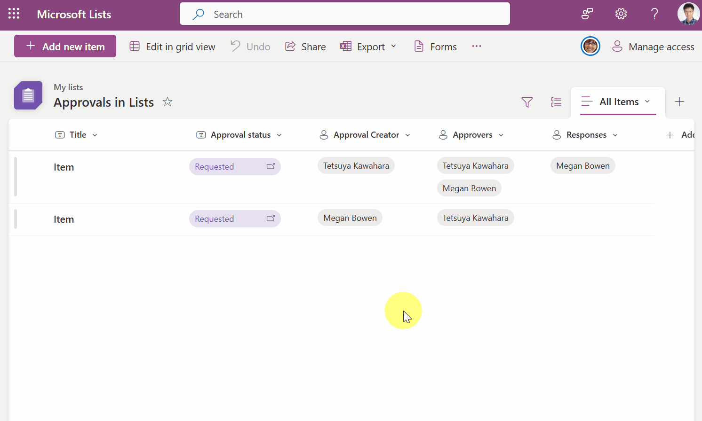
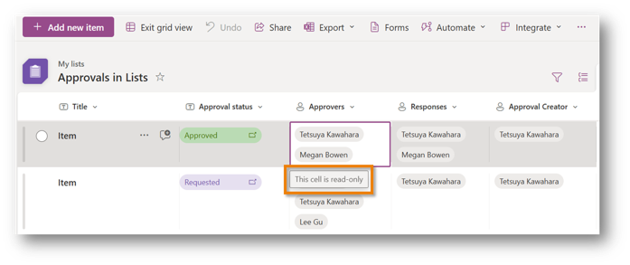

## Introduction

[The approval feature in Microsoft Lists](https://support.microsoft.com/office/approvals-in-lists-2bd0954d-5797-4be3-b78a-846f26338e17), which was previously only available for specific list templates, can now be enabled for any list. (Note: As of May 30, 2024, this feature may not yet be available for your tenant.)

When this feature is enabled, an `Approval status` column is displayed in the view, allowing you to see the current approval status. However, the view does not show who the approvers are or who has approved an item. Therefore, it can be difficult to easily identify the approvers for each item.

This post will guide you on how to display approvers in the view.

## How to Display Approvers in the View

When the approval feature is enabled, columns such as `Approver Creator`, `Approvers`, and `Responses` are automatically created in addition to the `Approval status` column. However, these columns are not usually displayed in the view. By displaying these columns in the view, you can easily identify the approvers.

To display these columns in the view:
1. Select the name of the view shown in the upper right corner >  Select **Add or remove fields**
1. Check the columns `Approver Creator`, `Approvers`, and `Responses`
1. Select **Apply**

### Explanation of Each Column

|Column Name|Internal Name of Column|Column Type|Description|
|---|---|---|---|
|Approval status|_ApprovalStatus|Number|The following numbers are set 0: Not Submitted 1: Requested 2: Rejected 3: Approved|
|Approver Creator|_ApprovalSentBy|Person or Group|Displays the user who requested the approval.|
|Approvers|_ApprovalAssignedTo|Person or Group (multiple selections possible)|Displays the users set as approvers.|
|Responses|_ApprovalRespondedBy|Person or Group (multiple selections possible)|Displays the users who approved or rejected.|

## Behavior for Each Process

### Behavior When Requesting Approval

When requesting approval,  the `Approval status` is set to Requested, the user who requested the approval is set in the `Approver Creator` column, and the approvers are set in the `Approvers` column.

### Behavior When Approving/Rejecting

When approving or rejecting,  the `Approval status` is set to Approved or Rejected, and the users who approved or rejected are added to the `Responses` column.

### Behavior When Canceling Approval Requests

When canceling, the `Approval status` is set to Not submitted, and the `Approver Creator`, `Approvers`, and `Responses` columns are cleared.

## Creating a View for Items Requiring Your Approval

You can also use view filters to display only the items that the current logged-in user needs to approve.

To create the view:
1. [Create a view](https://support.microsoft.com/office/create-or-change-the-view-of-a-list-25393905-087c-4b0a-9fb4-5c1e165b99b7)
1. Select the name of the view shown in the upper right corner >  Select **Edit current view**
1. Set the following filters

    `Approval status` is equal to **1** (Requested)

    And `Approvers` is equal to **[Me]**

    And `Responses` is not equal to **[Me]**

1. Select **OK**

## Edit in Grid View

When in edit in grid view, the `Approver Creator`, `Approvers`, `Responses`, and `Approval status` columns are read-only, and these columns cannot be edited.

## Additional Notes

- I confirmed that the `Responses` column is also updated when approvals are done via the Microsoft Teams Approval app. However, updates to the `Approval status` and `Responses` columns were not reflected until the Approval request details dialog was opened once on the list. It is unclear whether this is a bug, but I have submitted [feedback on this phenomenon](https://feedbackportal.microsoft.com/feedback/idea/7adb8e4a-b21d-ef11-989a-6045bd796e5a) to the [Microsoft feedback portal](https://feedbackportal.microsoft.com/feedback/).