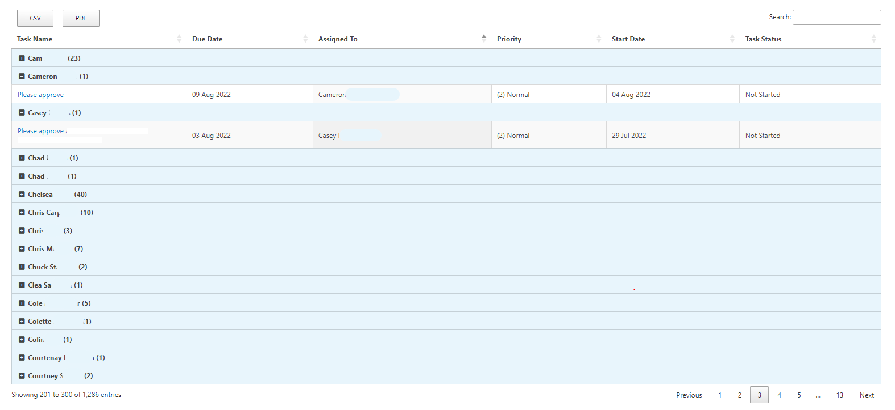

In this article, we will learn how to use PnPjs to get data from multiple SharePoint lists and display the collected data in a jQuery Datatables in SharePoint 2013/2016/2019 or online without a SPFx webpart.
You will also learn how to filter data in PnPjs and also group items with count in DataTables. 

## What is PnPjs?

PnPjs is a collection of fluent libraries for consuming SharePoint, Graph, and Office 365 REST APIs in a type-safe way. You can use it within SharePoint Framework, Nodejs, or any JavaScript project

More information: <https://pnp.github.io/pnpjs/>

## What is DataTables?

DataTables is a plug-in for the jQuery JavaScript library. It is a highly flexible tool, built upon the foundations of progressive enhancement, that adds all these advanced features to any HTML table.

More information: <https://datatables.net>

### Introduction

In SharePoint on-premises if you intend to aggregate multiple SharePoint lists and display them in a data view, you need to use a linked data source in SharePoint Designer (SPD). But when you have thousands of items in multiple lists, then the performance will be important for you as a developer.
Also, convenient and fast development will be another of your needs. Because the SPD has some problems and it is difficult to deal with XSLT codes for linked data source. To achieve this, you can easily use the PnPjs capabilities to get and filter lists items and finally display the data using a DataTables with great performance in a simple Content Query WebPart (CQWP).

For this, you will not even need to use the SharePoint Framework (SPFx). If you are interested in using SPFx in your SharePoint environment, you can read this great [article](https://techcommunity.microsoft.com/t5/microsoft-365-pnp-blog/guidance-on-how-to-use-react-datatable-webpart/ba-p/2772933).

### Get Started

In this example, we have three task lists with similar columns that have many items. We intend to aggregate and display them in a DataTables. We also need to filter items by status equal to “Not Started”. 

Firstable we need PnPjs library to add into our project, So you can download it from this [link](https://cdnjs.cloudflare.com/ajax/libs/pnp-pnpjs/1.3.9/pnpjs.es5.umd.bundle.min.js).

We also need to have some script and style libraries for the DataTables in the project as follows:

```html
<link href="https://nightly.datatables.net/css/jquery.dataTables.css" rel="stylesheet" type="text/css"/>
<script type="text/javascript" charset="utf8" src="https://nightly.datatables.net/js/jquery.dataTables.js"></script> 
```

In the code below, we have a main function that is of **async** type. Therefore, we need to call PnP methods with **await**.
After getting items from each list, we store them in a spread-type array named **dataSet**.

```javascript
const list1 = await pnp.sp.web.lists.getById('FE73088E-E843-41BF-B4D8-1114A4A16C92').items.expand('AssignedTo').select('Title,Priority,Status,PercentComplete,StartDate,DueDate,ID,Modified,Created,AssignedTo/ID,AssignedTo/Title,FileDirRef').filter("Status eq 'Not Started'").orderBy('AssignedTo/Title').getAll();
const list2 = await pnp.sp.web.lists.getById('2C3EE3B9-1A66-4D5F-A907-42859B9D2314').items.expand('AssignedTo').select('Title,Priority,Status,PercentComplete,StartDate,DueDate,ID,Modified,Created,AssignedTo/ID,AssignedTo/Title,FileDirRef').filter("Status eq 'Not Started'").orderBy('AssignedTo/Title').getAll();
const list3 = await pnp.sp.web.lists.getById('E0A9CC27-5C79-4DA8-B9B2-F53A986FDA96').items.expand('AssignedTo').select('Title,Priority,Status,PercentComplete,StartDate,DueDate,ID,Modified,Created,AssignedTo/ID,AssignedTo/Title,FileDirRef').filter("Status eq 'Not Started'").orderBy('AssignedTo/Title').getAll();
        
const dataSet = [...list1, ...list2, ...list3];

```

Now, we need to use DataTables component to display the aggregated data in the page. There are several important things in the code:

- #TaskTable is the ID of HTML table
- “Title” column is a linkable column to open each task’s item
- We used Momentjs to show DueDate and StartDate value in custom format
- We used a function in the rowGroup property to collapse/expand the items along with the number of items in each group in each parent row.

```javascript
var table = $("#TaskTable")
            .DataTable({
                "dom": 'Bfrtip',
                "buttons": [
                    'csv', 'pdf' //you can add other buttons supported by DataTables here.
                ],
                "aaData": dataSet,
                "processing": true,
                "autoWidth": true,
                "bDestroy": true,
                "aoColumns": [
                    {
                        "mData": "Title", "width": "20%", "fnCreatedCell":
                            function (nTd, sData, oData, iRow, iCol) {
                                $(nTd).html("<a href='" + oData.FileDirRef + "/DispForm.aspx?ID=" + oData.ID + "' target='_blank'>" + oData.Title + "</a>");
                            }
                    },
                    {
                        "data": "DueDate", "stype": "date",
                        "render": function (data, type, row, meta) {
                            var dtFormat = moment(new Date(data)).format("DD MMM YYYY");
                            return dtFormat
                        }
                    },
                    {
                        "data": "AssignedTo.Title"

                    },
                    {
                        "data": "Priority"
                    },
                    {
                        "data": "StartDate", "stype": "date",
                        "render": function (data, type, row, meta) {
                            var dtFormat = moment(new Date(data)).format("DD MMM YYYY");
                            return dtFormat
                        }
                    },
                    {
                        "data": "Status"
                    }
                    
                ],
                rowGroup: {
                    dataSrc: 'AssignedTo.Title',
                    className: 'group-row',
                    startRender: function (rows, group) {
                        var collapsed = !!collapsedGroups[group];

                        rows.nodes().each(function (r) {
                            r.style.display = 'none';
                            if (collapsed) {
                                r.style.display = '';
                            }
                        });

                        var toggleClass = collapsed ? 'fa-minus-square' : 'fa-plus-square';

                        // Add group name with items count to <tr>
                        return $('<tr/>')
                            .append('<td colspan="' + rows.columns()[0].length + '">' + '<span class="fa fa-fw ' + toggleClass + ' toggler"/> ' + group + ' (' + rows.count() + ')</td>')
                            .attr('data-name', group)
                            .toggleClass('collapsed', collapsed);
                    },
                },               
                "caseInsensitive": false,
                "searching": true,
                "pageLength": 100,
                "ordering": true,
                "paging": true,
                "order": [2, "asc"],
            });

```

As we explained earlier, we used a function in rowGroup that groups items based on **“Assigned To”** column. Also, we have provided a jQuery event listener as below that handles clicking on each group to open and close the group.

```javascript
// Add event listener to handle open and close group
        $('#TaskTable tbody').on('click', 'tr.group-start', function () {
            var name = $(this).data('name');
            collapsedGroups[name] = !collapsedGroups[name];
            table.draw(false);
        });
```

When you are done with the scripts, now we need to create the HTML code to display the DataTables and items.

```html
<table id="TaskTable" width="100%" cellpadding="0" cellspacing="0" border="0" class="display cell-border">
    <thead>
        <tr>
            <th>Task Name</th>
            <th>Due Date</th>
            <th>Assigned To</th>
            <th>Priority</th>
            <th>Start Date</th>
            <th>Task Status</th>
        </tr>
    </thead>
</table>
 ```

Well, everything is finished. Now it is the time to put the completed code in a CQWP and save the page. 

Final result will be something like this :



Please note that we need other scripts and styles added in the final code to add various features such as buttons (send to csv/pdf) as well as display plus and minus buttons in the grouped header in DataTables.

You can also add more features to the table and use Bootstrap 5 styles to design the look and feel of table. I recommend you check the [DataTables official site](https://datatables.net).

You can download complete code for this article from [here](https://github.com/ArashAghajani/my-dev-PnPjs/blob/main/SPDev-PnPjs-and-DataTables.html).


**Sharing is Caring!**
