Scenario
--------

I recently got involved in a project where the client, an educational institution, needed us to facilitate a way for parents of students to complete an online information form and attach various documents, all anonymously, without requiring usernames, passwords, Microsoft account or Microsoft 365 accounts. The organization had Microsoft 365 accounts for its staff and utilized SharePoint and Power Platform within the organization.

As a technical architect my task was to propose a solution that met their needs and was cost-effective. The first idea I suggested was using Power Pages. This involved designing forms with Power Apps and making them available to parents via the Power Pages site for completion, which supports anonymous submissions. Technically feasible, but licensing costs for approximately 10,000 anonymous users (parents) were deemed impractical by the client. I then considered another solution : utilizing Microsoft Forms! It seemed like a good option to publish the form anonymously for parents to complete. However, there was a drawback : _Microsoft Forms doesn’t support uploading documents for anonymous users!_

I thought about handling this requirement with SharePoint. If you’re familiar, SharePoint Online offers a ‘**Request Files**‘ feature in libraries, enabling you to send an upload file link to users and allowing them to upload files even anonymously!

I spent a week on this issue and devised a good solution. We decided to design the form using Microsoft Forms and handle the file upload part by sending a ‘Request Files’ link to the parents. The form design in Microsoft Forms was relatively simple and quick. On the last page of the form, we included the following message:

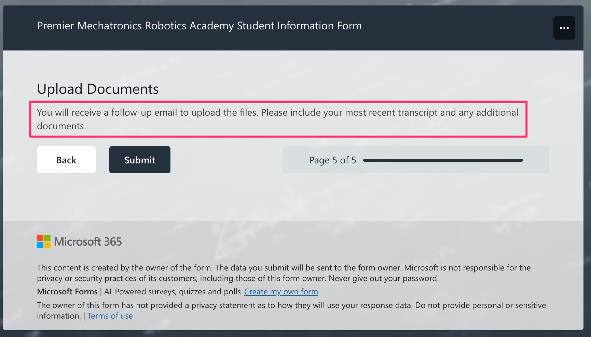

First, we need to enable Request Files at the site level in SharePoint. To utilize this feature in SharePoint, administrators need to ensure that specific requirements are fulfilled:

1.  Enable ‘Anyone links’ across the SharePoint tenant for site access.
2.  Configure advanced settings for ‘Anyone links’ with view, edit, and upload permissions.
3.  (Disabling ‘Anyone links’ for SharePoint will deactivate the ability to enable the file request feature at site, SharePoint, and OneDrive levels.)

Please check out this article in Microsoft Learn : [https://learn.microsoft.com/en-us/sharepoint/enable-file-requests](https://learn.microsoft.com/en-us/sharepoint/enable-file-requests)

The ‘Request Files’ feature usually works by selecting a folder within a library on the SharePoint site. Then, from the command bar of the library, clicking on ‘Request Files’ opens a pop-up dialog that generates a link for file uploads to this specific folder. You’ll send this link to the person who needs to upload files into this library, allowing them to do so anonymously.

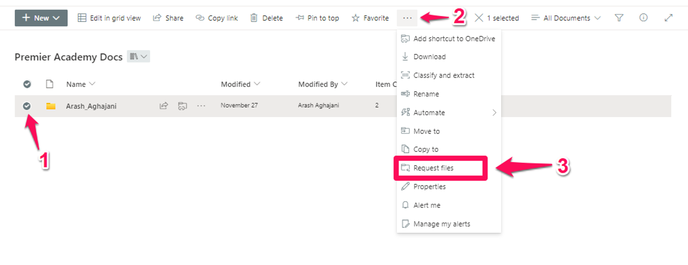

However, in this project we expect a folder with each student’s name to be automatically created in the SharePoint library after the parent completes the form in Microsoft Forms. An anonymous upload link is then automatically generated for that specific folder and sent to parents via separate emails so they can upload documents anonymously.

Solution
--------

**To accomplish this, I utilized Power Automate and learned a technique from [this YouTube video](https://www.youtube.com/watch?v=TCrKscem8Ns), which greatly assisted me. Using Power Automate, I could generate a file request link for each new folder created and send it to the parents. It was an engaging task, and both the client and I enjoyed the output**! 🙂

Open the Power Automate designer by going to the following URL:

[https://make.powerautomate.com/](https://make.powerautomate.com/)

Follow the steps below to create the Workflow. Give flow a name like **PremierAcademyUploadFilesFlow** and select “When a new response is submitted” in Microsoft Forms. (This workflow will start when the form is submitted by the parent in Microsoft Forms)

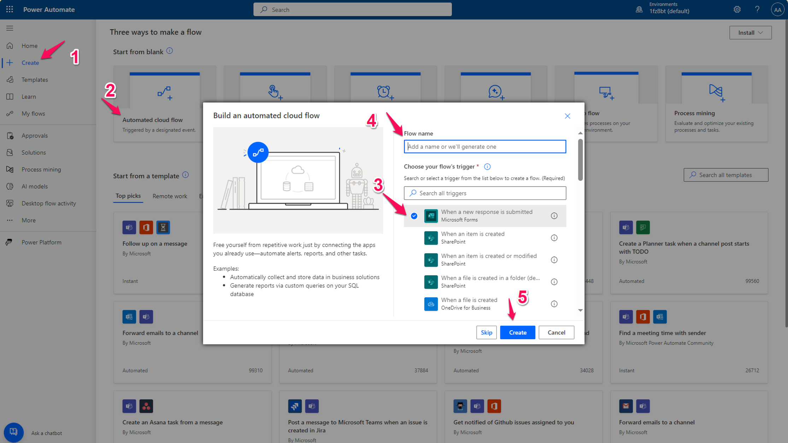

The final workflow should be something like this:

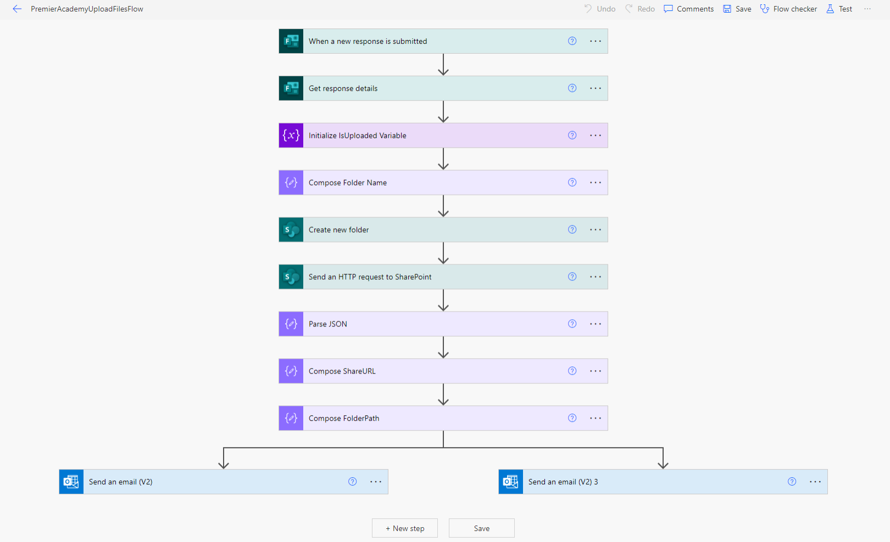

Let’s start adding and setting the value of each action:

1- In the first action we have a list of MS Forms published in our tenant, if your form doesn’t exist in the list so you need to get the ID of forms through URL by opening the form in browser and copy the value of “id” parameters:

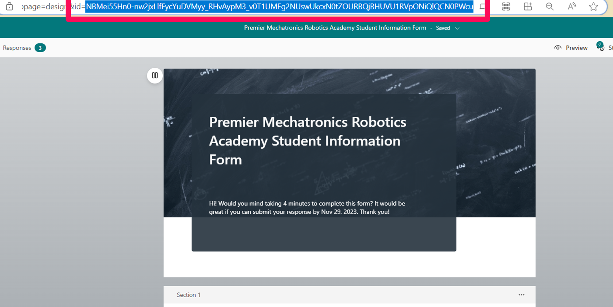

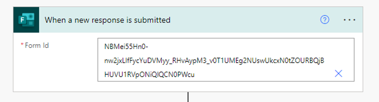

My Form ID is : NBMei55Hn0-nw2jxLlfFycYuDVMyy_RHvAypM2_v0T1UMEg2NUswUkcxOURBQjBHUVU1RVpONiQlQCN0PWcu

2- In the second action you need to first select the form as previous step, then select Response Id from Dynamic Content panel, and use it in Response Id field.

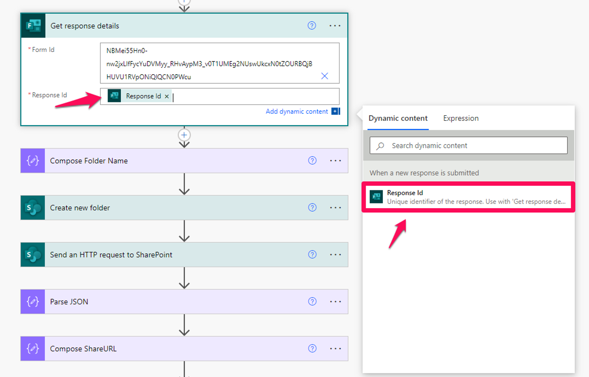

3- “**Compose Folder Name**”, is a Compose action, the value of Inputs should be the structure of the folder name. for our scenario we use \[StudentFirstName\_StudentLastName\], So to make this string value we need to use Concat function through the Expression tab in dynamic content.
```powerappsfl

    function: 
    
    concat(StudentFirstName,'_',StudentLastName)
    
    value: 
    
    concat(outputs('Get_response_details')?['body/rb29fdbf3d0ee41a783f54319ca784bcf'],'_',outputs('Get_response_details')?['body/ra4efad4bb3444bbbb4b90b430bcc2910'])

```

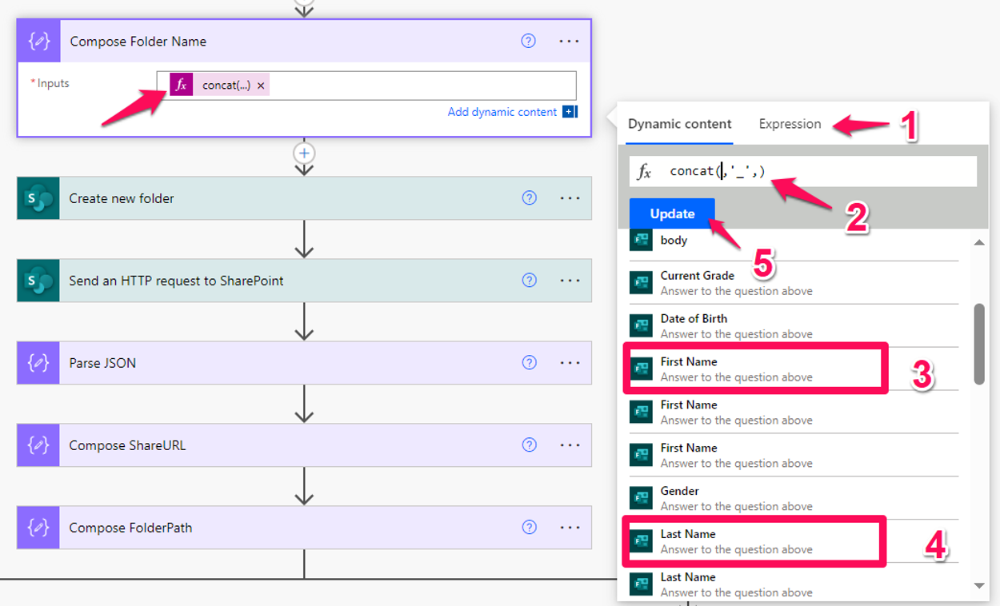

4- **“Create New Folder”** action will create a folder in our SharePoint Library with the name that we composed in previous action (Compose Folder Name). So, to configure this action we need to provide SharePoint Site name, select the Library name and then in the “Folder Path” we will select Outputs of the previous action as follows:

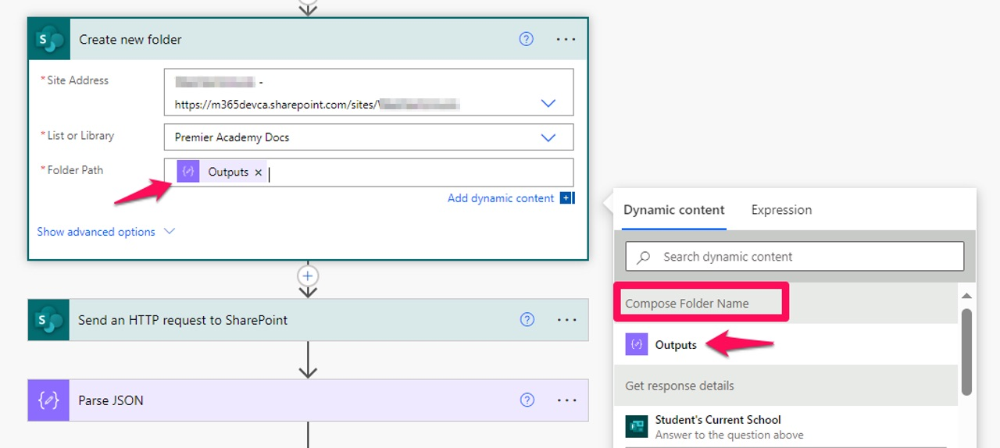

5- This step is an important part of our flow. Because in this step we will call an HTTP request with the SharePoint API to generate the URL of the **Request Files** link that will be sent to the parents via email. Let’s look at the details of the operation:

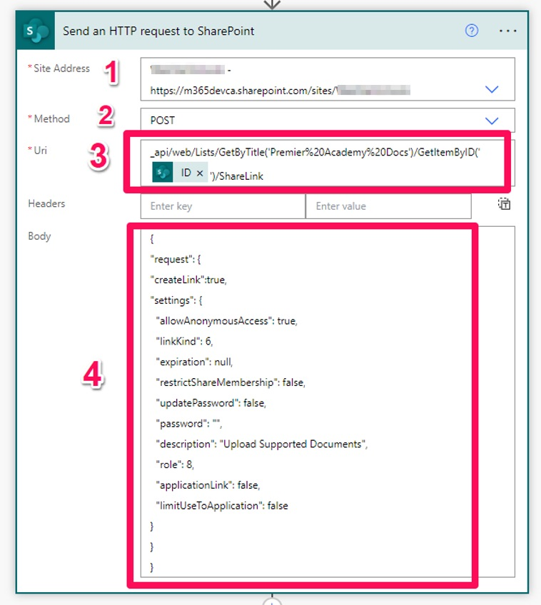

(1), we should select the created site for the project and in (2) put the Method to POST.

In (3), type the following string but replace the **LISTTITLE** with your SharePoint Library title and for the ID select the **ID** field from “**Create new folder**” action through Dynamic Content.

api/web/Lists/GetByTitle(‘**LISTTITLE**‘)/GetItemByID(‘**ID**‘)/ShareLink

Note: Both values should be inside single quotes. Don’t remove them. 

In (4), for the Body, we need to extract that content from the SharePoint site through the Developer Tools of browser as follows:

First open the Developer Tools in your browser:

Then click on Network tab and then open the library and select an exist folder, then from the command bar click on “Request Files”.


In pop up dialog box, type a description and then click on Next:

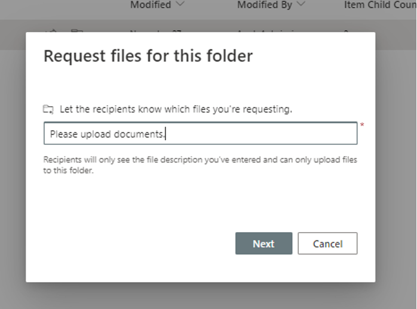

In last window click on done to complete the creating a Share Link for that folder. Now let’s look at the developer tools. In Developer Tools search for a resource start with ShareLink as follows:

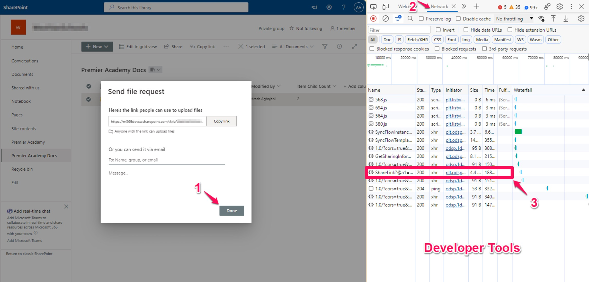

Then in Developer Tools select the row and click on the Payload tab to grab the require data.

Expand the settings as follows and copy the text to a text editor. We will use this data in our Power Automate flow.

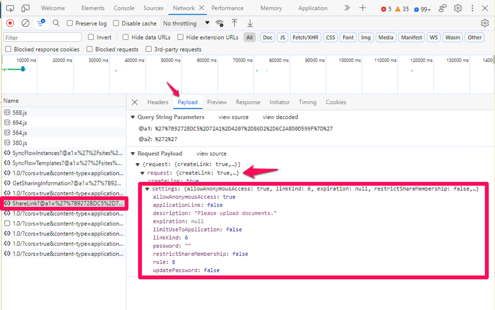

Try to build a JSON string like this :
```json

    {
    "request": {
    "createLink":true,
    "settings": {
      "allowAnonymousAccess": true,
      "linkKind": 6,
      "expiration": null,
      "restrictShareMembership": false,
      "updatePassword": false,
      "password": "",
      "description": "Upload Supported Documents",
      "role": 8,
      "applicationLink": false,
      "limitUseToApplication": false
    }
    }
    }

```    

Then copy the data in “Send an HTTP request” action :


6- Now we need to Parse the JSON data from previous action, So add a Parse JSON action and select Body of previous action as Content as follows :


For the Schema, copy the following content into the Schema field :
```json

    {
        "type": "object",
        "properties": {
            "d": {
                "type": "object",
                "properties": {
                    "ShareLink": {
                        "type": "object",
                        "properties": {
                            "__metadata": {
                                "type": "object",
                                "properties": {
                                    "type": {
                                        "type": "string"
                                    }
                                }
                            },
                            "sharingLinkInfo": {
                                "type": "object",
                                "properties": {
                                    "__metadata": {
                                        "type": "object",
                                        "properties": {
                                            "type": {
                                                "type": "string"
                                            }
                                        }
                                    },
                                    "AllowsAnonymousAccess": {
                                        "type": "boolean"
                                    },
                                    "ApplicationId": {},
                                    "BlocksDownload": {
                                        "type": "boolean"
                                    },
                                    "Created": {
                                        "type": "string"
                                    },
                                    "CreatedBy": {
                                        "type": "object",
                                        "properties": {
                                            "__metadata": {
                                                "type": "object",
                                                "properties": {
                                                    "type": {
                                                        "type": "string"
                                                    }
                                                }
                                            },
                                            "directoryObjectId": {},
                                            "email": {
                                                "type": "string"
                                            },
                                            "expiration": {},
                                            "id": {
                                                "type": "integer"
                                            },
                                            "isActive": {
                                                "type": "boolean"
                                            },
                                            "isExternal": {
                                                "type": "boolean"
                                            },
                                            "jobTitle": {},
                                            "loginName": {
                                                "type": "string"
                                            },
                                            "name": {
                                                "type": "string"
                                            },
                                            "principalType": {
                                                "type": "integer"
                                            },
                                            "userId": {},
                                            "userPrincipalName": {
                                                "type": "string"
                                            }
                                        }
                                    },
                                    "Description": {
                                        "type": "string"
                                    },
                                    "Embeddable": {
                                        "type": "boolean"
                                    },
                                    "Expiration": {
                                        "type": "string"
                                    },
                                    "HasExternalGuestInvitees": {
                                        "type": "boolean"
                                    },
                                    "Invitations": {
                                        "type": "object",
                                        "properties": {
                                            "__metadata": {
                                                "type": "object",
                                                "properties": {
                                                    "type": {
                                                        "type": "string"
                                                    }
                                                }
                                            },
                                            "results": {
                                                "type": "array"
                                            }
                                        }
                                    },
                                    "IsActive": {
                                        "type": "boolean"
                                    },
                                    "IsAddressBarLink": {
                                        "type": "boolean"
                                    },
                                    "IsCreateOnlyLink": {
                                        "type": "boolean"
                                    },
                                    "IsDefault": {
                                        "type": "boolean"
                                    },
                                    "IsEditLink": {
                                        "type": "boolean"
                                    },
                                    "IsEphemeral": {
                                        "type": "boolean"
                                    },
                                    "IsFormsLink": {
                                        "type": "boolean"
                                    },
                                    "IsManageListLink": {
                                        "type": "boolean"
                                    },
                                    "IsReviewLink": {
                                        "type": "boolean"
                                    },
                                    "IsUnhealthy": {
                                        "type": "boolean"
                                    },
                                    "LastModified": {
                                        "type": "string"
                                    },
                                    "LastModifiedBy": {
                                        "type": "object",
                                        "properties": {
                                            "__metadata": {
                                                "type": "object",
                                                "properties": {
                                                    "type": {
                                                        "type": "string"
                                                    }
                                                }
                                            },
                                            "directoryObjectId": {},
                                            "email": {
                                                "type": "string"
                                            },
                                            "expiration": {},
                                            "id": {
                                                "type": "integer"
                                            },
                                            "isActive": {
                                                "type": "boolean"
                                            },
                                            "isExternal": {
                                                "type": "boolean"
                                            },
                                            "jobTitle": {},
                                            "loginName": {
                                                "type": "string"
                                            },
                                            "name": {
                                                "type": "string"
                                            },
                                            "principalType": {
                                                "type": "integer"
                                            },
                                            "userId": {},
                                            "userPrincipalName": {
                                                "type": "string"
                                            }
                                        }
                                    },
                                    "LimitUseToApplication": {
                                        "type": "boolean"
                                    },
                                    "LinkKind": {
                                        "type": "integer"
                                    },
                                    "MeetingId": {},
                                    "PasswordLastModified": {
                                        "type": "string"
                                    },
                                    "PasswordLastModifiedBy": {},
                                    "RedeemedUsers": {
                                        "type": "object",
                                        "properties": {
                                            "__metadata": {
                                                "type": "object",
                                                "properties": {
                                                    "type": {
                                                        "type": "string"
                                                    }
                                                }
                                            },
                                            "results": {
                                                "type": "array"
                                            }
                                        }
                                    },
                                    "RequiresPassword": {
                                        "type": "boolean"
                                    },
                                    "RestrictedShareMembership": {
                                        "type": "boolean"
                                    },
                                    "RestrictToExistingRelationships": {
                                        "type": "boolean"
                                    },
                                    "Scope": {
                                        "type": "integer"
                                    },
                                    "ShareId": {
                                        "type": "string"
                                    },
                                    "ShareTokenString": {
                                        "type": "string"
                                    },
                                    "SharingLinkStatus": {
                                        "type": "integer"
                                    },
                                    "TrackLinkUsers": {
                                        "type": "boolean"
                                    },
                                    "Url": {
                                        "type": "string"
                                    }
                                }
                            }
                        }
                    }
                }
            }
        }
    }
```    

7- In this step we need to compose the Share Link URL and Folder Path. So let’s add two Compose action as follows and for the “**Compose ShareURL”** action select URL from Parse JSON output through Dynamic Content panel:

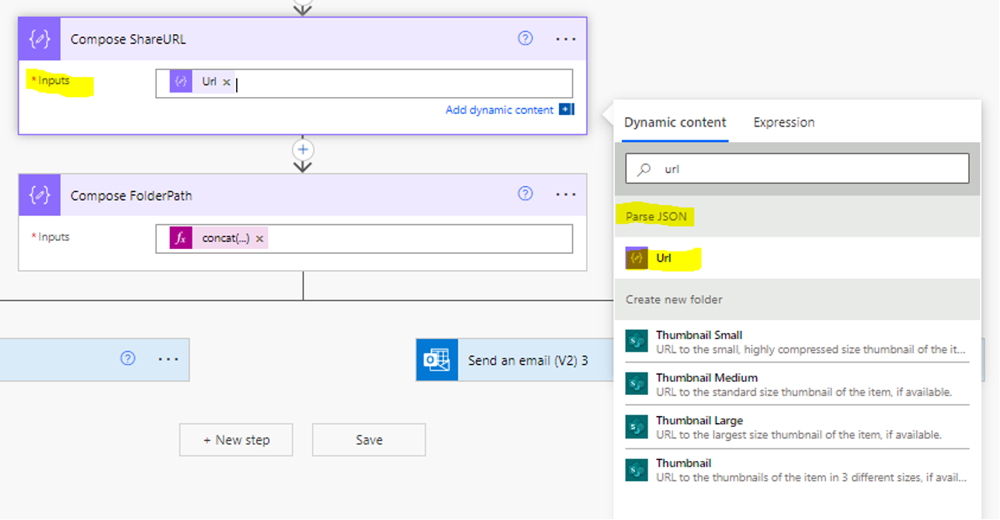

For the **“Compose FolderPath”** create an expression using Concat function :

    concat('https://m365devca.sharepoint.com/sites/MyTestSite/Premier%20Academy%20Docs/',outputs('Compose_Folder_Name'))

Replace the above **bold** path with your SharePoint site URL. 

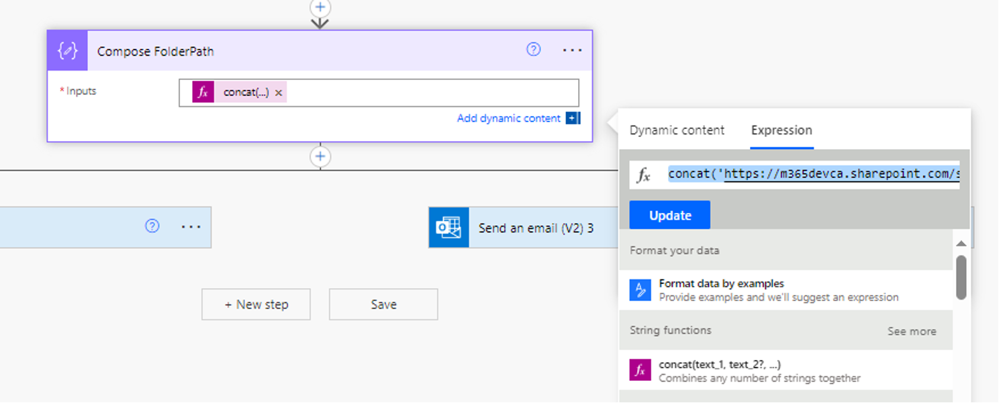

8- In last step, first add a parallel branch and then add two “Send and Email (V2)” action in right and left hand of parallel action. The left action will send an email includes the upload link to parent (Primary Contact Email) email address which filled out during submitting the MS Form.

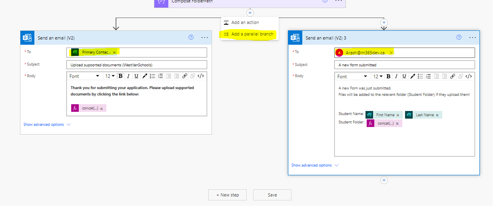

For the Student Folder, create the following expression:
```powerappsfl

    concat('<a href=', outputs('Compose_FolderPath'), '>Open the student folder!</a>')

```
Perfect! Let’s test the form and workflow:

Save the flow and try to submit a new form through MS Form. After submitting the workflow will be triggered and the parent will receive an email like this :

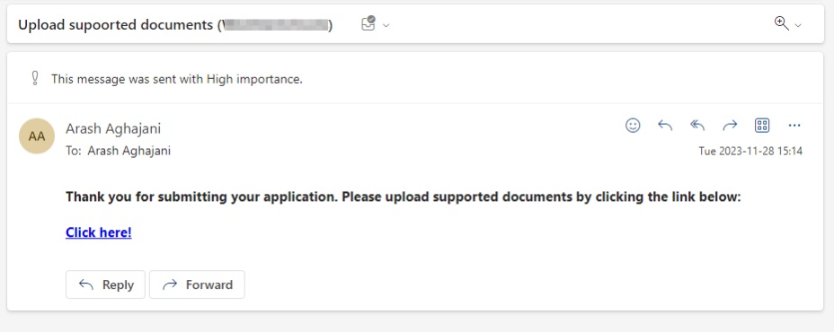

When parents click on the “**Click here!**” link, the following page will be open and they can upload required documents anonymously: (They need to fill out the First Name and Last Name fields with Student information)

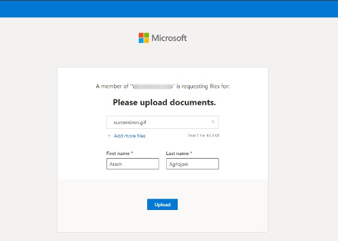

After uploading documents, a new folder with Student Full Name will be created in the SharePoint library: 

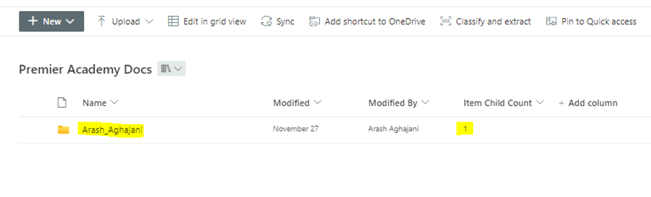

And when you click on the folder it contains uploaded file(s):

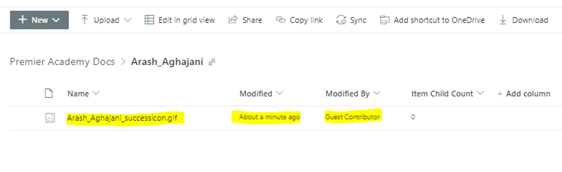

The program manager will also receive an email as we defined in the workflow in parallel :

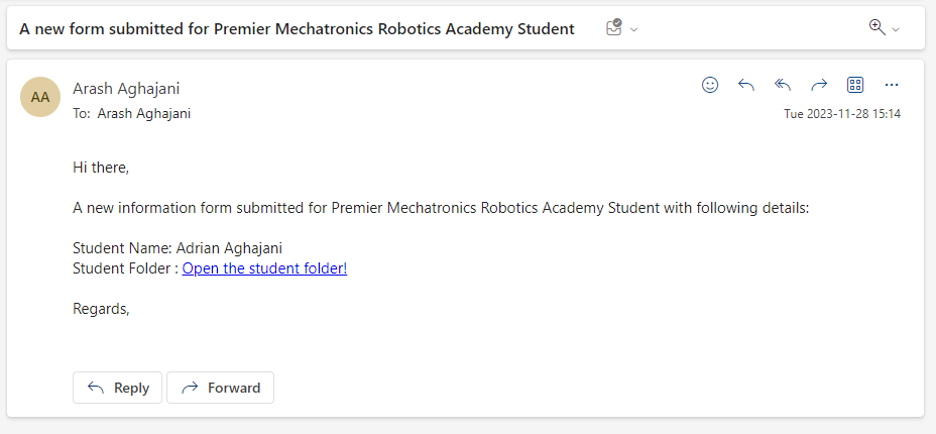

Conclusion
----------

The above solution can be very useful for most businesses who intend to use Microsoft 365 facilities to create a form for their audience, clients or business partners and provide the ability to upload/attach files, and all this can be done anonymously!