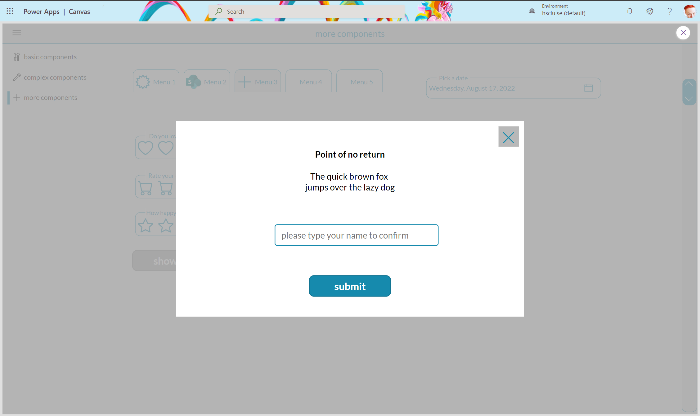
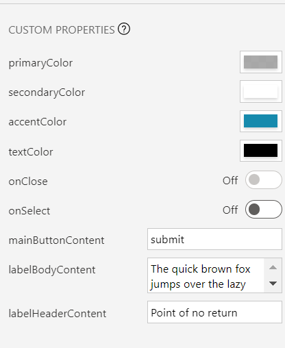
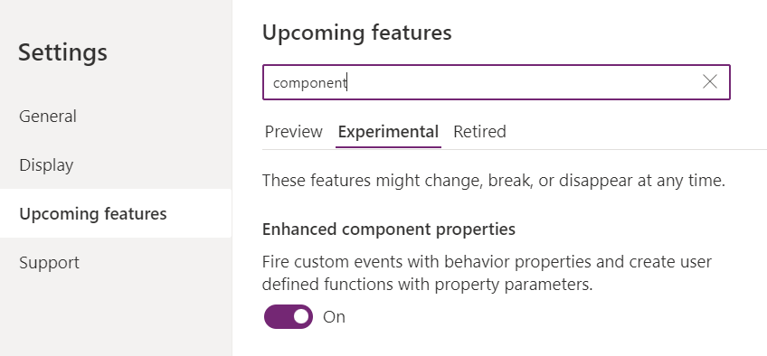
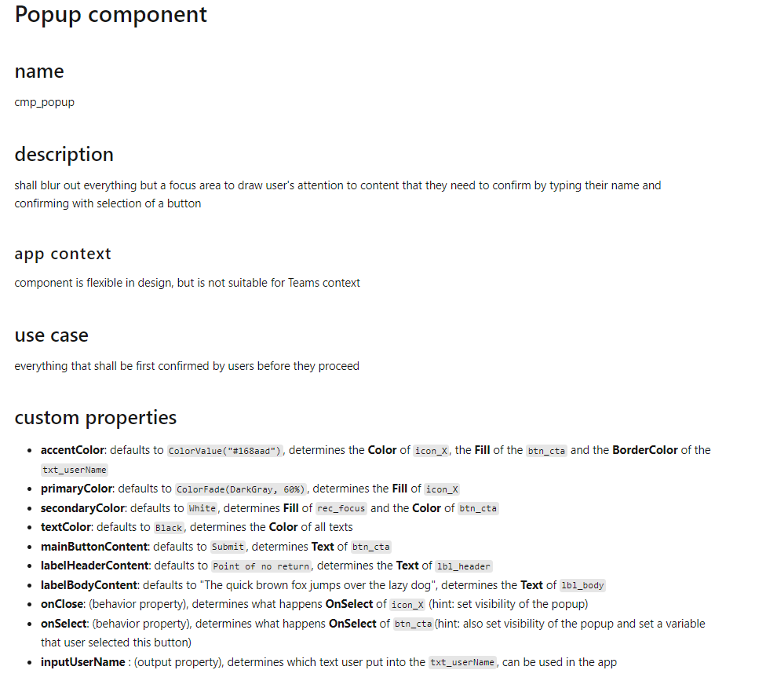

Power Apps components are awesome, still I do not see too many organization using them, which is why I want to give some guidance on how to better plan and build components. Proper planning can save hours or even days of development time and lead to a better result, so it could be worthwhile to dig into how we plan components:

When building components for we usually build something in an app, then realize that this could/should be a component and then rework this as a component. This comes with a lot of going back and forth and is neither the most efficient way nor the most satisfying one.

Also undocumented (and no, some inline comment don't make proper docs!) components won't serve the components goal of being reusable so that they reduce time and effort that goes into building UI, but will furthermore increase technical debt.

To improve both developer experience and user satisfaction, here is some guideline to follow along.

💡 Note: I will talk about the person who is making components and component libraries for other makers to use as a **maker enabler** and about the person using ready to be used components in their apps as **makers**, while people who will use apps will be called **users**.

## Start with the docs: What is this?

1. Give your component a meaningful name

If you plan on doing an entire component library or if you see potential to share more than one component with co-workers, its a good idea to stick to a naming convention. This makes it easier for makers to find the right component when building apps.

2. Describe what your component should do

Give some thoughts to the purpose of the component. Shall it display information, gather data from a user, facilitate how users interact with UI? 

3. Describe the kind of app it is intended to be used for

For which kind of apps is this component intended to be used for, what is its context? Does it run standalone, in SharePoint, in Teams? On which devices will it be used?

4. Describe use cases this component could serve

A generic popup component could serve to display information, a warning or an error message. It can be used to let users confirm something, give them a guided tour through an app, a process or more, could gather their input and so much more. The more time you spend on exploring what your component could do, the more likely it is, that you build a component that is flexible enough to adjust to maker's needs.

Take your time to write this down, if you plan on creating more than 1 component but rather a component library, make a habit to start with the docs and make these accessible and discoverable to every maker who could use these components. Trust me, if you commit to work in the open and document your work, you will likely also take more care, as you would need to write down messy workarounds as well.

## Design considerations

We will use a popup component as an example, but the process will apply to all kinds of components.

### Visual design - how things look

To make a component as reusable and adjustable as possible, its a good idea as a maker enabler to let makers adjust colors and shapes but give them already something that works without needing to change anything.

#### Colors

A good practice is to layout a color palette for your component or your component library and then stick to this.

If you need a little help with which colors go well together: I use [coolors.co](https://coolors.co) palette generator to find those matching colors. To harmonize the look you can use the [60-30-10 rule](https://uxplanet.org/5-simple-tips-on-using-color-in-your-design-40916d0dfa63), which states that about 60% should be a primary color (dominant), 30% should be a secondary color (supporting), and 10% should be an accent color.

Define a palette with these 3 colors, but keep accessibility and color contrast in mind. Also think about hover or pressed events.

#### Shapes & Sizes

Now think about the shapes and sizes in your components, for example rounded corners, border thickness, width and height of your component. Write these considerations down. Also think about media such as images, icons and more to be consistent.

#### Look and feel of your component - input properties

Now that you already defined a color palette and got an idea how your component and its parts could look and feel, let's make this happen.

1. Define input properties for the colors you want to use: `primaryColor`, `secondaryColor`, `accentColor`
2. Assign your color palette values to them as default values.

3. Create also input properties for radius of buttons, standard width or height of controls you use, and more. The goal is to avoid hard coded values as you don't want to go over the entire component over and over just because someone requests 'just a tiny change' 🙃
4. Write everything down. Seriously.

### Functional design - how things work

After working on UI, let's work on UX and consider how the app works. First think about the logic within the component, then think about how the component interacts with the apps it shall run in.

#### Behavior properties - make your component interact with the app

For this, we can fire custom events with behavior properties - for example we can close a popup-component by

1. Add a behavior property `onClose` (boolean) to our component
2. Add an `X` icon to the component
3. Assign the property to the **OnSelect** of the `X` icon
4. In your component instance, set the **OnSelect** property of your component to `Set(isCmpVisible, false)`
5. In your component instance, set the **Visible** property of your component to `iscmpVisible`

As a result, the component will automagically 🦄 disappear, once a user selects that `X` icon.

💡 Note: If you like behavior properties, you need to first turn on the respecting setting:

#### Content - display useful information with more input properties

As we will also want to give makers good options to customize the content being displayed in the component:

Define input properties for every text, number, table, or image being displayed, such as

1. mainButtonContent
2. labelHeaderContent
3. labelBodyContent

so that makers can easily adjust these values.

#### Return values from component to app - Output properties

If users interact with our components and we want to know *what* they did, we will need to return values from our component to the app. We do this with output properties.

For example, if our component contains a TextInput control and we want to know the **Text** property of that in our app, we will need to create an output property, hook that to `TextInput.Text` and then use the Output property in the app to return that value.

## Build the component

Now that you defined all the properties to take care of

1. look and feel of your component
2. content to be displayed
3. inner and outer logic in app context

its time to build the component.

1. Define the components size, preferably relative to the App's **Width** and **Height**
2. Add the controls you need to your component, define **X**, **Y**, **Width** and **Height** relative to the component, don't use hard coded values
3. Assign the custom input properties for look and feel: colors and shapes
4. Assign the custom input properties for displaying content: texts, tables, images
5. Assign the behavior properties to the controls that shall call that property like a function
6. Assign the output properties to the controls that shall return a value to the app

## Use the component

Once you finished the component, add it to your app and try it out.

1. Make sure that you assign a custom event to each behavior property
2. Understand the output properties you already defined
3. Document this :-)

As a last hint: This is how proper docs for a component could look like:

## Result

As a result, you can establish this as your standard process to build components, which will also reduce your development time and increase component quality. You will also take advantage of proper documentation, which will make sure that you are not the only one who needs to take care if the component needs an adjustment or if users need a similar component. What do you think? [Let me know on twitter](https://twitter.com/LuiseFreese/status/1559948044078030853) or below in the comments. 

*first published on m365princess.com*
