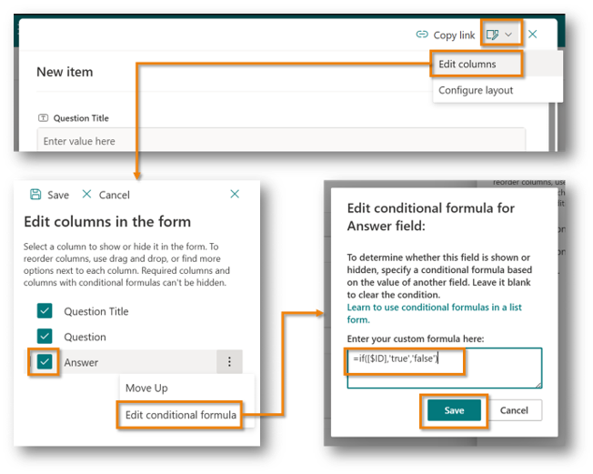

---
# this is the title
title: "Microsoft Lists: How to hide columns in a new form using conditional formula"

# this is the publishing date of your article, usually this should match "now"
date: 2024-07-10T16:00:00-00:00

# This is your name
author: "Tetsuya Kawahara"

# This is your GitHub name
githubname: tecchan1107

# Don't change
categories: ["Community post"]

# Link to the thumbnail image for the post
images:
  - images/thumbnail.png

# don't change
tags: []

# don't change
type: "regular"
---

## Introduction

While using Microsoft Lists, I encountered a situation where I wanted to hide specific columns in a new form.


I resolved this issue using the following approach.

## Solution

I used a [conditional formula](https://learn.microsoft.com/sharepoint/dev/declarative-customization/list-form-conditional-show-hide) to hide columns in a new form. Here are the steps and the formula I used:

1. Open the form
2. At the top of the form, select **Edit form** > **Edit columns**
3. Check the columns you want to hide on the new form
4. Select **options menu (︙)** > **Edit conditional formula**
5. Set the following expression in the conditional formula:

    ```
    =if([$ID],'true','false')
    ```

6. Select **Save**

    

This completes the setup. The column with the conditional formula will now be hidden in the new form.


