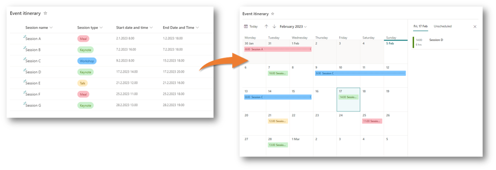
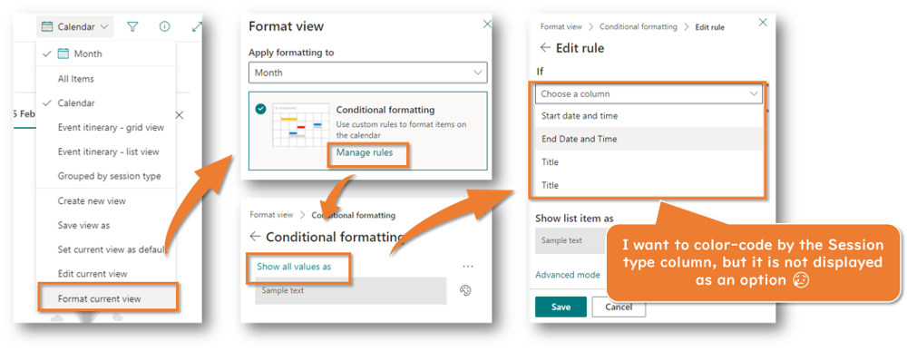
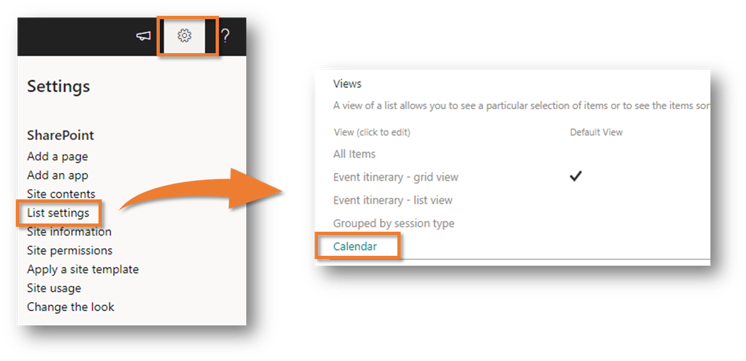
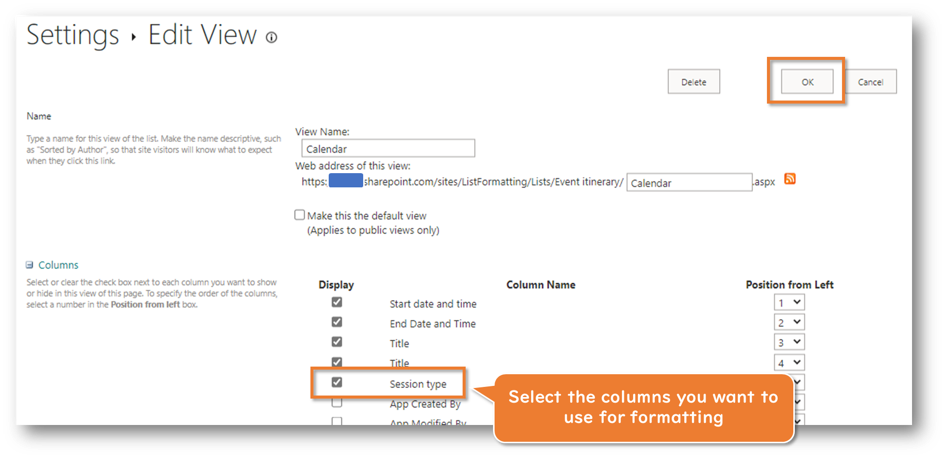
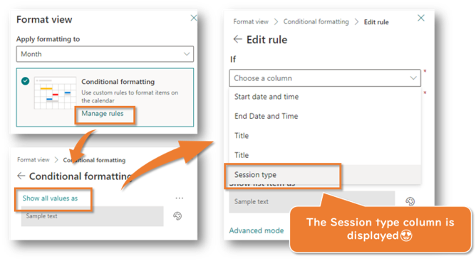

## Introduction

Microsoft Lists allows you to create a calendar view and color-code each item.

However, the columns you want to use for color coding may not appear in the formatting screen. This is because the column you want to use for color coding is not included in the calendar view.

So, the following is a method to change the view settings and increase the columns available for use in the calendar view formatting.

## How to increase the columns available for calendar view formatting

1. Open the Calendar view in Microsoft Lists
2. Click the **⚙** icon > Click **List settings**
3. Click on the view name of the calendar view in Views

    

4. Select the columns you want to use for formatting from the list of columns displayed in the Columns section
5. Click **OK** button

    

This completes the settings. When you open the formatting screen, the columns you selected in the Edit View screen will be displayed as available options for color-coding!

## References

- [List Formatting Samples](https://pnp.github.io/List-Formatting/)
- [Formatting syntax reference | Microsoft Learn](https://learn.microsoft.com/sharepoint/dev/declarative-customization/formatting-syntax-reference)
- [Format calendar view to customize SharePoint | Microsoft Learn](https://learn.microsoft.com/sharepoint/dev/declarative-customization/view-calendar-formatting)
- [Microsoft Lists Calendar Color Coding with View Formatting | YouTube](https://www.youtube.com/watch?v=QkHQs1HX-eE) - [April Dunnam](https://twitter.com/aprildunnam) | @aprildunnam
- [📆How to create a modern and colorful calendar view in SharePoint | YouTube](https://www.youtube.com/watch?v=q-8BzgXEwGk) - [Giuliano De Luca](https://twitter.com/DeLucaGiulian) | @DeLucaGiulian
- [SharePoint Library - calendar view conditional formatting | YouTube](https://www.youtube.com/watch?v=CWS8bMoYTys) - [Ami Diamond](https://twitter.com/ami_diamond) | @ami_diamond
