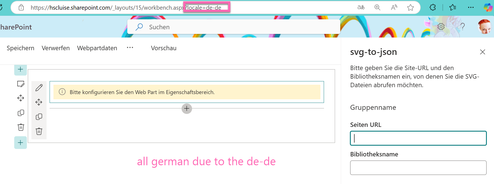

If you want to easily allow users to have your SPFx Web Part in a language of their liking, this guide is for you. To enable this multi language feature, we need to

1. Define the keys and their types for localized strings in the `mystrings.d.ts` file like this:


```typescript
declare interface ISvgToJsonWebPartStrings {
  saveConfiguration: string;
  libraryName: string;
  column: string;
  selectColumn: string;
}

declare module 'SvgToJsonWebPartStrings' {
  const strings: ISvgToJsonWebPartStrings;
  export = strings;
}

```

Depending on how much text you have in your Web Part, this can be a rather tedious task 😇.

(replace the `SvgToJsonWebPartStrings` with your Web Part Name)

2. Now in the `en-us.js` file (it's in the `loc` folder) you will define for each of your keys that you have in the `mystrings.d.ts` file, a key-value pair in english. If you also need `de-de.js` for german, or `fr-fr.js` for french or any other language, create a file with the name of that locale in the `loc` folder and provide a translated version of the values of the `en-us.js` file (Hello 👋 Copilot).

This should look a bit like this:

```typescript
define([], function() {
    return {
      "saveConfiguration": "Konfiguration speichern",
      "LibraryName": "Bibliotheksname",
      "column": "Spalte",
      "selectColumn": "Wählen Sie eine Spalte"
    }
});
```

3. Now replace all the hard coded strings like button texts, placeholders, labels, error messages etc. with `strings.<keyname>`, so for example `strings.column`.
4. As a last step, you need to import the strings into the file you want to use them with something like `import * as strings from 'SvgToJsonWebPartStrings';`

If you now run `gulp build` and `gulp serve` again to try out your masterpiece in the workbench and want to see your newly added languages, append the URL `https://<your tenant>.sharepoint.com/_layouts/15/workbench.aspx` with `?locale=de-de` or any other locale that you created.



Congrats! You enabled a multi-language feature in your Web Part and also improved the logic of it. Now if you change a text, that will appear two or more times in your Web Part once it reflects this everywhere, so less manual changes!

If you want to have a look at the Web Part (which is still work in progress), you can do this here: [react-svg-to-json-converter/](https://github.com/LuiseFreese/sp-dev-fx-webparts/tree/main/samples/react-svg-to-json-converter). Let me know what you think!
