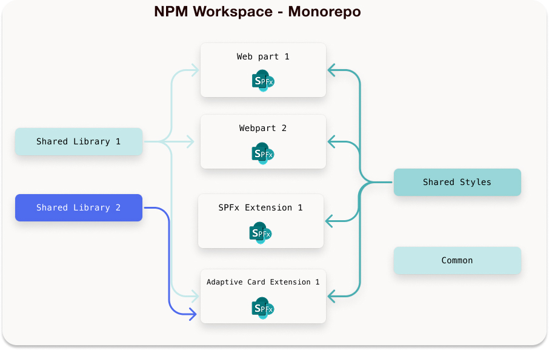

---

title: "Scaling SPFx Projects with NPM Workspaces - How to Manage Multiple Solutions Efficiently"
date: 2025-03-19T21:40:00-04:00
author: "Ahmad Jad Alhak"
githubname: ahmad-jad-alhak
categories: ["Community post"]
images:
- images/Thumbnail.png
tags: ["SPFx", "NPM Workspaces", "Library Component", "PnP"]
type: "regular"

---

As SharePoint Framework (SPFx) solutions become more complex, managing multiple solutions in one project can be difficult. **Npm workspaces** offer a modern solution for managing multiple SPFx projects within a single repository, known as a **monorepo**.

In this post, we’ll look at how NPM workspaces can enhance your SPFx development workflow and explain why workspaces are becoming a more appealing choice for modern SharePoint development.

## What Are npm Workspaces?

Introduced in npm 7, **workspaces** are a feature designed for managing multiple projects within a single repository, commonly called a **monorepo**. Workspaces allow projects within the monorepo to share dependencies, making version management easier, reducing redundancy, and simplifying the build and deployment processes.

Npm workspaces offer a modern solution for managing multiple SPFx projects within a single repository, known as a monorepo. This approach addresses several challenges associated with managing multiple SPFx solutions, such as dependency management, version control, and build efficiency. By centralizing dependencies and organizing projects under a unified structure, npm workspaces streamline the development process, reduce redundancy, and simplify the build and deployment processes. This makes them an appealing choice for modern SharePoint development, enhancing workflow efficiency and maintainability.

[Getting Started with NPM workspaces](https://ruanmartinelli.com/blog/npm-7-workspaces-1/)


## How It Works

* All SPFx projects are placed inside a **unified monorepo**.
    
* Dependencies are **installed once** at the root level (`node_modules/`), ensuring consistency.
    
* Shared code (components, APIs, utilities) is stored in a **central module** and used directly in all SPFx projects.
    
* Updates are **instantly available** to all SPFx solutions when rebuilt.
    


The `package.json` file at the **root of the monorepo** defines all workspaces, ensuring that SPFx projects and shared modules are properly managed.

**Root-Level** `package.json` (Located in `spfx-monorepo/`)

```bash
{
  "name": "spfx-monorepo",
  "private": true,
  "workspaces": [
    "spfx-webpart-1",
    "spfx-webpart-2",
    "spfx-ace-1",
    "shared-styles",
    "shared-library"
  ],
  "dependencies": {
    "react-dom": "17.0.2",
    "@pnp/sp": "4.9.0"
  },
  "devDependencies": {},
  "scripts": {
    # spfx-webpart-1
    "spfx-webpart-1:serve": "gulp serve -f ./spfx-webpart-1/gulpfile.js --workspace spfx-webpart-1",
    "spfx-webpart-1:bundle": "gulp bundle -f ./spfx-webpart-1/gulpfile.js --workspace spfx-webpart-1",
    "spfx-webpart-1:pkg": "gulp package-solution --ship -f ./spfx-webpart-1/gulpfile.js --workspace spfx-webpart-1",
    # spfx-webpart-2
    "spfx-webpart-2:serve": "gulp serve -f ./spfx-webpart-2/gulpfile.js --workspace spfx-webpart-2",
    "spfx-webpart-2:bundle": "gulp bundle -f ./spfx-webpart-2/gulpfile.js --workspace spfx-webpart-2",
    "spfx-webpart-2:pkg": "gulp package-solution --ship -f ./spfx-webpart-2/gulpfile.js --workspace spfx-webpart-2",
    # spfx-ace-1
    "spfx-ace-1:serve": "gulp serve -f ./spfx-ace-1/gulpfile.js --workspace spfx-ace-1",
    "spfx-ace-1:bundle": "gulp bundle -f ./spfx-ace-1/gulpfile.js --workspace spfx-ace-1",
    "spfx-ace-1:pkg": "gulp package-solution --ship -f ./spfx-ace-1/gulpfile.js --workspace spfx-ace-1",
     # library Compoennt 
    "lib-comp": "npm run start --workspace shared-library"
  }
}
```

**What This Does:**

* Defines **workspaces** that include **SPFx projects (**`spfx-webpart1`, `spfx-webpart2`) and shared modules (`shared-components`, `shared-library`).
    
* Ensures that all **dependencies are installed centrally in** `node_modules/`, preventing duplication.
    
* Allows SPFx projects to **import shared modules** directly without needing a separate installation.
    

Explanation of `package.json` Setup:

**Workpace Section**

```bash
"workspaces": [
  "spfx-project-1",
  "spfx-project-2",
  "spfx-ace-1",
  "library-component"
]
```

**Scripts Section:**

```bash
"scripts": {
    # spfx-webpart-1
    "spfx-webpart-1:serve": "gulp serve -f ./spfx-webpart-1/gulpfile.js --workspace spfx-webpart-1",
    "spfx-webpart-1:bundle": "gulp bundle -f ./spfx-webpart-1/gulpfile.js --workspace spfx-webpart-1",
    "spfx-webpart-1:pkg": "gulp package-solution --ship -f ./spfx-webpart-1/gulpfile.js --workspace spfx-webpart-1",
    # spfx-webpart-2
    "spfx-webpart-2:serve": "gulp serve -f ./spfx-webpart-2/gulpfile.js --workspace spfx-webpart-2",
    "spfx-webpart-2:bundle": "gulp bundle -f ./spfx-webpart-2/gulpfile.js --workspace spfx-webpart-2",
    "spfx-webpart-2:pkg": "gulp package-solution --ship -f ./spfx-webpart-2/gulpfile.js --workspace spfx-webpart-2",
    # spfx-ace-1
    "spfx-ace-1:serve": "gulp serve -f ./spfx-ace-1/gulpfile.js --workspace spfx-ace-1",
    "spfx-ace-1:bundle": "gulp bundle -f ./spfx-ace-1/gulpfile.js --workspace spfx-ace-1",
    "spfx-ace-1:pkg": "gulp package-solution --ship -f ./spfx-ace-1/gulpfile.js --workspace spfx-ace-1",
    # library Compoennt 
    "lib-component": "npm run start --workspace shared-library"
}
```

**Running SPFx Projects & Shared Library:**

Running SPFx Project 1 in Development Mode

```bash
npm run spfx-webpart-1:serve
```

Bundling and preparing for deployment:

```bash
npm run spfx-webpart-1:bundle
npm run spfx-webpart-1:pkg
```

## Why Use NPM Workspaces for SPFx?

**Challenges of Managing Multiple SPFx Projects:**

Managing dependencies across multiple SharePoint Framework (SPFx) projects can quickly become a **time-consuming and error-prone task**. Each project traditionally maintains its own `node_modules` folder, leading to:

* **Version mismatches** – Different SPFx solutions using conflicting versions of the same package.
    
* **Redundant package installations** – Wasted disk space and long install times.
    
* **Manual updates** – Updating dependencies across multiple projects one by one.
    
* **Difficulty in sharing code** – Custom libraries have to be duplicated or published separately.
    
* **Code Duplication** – Every project has its own `services/`, `utils/`, and `styles/`, leading to **redundant code**.
    

**Traditional SPFx Folder Structure without Library Component or NPM Workspaces:**

```bash
spfx-projects/             🔹 Folder containing multiple independent SPFx solutions
│── spfx-webpart1/         🔹 First SPFx Web Part (Independent Project)
│   │── src/
│   │   │── components/     🔹 Web Part-specific UI components
│   │   │── services/       🔹 API calls and business logic
│   │   │── utils/          🔹 Helper functions (Duplicated in each project)
│   │   │── styles/         🔹 Local SCSS styles
│   │── node_modules/       🔹 Project-specific dependencies
│   │── package.json        🔹 Contains dependencies (installed separately)
│── spfx-webpart2/         🔹 Second SPFx Web Part (Independent Project)
│   │── (Same structure as `spfx-webpart1`)
│── spfx-webpart3/         🔹 Third SPFx Web Part (Independent Project)
│   │── (Same structure as above)
```

**Example of Duplication in Each Project:**

* `spfx-webpart1/src/utils/formatDate.ts`
    
* `spfx-webpart2/src/utils/formatDate.ts`
    
* `spfx-webpart3/src/utils/formatDate.ts`
    

If `formatDate.ts` needs an update, **every project must be modified separately**—a maintenance nightmare.

## How NPM Workspaces Solve These Issues

NPM Workspaces allow multiple SPFx projects to be managed within a **single repository (monorepo)**, where dependencies are centrally installed and maintained.

* **Centralized Dependency Management** – NPM Workspaces ensure that all SPFx projects use a single source for dependencies, eliminating version mismatches and reducing redundant package installations. This approach simplifies updates, improves consistency, and optimizes project maintenance across multiple solutions.
    
* **Consistent Package Versions** – Avoid mismatches between SPFx projects. By defining dependencies at the root level, NPM Workspaces ensure all SPFx projects use the same package versions, preventing conflicts and unexpected bugs. This eliminates the hassle of manually syncing versions across multiple solutions.
    
* **Code Sharing** – Share custom components and utilities across projects without extra setup. NPM Workspaces allow you to create and reuse shared modules, such as UI components, API services, and utility functions, across multiple SPFx projects. This reduces code duplication and ensures consistency in functionality and styling.
    
* **Scalable and modular for large teams** – NPM Workspaces allow multiple SPFx projects to share code efficiently while remaining independent, making collaboration easier across large development teams. As projects grow, this structure ensures maintainability, reduces redundancy, and streamlines updates.
    
* **Faster Install and Build Times** – No more downloading the same package multiple times. Since dependencies are installed once and shared across all projects, workspaces significantly reduce installation time and disk space usage. This speeds up development, CI/CD pipelines, and overall project performance.
    
* **Improved team collaboration** – Developers work on a single, unified codebase instead of multiple repositories.
    


### Folder Structure with NPM Workspaces

**Example Folder Structure in NPM Workspaces:**

```bash
spfx-monorepo/
│── package.json         🔹 Defines NPM Workspaces
│── packages/            🔹 Contains all SPFx projects
│   │── webpart1/        🔹 First SPFx Web Part
│   │── webpart2/        🔹 Second SPFx Web Part
│   │── shared-utils/    🔹 Shared helper functions (e.g., API wrappers)
│   │── shared-styles/   🔹 Shared SCSS styles
│── node_modules/        🔹 Shared dependencies
│── README.md            🔹 Documentation
```

*This structure scales efficiently as more SPFx projects are added.*

**Example of more detailed structure for SPFx with NPM Workspaces**

```bash
spfx-monorepo/             🔹 Root Monorepo (Managed with NPM Workspaces)
│── package.json           🔹 Defines workspaces & shared dependencies
│── tsconfig.base.json     🔹 Base TypeScript configuration for all projects
│── .eslintrc.js           🔹 Shared ESLint configuration
│── node_modules/          🔹 Centralized dependencies
│── packages/              🔹 All SPFx projects & shared modules
│   │── spfx-webpart1/     🔹 First SPFx Web Part
│   │   │── src/
│   │   │   │── components/     🔹 Web Part-specific UI components
│   │   │   │── services/       🔹 API calls (imports from `shared-library`)
│   │   │   │── utils/          🔹 Local helper functions (imports from `shared-library`)
│   │   │   │── styles/         🔹 Local SCSS styles (can import from `shared-styles`)
│   │   │── package.json        🔹 Web Part dependencies
│   │── spfx-webpart2/     🔹 Second SPFx Web Part (Same structure)
│   │── shared-components/ 🔹 Shared UI Components
│   │   │── src/
│   │   │   │── Button.tsx
│   │   │   │── Modal.tsx
│   │   │── package.json
│   │── shared-styles/     🔹 Global SCSS Themes & Variables
│   │   │── src/
│   │   │   │── themes.scss
│   │   │   │── mixins.scss
│   │   │── package.json
│   │── shared-library/    🔹 **Shared Library (Services & Utilities)**
│   │   │── src/
│   │   │   │── services/       🔹 API Logic (PnP JS, MS Graph, etc.)
│   │   │   │   │── SharePointService.ts
│   │   │   │   │── GraphService.ts
│   │   │   │   │── index.ts
│   │   │   │── utils/          🔹 Helper Functions (Formatting, Data Manipulation)
│   │   │   │   │── formatDate.ts
│   │   │   │   │── arrayHelpers.ts
│   │   │   │   │── index.ts
│   │   │── package.json         🔹 Defines shared dependencies for services & utils
│── README.md              🔹 Documentation
│── .gitignore             🔹 Ignore unnecessary files
```

To summarize, here are some issues that npm workspaces address:

| **Feature** | **Traditional SPFx Project** | **SPFx with NPM Workspaces** |
| --- | --- | --- |
| **Project Structure** | Separate repositories or folders | Single monorepo with multiple projects |
| Code Reuse | Shared code must be copied or referenced via SPFx Library Component | Shared components and utilities are directly imported from a central module |
| Dependency Management | Each project installs dependencies separately, leading to version mismatches | Dependencies are centralized, ensuring consistency across all projects |
| Updating Shared Code | Requires manual updates in each project | Updates apply automatically across all projects when rebuilt |
| Performance & Maintenance | Higher maintenance effort due to redundant dependencies | Lower maintenance as dependencies are installed once for all projects |
| Collaboration | Teams work on isolated projects, often duplicating work | Teams collaborate on a unified codebase, reducing duplication |

## The Domino Effect in NPM Workspaces: How Scaling Benefits Grow with More SPFx Projects

One of the biggest advantages of using **NPM Workspaces** for SPFx development is the **Domino Effect**—where a single change in shared code can **automatically propagate across multiple projects**, improving efficiency at scale.

How the Positive Domino Effect Works

* **Faster Code Improvements** → A fix or feature enhancement in `shared-library` instantly applies to **all SPFx projects**that use it.
    
* **Consistent Branding & UI** → Updates in `shared-styles` or `shared-components` ensure that every web part maintains **a unified design**.
    
* **Reduced Duplicate Work** → Teams don’t need to copy and maintain identical services, utilities, or styles across multiple repositories.
    
* **Easier Security & Performance Updates** → A single change in `shared-services` can enhance security across **every consuming SPFx solution**.
    

**Example: How a Small Change Has a Big Impact**

Imagine you update a **PnP JS API function** in `shared-library/services/SharePointService.ts` to optimize performance.

**1. Traditional SPFx Approach (Without NPM Workspaces or library component):**
    

* Each SPFx project has **its own version** of `SharePointService.ts`.
    
* You must **manually copy and update** this service in every project.
    
* Some projects may **still use outdated, less efficient versions**.
    

**2. NPM Workspaces Approach:**
    

* The optimized function in `shared-library` is **immediately available** to all SPFx projects.
    
* No need for **manual updates**—each SPFx project gets the latest changes upon rebuild.
    
* Every solution benefits from **performance improvements without extra effort**.
    

 **Scaling the Domino Effect: More Projects = Greater Efficiency Gains**

| **Number of SPFx Projects** | **Traditional Approach (Without Workspaces)** | **NPM Workspaces Approach** |
| --- | --- | --- |
| **2-3 Projects** | Manageable but still requires manual updates | Shared updates benefit all projects instantly |
| **5-10 Projects** | Code duplication increases, version mismatches appear | Changes scale across all projects, reducing maintenance |
| **10+ Projects** | Updating shared logic becomes time-consuming and error-prone | Every fix, feature, or enhancement is applied effortlessly |

## Exploring Other Alternatives: SPFx Library Components

**A common alternative to the npm workspace is SPFx Library Component.** They provide a structured and version-controlled method to share reusable code across multiple SPFx solutions. Instead of duplicating components or utilities, teams can maintain a **centralized library** that various SPFx web parts and extensions can reference. It's important to note that there are some limitations when using library components compared to npm workspaces. For example, you cannot update the solution version when a new version of SPFx is released using the library component, which you can do with npm workspaces. Ultimately, it depends on the use case.

### How It Works:

* A **separate SPFx Library Component** is created and packaged as a `.sppkg` file.
    
* The library is **deployed to the Tenant App Catalog**, making it available for other SPFx projects.
    
* Each consuming SPFx solution must **install and reference the library manually** as a dependency.
    
* Updates require **rebuilding and redeploying** the library, followed by **manually updating** the version in all consuming projects.
    

**Example Structure for SPFx with Library Components**

```bash
spfx-webpart1/         🔹 Independent SPFx Project
│── src/
│   │── components/     🔹 Web Part-specific UI components
│   │── services/      🔹 API calls and business logic
│   │── utils/         🔹 Helper functions
│   │── styles/        🔹 Local SCSS styles
│── node_modules/      🔹 Project-specific dependencies
│── package.json       🔹 Dependency configuration

spfx-webpart2/         🔹 Another independent SPFx Project
│── (Same structure as webpart1)

spfx-library-component/ 🔹 Shared Library Component
│── src/
│   │── components/     🔹 Reusable UI components (e.g., Buttons, Modals)
│   │── hooks/          🔹 Shared React Hooks
│   │── services/       🔹 API helpers (e.g., SharePoint PnP JS functions)
│   │── styles/         🔹 Shared SCSS styles
│── package.json       🔹 Needs to be manually updated in consuming projects
```

### Key differences between library components and npm workspaces:

| **Feature** | **NPM Workspaces** | **SPFx Library Component** |
| --- | --- | --- |
| Deployment Method | Each SPFx solution has its own `.sppkg` file. No separate deployment for shared code. | A single `.sppkg` file for the library is deployed to the Tenant App Catalog. Must deploy `.sppkg` file for the library |
| How Shared Code is Delivered | Bundled directly inside each SPFx project | Deployed separately and referenced as a dependency |
| Deployment Required? | No separate deployment for shared code | Must deploy `.sppkg` file for the library |
| Automatic updates across projects | Manual—update reference in each project and redeploy |  |
| Best for | Managing multiple SPFx projects that share utilities, APIs, configs | Centralized versioning of reusable UI components |


## Summary: When to Use npm Workspaces

* **Use npm Workspaces** when:
    
    * You have a large, multi-component SPFx solution that benefits from centralized dependency management.
        
    * You want to simplify your project structure by managing all SPFx components within a single repository.
        
    * You need efficient, simultaneous builds and want to streamline CI/CD pipelines.
        
    * You’re developing closely related components that share dependencies, libraries, or utility functions.
        
* **Use SPFx Libraries** when:
    
    * You need to create a reusable, standalone library that may be used across multiple projects or repositories.
        
    * Your organization prefers managing separate repositories for each project or has complex deployment requirements.
        
    * You want more control over when updates are pulled into individual projects, avoiding immediate changes across all projects.
        
    
## Conclusion
    
    For SPFx developers, npm workspaces provide a powerful solution by enabling centralized dependency management, facilitating easier code reuse, and enhancing scalability. As more SPFx solutions adopt npm workspaces, the efficiency gains increase, reducing maintenance efforts while ensuring all projects remain synchronized with the latest updates.
    

## Further Reading & Implementation Guide

This blog was inspired by a blog from one of the PnP community members. His detailed blog and video walkthrough provide additional guidance on setting up and managing a monorepo for SPFx.

If you're looking for a **step-by-step implementation guide**, check out these resources to get hands-on experience setting up **SPFx projects with NPM Workspaces**.

**Recommended Resources:**

**Blog:** [Use SharePoint Framework with npm / yarn workspaces](https://n8d.at/use-sharepoint-framework-with-npm-yarn-work-spaces/)

**Video Tutorial:** [Using npm workspace for making management of complex SPFx solutions easy](https://www.youtube.com/watch?v=mg17Hcb-vMg)

[SharePoint Framework Official Docs](https://learn.microsoft.com/sharepoint/dev/spfx/sharepoint-framework-overview?WT.mc_id=m365-15744-cxa)

[Getting Started with npm Workspaces](https://ruanmartinelli.com/blog/npm-7-workspaces-1/)
