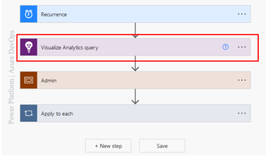
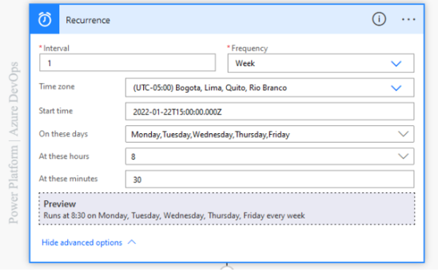
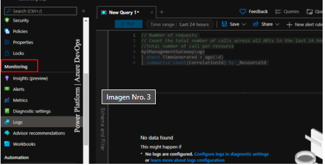
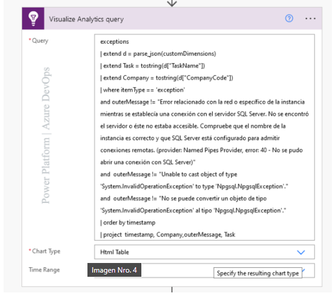

## how do you monitoring azure resources with power platform

We will use timer type objects, this not being cataloged as a connector will have a role in the construction of the process.

Our Flow will be a (Flow on a schedule) in short words the process will have a responsibility to execute due to a schedule that the creator of the process will assign to it.

When you have a defined role in the subscription, resource group, or resource scope in Azure, and you're interested in knowing or monitoring the health of your app.

The Azure cloud provides us with a whole range of options seeking to always be aware of what happens to resources, to be able to make decisions regarding infrastructure errors.

On the other hand, we have the option to do this monitoring through the Power Platform tools through connectors for this purpose.

**What is the difference between Azure or Power Platform?**

I share with you some valid options when you make use of the Microsoft Office 365 suite.

*Azure*

1. Monthly charge of USD $1.60 per alert created
2. More configuration steps to notify IT

*Power Platforms*

1. Use the Premium Application Insights connector for free for 90 days, through Power Automate included in your Office 365 subscription

2. Zero complexities when choosing who to notify about the result of this connector.

## Why does this Process?

Imagine that you are Sysadmin / IT Support Engineer / SRE of a very robust infrastructure, you need to know the 24/7 health of your applications and your organization also requires saving some money.

The use of Power Platform, you are under a concept that is known as Low Code where the development of an application is democratized to a professional developer.

## How does this process work?

We start our Flow with a detonator in this case we will use Recurrence to which we can add (Interval, Frequency, Time Zone, Start Time, Days) the value of adding these values corresponds to the particular need in the way we want to communicate the result.

The Power Automate Application insights Premium connector in its Visualize Analytics query action with three (03) parameters (Query, Chart Type, and Time Range).

In the azure portal within the resource in the Monitoring/Logs section You can execute KQL statements as an example in image No. 3 total requests handled by Application Insights are being calculated.

In Power Automate in the Application insights connector in its Action Visualize Analytics query in the query action goes the Kusto Query Language (KQL) statement.

- Chart type: What type of chart you want.

- Time Range: Time to monitor.

To generate the Connection of the Application Insight in Power Automate we must have two very important data.

1. Generate an ACCESS API in the Azure portal with the permission of the Read Telemetry.

2. Copy the Application ID of the resource.

Finally, we make use of the standard Office 365 Outlook connector in the Send an email action (V2) where we select a sender, a subject and body of the email you enter the output of the body of the Application insights connector, here I recommend you make use of the option < / > code to be able to send templates written with html code.
