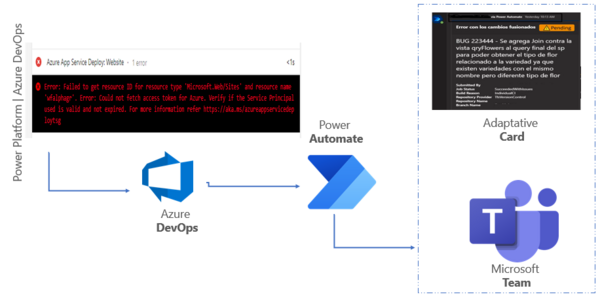
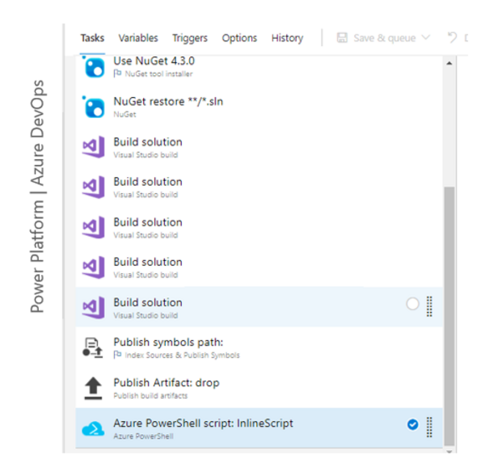
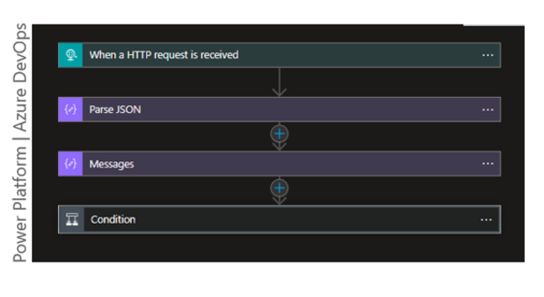

## How to monitor build host agent from power platform

We will make use of the standard connector when a HTTP request is received and Microsoft Team.

We will use compose type objects, these not being cataloged as connectors will have an important role in the construction of the process.

The flow is of type Cloud Flow What is it? A cloud flow is responsible for running one or more tasks automatically once an event triggers it.

## Why does this Process?

VM runs the processes of release of code of interest to a type of business and it is required to have a monitoring strategy for when errors occur throughout the DevOps cycle.

A way to develop a process that fulfills this end. It is using the Power Platform suite and getting this result.



## What do we do in this process?

through the agent variables (DevOps Services) where you are can be used as parameters in the compilation tasks; We will obtain some necessary values to help monitor errors when compiling a code project.

The variables to be used will be.

Agent.Job status: Build status.

`Canceled`

`Failed`

`Succeeded`

`SucceededWithIssues `


```

- [ ] Build.Reason : Event that caused the build to run

- [ ] Manual: a user manually queues the build.

- [ ] IndividualCI: Continuous integration (CI) triggered by a Git insertion or a TFVC insertion.

- [ ] BatchedCI: continuous integration (CI) triggered by a Git push or TFVC check, and Batch changes were selected.

- [ ] Schedule: programmed trigger.

- [x] Build.Repository.Provider: The type of the trigger repository.

- [ ] TfsGit

- [ ] TfsVersionControl

- [ ] Git

- [ ] GitHub

- [ ] Svn

- [x] Build.Repository.Name: he type of the trigger repository.

- [x] Build.SourceVersionMessage : Comment on the commit or change set of the trigger repository. Truncate the message to the first line or 200 characters, whichever is shorter.

- [x] Build.SourceBranchName : Name of the branch in the trigger repository for which the build was queued.
```


## How does this process work?

From the Azure DevOps tool through CI / CD process we will compile a code project (Front End - Back End and Services).

The compilation process will be automatically triggered from a code repository; This will occur in virtual machines managed by Azure DevOps, where you can get the previously related variables.

These variables will be sent to Power Platform via the Azure task.

PowerShell Script: Inline Script



Now we will use the connector when a HTTP request is received in charge of receiving via parameters from the Power Shell of Azure DevOps the group of variables to be used.



The group of variables are received in an object, which is recommended to convert to an object of type JSON for them we use the Component Parse JSON there receives in the section of the body receives the body of the connector when a HTTP request is received and the Shema is a format of type JSON with the 6 six variables of the azure DevOps agent.

In the condition section, there is a validation with the agent.jobstatus variable where if the result is SuccededwithIssues or Failed the values of the variables are related on an adaptive card and sent to a Microsoft Team channel.

