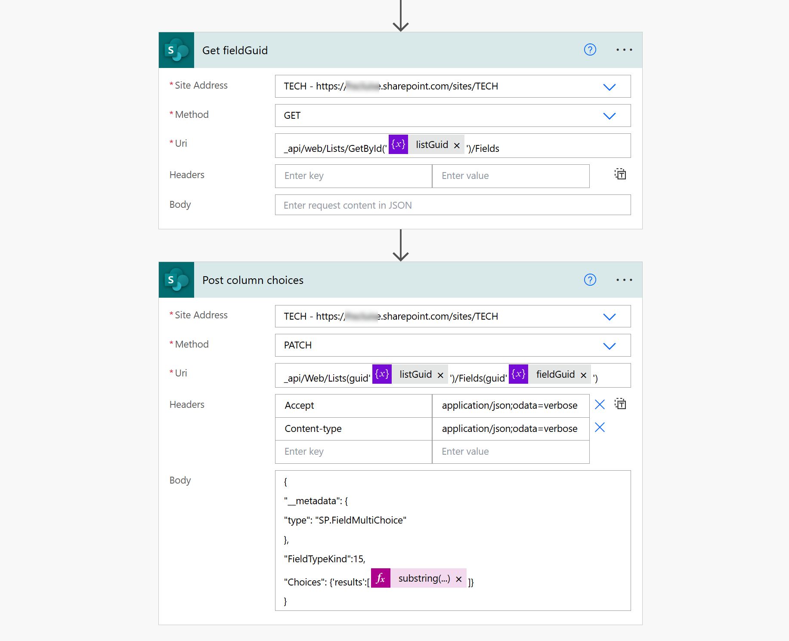

Recently, a customer asked me if I could automagically 🦄 populate Microsoft 365 Group Names to a multiple choice column in a SharePoint list. Of course I told them that one can create an ootb Person field and allow group selection, but that was not quite what they wanted. So I built a simple Power Automate flow that would populate the choice column and applied some nice list formatting to it.

## Prerequisites

- Have a SharePoint list
- Create a Choice column (I named mine `Group`)
- Under **More options** flip the switch **Allow multiple selections** to `Yes`

## The Power Automate flow


We will use non-Premium connectors, first leveraging the Azure AD Group connector (*time for a rename @Microsoft, huh?*) to get all the groups, then use the SharePoint connector to send a request via SharePoint REST API. Let's get started!

### Get your groups

* We trigger the flow as per our needs (manually, if there is not a lot of change in groups) or on a schedule (if there is a lot of changes in groups)
* we then initialize a variable (I used string, but you can also do an array) for the `groupNames`
* then we use the Azure AD Groups - List Groups action to list all groups. Filter if needed!
* Then we append the `Name` (and a comma) in a loop to our `groupNames` variable


### Obtain listguid and fieldguid

Now we need to obtain 2 things

1. the **listguid** of our SharePoint list: Select the **Settings** gear ⚙️ on your list, **List Settings**, you will find it in the URL. The List guid sits right in between `%7B` and`%7D` (Of course there are a gazillion of other ways to obtain this, but that is a super easy one). If you like to, write this value into a variable - it looks just more neat and tidy!
2. the **fieldguid** of the field that we are trying to populate: You can either follow [this post here](https://medium.com/@hadimahmood777/sharepoint-essentials-getting-to-know-your-lists-column-guid-a7b46bdf7596) or stick with me and:

- Use **Send an HTTP request to SharePoint**
  - Method: Get
  - URI:`_api/web/Lists/GetById('@{variables('listGuid')}')/Fields`

This will return a massive json object from which you can now find the `id` of the field you are interested in. Again, use a variable if you like to!

If you need this for several multiple choice columns, I suggest that you filter down your `results` array to the column that you are interested in and then select the `id` from that.

### Patch the choice column

As a last step, we patch our choice column with the groupNames. As we comma-separated this variable, we need to make sure that we remove that comma now:



- Use **Send an HTTP request to SharePoint**
  - **Method**: `Patch`
  - **URI**:`_api/Web/Lists(guid'listGuid')/Fields(guid'fieldguid')`
  - **Headers**:
    - **Accept**: `application/json;odata=verbose`
    - **Content-type**: `application/json;odata=verbose`
- **Body**:

```json
{
"__metadata": {
"type": "SP.FieldMultiChoice"
},
"FieldTypeKind":15,
"Choices": {'results':[@{substring(variables('groupNames'),0, sub(length(variables('groupNames')),1))}]}
}
```

If we now check in SharePoint, this looks good! Next time: Add some Listformatting to the column!

## Sneak peek


Let me if you like it :-)


