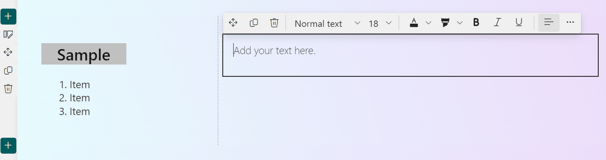

## Introduction

Did you know that you can use Markdown syntax in SharePoint's [Text Web Part](https://support.microsoft.com/office/add-text-tables-and-images-to-your-page-with-the-text-web-part-729c0aa1-bc0d-41e3-9cde-c60533f2c801)? With Markdown syntax, you can quickly set headings and text styles without using the mouse.


In this article, I'll introduce the Markdown syntax that can be used in the Text Web Part.

## Markdown Syntax Available in the Text Web Part

The following table lists the Markdown syntax available in the Text Web Part:

|Element|Markdown Syntax|
|---|---|
|Header|`#[space]Header`<br />`##[space]Header`<br />`###[space]Header`|
|Bold Text|`**Bold Text**`<br />or<br />`__Bold Text__`|
|Italic Text|`*Italic Text*`<br />or<br />`_Italic Text_`|
|Strikethrough|`~~Strikethrough~~`|
|Numbered List|`1.[space]Item`|
|Bulleted List|`*[space]Item`<br />or<br />`-[space]Item`|
|Quote|`>[space]Quote`|

### Header

To create a header, start the line with `#` (hash) followed by a space, then write your text. Fewer `#` symbols indicate larger headers.

```
#[space]Header
##[space]Header
###[space]Header
```


### Bold Text

To make text bold, surround it with `**` (two asterisks) or `__` (two underscores).

```
**Bold Text**
__Bold Text__
```


### Italic Text

To italicize text, surround it with `*` (asterisk) or `_` (underscore).

```
*Italic Text*
_Italic Text_
```


### Strikethrough

To strikethrough text, surround it with `~~` (two tildes).

```
~~Strikethrough~~
```


### Numbered List

To create a numbered list, start the line with a number followed by a period and a space.

```
1.[space]Item
```



### Bulleted List

To create a bulleted list, start the line with `*` (asterisk) or `-` (hyphen) followed by a space.

```
*[space]Item
-[space]Item
```


### Quote

To create a quote, start the line with `>` (greater than) followed by a space.

```
>[space]Quote
```


These are the Markdown formatting options available in the Text Web Part. Give them a try!

## Additional Notes

SharePoint also has a [Markdown Web Part](https://support.microsoft.com/office/use-the-markdown-web-part-6d73c06d-2877-4bc9-988b-f2896016c50b), which allows you to create tables from Markdown-formatted text and retains the original Markdown format. Be sure to take advantage of the Markdown Web Part as well.

