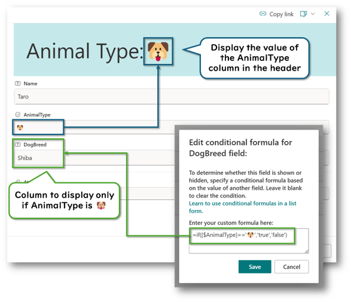
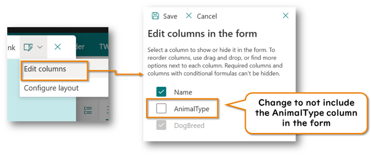
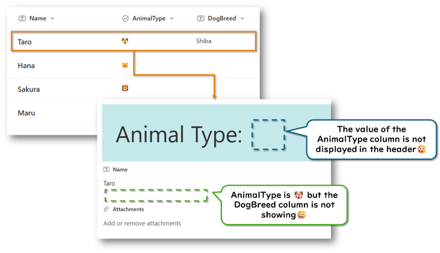
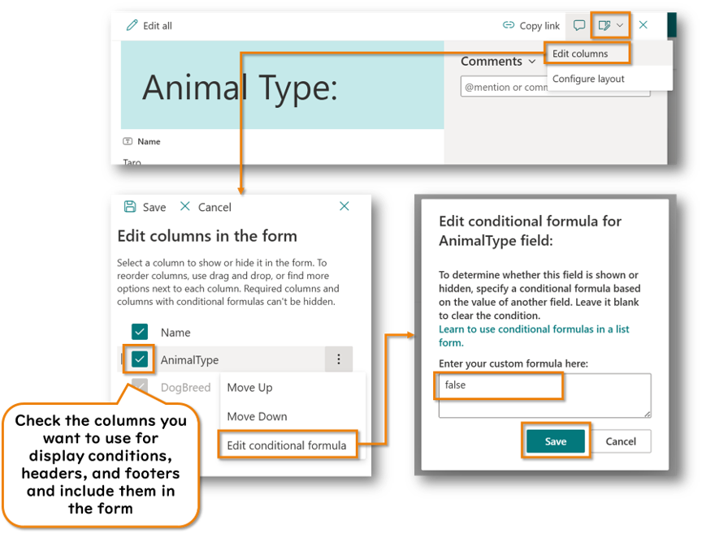
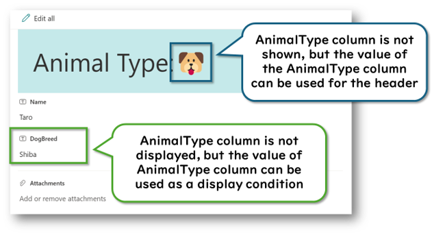
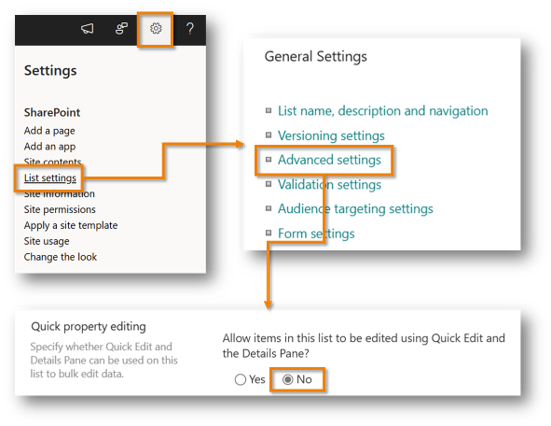

---
# this is the title
title: "Microsoft Lists: How to use values in columns not displayed on the form for display conditions and form formatting"

# this is the publishing date of your article, usually this should match "now"
date: 2024-07-07T10:00:00-00:00

# This is your name
author: "Tetsuya Kawahara"

# This is your GitHub name
githubname: tecchan1107

# Don't change
categories: ["Community post"]

# Link to the thumbnail image for the post
images:
  - images/thumbnail.png

# don't change
tags: []

# don't change
type: "regular"
---

## Introduction

In Microsoft Lists forms, you can set [display conditions](https://learn.microsoft.com/sharepoint/dev/declarative-customization/list-form-conditional-show-hide) for each column and use [JSON to display column values in the header or footer](https://learn.microsoft.com/en-us/sharepoint/dev/declarative-customization/list-form-configuration).



However, these customizations are limited to columns included in the form. This means you cannot use values from columns not included in the form for display conditions or to display them in the header or footer.





Nonetheless, there may be cases where you want to use values from columns not displayed on the form for display conditions or to show them in the header or footer. For example, there might be columns that are only updated by Power Automate or PowerShell and are not displayed on the form to avoid editing, but you still want to use these columns for display conditions.

In this article, I will show you how to use values from columns not displayed on the form for display conditions and to display them in the header or footer.

## How to Use Values in Columns Not Displayed on the Form for Display Conditions and Form Formatting

You can use the values of columns included in the form for display conditions, headers, and footers. In other words, if you include a column in the form but always hide it, you can use its value.

Here are the steps to include a column in the form while keeping it always hidden:

1. Open the form
2. At the top of the form, select **Edit form** > **Edit columns**
3. Check the columns you want to use for display conditions, the header, or the footer to include them in the form
4. Select **options menu (︙)** > **Edit conditional formula**
5. Set the following expression in the conditional formula:

    ```
    false
    ```

6. Select **Save**

    

With these steps, you can set columns to be always hidden while using their values for display conditions, the header, or the footer.



## Additional Notes

- If you hide a column from the form, you cannot edit the column value from the form, but you can edit it in Edit in grid view. If you want to prevent this, set Quick property editing to "No" from the list settings.

  

- [List Formatting Samples](https://pnp.github.io/List-Formatting/formsamples/) provides JSON samples for customizing the header and footer of forms.