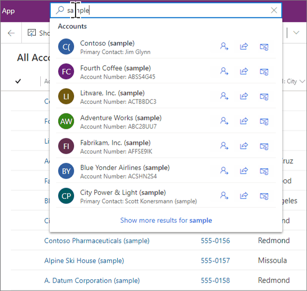
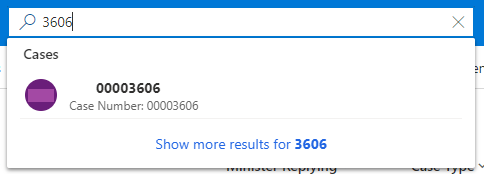

[Dataverse Search includes inline suggestions](https://learn.microsoft.com/en-us/power-apps/user/relevance-search#inline-suggestions) that are displayed as you type the search string, as shown in the example from Microsoft's documentation:



When working with tables such as Cases, it’s common to use autonumber columns to give them sequential reference numbers such as 00003606, 00003607, etc.

However, one issue with autonumber columns is that the inline suggestions in Dataverse search require the leading zeros as inline suggestions search words that begin with the characters typed. Typing “3606” doesn’t show the inline suggestion, and you have to use ‘Return’ to display the search results page.


Now that [Dataverse formula columns are generally available](https://learn.microsoft.com/en-us/power-apps/maker/data-platform/formula-columns?tabs=type-or-paste), we can get around this issue, by adding a new column with the formula:

``` excel
Text(Int('Case Number'),"#")
```

This formula converts the autonumber 00003606 to 3606 for our example.

The column can then be added as a find column in the quick find view to include it in Dataverse Search. This will show the case in the inline suggestion.



Note that the Text function is needed to convert the integer version of the case number into text, as the integer version can’t currently be added as a find column and also introduces thousand separators: ‘-’ or the equivalent for your locale.
