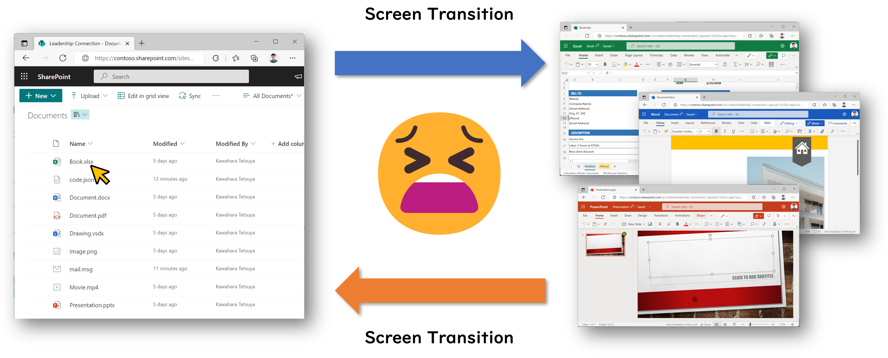
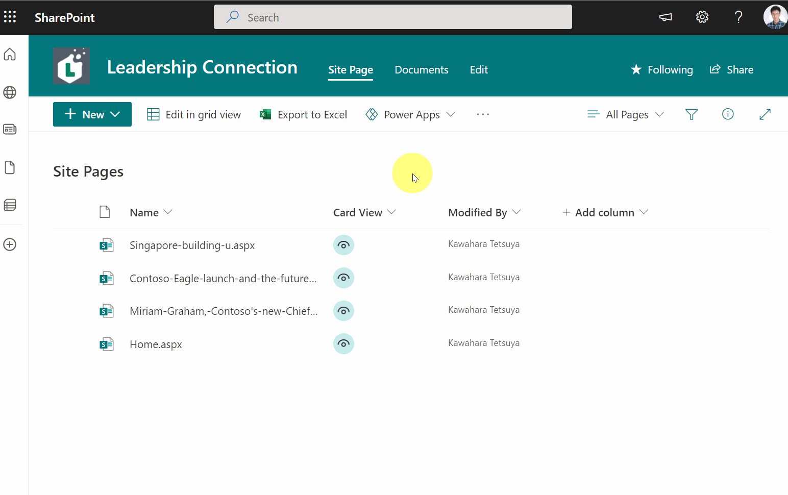
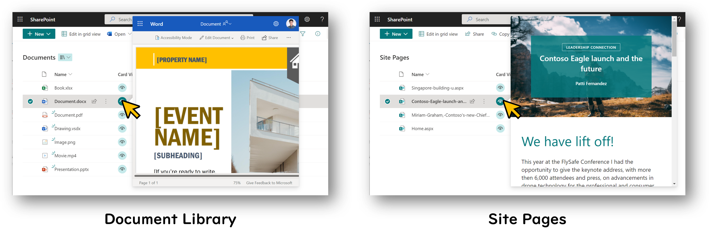
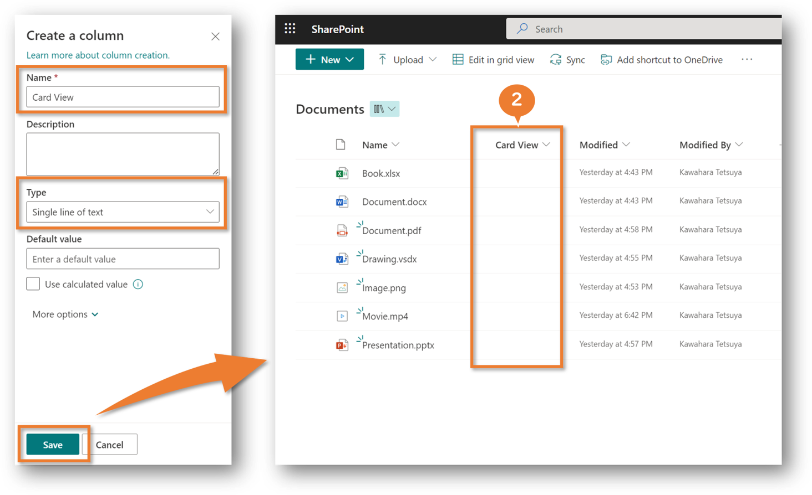
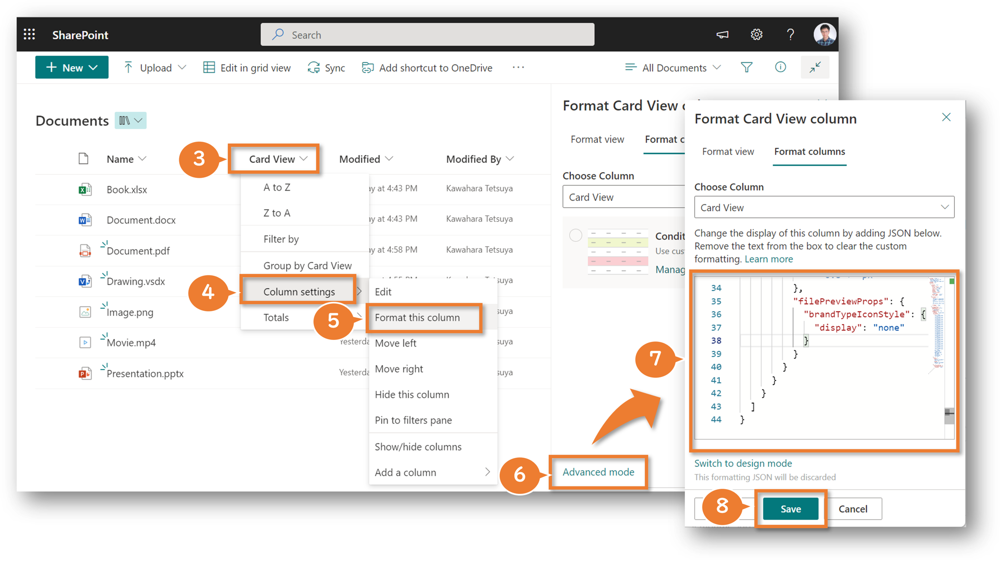

Have you ever opened and checked each file or page in the Document Library or Site Pages one by one to find the desired file or page? And have you ever been frustrated by the screen transitions that occur each time you open a file? I often have.



So, to eliminate these screen transitions, I created a column formatting that displays the file preview card, as shown below.



This file preview card can also be applied to either the Document Library or Site Pages.



Below are the instructions for applying this file preview card.

## How to apply file preview card

1. Open site pages or document library
2. Create a column of any name and type



3. Click on the column header of the created column
4. Hover **Column Settings**
5. Click **Format this column**
6. Click **Advanced mode**
7. Paste the JSON from the following into the text box
8. Click **Save**



``` json
{
  "$schema": "https://developer.microsoft.com/json-schemas/sp/v2/column-formatting.schema.json",
  "elmType": "div",
  "children": [
    {
      "elmType": "div",
      "style": {
        "border-radius": "50%",
        "cursor": "pointer",
        "font-size": "15px",
        "width": "27px",
        "height": "27px",
        "display": "flex",
        "justify-content": "center",
        "align-items": "center",
        "font-weight": "bold"
      },
      "attributes": {
        "class": "ms-bgColor-themeLighter ms-bgColor-themePrimary--hover ms-fontColor-neutralPrimary ms-fontColor-white--hover",
        "iconName": "View"
      },
      "customCardProps": {
        "openOnEvent": "click",
        "directionalHint": "rightCenter",
        "isBeakVisible": true,
        "formatter": {
          "elmType": "filepreview",
          "attributes": {
            "src": "=if([$File_x0020_Type] == '' || [$File_x0020_Type] == 'aspx' || [$File_x0020_Type] == 'pdf', [$FileRef] , if([$File_x0020_Type] == 'docx' || [$File_x0020_Type] == 'dotx' || [$File_x0020_Type] == 'dotm' || [$File_x0020_Type] == 'docm' || [$File_x0020_Type] == 'docb' || [$File_x0020_Type] == 'pptx' || [$File_x0020_Type] == 'pptm' || [$File_x0020_Type] == 'potx' || [$File_x0020_Type] == 'potm' || [$File_x0020_Type] == 'ppam' || [$File_x0020_Type] == 'ppsx' || [$File_x0020_Type] == 'ppsm' || [$File_x0020_Type] == 'sldx' || [$File_x0020_Type] == 'sldm' || [$File_x0020_Type] == 'vsdx' || [$File_x0020_Type] == 'xlsx' || [$File_x0020_Type] == 'xlsm' || [$File_x0020_Type] == 'xltx' || [$File_x0020_Type] == 'xltm', @currentWeb +'/_layouts/15/WopiFrame.aspx?sourcedoc=' + [$FileRef] + '&action=view' , @currentWeb +'/_layouts/15/embed.aspx?UniqueId=' + [$UniqueId] + '&client_id=FileViewerWebPart&showNewWindow=true&embed={\"af\":false,\"p\":1,\"z\":\"width\"}&auth=readwrite'))"
          },
          "style": {
            "width": "= @window.innerWidth * 0.5 + 'px'",
            "height": "= @window.innerHeight * 0.8 + 'px'"
          },
          "filePreviewProps": {
            "brandTypeIconStyle": {
              "display": "none"
            }
          }
        }
      }
    }
  ]
}
```

The above procedure completes the application of the file preview card.

## Additional notes

- I have not confirmed that all file types can be displayed. Therefore, it is possible that some file types may not support this display.

## Additional references

- [Use view formatting to customize SharePoint](https://learn.microsoft.com/sharepoint/dev/declarative-customization/view-formatting)
- [Formatting syntax reference](https://learn.microsoft.com/sharepoint/dev/declarative-customization/formatting-syntax-reference)

## Thanks to

- [Hubert Lam](https://twitter.com/z3019494) and [Geert de Kooter](https://twitter.com/gdekooter) for the inspiration for this file preview card.
