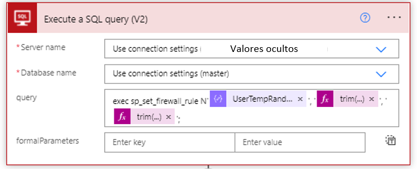

## How to manage SQL Azure firewall from a Business Application on Power Platform

Today we will make use of one premium SQL Server connector and four (04) standard connectors (SharePoint, Office 365 Outlook, Office 365 Users, Power Apps).

**Why does this Process?**

Imagina that you have a lot of SQL servers in Azure and that it is your responsibility to make a correct management always guaranteeing security when accessing them.

All these database servers became the heart of your production application now imagine, there will be times when a team must access and manipulate the data that exists in a database hosted on those servers. How do you control that?

In gray on the left side is the Microsoft model is the idea of them and it is not my intention to copy it, on the other hands, my idea is to integrate this with a solution making use of the tools known in the industry as Low Code or without code through Power Platform.

So, what is this so powerful firewall, very generally is the action that allows clients to have granular control over specific ranges of acceptable IP addresses. The firewall grants access based on the source IP address of each request.

You can do it from the comfort of a phone through two Approve or Reject buttons.

Now from an app built in power app connected to SharePoint.

## How does this process work?

1.  The standard SharePoint connector through its When an item is created action which is listening to when a record is created in the list previously built in SharePoint. 
   
2.  Then we make use of an object of type compose, which has the responsibility of converting to an object type JSON the response generated by the previous step.
   
3.  Standard component Office 365 Users which in my case will return existing information in Azure Active Directory (Azure AD) by means of an existing email sent as a parameter to the standard component.
   
4.  We will also make use of the variable rate component, there through expressions of Logic Apps we can calculate the time in DD / MM / YYYY format according to a Time Zone of interest to us.
   
5.  Then we have another variable type object, the responsibility of this is to make a calculation to obtain the number of days that access is required through a mathematical operation End Date – Current Date = days of the request.
   
This data is what is recorded in the SharePoint list of the start and thanks to that record an approval process is detonated that making use of Microsoft Team by means of adaptive cards requests the approval or denial of access communicating important data in the body of the message.

Finally, we enter the condition type object which will evaluate according to some parameters if the answer is true or false and depending on that result a few steps will occur.

Now within the nesting we make use of the premium SQL Server connector in the Execute a SQL query (V2) action here once a connection with a server and a database (Master) has been generated.

The record in terms of IP allowed in the Firewall scope is stored in system tables of each SQL Azure server for that reason we will use the Master system database to be able to do write and delete operations.

In the part of initial IP and final IP through expressions also of Logic Apps we register the IP that the user in the Power Apps application entered

With the above parameters we can run a SQL Azure Store Procedure automatically. Share the example.

`exec sp_set_firewall_rule N'Example setting 1', '0.0.0.2', '0.0.0.4';`

A fully automatic process that controls the firewall of SQL Azure servers through Power Platform.

