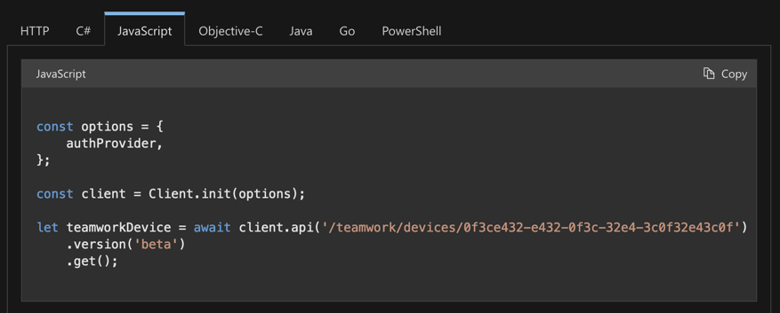
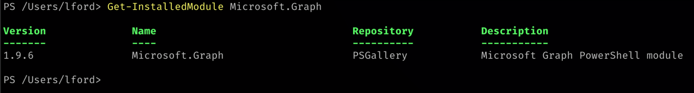
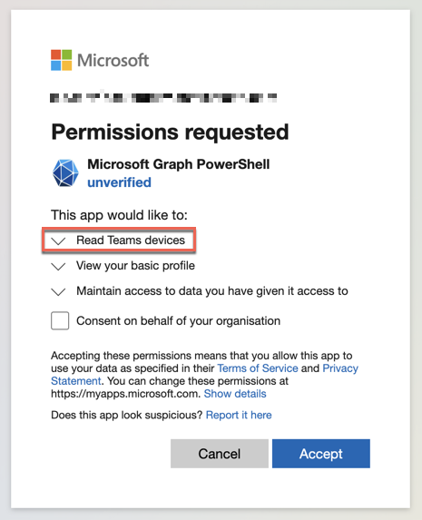
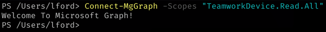
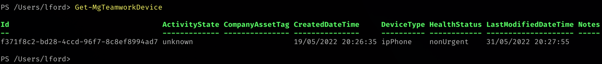
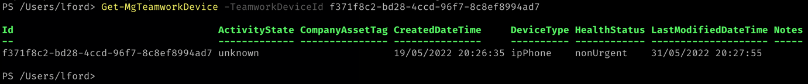
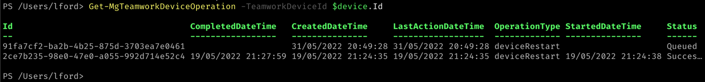
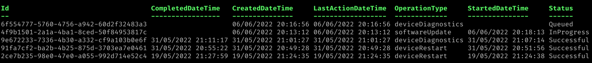
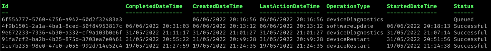
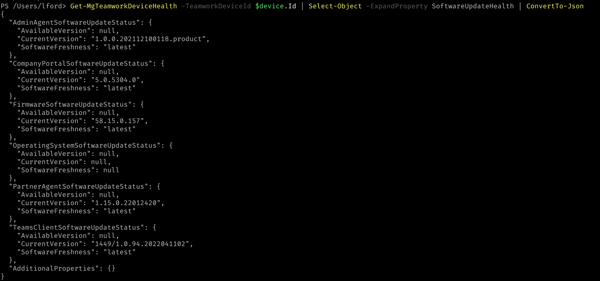

## Introduction

Have you wanted to manage your Teams devices within a script, or from the command line? Well, now you can. I will cover how you can do this for pretty much any Teams Device that is provisioned in Teams by using Microsoft Graph.

## What can you do?

As of 7th June 2022, with Microsoft Graph endpoints can achieve the following:

* List devices
* Get device
* Restart device
* Get device diagnostics
* Get device operations
* Update device software
* Get device health
* Get device config

There are a couple provisos to be aware of in using Microsoft Graph and Teams devices:

* It is currently in *Beta* so may not behave as expected. **Use at your own risk**
* Whilst Microsoft does not currently charge for using these endpoints, it states that is **does** plan to at some stage (details to follow in due course)

## How do I achieve this?

Whilst you can use these endpoints in any application/language you choose, to best illustrate this in an article I am going to use PowerShell. And the the easiest way to do this is by using the official [Graph SDK for PowerShell](https://learn.microsoft.com/powershell/microsoftgraph/overview?view=graph-powershell-1.0).

> Other SDKs/languages are available, and you can see samples within the Graph reference:
>
> 

To install the Graph SDK for PowerShell Module by following [these instructions](https://learn.microsoft.com/powershell/microsoftgraph/installation?view=graph-powershell-1.0).

Once installed, if you can check the module is installed by running:

```powershell
Get-InstalledModule Microsoft.Graph
```



## Using the PowerShell module

With the module installed, you can now look manage your Teams devices in PowerShell!

But - before you can do anything - you need to switch the module over to the **Beta** API. This is done by running:

```powershell
Select-MgProfile -Name "beta"
```

(It might take a few seconds to complete, but should return to a prompt).

The next step is connect to Microsoft Graph. This is done by running the following (and specifying the `TeamworkDevice.Read.All` scope/permission):

```powershell
Connect-MgGraph -Scopes "TeamworkDevice.Read.All"
```

You should be redirected to the browser to sign in to your Microsoft account (on the tenant where the devices are). You may need to consent to additional permissions.





### Get/list devices

Now you are connected, the fun can start. Start by querying all Teams devices:

```powershell
Get-MgTeamworkDevice
```



I only have one device in the list, but if you wanted to specify a particular device you can do this by using the `TeamworkDeviceId` of the device.



When working with a particular device, you will need to make use of the `TeamworkDeviceId` and of device. I tend to save the device under a variable to reference back to when required.


Then you can drill down and query the response:


### Restart device

To restart a device, you can run the following:

```powershell
Restart-MgTeamworkDevice -TeamworkDeviceId <TeamworkDeviceId>
```

### Run device diagnostics

To start a diagnostics report of a device, you can do the following:

```powershell
Start-MgTeamworkDeviceDiagnostic -TeamworkDeviceId <TeamworkDeviceId>
```


> You will need to get the report (once complete) separately from Teams Admin Center

### Get device operations

To get a list of queued and previous operations (restarts, upgrades, etc.), you can use the following:

```powershell
Get-MgTeamworkDeviceOperation -TeamworkDeviceId <TeamworkDeviceId>
```



### Update device software

To update the device to the latest software build (hosted by Microsoft), you can run the following:

```powershell
Update-MgTeamworkDeviceSoftware -TeamworkDeviceId <TeamworkDeviceId> -SoftwareType <SoftwareType> -SoftwareVersion <SoftwareVersion>
```


* **SoftwareType**: Can be one of the following: `adminAgent`, `operatingSystem`, `teamsClient`, `firmware`, `partnerAgent`, `companyPortal`
* **SoftwareVersion**: Specific version to upgrade to.

You can then check on the status of the firmware using the device operations command (already covered):

(In progress)


(Complete)


> Remember software updates can fail and leave the device in an unknown state, be careful!

### Get device health

You can query the device health including software and hardware status, pending updates etc:

```powershell
Get-MgTeamworkDeviceHealth -TeamworkDeviceId <TeamworkDeviceId>
```


Like a lot of output from the Graph PowerShell SDK, it isn't terribly useful with the default output. You can use `Select-Object` and `ConvertTo-Json` to make it more useful at a glance.



### Get device config

You can query the device configuration by doing the following:

```powershell
Get-MgTeamworkDeviceConfiguration -TeamworkDeviceId <TeamworkDeviceId>
```


> Not much to show here as the device is a Teams phone. Devices such as MTRs show way more.

## Closing thoughts

And there you have it - manage Teams devices from within Graph. I am keen to see if this will be improved before it goes 1.0. Being able to download the diagnostic files or being able to configure device profiles would be great.
