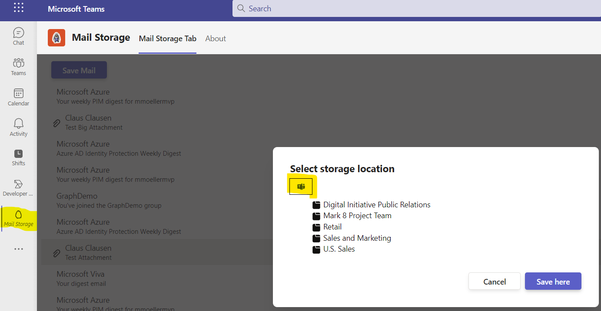
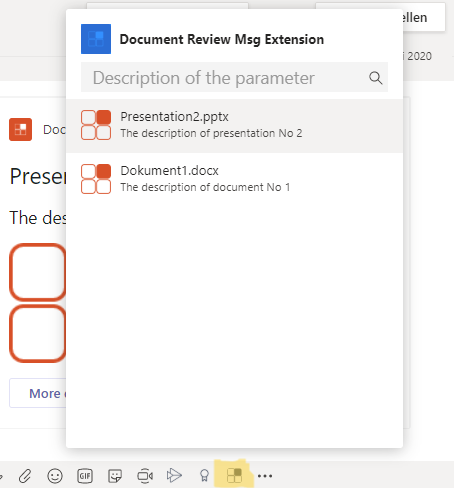
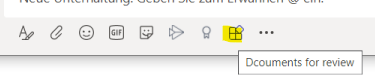
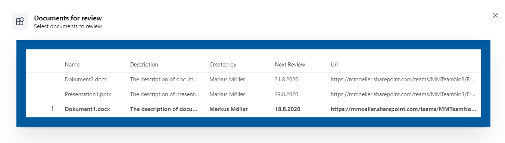
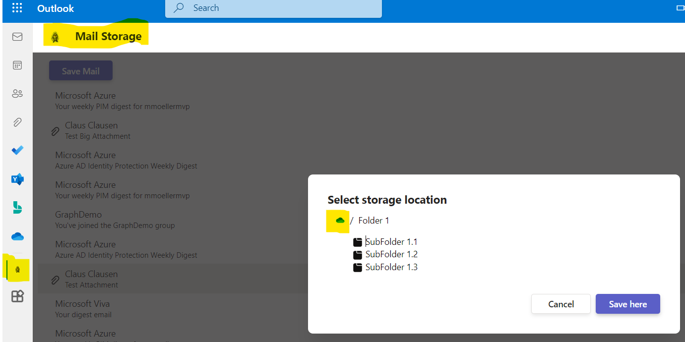
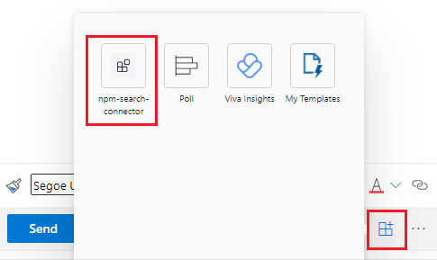

With [TeamsJS SDK 2.0](https://learn.microsoft.com/microsoftteams/platform/tabs/how-to/using-teams-client-sdk?view=msteams-client-js-latest&tabs=javascript%2Cmanifest-teams-toolkit#whats-new-in-teamsjs-version-20&WT.mc_id=M365-MVP-5004617) and [Teams manifest 1.13 and above](https://learn.microsoft.com/microsoftteams/platform/resources/schema/manifest-schema) it is possible to extend Microsoft Teams applications across Microsoft 365 so you can also use  those apps in Outlook or Office.

As you can also use SharePoint Framework (SPFx) to create Microsoft Teams applications you can [now use SPFx with 1.16 onwards across Microsoft 365 as well](https://learn.microsoft.com/sharepoint/dev/spfx/office/overview&WT.mc_id=M365-MVP-5004617).

## Teams extension options

### Personal app

A Microsoft [Teams Personal Tab](https://learn.microsoft.com/microsoftteams/platform/tabs/how-to/create-personal-tab?view=msteams-client-js-latest&pivots=node-java-script&WT.mc_id=M365-MVP-5004617)

### Search based messaging extension

A [search-based messaging extension](https://learn.microsoft.com/microsoftteams/platform/messaging-extensions/how-to/search-commands/define-search-command?view=msteams-client-js-latest&WT.mc_id=M365-MVP-5004617) allows you to select from a defined resultset of existing objects, such as documents or people and insert this selection into a compose message without any modification to the selected object.

### Action based messaging extension

Instead of the search-based messaging extension the [action-based variant](https://learn.microsoft.com/microsoftteams/platform/messaging-extensions/how-to/action-commands/define-action-command?view=msteams-client-js-latest&WT.mc_id=M365-MVP-5004617) allows to interact with the user about selection or modification or even creation of that selection. Instead of a simple pick here you can create custom forms or at least more customized selection areas.

## Microsoft 365 platform products

### Teams

A Microsoft Teams application can be personal or configurable Tab, a Bot, a messaging extension or a connector. It can be a standalone app or tailored to specific scenarios such as a team, a channel or a meeting.

### Outlook

Outlook can either [reuse a personal tab as standalone app](https://learn.microsoft.com/microsoftteams/platform/m365-apps/extend-m365-teams-personal-tab?view=msteams-client-js-latest&tabs=manifest-teams-toolkit&WT.mc_id=M365-MVP-5004617) or it can use a [search-based messaging extension](https://learn.microsoft.com/microsoftteams/platform/m365-apps/extend-m365-teams-message-extension?view=msteams-client-js-latest&tabs=manifest-teams-toolkit&WT.mc_id=M365-MVP-5004617) in mail composer, that is while a mail is created. The context of an incoming mail cannot be used, yet. Also the more flexible action based messaging extension cannot be used, yet.

### Office

Office can [reuse a personal tab as standalone app](https://learn.microsoft.com/microsoftteams/platform/m365-apps/extend-m365-teams-personal-tab?view=msteams-client-js-latest&tabs=manifest-teams-toolkit&WT.mc_id=M365-MVP-5004617). So you can show the same app experience in Office or even a slightly different on [by detecting in code if Office or a different product is host of your app](https://mmsharepoint.wordpress.com/2022/08/31/extend-teams-apps-to-m365-with-sso-the-right-way/#distinct-host).

## Development approaches

### Teams native App

A teams native app is a web application including Teams JS SDK and can be built either by using [Yeoman Generator for Teams](https://pnp.github.io/generator-teams/) or the Teams Toolkit for Visual Studio (code). And not to forget the PowerPlatform. The teams manifest (with JSON based notation) declares the app as a Teams application and the Teams JS SDK gives you access to the Teams-specific context. For hosting you need a separate web application, for instance an Azure app service.

### SPFx

SharePoint Framework (SPFx) provides full support for client-side SharePoint development. But despite the name SharePoint it’s much more than that. It can also be extended to other Microsoft 365 scenarios. SharePoint framework is self hosting. So no need to acquire additional resources for this. SharePoint framework runs client-side only and in user context. For user impersonation  or well performing backend operations you might still need additional backend components. Although direct access to Microsoft Graph is available within, [the security model is debatable](https://pnp.github.io/blog/post/microsoft-365-development-security/#spfx-3rd-party-api-and-issues) and might also need the implementation of backend components.

## Supported scenarios

(partially preview)

&nbsp;|Teams|Outlook|Office
-|:-----:|:-------:|:------:
**Personal app**|Teams App   SPFx|Teams App   SPFx|Teams App   SPFx
**Search-based messaging extension**|Teams App|Teams App|-
**Action-based messaging extension**|Teams App   SPFx| :pray: |-

## Summary

The big benefit for this approach now is that [user permissions to such apps only need to be configured once](https://learn.microsoft.com/microsoftteams/platform/m365-apps/publish&WT.mc_id=M365-MVP-5004617) and not product (Teams, Office, Outlook) individually. As a downside it's not yet controllable if such an app (mostly a personal tab) shall be published to Teams only for instance. That is, a personal tab with Teams manifest 1.13+ published to your org's app catalog will be visible in Outlook, too, in targeted release tenants at the moment of writing this post. [A GA is awaited for first half of 2023](https://learn.microsoft.com/sharepoint/dev/spfx/office/overview&WT.mc_id=M365-MVP-5004617).
Meanwhile you can only control the product inside the code which would [enable you at least to hide your functionality/UI in Office or Outlook](https://mmsharepoint.wordpress.com/2022/08/31/extend-teams-apps-to-m365-with-sso-the-right-way/#distinct-host) wheras still showing it in Teams.

I already provided one sample illustrating (not only) that capability which you may find [here](https://mmsharepoint.wordpress.com/2022/08/31/extend-teams-apps-to-m365-with-sso-the-right-way/). And I am currently working on another one which will come in two flavors, realized by using [Yeoman Generator for Teams](https://pnp.github.io/generator-teams/) but also an alternative that uses SPFx.

I hope you enjoyed this post and found some helpful information. I expect a lot more to come with "development across Microsoft 365" and I am highly interested in moving and bringing this forward and adapt new capabilities.

Feel free to leave a comment here, in the referenced blog posts or directly reach out to me on [Twitter](https://twitter.com/moeller2_0/)
