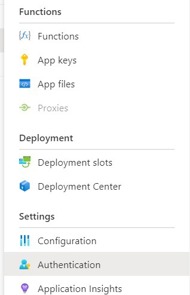
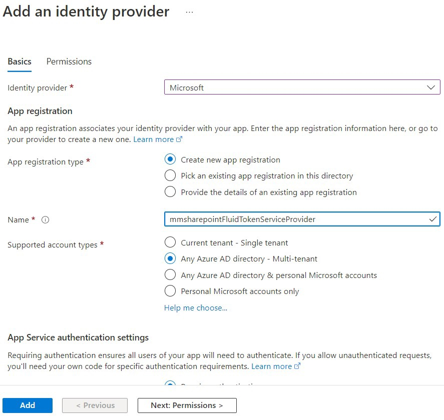
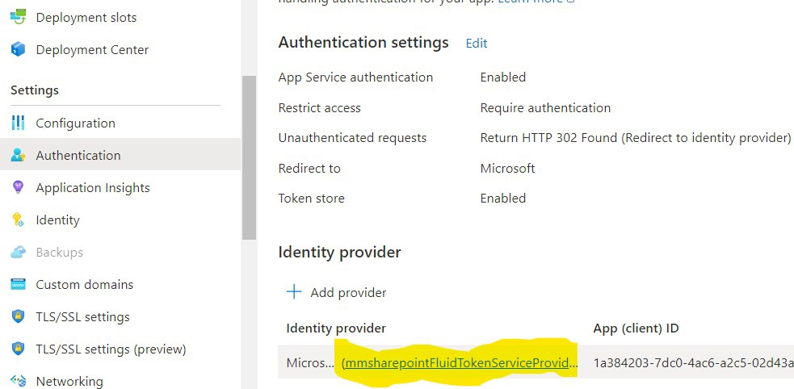
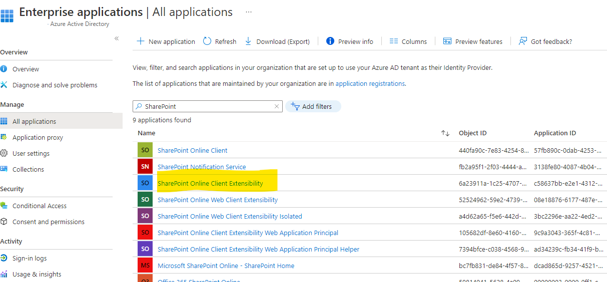
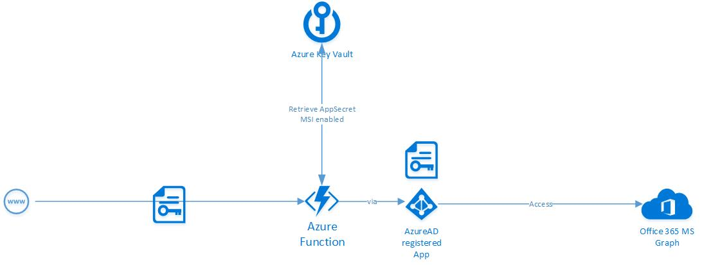

Although the *good old days* are over where you could implement nearly everything with full trust solutions there are still lots of SharePoint and M365 development capabilities that need to be considered closely in terms of security. Especially in large enterprises more and more so-called ZeroTrust strategies are implemented. What this means especially for a modern SharePoint and Microsoft 365 developer I’m gonna show in this post with some examples. Every given example is linked to a step-by-step implementation guidance.

## Authentication

Authentication normally is not a big deal inside SharePoint Framework applications as this comes out of the box. Nevertheless in specific scenarios there still might occur security or functionality issues. Together with [3rd-party API access](#spfx-3rd-party-api-and-issues) there is a need to generate additional access tokens. In SharePoint add-in model those tokens were generated ACS based. That should not be done anymore. But also with the modern SharePoint framework clients MSGraphClient or AadHttpClient there might be issues. One problem is that more and more browsers by default disable third-party cookies. This should be handled by MSAL.js 2.0 with the Authorization Code Flow with Proof Key for Code Exchange (PKCE). Unfortunately we still face issues when using SPFx directly. [Implementation of MSAL.js 2.0 into SPFx solutions](https://mmsharepoint.wordpress.com/2020/08/15/using-msal-js-2-0-in-sharepoint-framework-spfx/) can help to solve this. Especially in SPA like solutions this works great while having many webparts on the same page using that technique in a portal-style lead to concurrency challenges while the token needs to be generated and you have to deal with.

If there is a need to generate an access token for SharePoint Rest Api outside an SPFx solution you can try [SSO with on-behalf flow](https://mmsharepoint.wordpress.com/2021/06/22/use-sharepoint-rest-api-in-microsoft-teams-with-sso-and-on-behalf-flow/) if possible or [generate your OAuth2.0 access token manually](https://mmsharepoint.wordpress.com/2021/12/04/testing-an-azure-function-using-delegated-access-with-postman/).

### No anonymous access

When implementing backend services in Azure Functions for instance, always require authentication. Best with [adding Microsoft as identity provider](https://mmsharepoint.wordpress.com/2022/06/04/fluidframework-and-azure-fluid-relay-service/#userauth), if not even further restrict it by Azure AD groups [as described below](#secure-user-specific)

```cs
[FunctionName("WriteListItem")]
public static async Task<IActionResult> Run(
    [HttpTrigger(AuthorizationLevel.Anonymous, "get", "post", Route = null)] HttpRequest req,
    ILogger log)
{
    ...
```

is okay but together with







## SPFx 3rd-party Api and issues

SPFx solutions normally run in user context. Client-side this cannot be changed. But on behalf of 3rd-party Api access the *good old pattern* of using _elevated privileges_ can still be implemented. To be strict they should be prevented whenever possible. If a user is not allowed to do something the user should not be able to do it. As simple as that.

For 3rd-party Api access SPFx offers two clients: MSGraphClient and AadHttpClient. While the former one is easier to handle it has one big disadvantage. It deals with one public enterprise application which [grants permission tenant-wide](https://www.wictorwilen.se/blog/sharepoint-framework-and-microsoft-graph-access-convenient-but-be-very-careful/) and not application or webpart specific. Furthermore in typical ZeroTrust implementations those "public" enterprise applications are disabled first by conditional access policies!



<a name="secure-user-specific"></a>

Therefore it’s better to handle this with AadHttpClient in the backend and a specific app registration. It still allows to be consumed by any app but only in the way you implement it. 
You still need one public Enterprise application. But only to access your backend function which can be considered less critical than directly granted Microsoft Graph permissions, such as Directory.Read.All. Those critical permissions for Microsoft Graph e.g. you can handle in your app specific app registration available only to your specific backend application. 

You can further [secure your backend function either server-side](https://mmsharepoint.wordpress.com/2022/03/02/restrict-calls-from-spfx-inside-azure-functions/) or [client-side](https://mmsharepoint.wordpress.com/2021/08/20/restrict-calls-to-azure-functions-from-spfx/) on behalf of Azure AD security groups.

Client-side makes sense to disable or hide functionality in the UI immediately while server-side of course is the more secure one as the API cannot be called by any client without an appropriate user. 

<a name="avoid-app-permissions"></a>
## Avoid app permissions

To be precisely and clear: Always prefer to use delegated access and delegated permissions. App permissions always are applied non-resource specific. This means what you can do with one site you can do with every site. No user specific access to specific resources is possible that way. In the past there was the option to authenticate with ACS site-scoped which is not recommended anymore. For instance this is not centrally managed in Azure AD where you could apply conditional access policies as an example from a typical ZeroTrust scenario. A new option is the so called [resource specific consent (RSC)](https://mmsharepoint.wordpress.com/2021/08/18/accessing-sharepoint-sites-with-resource-specific-consent-rsc-and-microsoft-graph/). This is not SharePoint specific as for instance it also works with Teams. 
In fact here app permissions are granted only to "resource specific consent"ed objects such as Sites or Teams. First your app gets "Sites.Selected" as app permission, ONLY in a second step "selected" sites (or teams) get "consented" access by your app registration.
This is a big advantage over the old site-scoped ACS approach. One disadvantage is, this approach still requires a high privileged app permission needed at least for setup. So if your organization does not allow app permissions at all you need really good arguments for this approach. A request for “Sites.FullControl.All” app permission is a bit like requesting a bazooka...

### Domain Isolated

Of course there is another option to prevent granting permissions too broad. You could make use of [domain isolated web parts](https://learn.microsoft.com/en-us/sharepoint/dev/spfx/web-parts/isolated-web-parts?WT.mc_id=M365-MVP-5004617). But honestly I’ve never seen a really good enterprise implementation nor have I met an expert actively promoting this. Furthermore, as you can guess from above's Azure AD screenshot, it also works in combination with a public enterprise application. A potential showstopper in ZeroTrust environments as we have seen, already ...

## Managed Identities

Dealing with sensitive information of course always is a potential security risk. Client IDs, secrets or other sensitive data should be kept away from the user. Of course those things should never be unveiled in client-side code. But also in the backend there are enterprise-ready, secure, reliable and easy-to-use patterns to be a applied. [Sensitive secrets should be stored in Azure KeyVault](https://mmsharepoint.wordpress.com/2019/01/11/secure-azure-functions-part-2-handle-certificates-with-azure-keyvault-when-accessing-sharepoint-online/), for additional [configuration data Azure app configuration store](https://mmsharepoint.wordpress.com/2021/05/17/configure-teams-applications-with-azure-app-configuration-nodejs/) could be a matter of choice. The [access to your back-end application should be established with managed identity](https://mmsharepoint.wordpress.com/2018/11/14/secure-azure-functions-part-1-use-azure-keyvault-secrets-when-accessing-microsoft-graph/). The ultimate solution to stop the credentials needed to access credentials store challenge ...



### With delegated permissions?

Nevertheless there is one disadvantage in managed identities. In combination with Microsoft Graph or SharePoint permissions it only works with app permissions. Although I already implemented a delegated sample working in AzureAutomation I couldn’t reproduce this as an Azure function and I’m quite sure this is not yet supported. So my wish would be this becomes a valid scenario in the near future:

Managed Identity—>Member of AD security group—>Granted access to Graph or SharePoint resource—>Access Token with delegated permissions works 

## Use SSO wherever possible
As we have seen under [avoid app permissions](#avoid-app-permissions) or use the context with delegated permissions should be preferred. SPFx solutions provide that out of the box. Other application development scenarios should make use of single sign on( SSO) wherever possible. In typical Microsoft 365 apps such as Teams or office add-ins the [on-behalf-of flow](https://learn.microsoft.com/en-us/azure/active-directory/develop/v2-oauth2-on-behalf-of-flow?WT.mc_id=M365-MVP-5004617) should be the matter of choice.
To implement it correctly the only thing that should take place client-side is the retrieval of the user’s bootstrap or identity token. Having that everything else should take place so server-side. Providing the bootstrap token the on behalf of flow using a client secret needs to exchange the bootstrap to an access token and finally executing with that an API request. All that can be done and kept exclusively server-side while only finally providing the API call result back to the client.
A detailed implementation scenario can be found [here](https://mmsharepoint.wordpress.com/2022/08/31/extend-teams-apps-to-m365-with-sso-the-right-way/).


## Summary

I hope you enjoyed this post and found some helpful patterns. Of course this topic is not finally covered. The opposite is true, it will always be subject to change. This is because security always is a moving target. So might be this post.

To help moving forward feel free to leave a comment here or in the referenced blog posts or directly reach out to me on [Twitter](https://twitter.com/moeller2_0/)
