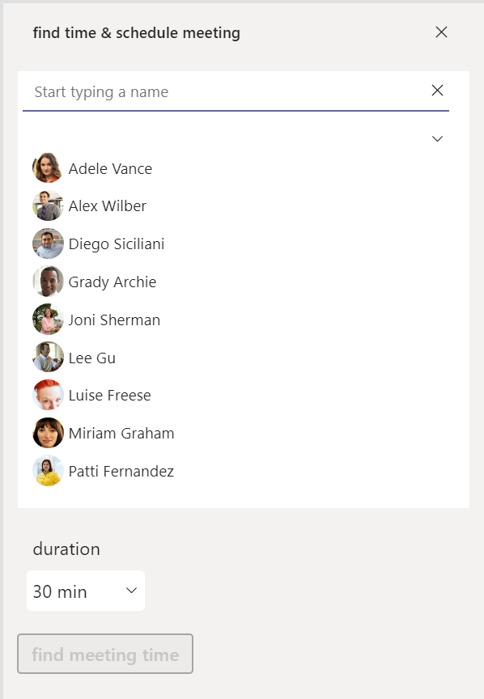

## tl:dr

[Microsoft Graph toolkit](https://learn.microsoft.com/graph/toolkit/overview) is a collection of reusable components for accessing and working with Microsoft Graph API - However, we can't use them in Power Apps, which is why I started to build a Microsoft Graph toolkit (MGT) lookalike component library for Power Apps.  The people-picker component looks like this in action:


## People-Picker

The MGT people picker is one of the most powerful components - it connects directly to your Azure Active Directory and shows your co-workers, which you can then select from. To make this work in a Power Apps canvas app, we need a few things:

1. [Power Platform custom connector](#power-platform-custom-connector) to [Microsoft Graph API](https://learn.microsoft.com/graph/api/overview?view=graph-rest-1.0)

* requires an app registration in Azure Active Directory
* makes this approach reusable

2. [UI in Power Apps](#ui-in-power-apps)

* works best as a component as you will want to re-use this
* shall adapt to different themes in Teams

### Power Platform Custom Connector

#### Understand the /me/people endpoint

Let's first understand what our custom connector will do. We will want to leverage the `https://graph.microsoft.com/v1.0/me/people` endpoint in our people picker to display people we work with - if you are unfamiliar with this, you can try out this query in [Microsoft Graph explorer](https://aka.ms/ge). To execute this, Graph Explorer needs permission for `People.Read` or `People.Read.All`.


It will return an object also containing an array with users, following this schema

```json
{
    "@odata.context": "https://graph.microsoft.com/v1.0/$metadata#users('2607b77e-22c4-4081-b278-a9516da4accd')/people",
    "@odata.nextLink": "https://graph.microsoft.com/v1.0/me/people?$skip=0",
    "value": [
        {
            "id": "7af3431f-ee68-4559-a1ca-17dc7bfcc269",
            "displayName": "Alex Wilber",
            "givenName": "Alex",
            "surname": "Wilber",
            "birthday": null,
            "personNotes": null,
            "isFavorite": false,
            "jobTitle": "Marketing Assistant",
            "companyName": null,
            "yomiCompany": null,
            "department": "Marketing",
            "officeLocation": "131/1104",
            "profession": null,
            "userPrincipalName": "AlexW@hscluise.onmicrosoft.com",
            "imAddress": "sip:alexw@hscluise.onmicrosoft.com",
            "scoredEmailAddresses": [
                {
                    "address": "AlexW@hscluise.onmicrosoft.com",
                    "relevanceScore": 1111,
                    "selectionLikelihood": "notSpecified"
                }
            ],
            "phones": [
                {
                    "type": "business",
                    "number": "+1 858 555 0110"
                }
            ],
            "personType": {
                "class": "Person",
                "subclass": "OrganizationUser"
            }
        },
        {...}
    ]
}
```

#### App registration

As our connector will need to authenticate, we will register an application in Azure Active Directory (AAD) as our identity provider. This means, that we will let AAD generate a username/password combination (client id and client secret) and equip that with permissions needed to call `/me/people` endpoint: `People.Read` or `People.Read.All`.

To do that, you can either

1. Open [portal.azure.com](https://portal.azure.com)
2. Select **Azure Active Directory**
3.  Select **Add**, then **App registration**
4.  Enter a name for your app - choose something like `GraphConnector-App`
5.  Select **Accounts in this organizational directory only**
6.  Select **Register**
7.  Select **Overview** and copy **Directory (tenant) ID** and **Application (client) ID** - we will need these later
8.  Select **Certificates & secrets**
9.  Select **New client secret**
10. Select **Add**
11. Save the value of this secret somewhere - we will need this later
12. Select **Permissions**
13. Select **Microsoft Graph**
14. Select **Delegated permissions**
15. Select **People.Read** or **People.Read.All**
16. Select **Add permissions**
17. Select **Grant admin consent for <your tenant name>**
18. Select **Yes**

or if you use [CLI for Microsoft 365](https://pnp.github.io/cli-microsoft365/) you can register your app including permissions, granting admin consent and generating a secret with this command:

`m365 aad app add --name 'GraphConnector-App' --redirectUris 'https://global.consent.azure-apim.net/redirect' --platform web --withSecret --apisDelegated 'https://graph.microsoft.com/People.Read.All' --grantAdminConsent`

This will output something like this:

```json
{
  "appId": "XXXXXXXX-XXXX-XXXX-XXXX-XXXXXXXXXXXX",
  "objectId": "XXXXXXXX-XXXX-XXXX-XXXX-XXXXXXXXXXXX",
  "tenantId": "XXXXXXXX-XXXX-XXXX-XXXX-XXXXXXXXXXXX",
  "secrets": [
    {
      "displayName": "Default",
      "value": "XXXXX~-XXXXXXXXXXXXXXXXXXXX_XXXXXXXXXXX"
    }
  ]
}
```

Save the value of `appId` and `secret`somewhere.

### Create the custom connector

1. Open [make.powerapps.com](https://make.powerapps.com)
2. Select **Dataverse**
3. Select **Custom Connectors**
4. Select **New custom connector**
5. Select **Create from blank**
6. Type in a name like `GraphConnector`
7. Select **Continue**
8. Type in `graph.microsoft.com` as **Host**


9. Select **Security**
10. Choose `OAuth 2.0` as **Authentication type**
11. Choose `Azure Active Directory` as **Identity Provider**
12. Paste your `appId` from Azure AD app registration as **Client Id**
13. Paste your `client secret` from Azure AD app registration as **Client secret**
14. Notice that **Login URL** is already set to `https://login.windows.net` - don't change
15. Notice that **Tenant Id** is set to `Common` - don't touch this
16. Type in `https://graph.microsoft.com` as **Resource URL**
17. Notice that **Enable on behalf of login** is set to `false` - don't change
18. Type in `People.Read.All` as **Scope**
19. Select **Create connector**

#### Add a GetPeople action

Now that we have a custom connector, we want to add at least one action to it.

1. Select **Definition**
2. Select **New action**
3. Type in `GetPeople` as **Summary**, **Description**, and **Operation ID**
4. Under **Request**, select **Import from sample**
5. Select `GET` as **Verb**
6. Type `https://graph.microsoft.com/v1.0/me/people` as **URL** (remember, it's the same URL we used in Graph explorer)
7. Select **Import**
8. Under **Response**, select **Add default response**
9. Paste in the response you got from Graph Explorer in the **Body** field
10. Select **Import**
11. Select **Update Connector**
12. Select **Test**
13. Select **New Connection**
14. Select **Create** - you will annoyingly be redirected to the connections overview - go back to your custom connector
15. Select **Test operation** - you should receive a HTTP response `200`
16. Select **Close**


### UI in Power Apps

Now that we have the connector working, let's

1. [create a Power Apps](#create-an-app) canvas app [using a theme](https://www.m365princess.com/blogs/2022-07-06-how-to-enhance-maker-experience-with-a-custom-theme-for-teams-apps-in-power-apps-studio/) that reflects default, dark, high-contrast mode in Microsoft Teams

2. [create a reusable canvas component](#create-a-canvas-component) as the people-picker

For all lovers of dark-mode: here is a little motivation to keep reading this post. This is what the people-picker will look like in dark mode in Microsoft Teams:


#### Create an app

1. Create a new app
2. Save it locally
3. Unpackage the app via [Power Platform CLI](https://learn.microsoft.com/power-platform/developer/cli/reference/canvas#pac-canvas-unpack)
4. Select the `themes.json` file
5. Replace its content by [FluentUI for Teams theme](https://github.com/pnp/powerapps-samples/blob/main/samples/fluentui-for-teams-theme/sourcecode/Themes.json)
6. Package the app again via [Power Platform CLI](https://learn.microsoft.com/power-platform/developer/cli/reference/canvas#pac-canvas-pack)
7. Open the app from within [Power Apps Studio](https://make.powerapps.com)
8. Add a Dropdown control `drp_theme`
9. Set its **Items** property to `["default", "dark", "high-contrast"]`
10. Set the  **OnChange** of the dropdown and the **OnStart** property of the App to the content of [this file](https://gist.github.com/LuiseFreese/41354f8563b9ee239f1454ca799dab97)

Now you have an app that reflects the 3 themes of Microsoft Teams. It will automatically adjust to the theme that is used in the Teams client. For development and test purposes, you can use the dropdown to switch to another theme.

##### Add the custom connector

Now add the custom connector on the **Data** tab to your app. Once you did that, select the **OnVisible** of a screen and create a collection that contains people you work with:

```powerappsfl
ClearCollect(
    colPeople,
    Filter('GraphConnector'.GetPeople().value, personType.subclass = "OrganizationUser")
);
```

##### Add the Office 365 Users connector

Add this built-in connector to easily retrieve Profile pictures of people

#### Create a canvas component

1. Create a new component `cmp_MGT_PeoplePicker`
2. Enable **Access app scope**

Let's now understand what the people-picker is built:

1. We will deal with two collections:
  * colPeople - which contains the people our custom connector returns
  * colAttendees - which contains only people that a user selected from the colPeople
2. Both collections will be reflected in two galleries - gal_People and gal_Attendees
3. Both collections work exclusively, this means, that a user, who is in colPeople, can't be in colAttendees and the other way around, as it wouldn't make any sense to select a person twice
4. A textinput control allows a user to type in a name they want to add
5. A Chevron down icon allows a user to expand the entire colPeople
6. A X icon allows a user to delete all items from the colAttendees collection


1. 1 - textinput which filters the galPeople
2. 2 - x icon which resets the textinput
3. 3 - gal_People
4. 4 - gal_Attendees
5. 5 - Chevron down to expand/collapse gal_People

##### Textinput

1. Add a TextInput `txt_input`
2. Set it's **HintText** to `"Start typing a name"`
3. Set its **Default** to `""`
4. Set its **OnSelect** to `If(IsEmpty(Self.Text), Set(isGallery, false), Set(isGallery, true))`
5. Take care of colors:
  * **BorderColor**: `gblAppStyles.TextInput.BorderColor`,
  * **Color**: `gblAppStyles.Label.Color`
  * **Fill**: `gblAppStyles.TextInput.Fill`,
  * **FocusedBorderColor**:  `Self.BorderColor`,
  * **HoverBorderColor**: `gblAppStyles.TextInput.BorderColor`,
  * **HoverColor**: `gblAppStyles.Label.Color`,
  * **HoverFill**: `Self.Fill`,
  * **PressedColor**: `Self.Color`
  * **PressedFill**: `Self.Fill`

##### Rectangle

we will now add a rectangle below the textinput to  create that Teams look & feel

1. **Fill**: `gblAppStyles.ButtonPrimary.BorderColor`
2. **Height**: `2`
3. **Width**: `txt_input.Width`
4. **X**: `txt_input.X`
5. **Y**: `txt_input.Y+ txt_input.Height`

##### gal_people

1. Create a blank vertical gallery
2. Set its **Items** to `Sort(Filter(colPeople,StartsWith(displayName, txt_input.Text )),displayName, Ascending)`
3. Set **Height** to `CountRows(colPeople)*(Self.TemplateHeight+ Self.TemplatePadding)`
4. Set **Width** to `txt_input.Width-txt_input.X*2`
5. Set **Visible** to `isGallery`
6. Add an image to the gallery
7. Set
  * **X** to `10`
  * **Y**: `(Parent.TemplateHeight / 2) - (Self.Height / 2)`
  * **Width** and **Height**: `32`
  * **Image** to `If(!IsBlank(ThisItem.userPrincipalName),Office365Users.UserPhoto(ThisItem.userPrincipalName),SampleImage)`
8. Add a textlabel to the gallery
  * Set **Color** to `gblAppStyles.Label.Color`
  * Set **HoverFill** to `gblAppStyles.TextInput.HoverFill`
  * Set **Width** to `Parent.TemplateWidth` and **Height** to `Parent.TemplateHeight`
  * Set **Text** to `ThisItem.displayName`
  * Set the **OnSelect** to

```powerappsfl
Collect(
    colAttendees,
    {
        type: "required",
        emailAddress: {
            name: gal_people.Selected.displayName,
            address: gal_people.Selected.userPrincipalName
        }
    }
);
Remove(
    colPeople,
    ThisItem
);
Reset(txt_input)
```

With that, we add people from our colPeople to our colAttendees and remove them from the colPeople. We also reset the textinput.

##### Chevron down

1. Add an image and set its **Image** to

```powerappsfl
"data:image/svg+xml;utf8, " & EncodeUrl(
    "
<svg width='48' height='48' viewBox='0 0 48 48' fill='" & If(
        gblThemeHiCo,
        "#ffffff",
        gblThemeDark,
        "#ffffff",
        "#252423"
    ) & "' xmlns='http://www.w3.org/2000/svg'>
<path d='M8.36612 16.1161C7.87796 16.6043 7.87796 17.3957 8.36612 17.8839L23.1161 32.6339C23.6043 33.122 24.3957 33.122 24.8839 32.6339L39.6339 17.8839C40.122 17.3957 40.122 16.6043 39.6339 16.1161C39.1457 15.628 38.3543 15.628 37.8661 16.1161L24 29.9822L10.1339 16.1161C9.64573 15.628 8.85427 15.628 8.36612 16.1161Z' />
</svg>
 "
)
```

This is the Fluent UI chevron down and it will now reflect the different themes.

2. Set the **OnSelect** to

```powerappsfl
Set(isGallery, !isGallery);
If(
    CountRows(colPeople) = 0,
    ClearCollect(
        colPeople,
        Filter('GraphConnector'.GetPeople().value, personType.subclass = "OrganizationUser")
    )
);
```

This controls how much we see from the gallery and also refreshes the colPeople when a user expands the gallery

##### gal_Attendees

We need another gallery to show the selected people

3. Add a blank vertical gallery
4. Set
  * **X**: `5`
  * **Y**: `txt_input.Y+ txt_input.Height`
  * **Items**: `If(isGallery,FirstN(colAttendees,6),FirstN(colAttendees,3))`
  * **WrapCount**: `If(isGallery,If(CountRows(colAttendees)<4,1,2),1)`
  * **Height**: `If(isGallery,If(CountRows(colAttendees)<4,txt_input.Height*1,If(CountRows(colAttendees)<6,txt_input.Height*2),txt_input.Height*2),40)`

This makes sure, that  we wrap items dynamically and adjust the **Height** of the gallery depending on how many items are selected. This still leaves a little problem - as there is not a lot of space where we can display all people in the gal_Attendees and we already limited this to either showing 3 (when collapsed) or 6 (when expanded), we should indicate, that there are more people added.

##### The 'more' pill

1. Outside of the gallery, add a new button `btn_plus`
  * **X**: `3*(gal_attendees.TemplateWidth)+10`
  * **Y**: `gal_attendees.Y + (gal_attendees.TemplateHeight-Self.Height)/2`
  * **Width**: `40` and **Height**: `32`
  * **Text**: `"+" &If(isGallery, CountRows(colAttendees)-6, CountRows(colAttendees)-3)`
  * **DisplayMode**: `View`
  * **Radius**: `1000`
  * **Visible** `If(isGallery,CountRows(colAttendees)>6,CountRows(colAttendees)>3)`

By that, we display this button only if we have more than 3 (collapsed) or more than 6 (expanded) and show the number of items in the collection (minus the items that are already shown)

Now let's fill the gallery with people we selected from the colPeople:

1. Add a button `btn_pill`
  * Set its **Displaymode** to `View`
  * **Fill**: `gblAppStyles.TextInput.HoverFill`
  * **Width**: `150` and **Height**: `32`
  * **Radius**: `1000`
2. Add an image `img_profilePic`
  * Set **Image** to `If(!IsBlank(ThisItem.emailAddress.address),Office365Users.UserPhotoV2(ThisItem.emailAddress.address),SampleImage)`
  * **X**: `btn_pill.X + 5`, and **Y**: `btn_pill.Y + (btn_pill.Height - Self.Height)/2`
  * **Width**: `20`, and **Height**:  `20`
  * **Visible**: `CountRows(colAttendees) >0`
3. Add a textlabel `lbl_displayName`
  * Set **Text**: `ThisItem.emailAddress.name`
  * **X**: `img_profilePicture.X + img_profilePic.Width`
  * **Width**: `btn_pill.Width - img_profilePicture.Width - icn_close.Width-20` and **Height**: `20`
  * Set: **Visible**: `CountRows(colAttendees) >0`
4. Add an icon `icn_close`
  * **X**: `btn_pill.X + btn_pill.Width-Self.Width-10` and **Y**: `btn_pill.Y + (btn_pill.Height - Self.Height)/2`
  * **Width** and **Height**: `12`
  * **Onselect**


```powerappsfl
Remove(colAttendees,ThisItem);Collect(colPeople,{userPrincipalName:ThisItem.emailAddress.address,displayName:ThisItem.emailAddress.name})
```

With this we allow users to remove a person from the colAttendees and add them again to the colPeople.

##### The X icon

Now let's add an X icon `icon_removeAttendees` so that a user can remove all people at once from the colAttendees and start all over again

1. **OnSelect**: `Clear(colAttendees);ClearCollect(colPeople,'ProductivityHub-Connector'.GetMyPeople().value);Reset(txt_input)`
2. **X**: `gal_attendees.X +gal_attendees.Width-20`
3. **Y**: `txt_input.Y+ (txt_input.Height - Self.Height)/2`
4. **Height** and **Width**: `16`

## Some more context

This component is part of an app - here is the real world use case: Finding meeting times for multiple colleagues.



This app is inspired by [Waldek Mastykarz](https://twitter.com/waldekm) who created a similar app with Microsoft Graph toolkit. You can [find his blogpost here](https://blog.mastykarz.nl/find-meeting-times-schedule-meeting-microsoft-graph/).

## Get the people-picker

You followed through but would just love to get this component? Don't fret, I got you covered. Its the first component of an entire library (so this will be updated) and you get it [here on GitHub](https://github.com/LuiseFreese/powerapps-samples/tree/main/samples/Microsoft-Graph-toolkit-people-picker)

Please follow the steps under [Create an app](#create-an-app) so that you get the themes working in your app.

### Import the component

1. Import the component library into your environment
2. In your app, select the `+` icon on the left bar
3. Select `get more components`
4. Choose the **MGT components**
5. Select **cmp_MGT_pp**
6. Select **Import**


### Add the component to your app

1. Select the `+` icon on the left bar
2. Expand the section **Library components**
3. Select the **cmp_MGT_pp**


This adds the component to the screen - but it looks ugly and full of bugs - let's fix the colors

1. Right-click on the component
2. Select **Edit component** - you will be prompted with a dialogue that you need to create a local copy -
3. Select **Create a copy**


1. Select **Components** on the left menu
2. Select your new component
3. Switch the **Access app scope** toggle to off and then to on again (yes, I know 🙄)
4. Select **Screens** on the left menu
5. Select `+` icon onm the left bar
6. ⚠️ Resist the urge to expand the **Library components** section - remember? We created a copy, which sits right in our app 💡
7. Expand **Custom** - you will find your copy there
8. Select it - it will be added to your screen
9. Either expand/collapse the **galPeople** by clicking on the Chevron or navigate from the screen and to it again so that the galPeople gets populated with the colPeople`

## Feedback & What's next

What do you think? Is this people-picker helpful? Which other Microsoft Graph toolkit component shall I rebuild next? [Let me on on twitter](https://twitter.com/LuiseFreese/status/1600172653100138507) or comment below 👇
