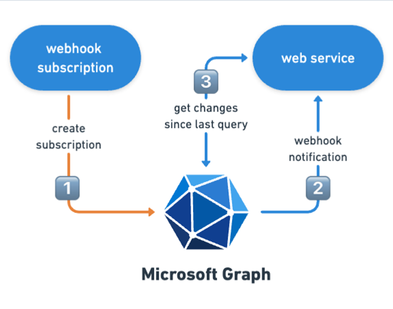
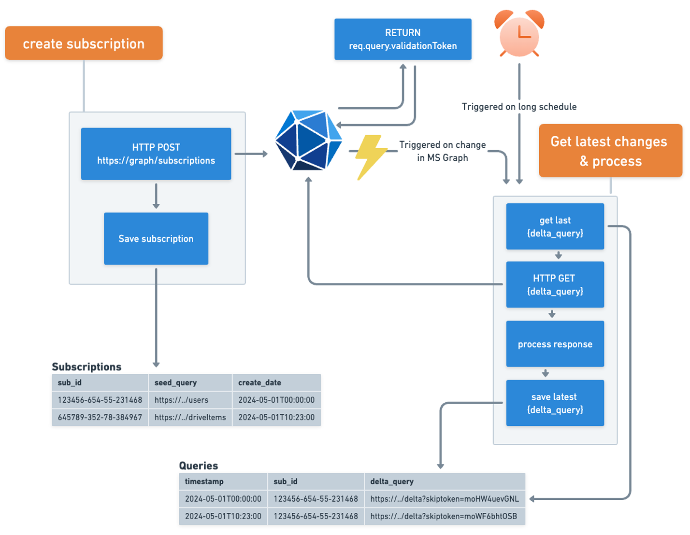

> This article originally appeared on Andrew Connell's site, **[Microsoft Graph Webhooks - What, Why, How & Best Practices](https://www.voitanos.io/blog/microsoft-graph-webhook-delta-query/?utm_medium=website&utm_source=pnpblog&utm_campaign=blog&utm_content=SharePoint%20Framework%20Updated%20in%20SharePoint%20Server%20Subscription%20Edition)**.

In this article, I want to talk about a feature that's been in Microsoft Graph for a very long time. But it's always surprising to me how many people aren't aware of it.

Microsoft 365 is a significant repository of our business data, yet we also have other business apps that need access to this data. Not to mention the custom processes or applications that need to respond to changes made in Microsoft 365 by us or our users.

Consider two different scenarios:

- When a new user joins your organization, you might want to automatically create an account for them in your corporate third-party time tracking system and send them an email notification about their new account.
- Alternatively, when a new file is added to a SharePoint document library, a OneDrive folder, or a SharePoint Embedded container, you might want to check if the file is a receipt and initiate additional content processing, such as automatic expense reporting.

Some developers address these challenges by developing scheduled processes that poll Microsoft Graph for changes. However, this approach is prone to throttling and could land you in Microsoft Graph jail. A better solution is to use Microsoft Graph webhooks which notify you of changes, enabling real-time action.

> **What is a webhook?**
>
> A webhook is **an HTTP request, triggered by an event in a source system and sent to a destination system, often with a payload of data**. Webhooks are automated, in other words they are automatically sent out when their event is fired in the source system. [The term was coined in 2007 by Jeff Lindsay](https://en.wikipedia.org/wiki/Webhook).

In this article, I'll guide you through the process of creating a reliable and robust configuration. We'll begin by discussing how to leverage Microsoft Graph's support for webhooks in your custom applications & processes.

To create a dependable set up, you'll primarily work with two components: a webhook, which Microsoft Graph refers to as *change notifications*, and a web service that you'll create.

## How Microsoft Graph webhooks work

The webhook allows you to issue a query to Microsoft Graph and then requests a notification when the query results change. For instance, if you query a list of all files in a SharePoint Embedded Container or SharePoint document library, and a new file is added, Microsoft Graph will notify you that happened.



The web service you create is the platform that Microsoft Graph will contact to inform us of any changes. You'll also need to create a webhook subscription which tells Microsoft Graph to notify you for a period of time when this activity happens.

Essentially, you're subscribing to Microsoft Graph's query, asking for notifications via your web service whenever the query results change.

Lastly, there's a concept called *delta query*, or "track changes" in Microsoft Graph language. Delta queries only return the changes since the last time the same query was executed. I'll explain these concepts in greater detail later in the article.

## Change notifications (webhooks)

Let's examine a specific feature offered by Microsoft Graph: change notifications.

> **Which is it? Webhook or change notifications?**
>
> This is frustrating and frankly a little annoying. Technically, they’re just webhooks. Some product manager or marketing person at Microsoft tried to get creative to give the a more descriptive name. But the only people implementing these are web developers, and webhooks are the industry term so they should have just stuck with that.

Webhooks allow applications to be notified when data is created or modified in Microsoft Graph. When an entity of interest is created, updated, or deleted, Microsoft Graph sends an HTTP POST to a designated endpoint. Your custom endpoint listens for these messages and responds according to your business requirements.

**What can you receive notifications for?**

Notifications can be received for messages, events, contacts, users, groups, conversations, OneDrive files, alerts, and more. This keeps you updated and synchronized with data accessible via Microsoft Graph. It also eliminates the need for a polling infrastructure, where you frequently send requests to Microsoft Graph to check for the latest changes. Instead, you can request changes from Microsoft Graph when your application receives a notification. This ensures you never miss a modification to data exposed or accessible via Microsoft Graph.

## Web service

Most of the work will occur within a web service that you create. This web service holds two main responsibilities.

### Respond to Validation Request

Initially, when a webhook subscription is created (*which I'll explain later in this article*), Microsoft Graph sends a confirmation HTTP POST to your web service to confirm its functionality.

### Process Webhook Submissions

The web service's second responsibility is to listen for and process the webhook notifications that Microsoft Graph sends.

## Webhook subscriptions

To receive notifications from Microsoft Graph when something happens, you need to create a webhook. This is done by creating a subscription with Microsoft Graph. The subscription informs Microsoft Graph about the entity or collection for which you want to receive notifications and provides the address of your web service to post these notifications.

When creating the subscription, you specify the subscription duration. Different entities have different maximum durations. For instance, files in OneDrive (driveItems) can have a maximum subscription expiration time of 42,300 minutes (approximately 30 days) from when the subscription is created.

> For a list of all entities in Microsoft Graph that support webhooks and their respective max subscription lifetime, see: [Microsoft Graph Subscription Resource Type](https://learn.microsoft.com/graph/api/resources/subscription).

### Create subscription

Next, create a webhook subscription by submitting an HTTP POST request to the subscriptions endpoint: `https://graph.microsoft.com/v1.0/subscriptions`. The payload of this request will contain the specifics of the subscription (*covered later in this unit*).

The following HTTP POST creates a subscription to receive webhooks on the `https://graph.microsoft.com/v1.0/users` endpoint when users are updated:

```
POST https://graph.microsoft.com/v1.0/subscriptions
Authorization: bearer eyJ0eXAiOiJ[..]
Content-Type: application/json

{
  "changeType": "updated",
  "clientState": "SecretClientState",
  "notificationUrl": "https://voitanos.ngrok.io/api/notifications",
  "resource": "/users",
  "expirationDateTime": "2024-05-01T00:00:00.0000000+00:00"
}
```

The subscription creation request is submitted to the `https://graph.microsoft.com/v1.0/subscriptions` endpoint. The body of the request includes the details of where the notifications should be sent (`notificationUrl`), the type of change to trigger the notification (`changeType`) and a timestamp for the expiration of the subscription (`expirationDateTime`).

Notice the `clientState` property in the body of the requests. This value will be included in every webhook to your registered endpoint. You can use this value to validate that the requests your endpoint receives are from your subscription, and not from someone else. The value of this property is of type `string` and can be anything you want it to be.

This request includes a URL parameter, `validationToken`, which your web service must return in the response body as plain text within 10 seconds of receiving the request.

### Manage the subscription lifecycle

Webhook subscriptions will be good for a specified amount of time. For most resources, the maximum subscription length is 3 days, but you should check with each resource for the supported subscription maximum length. After that time, the subscription is automatically purged from Microsoft Graph. This means if your application does nothing after creating the subscription, it will only receive notifications up to the expiration time specified when the subscription is created.

You should have a process that is going to monitor the subscriptions to ensure that it isn't expired or isn't going to expire in a certain amount of time.

If the subscription does expire, you can create a new subscription. However, you can proactively renew existing subscriptions with no interruption in notifications as long as the subscription hasn't expired. Your application just needs to keep track of when the subscription will expire.

One option you can implement is to check the expiration timestamp on the subscription for each webhook your application receives. If the expiration is within a certain time frame, in addition to handling the webhook, your application can also renew the subscription. While this solution will work in scenarios that receive a high number of webhooks, it breaks down if no webhooks are received in the specified subscription window.

### Get one or multiple subscriptions

To get a list of all your current subscriptions, submit an HTTP GET to the subscriptions endpoint…

```
GET https://graph.microsfot.com/v1.0/subscriptions
Authorization: bearer eyJ0eXAiOiJ[..]
```

… or get the details on a specific subscription:

```
GET https://graph.microsfot.com/v1.0/subscriptions/{{subscriptionId}}
Authorization: bearer eyJ0eXAiOiJ[..]
```

### Renew webhook subscription

Now let's look at the process for renewing a subscription. This is done by submitting an HTTP PATCH request to the endpoint of the subscription.

In the following example, note the endpoint includes the subscription ID, **47e861c4-2db2-455a-8774-57658ba185a1**, in the address:

```
PATCH https://graph.microsoft.com/v1.0/subscriptions/47e861c4-2db2-455a-8774-57658ba185a1
Authorization: bearer eyJ0eXAiOiJ[..]
Content-Type: application/json

{
  "expirationDateTime": "2024-06-01T00:00:00.0000000+00:00"
}
```

### Delete subscriptions

Deleting subscriptions is as simple as submitting an HTTP DELETE to the subscription endpoint:

```
DELETE https://graph.microsfot.com/v1.0/subscriptions/{{subscriptionId}}
Authorization: bearer eyJ0eXAiOiJ[..]
```

## Delta query: tracking changes in Microsoft Graph

Many custom applications have a need to track and replicate changes between two systems. For example, updates to user information in the master Microsoft Entra ID directory for an organization, such as office addresses, manager, and contact phone numbers need to be recorded in time reporting systems or other back-office platforms. One way developers can monitor a source system for changes is by polling the system to detect changes.

As I previously covered, as an alternative to the polling pattern, developers can leverage webhooks in Microsoft Graph to be notified when entities change. While this addresses one part of the problem, what happens in the case where a webhook subscription expires? In this case, your application may miss changes to entities when the subscription was not active. In addition, what happens if a webhook wasn't fired by Microsoft Graph because of a system error? In these cases, your application would have to temporarily rely on the polling pattern.

There's another option that developers can leverage for certain endpoints in Microsoft Graph that, when combined with webhook, enables applications to avoid the polling pattern in a robust and fault tolerant way. This is done using the *track changes* capability, also known as the delta query.

### Introducing delta query

Delta query is supported on many different types of entities, include email messages, groups, users, events, and files objects in Microsoft Graph.

> For a full list of all entities in Microsoft Graph that support delta query, see: [Delta query Overview - Supported resources](https://learn.microsoft.com/graph/delta-query-overview#supported-resources).

The way it works is that an application submits an HTTP GET request to a particular endpoint, `/users` for example. In the request, the endpoint has the `/delta` function added to the end of the URL.

Microsoft Graph will respond with a list of all the users in the collection just like a normal HTTP GET request. However, it will include a new property, `odata.deltaLink`, in the response. The value of this property is a link that your application should save for future use. At some point in the future, your application can use this `deltaLink` URL to submit the same request to the `/users` endpoint, except the response will only include those items that have changed since the first call was submitted.

This second response will include a new `deltaLink` that your application should save, replacing the previous `deltaLink`. The application can then use this new value to retrieve all changed items since the second request was submitted. Each time you make a new request, the `deltaLink` will change, allowing your application to only retrieve those items that have changed since the previous request.

### Submitting a delta query request

Let's look at a sample request. The following request will get a list of all users from Microsoft Graph.

```
GET https://graph.microsoft.com/v1.0/users/delta
Authorization: bearer eyJ0eXAiOiJ[..]
```

This first time this is submitted, you'll receive a list of all users in the directory. Notice the response includes the `@odata.deltaLink` property:

```json
{
  "@odata.context": "https://graph.microsoft.com/v1.0/$metadata#users",
  "@odata.deltaLink": "https://graph.microsoft.com/v1.0/users/delta
                               ?$skiptoken=moXwmvoHW4B2uevGNLf2..",
  "values": [ ..<users>.. ]
}
```

If there are multiple pages of data returned, the `deltaLink` will be present in the last page of the results.

## Combine webhooks and delta query for a robust application

Your apps can use webhooks and delta query both together to create a robust, reliable, and performant experience.

Webhooks are going to notify your app when something changes with a collection supported by Microsoft Graph. When Microsoft Graph notifies your application that something changed, instead of your app requesting all the information from Microsoft Graph on the entity that triggered the notification, it can use the delta query to retrieve all changes that have happened since the last request.



With this pattern, your app could first, create a webhook subscription for changes to the `/users` endpoint in Microsoft Graph. Then, immediately after creating the subscription, the application can request all users from Microsoft Graph using the delta query option. After processing all the users in the response, your app will save the delta query link.

In the future, webhooks will be used to notify your application that something changed. You can use this as a trigger to resubmit the delta query for all changes that have happened since the first request, or one of the later requests. This way, your application can be assured to not miss any changes that happen even when a subscription expires or there's an unforeseen error in the processing of, or sending, the webhook.

Furthermore, I’d set up a scheduled process that runs on a long interval such as 6/12/24/48 hours to trigger your process that’s normally triggered by the webhook. This ensures you’ll catch any gaps in an active subscription or where a webhook notification wasn't fired or received for some unknown reason.

I’d also make the application as fault-tolerant as possible by having a scheduled process check for a valid subscription and renew it if the expiration time is coming up soon.

### For very active or chatty systems

Suppose you have a resource that is frequently updated, like a SharePoint document library or a SharePoint Embedded Container. If many documents are added or changes are made on a consistent basis, you may want to consider batching your requests. One way to do this is by implementing a serverless configuration triggered off queues.

When you receive a webhook notification, it could simply add an item to a list of all changed things and queue more items for processing. This triggers your process to request the specific document and perform any additional processing needed.

This approach results in a more distributed application that can scale out and reduce the load on Microsoft Graph if you're just retrieving individual items. Each item landing on the second queue allows you to scale out your Azure Function, container, or any other implementation you choose.

## Conclusion

In conclusion, this article has provided a comprehensive overview of Microsoft Graph's webhooks and delta query features. These features offer a robust and efficient way to track changes in your Microsoft Graph data. By understanding and implementing these features, you will be able to create more responsive and reliable applications.

If you have any questions or comments about the information covered in this article, please feel free to leave them in the comment box below.
