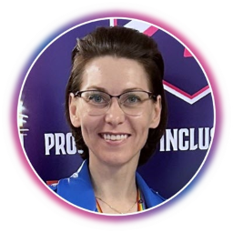

We are excited to announce that we are again extending our virtual [Microsoft 365 & Power Platform Community coordination team](https://pnp.github.io/#team) with additional community members. This virtual community team is responsible of the different [Microsoft 365 & Power Platform Community](https://aka.ms/community/home) activities in different community channels, including our open-source work in the GitHub. This team consist of Microsoft employees and community members (MVPs) focused on helping the community the best use of Microsoft products, like Microsoft Copilot, Microsoft Teams, Microsoft Viva, Power Platform, OneDrive, SharePoint, or API layer like Microsoft Graph.

We believe that by **working together as a one unified team across the organization barriers**, we can make even larger worldwide impact and helping other community member to succeed on adopting different practices within Microsoft 365 & Power Platform areas. **Better together with shared objectives**, not in isolation.

*“We are committed on building the best tech community in the world where everyone feels welcome, and we help to empower each and every community member to achieve more.” 🧡*

Thank you for being part of this incredible community! 

------------------------------------------------------------------------

## Katerina Chernevskaya - Senior Software Architect, MVP

My journey began years ago when, as a kid, my mom introduced me to an article about Microsoft. That moment sparked a dream to work with Microsoft technologies. For the past 20 years, I’ve lived that dream, crafting projects that harness the power of these technologies. 

I’m a fervent advocate for simple tech solutions and low-code development. As a mom to two incredible, tech-savvy kids - the elder having already aced the PL-100 and AI-102 exams at 14 - I’m passionate about making IT fun and accessible. I aim to show young people that technology is not just about coding; it’s about creating, dreaming, and turning the impossible into reality.

You will find Katerina on:

* [Twitter/X](https://twitter.com/KaterinaCh79869)
* [GitHub](https://github.com/Katerina-Chernevskaya/)
* [LinkedIn](https://www.linkedin.com/in/katerinachernevskaya/)

## Rashmee Auckloo - Pension Protection Fund, MVP

I am a SharePoint Developer at Pension Protection Fund and a Microsoft MVP in M365 Development since January 2024. I started my career journey as a .Net developer before transitioning to SharePoint and Project Server in 2011. In 2021, I began my cloud journey with SharePoint Online and Microsoft 365, discovering a vast array of extensions available.

Throughout my journey, I have found community resources to be invaluable, inspiring me to contribute back. I have actively enriched the [PnP repositories](https://github.com/pnp) since 2021, focusing on [PnP Sample Scripts](https://pnp.github.io/script-samples/), [PnP PowerShell](https://pnp.github.io/powershell/), [CLI for M365](https://pnp.github.io/cli-microsoft365/), and related repositories. I believe in "sharing is caring" and empowering others within the tech community.

Beyond work and community engagements, I cherish spending quality time with my two daughters, family, and friends.

You will find Rashmee on:

* [Twitter/X/Xer](https://twitter.com/ReshmeeAuckloo)
* [GitHub](https://github.com/reshmee011)
* [LinkedIn](https://www.linkedin.com/in/laskewitz/)

## Dan Toft - Microsoft 365 & SharePoint Specialist, MVP

Meet Dan from Denmark 🇩🇰  - A Microsoft 365 developer and consultant 🧑‍💻 - with a huge passion for community 🙌

Dan has "only" been working with Microsoft technologies since 2018 📅 - making him a "cloud native" developer ☁️

When he started working with Microsoft 365, he instantly fell in love with the platform 🎉 - and especially how fast and easy it is to create real world value for end users 🚀 - and that is what he is passionate about sharing with others 🙌

When he's not working the next community sample 🎉, blog post ✍️ or at work 🥱 - he loves to throw plastic in nature 🌳 - quite literally, Dan loves to play Disc golf 🥏

#SharingIsCaring 🙌

You will find Dan on:

* [Twitter/X](https://twitter.com/tanddant)
* [GitHub](https://github.com/Tanddant)
* [LinkedIn](https://www.linkedin.com/in/dan-toft/)

## Kasper Larsen - Senior Solution Architect, MVP

Kasper is a Senior Solution Architect at Fellowmind Denmark, and became a MVP in the Microsoft 365 category in January 2024.

He is a regular contributor to the [PnP Script Samples](https://pnp.github.io/script-samples/) and in particular to the [PnP Modern Search project](https://microsoft-search.github.io/pnp-modern-search/), where he is responsible for the PnP Modern Search Office hours, offering guidance and assistance to those learning about Search. You can read his blog articles on https://www.m365thinking.com/blog, and contact him on X.

You will find Kasper on:

* [Twitter/X](https://twitter.com/kasperbolarsen)
* [GitHub](https://github.com/kasperbolarsen)
* [LinkedIn](https://www.linkedin.com/in/kasperbolarsen/)

-----------------------------------------------------------------------

If you are looking for more details on what Microsoft 365 & Power Platform community is all about, see more details on the different activities and projects from https://aka.ms/community/home, including all community calls, open-source projects, [samples](https://aka.ms/community/samples) and much more.

There are also numerous exciting new projects under development which will be released as open-source solutions soon addressing Copilot, Copilot Studio, Microsoft Teams, Power Platform, OneDrive, Microsoft Graph, SharePoint and more. We want to thank also the countless of other community members who have been involved on this journey for past years. 

We still consider this as **just a start** and are looking for your feedback and input to further improve the processes and model we use.

**Got ideas, feedback, comments on our community work?** – Don’t hesitate to let us know. We are here for you. Everyone is welcome!

*Sharing is Caring! 🧡*

Previous related announcements:

- [New Microsoft 365 & Power Platform Community coordination team members – March 2023](https://pnp.github.io/blog/post/new-community-team-members-march-2023/) - [Adam Wójcik](https://www.linkedin.com/in/adam-w%C3%B3jcik-9b7777a6/) (Hitachi Energy), [Daniel Laskewitz](https://www.linkedin.com/in/laskewitz/) (Microsoft), [Jasey Waegebaert](https://www.linkedin.com/in/jwaegebaert/) (Xylos), [Markus Möller](https://www.linkedin.com/in/markus-moeller-25b72821/) (Avanade), [Martin Lingstuyl](https://www.linkedin.com/in/martinlingstuyl/) (I4-YOU Business Solutions B.V.) & [Milan Holemans](https://www.linkedin.com/in/milan-holemans/) (Xylos )

- [New Microsoft 365 Platform Community (PnP) team members – June 2022](https://pnp.github.io/blog/post/new-pnp-team-members-june-2022/) - [Anoop Tatti](https://twitter.com/anooptells) (Content+Cloud) | @anooptells & [Fabio Franzini](https://twitter.com/franzinifabio) (Apvee Solutions) | @franzinifabio

-   [New Microsoft 365 Patterns and Practices (PnP) team members – March 2022](https://techcommunity.microsoft.com/t5/microsoft-365-pnp-blog/new-microsoft-365-patterns-and-practices-pnp-team-members/ba-p/2953966) - [Chandani Prajapat](https://twitter.com/Chandani_SPD) (Rapid Circle) | @Chandani_SPD, [Arjun Menon](https://twitter.com/arjunumenon) (Tata Consultancy Services - TCS) | @arjunumenon, [Sergei Sergeev](https://twitter.com/sergeev_srg) | @sergeev_srg

-   [New Microsoft 365 Patterns and Practices (PnP) team members – November 2021](https://techcommunity.microsoft.com/t5/microsoft-365-pnp-blog/new-microsoft-365-patterns-and-practices-pnp-team-members/ba-p/2953966) - [Geetha Sivasailam](https://twitter.com/gsived)  (Artis Consulting) | [@GSiVed](https://techcommunity.microsoft.com/t5/user/viewprofilepage/user-id/384388),  [Natalie Pienkowska](https://twitter.com/NataliePienkow1) (Microsoft) | @NataliePienkow1, [Derek Cash-Peterson](https://twitter.com/spdcp) (Sympraxis Consulting) | [@Spdcp](https://techcommunity.microsoft.com/t5/user/viewprofilepage/user-id/386549), [João J. Mendes](https://twitter.com/joaojmendes) (Valo) | [@joaojmendes](https://techcommunity.microsoft.com/t5/user/viewprofilepage/user-id/442957), [Joel Rodrigues](https://twitter.com/JoelFMRodrigues) (Storm Technology) | @JoelFMRodrigues, [Rick Van Rousselt](https://twitter.com/RickVanRousselt) (Advantive) | @RickVanRousselt, [Stephan Bisser](https://twitter.com/stephanbisser) (Solvion) | @stephanbisser, [Tetsuya Kawahara](https://twitter.com/techan_k) | @techan_k, and [Thomas Gölles](https://twitter.com/thomyg)  (Solvion) | @thomyg

-   [New Microsoft 365 Patterns and Practices (PnP) team members – May 2021](https://techcommunity.microsoft.com/t5/forums/editpage/board-id/Microsoft365PnPBlog/message-id/263) - [Gautam Sheth](https://twitter.com/gautamdsheth) (Valo Solutions) and [Patrick Lamber](https://github.com/plamber) (Experts Inside AG)

-   [New Microsoft 365 Patterns and Practices (PnP) team members - February 2021](https://developer.microsoft.com/en-us/microsoft-365/blogs/new-microsoft-365-patterns-and-practices-pnp-team-members-february-2021/) - [April Dunnam](https://www.twitter.com/aprildunnam "https://www.twitter.com/aprildunnam") (Microsoft), [Emily Mancini](https://twitter.com/EEMancini) (Sympraxis Consulting) and [Veronique Lengelle](https://twitter.com/veronicageek) (CPS)

-   [New Microsoft 365 Patterns and Practices (PnP) team members - December 2020](https://developer.microsoft.com/en-us/microsoft-365/blogs/new-microsoft-365-patterns-and-practices-pnp-team-members-2/) - [Luise Freese](https://twitter.com/LuiseFreese) and [Sébastien Levert](https://twitter.com/sebastienlevert/)

-   [New Microsoft 365 Patterns and Practices (PnP) team members - August 2020](https://developer.microsoft.com/en-us/microsoft-365/blogs/new-microsoft-365-patterns-and-practices-pnp-team-members/) - [Albert-Jan Schot](https://twitter.com/appieschot) (Portiva), [Koen Zomers](https://twitter.com/koenzomers) (Microsoft), [Paul Bullock](https://twitter.com/pkbullock) (CaPa Creative), [Rabia Williams](https://twitter.com/williamsrabia) (Microsoft) and [Yannick Plenevaux](https://twitter.com/yp_code) (PVX Solutions)
