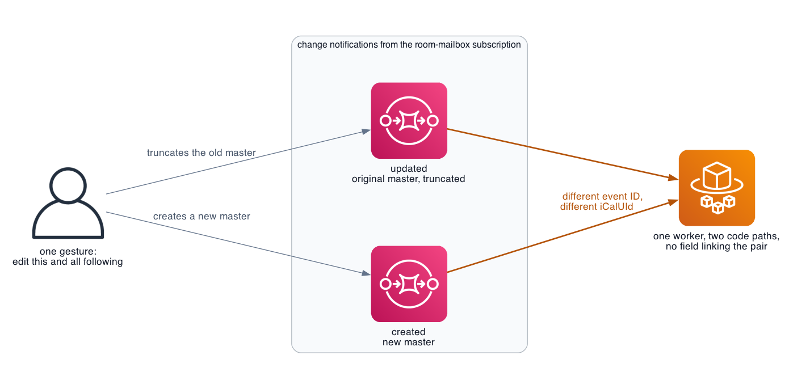
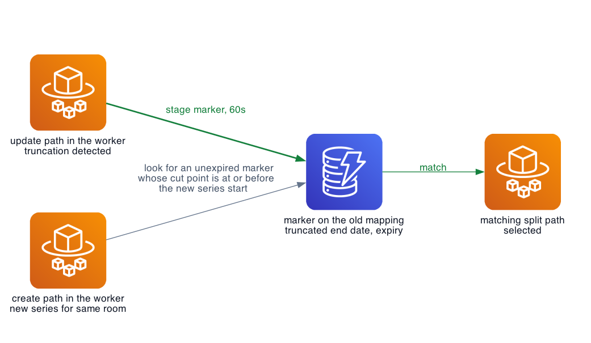
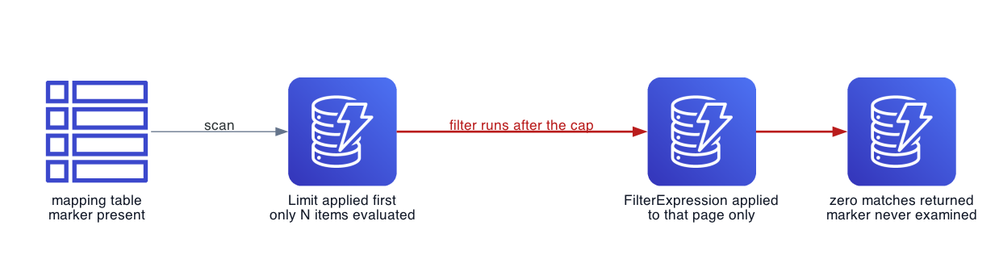

A user opened a recurring room booking in Outlook, chose **Edit this and all following events**, and changed the future part of the series. The booking integration then handled an update and a create as two unrelated actions.

That produced the wrong result in the connected reservation system. The shortened series updated one reservation group. The new future series created another group. A later cancellation attempt behaved as though the booking were two separate things. That was the observed symptom. It did not establish the cause.

Both Microsoft Graph event handlers worked as designed on their own. The service had no state that carried the user's intent from one handler to the other.



*Figure 1. One user action reached the integration as two resource changes with separate identifiers.*

## The interface described an action while Graph exposed objects

Outlook offers an option to edit one occurrence, the full series, or the selected occurrence and all events that follow it. That third choice describes what the user wants to happen. It does not promise that an integration will receive one event object carrying that intent.

In this incident, inspection of the affected calendar records showed two recurring series masters:

- the original master had a shorter recurrence range
- a new master began at the edit point
- the masters had different event IDs
- the masters also had different `iCalUId` values

The Graph event resource includes both `iCalUId` and `seriesMasterId`. Those fields solve other identity problems. `seriesMasterId` connects an occurrence or exception to its current master. It does not connect an old master to the new master that replaced its future portion. In the records I inspected, neither field linked the two masters.

I treat this shape as an observed integration behaviour from this incident. Microsoft documents the Outlook editing choice and the Graph event fields, but I found no API contract that says every use of the interface must always produce this exact pair.

## The first useful test was a mutation matrix

The incident had two symptoms. Future edits did not reach the reservation platform, and a series edited that way later failed to cancel cleanly. Reading the code suggested several possible paths, but it could not establish which Graph objects Outlook had created.

I wrote a probe that created a fresh weekly series for each of five scenarios:

1. extend the end date
2. shorten the end date
3. add another weekday
4. move the recurrence to another weekday
5. shorten one master and create another master at the cutoff

The fifth scenario acted as a known split. It gave the other mutations a concrete two-master shape to compare against.

The first probe inspected the organizer's calendar. Production notifications came from the room mailbox, so that result alone could not explain the integration. A second probe recorded the room calendar before the split, performed the two Graph mutations on the organizer calendar, waited for room processing, and counted the resulting room masters.

This controlled probe reproduced the two-object shape through explicit Graph operations. It did not automate a click in the Outlook interface. That distinction matters. The incident connected the user action to the failure. The probe showed how the same old-master update and new-master create propagated to the mailbox that generated notifications.

## Event-level idempotency could not join the pair

The service subscribed to created, updated and deleted event changes in the room mailbox. It already stored an event mapping so a repeated notification for the same event would not create another reservation.

That protection stopped duplicates for one Graph ID. It could not help when Graph presented the future portion as a new master with a new ID.

The update path saw a valid series shortening. The create path saw a valid new series. If each handler committed its own interpretation, the reservation platform ended with two groups for one calendar action.

The service needed correlation across messages. It also needed to distinguish a split from an ordinary shortening where no replacement series would arrive.

## A short-lived marker joined the two messages

The implementation that shipped used a short-lived marker in DynamoDB and a 60 second window. The
marker carried just enough state to ask whether two messages belonged to the same user action.

When the update handler found that the last cancelled occurrence ended after the last remaining occurrence, it treated the change as a possible truncation. It stored two dates on the old master's mapping, and the naming matters because they are easy to invert. One is the end date the master had before the update. The other is the truncated end date it has after the update, which is the cut point a later create has to match against. An expiry time sat alongside them.

When a new series arrived for the same room, the create handler looked for an unexpired marker whose truncation point fell at or before the new series start. A match connected the two messages. The handler then attempted to cancel the old reservation group, retired its mapping rows, cleared the marker and created a group for the new master.

```text
on old series update
  if the final active occurrence moved earlier
    store a truncation observation for 60 seconds

on new series create
  find an unexpired observation for the same room
  require the old cutoff to be at or before the new start
  attempt to cancel the old reservation group
  retire the old mappings
  clear the observation
  create the new reservation group
```

The expiry let a genuine shortening continue without later capturing an unrelated series. On the success path, clearing the marker kept a retried create from selecting the same candidate. Unit tests covered the match and no-match branches. The match test verified the cancellation call, retirement of the old mappings, marker clearing and the new create. The no-match test left old groups alone. The tests did not supply a partial cancellation result.



*Figure 2. The marker carries correlation state for 60 seconds. A match selects the split path but does not prove that cancellation succeeded.*

## The lookup contained a DynamoDB trap

A later source review found a serious weakness in the marker lookup. The code used a table scan with a filter and `Limit: 5`.

```text
scan the mapping table
  limit evaluated items to 5
  filter for the same room
  filter for a live truncation marker
  filter for a compatible cutoff
```

DynamoDB applies a scan filter after it reads the items. The `Limit` value caps how many items DynamoDB evaluates before that filter. If the first five table items belong to other rooms, the call can return no match even when the correct marker sits later in the table.

The scan also uses eventually consistent reads unless the caller requests strong consistency. A create notification can therefore miss a marker that the update handler has just written.

The low number of active markers does not make this safe. Marker rarity actually makes a filtered scan more likely to examine unrelated items first. Pagination would eventually find the marker, but it would turn a latency-sensitive webhook path into a growing table walk.



*Figure 3. `Limit` constrains evaluated items, so a filtered scan can return an empty result while a matching row exists.*

I would replace the scan with a queryable correlation record. One option uses a sparse secondary index with the room as its partition key and the truncation point plus master ID as its sort key. Only active observations enter the index. The create handler queries one room and a bounded time range, then checks expiry and ambiguity in application code.

Another option writes one dedicated correlation item per room. A conditional or transactional write can make the winner explicit when two truncations happen close together. Either design makes cost and correctness depend on candidates for one room rather than the size and physical order of the full mapping table.

## The sibling path already checked the cancellation result

The implementation had a second unsafe edge. The same service already contained the check that this
path needed.

On the split path the handler calls the cancel method and throws the answer away:

```ts
try {
  await this.reservationsClient.cancelReservationGroup(
    candidate.reservationGroupId,
    actingUserEmail || candidate.organizerEmail || '',
  );
} catch (err) {
  log.warn({
    oldGroupId: candidate.reservationGroupId,
    error: err instanceof Error ? err.message : String(err),
  });
}
```

A thrown error is logged and execution continues. It still retires the old mappings and creates the
replacement group, which can preserve the exact duplicate the correlation logic exists to remove.

A throw is not the only failure mode. That method returns a result describing partial success:

```ts
export interface GroupCancellationResult {
  cancelled: string[];
  failed: NotCancellableReservation[];
}
```

A policy rule can block individual reservations inside a group. The group cancel then returns
normally with entries in `failed`, nothing throws, and the split path never looks.

The series-extension path in the same service does look, and it is explicit about why:

```ts
const cancelResult = await this.reservationsClient.cancelReservationGroup(
  existingGroupId,
  actingUserEmail,
);
const failedCount = cancelResult?.failed?.length ?? 0;
cancelCleanlyCompleted = failedCount === 0;
```

The sibling path uses that result to gate its recreate. If any reservation appears in `failed`, it
skips the create. If the call throws, it also skips the create. That prevents another group from
being created after an incomplete cancellation, although reservations that did cancel can still
leave the original group in a partial state.

The split path did not need a new design. It needed to use the return value already checked elsewhere
in the same service. The positive extension test exercised the cancel-and-recreate path, but I found
no focused test that supplied a nonempty `failed` array. The guard existed in code while its
partial-failure branch lacked a direct test.

That is a more useful lesson than any architecture I could propose here. Two paths in one service
faced the same problem. One learned that a clean return is not the same as a clean outcome, and that
knowledge stayed local to the path that learned it.

## Correlation needs an ambiguity rule

Room and time provide useful evidence, but they do not form a global identity. Two organizers could truncate two recurring bookings for the same room within the same minute.

The initial lookup selected the candidate with the truncation point closest to the new start. That produces a deterministic answer. It does not prove the answer is correct.

When several candidates remain plausible, the service should avoid a destructive guess. It can compare more non-sensitive context such as organizer identity, normalized subject, duration and recurrence pattern. If the candidates still tie, it should hold the change for reconciliation and raise an operational signal.

That rule turns uncertainty into a visible state. A quiet false match can cancel the wrong reservation group.

## The queued notification did not carry the relationship

In this integration, the queued notification identified the event and change type, but it did not
contain the calendar state that changed. It also did not say that two event IDs came from one Outlook
gesture. The worker had to fetch current state and infer the relationship.

The 60 second window introduced a recovery gap. A short outage, an expired subscription or a failed
handler could leave one side unseen until the marker expired. Microsoft Graph calendar delta queries
could support a recovery loop. I would retain one delta link for each room calendar view and reconcile
periodically. I did not implement that recovery path in this work.

## The failure lived between correct steps

The correlation marker fixed the immediate path, and the review afterwards was worth more than the
fix. It found a scan that could miss the marker it was looking for, and a cancellation whose result
nobody read.

Both defects have the same shape as the original bug. The integration handled an updated resource
correctly and a created resource correctly, and the failure lived in the space between them. The
DynamoDB lookup evaluated items correctly and filtered them correctly, and the failure lived in the
order of those two steps. The cancel call succeeded correctly and reported partial failure
correctly, and the failure lived in nobody joining the two.

When an interface offers an action over "this and all following", inspect the state passed from one
handler to the next. Microsoft Graph exposed two event IDs in this incident, and neither carried the
user's original intent across the boundary.

## References

- [Microsoft Support: Change an appointment, meeting, or event in Outlook](https://support.microsoft.com/en-us/outlook/calendar/change-an-appointment-meeting-or-event-in-outlook)
- [Microsoft Graph: Event resource type](https://learn.microsoft.com/en-us/graph/api/resources/event?view=graph-rest-1.0)
- [Microsoft Graph: Outlook change notifications](https://learn.microsoft.com/en-us/graph/outlook-change-notifications-overview)
- [Microsoft Graph: Track incremental changes to events in a calendar view](https://learn.microsoft.com/en-us/graph/delta-query-events)
- [AWS: Working with scans in DynamoDB](https://docs.aws.amazon.com/amazondynamodb/latest/developerguide/Scan.html)
