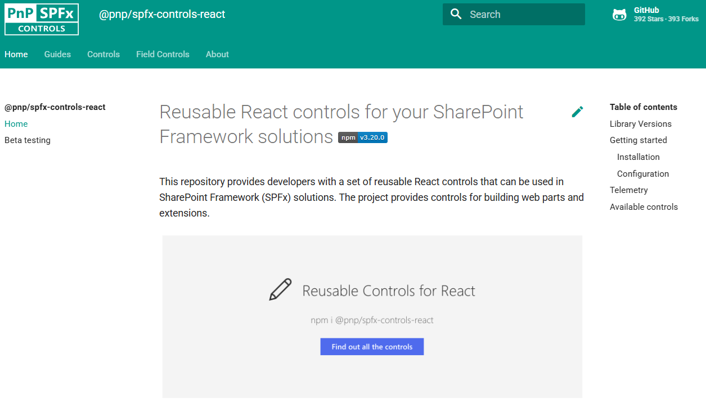
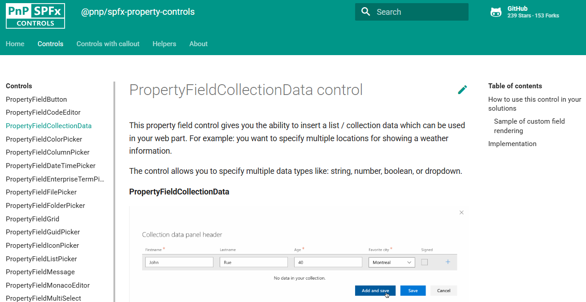
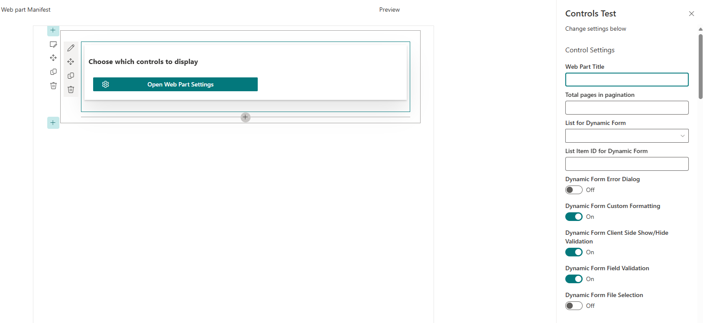
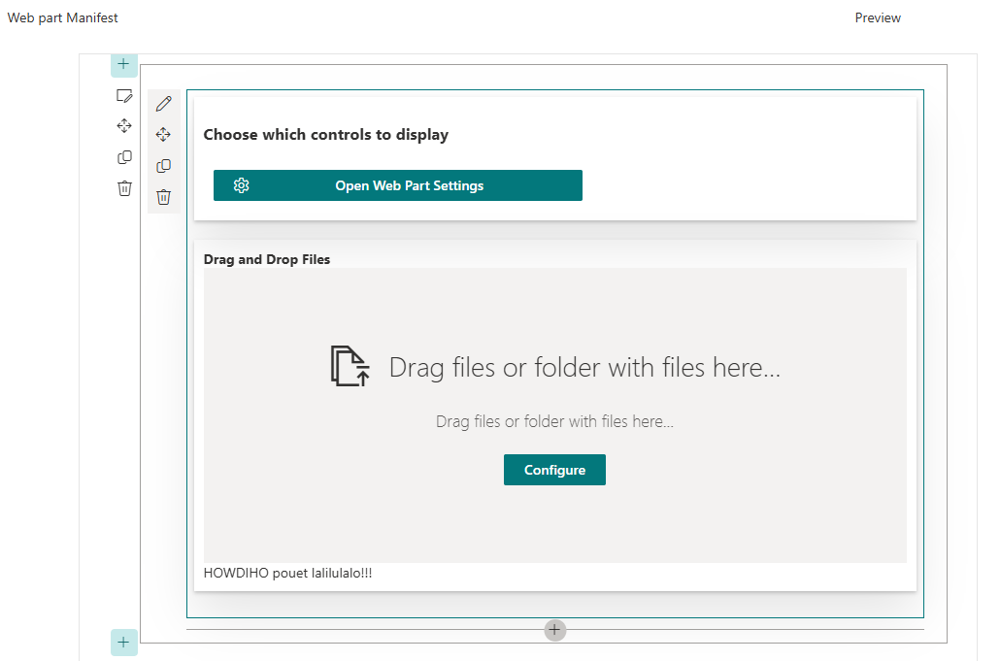
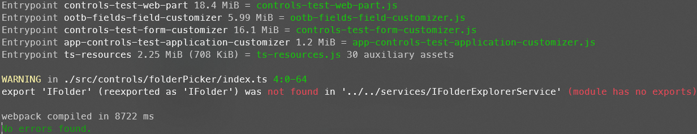

If you're reading this, then you're curious about how you can contribute to the PnP React Controls & PnP Property Controls. Welcome 🤗.

## What are these?

If you didn't know already, when we're referring to _PnP Controls_, there are two open source solutions:

* PnP React Reusable Controls
* PnP Property Pane Reusable Controls

These two were created in order to address multiple use cases when it's about designing [SharePoint Framework](https://learn.microsoft.com/sharepoint/dev/spfx/sharepoint-framework-overview?WT.mc_id=M365-MVP-5005200) solutions with frequent needs, whether we're talking about [`PeoplePicker`](https://pnp.github.io/sp-dev-fx-controls-react/controls/PeoplePicker/) or the [`PropertyFieldMultiSelect`](https://pnp.github.io/sp-dev-fx-property-controls/controls/PropertyFieldMultiSelect/). Because for most of these _controls_, they are linked to a M365 context which means that they are not designed to be implemented outside of Microsoft 365 ecosystem.

### PnP React Reusable Controls

This solution contains professional-looking _controls_ that can be used in SPFx solutions (web parts, application & form customizers,...).

You'll find different kind of components such as:

* Pickers (site, taxonomy, user)
* Charts
* SharePoint-focus components (lists / list items, web parts, documents)

For most of them, a few parameters will be enough to be exploited easily. For others, they'll need some exploration or to play with, in order to fulfill business needs.

There are also [_Field Controls_](https://pnp.github.io/sp-dev-fx-controls-react/controls/fields/main/), a set of components designed for [SPFx field customizers](https://learn.microsoft.com/sharepoint/dev/spfx/extensions/get-started/building-simple-field-customizer?WT.mc_id=M365-MVP-5005200).

### PnP Property Pane Reusable Controls

This one is a collection of components that can be used in any web part which needs to be configured through a [property pane](https://learn.microsoft.com/training/modules/sharepoint-spfx-web-part-property-pane/?source=recommendations&WT.mc_id=M365-MVP-5005200).

Many of them are design to facilitate user interaction during configuration step, thanks to different field types available (button, color picker, ordered list,...).

This solution also offers property pane fields with a customizable callout.

## Contributing

So you found a bug to solve, an improvement for a _control_ or a new one to create, and you would like to give a try?

First: check in the target repo if it hasn't been raised before, through the issue list. If not, please declare it!

Then, you have to fork the repo (or download the source code if you just want to dive into it):

* [PnP React Reusable Controls](https://github.com/pnp/sp-dev-fx-controls-react)
* [PnP Property Pane Reusable Controls](https://github.com/pnp/sp-dev-fx-property-controls)

Once you got them, the only thing you have to do is running the following command from the repo: `npm i`. But before doing this, be sure to have correct version of Node installed, based on the [SPFx compatibility matrix](https://learn.microsoft.com/sharepoint/dev/spfx/compatibility?WT.mc_id=M365-MVP-5005200#spfx-development-environment-compatibility) and the current version used in the _PnP Controls_. You'll also have to get [`gulp cli`](https://learn.microsoft.com/sharepoint/dev/spfx/set-up-your-development-environment?WT.mc_id=M365-MVP-5005200#install-gulp) installed.


Check this super [blog post](../spfx-setup-part1-nvm-nvs) made by [Adam Wójcik](https://github.com/Adam-it/) regarding SPFx setup and Node configuration.


Then, you can run the local server in two ways: classic `gulp serve` or `npm run serve`. The second one is using [`spfx-fast-serve`](https://github.com/s-KaiNet/spfx-fast-serve), a great tool created by [Sergei Sergreev](https://github.com/s-kainet), which reduces building speed and refreshes the dev environment page instantly after a saved update during local development.

Moreover, you can check if your favorite language is supported by using the `--locale` argument! For example:

* `gulp serve --locale=zh-cn` or `npx fast-serve --locale=zh-cn` (not `npm run serve`) for Chinese

If you found mistranslation or your language is not listed in the supported one, feel free to open an issue 😊.

### Testing the PnP React Reusable Controls

The most common usage is to display the `ControlsTest` web part in the workbench:

From this screen, you can select which _control_ you want to display. For some of them, like the `DynamicForm`, you can configure specific properties (such as target list / library) through the property pane. For the others, you'll have to configure them directly in the `ControlsTest` web part component file or you'll face loading errors in the browser console.


For now, the only control which doesn't work with `spfx-fast-serve` is the `MyTeam` _control_ (displayed when the property `Teams` toggle is enabled). Please use the `gulp serve` in that case. Root cause is due to compatibility mismatch with `mgt-spfx` package which is used under the hood.


If you're debugging with `spfx-fast-serve`, you'll face a _warning_ message in your terminal, regarding export of `IFolder`. Don't pay attention, this won't prevent you from testing the solution.


### Testing the PnP Property Pane Reusable Controls

As we're talking about property pane, there's only one way to test them: in the workbench!

As you can see, property pane _control_ values are displayed in the dedicated web part.

They're grouped by type of property _control_ and you can freely update their values to see how they behave.

## Test local version of PnP React Reusable Controls on a solution?

We saw that it was possible to test them through their embedded SPFx solution, but let's say that you want to test their behavior in a "real life" scenario, such as one of your production solution?

This is possible, thanks to NPM package linking! But it's a bit tricky...


The following tutorial only works for the **PnP React Reusable Controls**, not the **PnP Property Pane Reusable Controls**.


From the _PnP React Reusable Controls_ solution, run the following command: `npm link`. This will make them available for any consuming SPFx solution. Then this one, run the command: `npm link @pnp/spfx-controls-react`.

The other thing you need to do, is to deploy the consuming solution in **debug** mode.

First, choose a different port than the default _4321_ (which is currently used by the _PnP Controls_). Update the `port` value in the `config/serve.json`. If you're using `spfx-fast-serve`, you'll have to specify the same port in the `fast-serve/config.json` file. Then package your solution in **debug** mode (`gulp bundle && gulp package-solution`, without the `--ship` argument).

Once the solution deployed, do the following actions in the exact order:

1. Run `gulp serve --nobrowser` from the _PnP React Reusable Controls_
2. Wait for the last subtask to be displayed ("**reload**")
3. Run `gulp serve` (or `npm run serve` if using `spfx-fast-serve`) from the consuming SPFx solution (the one you deployed in **debug** mode)
4. Wait for the server status to be displayed ("**webpack compiled in xxx ms**")

Then go to your site where is already deployed your consuming SPFx solution. In the URL of your page (where is located a web part, or extension), add the following query parameters:

> ?loadSPFX=true&debugManifestsFile=https://localhost/4321/temp/manifests.js

Now, whether you choose to update your consuming SPFx solution or the _PnP React Reusable Controls_, you'll be able to see changes on your page! One important thing to note is that updates to _PnP Controls_ will take a little bit more time than updating the consuming SPFx solution. But once rebuilt, those updates will automatically refresh the page you're testing!

Once your tests done, don't forget to do the following actions on your consuming SPFx solution:

* Run `npm unlink @pnp/spfx-controls-react` to remove symbolic link with the local version of _PnP React Reusable Controls_
* Run `npm i @pnp/spfx-controls-react` to install again the latest production version

I couldn't make work both of the solutions with `spfx-fast-serve`, that's why I'm mixing `gulp serve` on the _PnP React Reusable Controls_ & `npm run serve` on the consuming SPFx solution.

Of course, if you have better ways to test this scenario, or any other feedback, feel free to share them in the comments!

Happy coding!

> Sharing is caring
