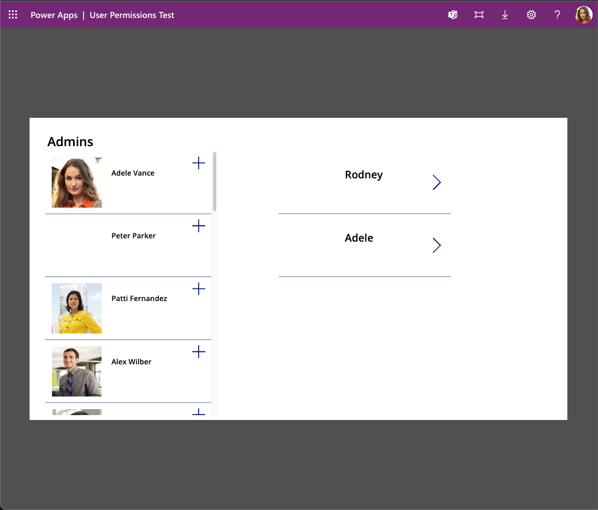

# Background
When I build apps for my department or enterprise, it is sometimes a challenge to sync up with co-workers, everyone is busier these days. But I need to test my apps with other user accounts. Fortunately Microsoft provides a way to meet these testing needs with the Microsoft 365 Developer Program. A huge thanks goes out to Microsoft for providing this service.

## Getting Started

If you would like a safe environment where you can experiment. I recommend signing up for a free [Microsoft 365 Developer Program](https://developer.microsoft.com/en-us/microsoft-365/dev-program) 

## You do not need to be a Pro Dev!

The Microsoft 365 Developer Program gives you the ability to experiment safely with the Power Platform, Dataverse, Connectors, Teams, Azure, and more. This is isolated from your company's environment.

This environment creates 16 user accounts for you that you can manage in an isolated instance of Azure Active Directory, Power Platform Admin Center, and Dynamics 365. 

These 16 accounts come in handy when testing your Power App by users who may have different permissions than you, the app creator. As a bonus you no longer have to annoy your co-workers each time you need to test your app.

# Licenses

Each user account added to the Azure Active Directory associated with the Microsoft 365 Developer Program account, will automatically be assigned the default Microsoft 365 E5 Developer (without Windows and Audio Conferencing) license. 

# Optional - Check User Licenses

For the purpose of this blog post it's not required but if you wish to see all the licenses assigned to a user, go to [Azure Active Directory Portal associated with the Microsoft 365 Developer Program account](https://portal.azure.com) - Azure Active Directory - Users. Click on the user name, Assigned licenses link.

# Optional - Web Browser: Create User Profiles 

The following only applies if you are testing with the 16 user accounts that were created when you signed up for the Microsoft 365 Developer Program. If a co-worker is helping you test, you do not need to do either of the following.

In Microsoft Edge select Profiles -> Manage Profiles.

Add a Browser User Profile For:

1. Your Microsoft 365 Developer Program account.
2. One or more of the 16 User Accounts.

Or if you prefer you can open separate InPrivate browser windows for each test account. 

I find User Profiles makes more sense to me when I test my Power App as a different user. 

# Learn more about Security Roles:

1. [Microsoft Learn - Get started with security roles in Dataverse](https://learn.microsoft.com/en-us/training/modules/get-started-security-roles/)
2. [Power Platform Documentation - Security in Microsoft Dataverse](https://learn.microsoft.com/en-us/power-platform/admin/wp-security)
    - [Configure user security to resources in an environment](https://learn.microsoft.com/en-us/power-platform/admin/database-security)

# Setup the Power Platform Environment(s)

Make sure you are logged into your [Power Platform Environment](https://make.powerapps.com) with your Microsoft 365 Developer Program account.

It's recommended to create a developer Environment. The default environment should only be used to create personal apps. The apps you will share with co-workers should be created in another Power Platform Environment.

If you have not already created a Developer Environment, click the cog wheel in the upper right of your browser window and click the Admin center link.

In the Admin center, click Environments then click the + New link.

## Note

If you wish to work with the new <strong>Pipelines feature</strong> I recommend having at least 3 Environments i.e. <strong>Dev, QA & Production</strong>

# Create A Power App

In the Developer environment,
1. Create a new Power App.
2. Add a Gallery Control to the Home screen.
3. Name the gallery control, <strong>galAADUserPeoplePicker</strong>
4. Add the AAD Users table as a Data source.
5. Set galAADUserPeoplePicker Items to 'AAD Users'
6. Accept the default fields

You should now have something similar to the People Picker on the left.

 

# Share
Click the Share button, this opens a new window.
 

Add users and assign the <strong>Basic User</strong> and <strong>Service Reader Security Roles</strong>!

There is a Dataverse Search Role in the selection list, but in my tests, this does not provide the user with the permissions needed to surface information from the AADUser table.

According to the Microsoft docs, Dataverse Search is for searching Model Driven apps. I'm still looking for specific information about the <strong>Dataverse Search Role</strong>.

# Monitor
1. Go to the Power Platform Environment Apps page.
2. Select the line with the Power App but don't open the app!
3. Click the Monitor button

4. Select the Connect user button

5. Select a user and copy the Connected User Link

# Test
1. Open a new browser window.
2. Click the User Profile photo in the upper right if using Microsoft Edge.

3. Select the User Profile or create a new profile for the user you selected in the Monitor tool.
4. Navigate to the Connected User Link.
5. Join the monitor debug session

5. Test 

# Monitor
The Monitor tool can help you to determine if the connection is successful or not. 
It's a good resource to help you in troubleshooting your applications.

# Security Role Changes
You can assign a Security Role when you share the app, but you cannot deselect the role from the share session window. To make changes to Security Roles you will need to go the Power Platform Admin Center. 

In the Power Platform Admin Center go to your environments settings then click users and select the user account you wish to make changes to. Click Manage Roles.

For instance maybe remove the Service Reader & Dataverse Search roles and assign the System Customizer role. 

# Test As The User
Open the apps url from the app details screen in a browser window as the User Profile. Sign in and accept to allow the requested permissions if necessary.

Now your user should see something similar to:

You can choose to Export and Import your solution to your company environment. You may want to consult your IT department first, they may have guidelines you should follow.

Hope this is useful!

I created a short video about this topic.

# YouTube

[Power Bytes-Ep-2: AADUser Table-Sharing](https://youtu.be/W8CWft05Og4)