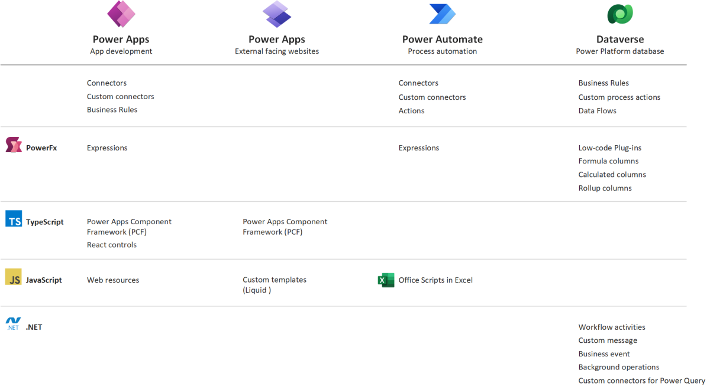
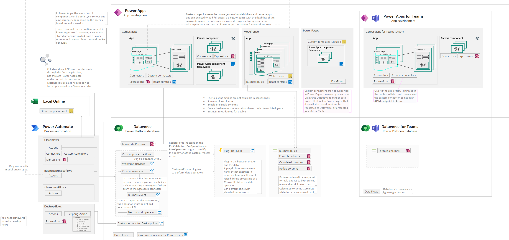

## Power Platform extensibility options series

1. Power Platform extensibility options - this article
1. [Power Apps](./../power-platform-extensibility-02/index.md)
1. [Power Automate](./../power-platform-extensibility-03/index.md)
1. [Dataverse](./../power-platform-extensibility-04/index.md)

## Don't code if you don't need to

When building Power Platform solutions, first evaluate Platform capabilities and use as much of low-code as possible.
This means learning which controls are available, how to use [Power Fx](https://learn.microsoft.com/en-us/power-platform/power-fx/overview) (if you ever wrote Excel formula, you will feel at home), deciding which parts of business logic should be executed client-side, and when it's time to use Power Automate, or other capabilities instead.

Make sure you are familiar with [Where to place logic: Canvas apps, model-driven apps, Microsoft Dataverse, or Power Automate flows?](https://learn.microsoft.com/en-us/power-apps/guidance/planning/logic) and keep an eye on the [Release plans for Dynamics 365, Power Platform, and Cloud for Industry - Dynamics 365](https://learn.microsoft.com/en-us/dynamics365/release-plans/)⭐ to learn about new features as they are prepared for release.

>_As a developer, you should approach apps on Microsoft Power Platform from the perspective that **writing code […] should be** considered as an **exception** to no-code and low-code approaches. […]
Microsoft Power Platform often implements something in a particular way that benefits the platform. This may be different if you're used to doing it in custom application code. It isn't uncommon for developers that are new to building Microsoft Power Platform solutions to try to customize the platform the way they used to build custom apps previously. This should be avoided when possible and you should try to take advantage of what the platform does well, rather than try to change it to what you are used to doing._
>
>Source: [Determine when to configure or when to code](https://learn.microsoft.com/en-us/training/modules/introduction-power-platform-extend/configure-code)

If, after extensive evaluation, you see that the existing controls or declarative process don't meet your needs, you may start coding using either **Power Fx**, **Typescript** or **.NET**. The choice of technology will depend on [where you want to place your logic](https://learn.microsoft.com/en-us/power-apps/guidance/planning/logic).

Don't underestimate the power of **Power Fx**. It's getting better and better, and is now offering [error handling](https://learn.microsoft.com/en-us/power-platform/power-fx/error-handling), [named formulas](https://learn.microsoft.com/en-us/power-platform/power-fx/reference/object-app#formulas-property), [assertions](https://learn.microsoft.com/en-us/power-platform/power-fx/reference/function-assert), [regular expressions](https://learn.microsoft.com/en-us/power-platform/power-fx/reference/function-ismatch), etc. Always ensure that the feature you want to use is generally available, because experimental and preview features are not meant for production.

## Extensibility options

The following summary outlines existing options for implementing business logic, encompassing low-code solutions such as custom canvas components or business rules, as well as pro-code options like React components, add-ins, and more.

## Deep dive

## Power Platform extensibility options series

The following articles in the series present available options in more detail, outlining differences and whenever applicable, the limitations.

> Important: Some of the capabilities described in this series are still in **preview** at the time of writing. Always refer to the official documentation to ensure your solution is using generally available capabilities.

1. Power Platform extensibility options - this article
1. [Power Apps](./../power-platform-extensibility-02/index.md)
1. [Power Automate](./../power-platform-extensibility-03/index.md)
1. [Dataverse](./../power-platform-extensibility-04/index.md)
