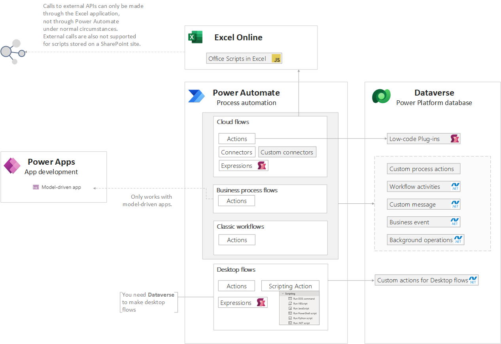

## Power Platform extensibility options series

1. [Power Platform extensibility options](./../power-platform-extensibility-01)
1. [Power Apps](./../power-platform-extensibility-02)
1. Power Automate - this article
1. [Dataverse](./../power-platform-extensibility-04)

## Where to place logic

> Power Automate **[Cloud flows](https://powerautomate.microsoft.com/en-us/digital-process-automation/) are always asynchronous**, while **Classic workflows** may be **either background (asynchronous) or real-time (synchronous)** workflows. Microsoft recommends to use Cloud Flows instead of classic background workflows.
>
>Power Automate supports **transactions through ChangeSets** which can be used with the **Dataverse** connector to perform atomic transactions. For transactions not related to Dataverse, custom rollback logic must be implemented.

Power Automate can function autonomously as a workflow triggered manually, on a schedule, or by an event such as the arrival of an email or the creation of an item in a list. It may also be used to execute business logic that is not intended for client-side execution within Power Apps.

Power Automate is great for [use cases](https://learn.microsoft.com/en-us/power-apps/guidance/planning/logic#power-automate-flows) where you need to run complex logic, need multiple connectors, or you don't want the user to wait for the action to finish. Consider it if:

- Logic needs to run across multiple connectors.
- You're creating an approval process.
- Output is being produced in another format.
- You want to reduce dependency on device-side processing power.
- The process is well understood and consistent, runs frequently and there's a potential ROI
- High risk and/or impact of a failure could be mitigated through automation.

It's [recommended to build separate flows](https://learn.microsoft.com/en-us/power-automate/guidance/planning/separate-flows) instead of a single automation that covers the entire process.

> Key developer extensibility points
>
> - Create custom connectors to communicate to your external data sources and services. A custom connector is a wrapper around a REST API and can be created using tools like Azure Functions and Azure API Management
> - Use workflow definition functions to build complex expressions
>
>Source: [Introduction to Microsoft Power Platform for developers](https://learn.microsoft.com/en-us/power-platform/developer/get-started#power-apps)

## Summary of extensibility options in Power Automate

See full resolution [here](https://gist.github.com/kkazala/9e83d5e7ad5e2cccf87586adf4523e0f)

|||Cloud Flows|Desktop Flows|Business Process Flow|Classic workflows|
|-|-|-|-|-|-|
|[Formulas - Power Apps](#formulas-using-power-fx) |Power Fx|✅|✅ |❌|❌|
|[Low-code plugins](#low-code-plug-ins-using-power-fx)  |Power Fx, Connectors |✅|❌|❌|❌|
|[Custom process action](#custom-process-actions-declarative)|declarative|✅|❌|✅*|✅|
|[Custom API](#custom-api-using-net) |.NET|✅|❌|❌|✅|
|[Workflow activities/assemblies](#workflow-activitiesassemblies)|.NET|✅|❌|✅|✅|
|[Custom connectors](#custom-connectors-using-rest-api) |REST API|✅|✅|✅**|❌|
|[Office Scripts in Excel](#office-script-in-excel-using-typescript)|TypeScript|✅|❌|❌|❌|
|[Custom actions for Power Automate for Desktop](#custom-actions-for-power-automate-for-desktop-using-net)|.NET|❌|✅|❌|❌|
|[Custom script](#custom-script-in-desktop-flows) in Desktop flows|DOS command, VBScript***, JavaScript, PowerShell, Python, .NET|❌|✅|❌|❌|

\* To allow business process flow execute the custom process action, define table entity and enable "As a Business Process Flow" in action properties

** By using custom process action that uses custom connector

*** VBScript is deprecated from Windows

## Formulas using Power Fx

Read more: [Formulas](https://learn.microsoft.com/en-us/power-platform/power-fx/formula-reference-overview)

Formulas combine many elements, for example:

- **Functions:** take parameters, perform an operation, and return a value. Functions are modeled after Microsoft Excel functions. Some functions have side effects, such as `SubmitForm`, which are appropriate only in a [behavior formula](https://learn.microsoft.com/en-us/power-apps/maker/canvas-apps/working-with-formulas-in-depth) such as `Button.OnSelect`.
- **Signals** return information about the environment. For example, [Location](https://learn.microsoft.com/en-us/power-platform/power-fx/reference/signals) returns the device's current GPS coordinates. Signals don't take parameters or have side effects.
- **Enumerations** return a pre-defined constant value. For example, [Color](https://learn.microsoft.com/en-us/power-platform/power-fx/reference/function-colors) is an enumeration that has pre-defined values for `Color.Red`, `Color.Blue`, and so forth.
- **Named operators**, such as [ThisItem](https://learn.microsoft.com/en-us/power-platform/power-fx/reference/operators#thisitem-thisrecord-and-as-operators) and [Self](https://learn.microsoft.com/en-us/power-platform/power-fx/reference/operators#self-and-parent-operator), provide access to information from within a container.

### Constraints and limitations

  Not all  functions area available in all Power Platform components. For example [regular  expressions](https://learn.microsoft.com/en-us/power-platform/power-fx/reference/function-ismatch) like  `IsMatch`,  `Match`, and `MatchAll`  are available in both, Canvas and Model-driven apps but  **not in Power Automate.**

## Low-code Plug-ins using Power Fx

Read more: [Low-code  Plug-ins](https://learn.microsoft.com/en-us/power-apps/maker/data-platform/low-code-plug-ins?tabs=instant)

 With the low-code plug-ins, you can create plug-ins with minimal or no coding  required, and without the need for compiling solution and manual registration.

Low-code  plug-ins are stored within a Dataverse database and can be seamlessly  integrated into Power Apps and Power Automate. They are defined using the Power Fx expression language and can directly connect   with Dataverse business data and external data sources through Power Platform connectors.

>**Idea**: You may use low-code plugins as a way  to execute [regular  expressions](https://learn.microsoft.com/en-us/power-platform/power-fx/reference/function-ismatch) in Power Automate.

### Constraints and limitations

  Low-code plug-ins are stored within a Dataverse database and are created using [Dataverse accelerator app](https://learn.microsoft.com/en-us/power-apps/maker/data-platform/low-code-plug-ins?tabs=instant#prerequisites-for-creating-a-low-code-plug-in), which must be installed in the environment. All new environments have the Dataverse accelerator app automatically installed as of October 1st 2023.

Use of low-code plugins in your solution requires Premium licenses.

[Limitations](https://learn.microsoft.com/en-us/power-apps/maker/data-platform/low-code-plug-ins?tabs=instant#limitations)

## Custom process actions (declarative)

Read more: [Custom  process action](https://learn.microsoft.com/en-us/power-apps/maker/data-platform/create-actions)

[Custom  process actions](https://learn.microsoft.com/en-us/power-apps/developer/data-platform/workflow-custom-actions), also known as Custom actions, allow creating custom  reusable actions that encapsulate specific business logic, and may be  invoked directly from a workflow.

The  business logic of a custom process action is implemented using a workflow.  When you create a custom process action, the associated real-time workflow is  automatically registered to execute in the main operation stage of the  message execution pipeline.
They  are stored in Dataverse and may use a context of a table, or be defined as global.

See [Dataverse](./../power-platform-extensibility-04) page for a more details.

### Constraints and limitations

To allow business process flow execute the custom process action, define table  entity and enable **As a Business Process Flow** in action properties

## Custom API using .NET

Read more: [Custom  API](https://learn.microsoft.com/en-us/power-apps/developer/data-platform/custom-api)

Custom  API is a newer way to define custom messages with many advantages for  developers. If you do not intend to use the no-code capabilities that custom  process actions provide to configure business logic, custom API provides  better capabilities for developers to create their own messages.

See [Dataverse](./../power-platform-extensibility-04) page for a more details.

### Constraints and limitations

[Compare Custom Process Action and custom API](https://learn.microsoft.com/en-us/power-apps/developer/data-platform/custom-actions#compare-custom-process-action-and-custom-api)

## Workflow activities/assemblies

Read more: [Workflow activities/assemblies](https://learn.microsoft.com/en-us/power-apps/developer/data-platform/workflow/workflow-extensions)

 As  reusable components, workflow extensions can be added to any workflow or  custom action.

See [Dataverse](./../power-platform-extensibility-04) page for a more details.

## Custom connectors using REST API

Read more: [Custom  connectors](https://learn.microsoft.com/en-us/connectors/custom-connectors)

Use to  communicate to your external data sources and services. A custom connector is  a wrapper around a REST API and can be created using tools like Azure  Functions or Azure API Management.

New  connectors-both Microsoft  first party and third party-are added constantly, and as an administrator you should be aware of new  connectors and ensure they are classified accordingly in your [Data loss prevention (DLP) policies](https://learn.microsoft.com/en-us/power-platform/admin/wp-data-loss-prevention)

### Constraints and limitations

Power Platform **only supports REST API**,  while Logic Apps also supports SOAP APIs.

[Custom  connector FAQ for Azure Logic Apps, Power Automate, and Power Apps](https://learn.microsoft.com/en-us/connectors/custom-connectors/faq)

[Known  limitations](https://learn.microsoft.com/en-us/connectors/custom-connectors/customconnectorssolutions#known-limitations)

## Office Script in Excel using TypeScript

Read more: [Office  Script in Excel](https://learn.microsoft.com/en-us/office/dev/scripts/develop/power-automate-integration?tabs=run-script)

  Office  Scripts in Excel let you automate your day-to-day tasks. You may record  manual steps, or write your script on your own.

Although  it's meant for editing workbook, you don't have to access Excel contents at  all. Instead, you may use Office Script in Excel to execute your TypeScript  functions, to execute any logic that is not available using Power Fx.

### Constraints and limitations

  To use [Excel  Online (Business) connector (standard)](https://learn.microsoft.com/en-us/connectors/excelonlinebusiness)
in Power Automate you must have a [business  license of Microsoft 365](https://learn.microsoft.com/en-us/office/dev/scripts/develop/power-automate-integration?tabs=run-script#:~:text=on%20workbook%20comments.-,Important,-To%20use%20Office)

Excel Scripts may be saved either in [OneDrive or in a SharePoint](https://learn.microsoft.com/en-us/office/dev/scripts/overview/script-storage)

Requests and responses in Excel are limited  to  **5MB**, and the maximum size of parameters passed to the Run script action is 30,000,000 bytes **(28.6MB)**.

**External calls from a script are NOT supported**

[Data  security in Office Scripts with Power Automate](https://learn.microsoft.com/en-us/office/dev/scripts/develop/power-automate-integration?tabs=run-script#data-security-in-office-scripts-with-power-automate)
[Limits  and configuration in Power Automate](https://learn.microsoft.com/en-us/power-automate/limits-and-config)
[Known  issues and limitations for the Excel Online (Business) connector](https://learn.microsoft.com/en-us/connectors/excelonlinebusiness/#known-issues-and-limitations)
[Power  Automate specific restrictions](https://learn.microsoft.com/en-us/office/dev/scripts/testing/platform-limits?tabs=business#power-automate-specific-restrictions)
[TypeScript  restrictions in Office Scripts](https://learn.microsoft.com/en-us/office/dev/scripts/develop/typescript-restrictions)

## Custom actions for Power Automate for Desktop using .NET

Read more: [Custom  actions for Power Automate for Desktop](https://learn.microsoft.com/en-us/power-automate/desktop-flows/custom-actions)

  Custom  actions exist at the environment level.
  Custom  actions developed by your organization and uploaded to the respective  environments can be included in desktop flows and utilized like actions that  belong in the standard library of automation actions.

### Constraints and limitations

.dll  files describing Custom actions, their dependency .dll files, and the .cab  files are properly signed with a digital certificate trusted by your
organization. The certificate should also be installed on the device under the trusted root certificate authority where the desktop flow with custom
action dependencies is modified and/or executed.

[Known  limitations](https://learn.microsoft.com/en-us/power-automate/desktop-flows/custom-actions#known-limitations)

## Custom script in Desktop flows

Read more: [Custom  script in Desktop flows](https://learn.microsoft.com/en-us/power-automate/desktop-flows/actions-reference/scripting)

Scripting  actions enable you to run blocks of code and implement custom behavior in  your desktop flows using:

- DOS command,
- VBScript*,
- JavaScript,
- PowerShell,
- Python and
- .NET.

\* VBScript is deprecated from Windows. In future releases of Windows, VBScript will be available as a [feature on demand](https://learn.microsoft.com/en-us/windows/whats-new/deprecated-features-resources#vbscript) before its removal from the operating system

### Constraints and limitations

To prevent unauthorized access, Windows require administrator  rights to access protected resources. To access protected resources (such as files) using the scripting actions, run Power Automate with administrator  rights.
