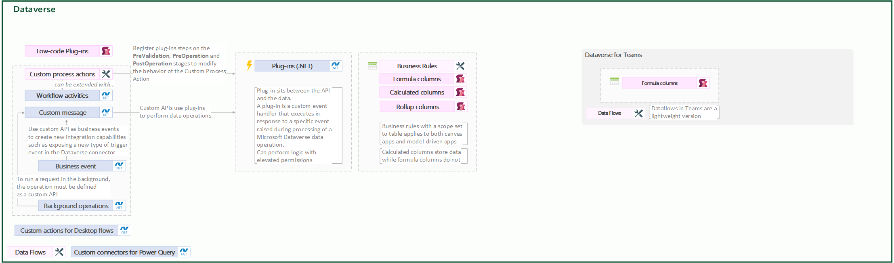

# Dataverse

## Contents

1. [Power Platform extensibility options](index.md)
1. [Power Apps](powerApps.md)
1. [Power Automate](./PowerAutomate.md)
1. **Dataverse**

## Where to place logic

Because Dataverse includes many capabilities for people to configure custom business logic without writing code, the most common scenarios for developers to contribute involve filling spaces in-between where existing features may not provide functionality you need to meet a requirement. Fortunately, Dataverse provides many points for developers to extend the common functionality using code. Each of these options are typically invoked based on events that occur on the server, so understanding of the [Event Framework](https://learn.microsoft.com/en-us/power-apps/developer/data-platform/event-framework) will be valuable.

A best practice recommendation is that [long running operations should be executed outside of Dataverse](https://learn.microsoft.com/en-us/power-apps/developer/data-platform/workflow-custom-actions#watch-out-for-long-running-actions) using Power Automate, Logic Apps, or other capabilities offered by Azure.

**All operations in a synchronous transaction are limited to a total of two minutes. An exception thrown by your code at any synchronous stage within the database transaction will cause the entire transaction to be rolled back.**

Tables in Dataverse can use rich server-side logic and validation to ensure data quality and reduce repetitive code in each app that creates and uses data in a table.

- [Business rules](https://learn.microsoft.com/en-us/power-apps/maker/data-platform/data-platform-create-business-rule): Validate data across multiple columns and tables, and provide warning and error messages, regardless of the app used to create the data.
-[Business process flows](https://learn.microsoft.com/en-us/power-apps/maker/data-platform/data-platform-create-business-rule): Guide users to ensure that they enter data consistently and follow the same steps every time. Business process flows are currently only supported for model-driven apps.
- [Classic workflows](https://learn.microsoft.com/en-us/power-automate/business-process-flows-overview): Automate business processes without user interaction.
    - Background workflows.
    - Real-time workflows.
- [Business logic with code](https://learn.microsoft.com/en-us/power-apps/developer/data-platform/apply-business-logic-with-code): Supports advanced developer scenarios to extend the app directly through code.
    - Plug-in
    - Workflow extension

>Key developer extensibility points
>
>- Create plug-ins, similar to event handlers, that customize or extend Dataverse data processing with custom business logic (code)
>- Use webhooks and Azure Service Bus to integrate with external systems
>- Extend the Dataverse API with your own custom API that implements your business logic
>- Use virtual tables to integrate data stored in external systems into Dataverse without replicating the data
>
>Source: [Introduction to Microsoft Power Platform for developers](https://learn.microsoft.com/en-us/power-platform/developer/get-started#power-apps)

## Summary of extensibility options in Dataverse

## Formula  columns using Power Fx

Read more: [Formula  columns](https://learn.microsoft.com/en-us/power-apps/maker/data-platform/formula-columns)

**Description**: Formula column is a column that derives its value from a formula using other columns  in the same table.

**Constraints and limitations**: The formula can be defined using the Power Apps editor and can reference other  calculated columns, but not rollup columns. Calculated  columns are read-only and their values are calculated at runtime when the  record is retrieved.

They're not specific to the user; the calculation is performed using a system user account, so the values may be based on records that the user doesn't otherwise have privileges to view, such as columns that have field-level security enabled.

[Calculated columns](https://learn.microsoft.com/en-us/power-apps/maker/data-platform/define-calculated-fields) will eventually be  discontinued. It's recommend to use the **Formula columns** for calculations instead.

## Rollup  column using Power Fx

Read more: [Rollup  column](https://learn.microsoft.com/en-us/training/modules/create-define-calculation-rollup-fields/1-intro)

**Description**:  Contains  an aggregate value computed over the rows related to a specified row,  can aggregates data from relate  records in another table
In more  complex scenarios, you can aggregate data over the hierarchy of rows.

**Constraints and limitations**: The  rollups are calculated by scheduled system jobs that run asynchronously in the background. Rollup columns are **only  recalculated every hour** by default, but can be scheduled to run daily every x hours.

[Rollup columns benefits and capabilities](https://learn.microsoft.com/en-us/power-apps/maker/data-platform/define-rollup-fields#rollup-columns-benefits-and-capabilities)

[Key  considerations](https://learn.microsoft.com/en-us/training/modules/create-define-calculation-rollup-fields/2-rollup)

## Business  rules

Read more: [Business  rules](https://learn.microsoft.com/en-us/training/modules/define-create-business-rule)

**Description**:  Business  logic to ensure that columns in a model-driven app are shown, hidden, or set  with the correct values without writing JavaScript code or creating plug-ins.
  Define business  rules for a table that apply to all the table forms and at the server  level. Business rules defined for a table apply to both canvas
  apps and model-driven apps if the table is used in the  app.

**Constraints and limitations**:   Not all  business rule actions are available on canvas apps at this time: [Differences  between canvas and model-driven apps](https://learn.microsoft.com/en-us/power-apps/maker/data-platform/data-platform-create-business-rule#differences-between-canvas-and-model-driven-apps)

[Create business rules to apply logic in a model-driven app form](https://learn.microsoft.com/en-us/power-apps/maker/model-driven-apps/create-business-rules-recommendations-apply-logic-form)

## Low-code  Plug-ins using Power  Fx

Read more: [Low-code  Plug-ins](https://learn.microsoft.com/en-us/power-apps/maker/data-platform/low-code-plug-ins?tabs=instant)

**Description**:   Traditionally,  plug-ins were created as custom classes compiled into a .NET Framework  assembly, which were then uploaded and registered within Dataverse. However,  with the introduction of low-code plug-ins, users can create these event  handlers with minimal or no coding required, and without the need for manual  registration.

Low-code  plug-ins are stored within a Dataverse database and can be seamlessly  integrated into Power Apps and Power Automate. The behavior of the workflow  is defined using the **Power Fx** expression language and can directly connect with Dataverse business data and  external data sources through Power Platform connectors. With low-code   plug-ins, makers can rapidly construct complex workflows with minimal coding  expertise, resulting in a more streamlined and efficient data architecture.

**Constraints and limitations**: Low-code plug-ins are stored within a Dataverse database and are created using [Dataverse accelerator app](https://learn.microsoft.com/en-us/power-apps/maker/data-platform/low-code-plug-ins?tabs=instant#prerequisites-for-creating-a-low-code-plug-in), which must be installed in the environment. All new environments have the Dataverse accelerator app automatically installed as of October 1st 2023.

Use of low-code plugins in your solution requires Premium licenses.

[Limitations](https://learn.microsoft.com/en-us/power-apps/maker/data-platform/low-code-plug-ins?tabs=instant#limitations)
[Formulas currently not supported](https://learn.microsoft.com/en-us/power-apps/maker/data-platform/low-code-plug-ins-powerfx)

## Dataverse  plugins using .NET

Read more: [Dataverse  plugins](https://learn.microsoft.com/en-us/power-apps/developer/data-platform/plug-ins)

**Description**:  A plug-in is  a custom event handler that executes in response to a specific event raised  during processing of a Microsoft Dataverse data operation. It sits between the API and the data.

When  the target event occurs during a data processing operation, the code within  the registered plug-in class executes. It can create, read, modify, or delete  data being processed during the current database transaction. **Logic is transactional and either all complete or  all roll back**.

Plug-in  code should be very focused, execute quickly and minimize blocking to avoid  exceeding timeout thresholds and ensure a responsive system for synchronous  scenarios. Simply submit each request directly [instead  of batching](https://learn.microsoft.com/en-us/power-apps/developer/data-platform/best-practices/business-logic/avoid-batch-requests-plugin) them and submitting as a single request.

They  can perform logic with **elevated permissions**  that the user might not normally have. This approach also allows for  minimizing the permissions the app user might require.

Plug-ins can be synchronous or asynchronous. **Asynchronous**  plug-in will cause the data **operation to wait** until the code in the plug-in completes. This has an impact on end-user  perceived performance of the system, which is why **synchronous plug-ins must execute and complete quickly**. **Asynchronous** plug-in execution is **queued** and later executed after the data  operation has completed.

**Constraints and limitations**: Plug-ins  on events **aren’t the best approach ifyou must  listen to events on multiple tables** to complete a single business
event like Close Inspection. Consider a **Dataverse  custom API instead of having plug-ins on multiple tables.**
[Disadvantages](https://learn.microsoft.com/en-us/power-apps/developer/data-platform/plug-ins#disadvantages-of-plug-ins) of plug-ins:
- Plug-ins **require the special skills** of a software developer to create and maintain the plug-in code. Smaller businesses may not have access to a developer with the needed skills. Business processes can change rapidly and providing options to enable change without requiring a developer can allow the system to adapt more rapidly.
- They **can be abused.** A **poorly written** plug-in can cause significant impact on the performance of the data processing  pipeline and ultimately the environment. The great power of plug-ins needs to be applied with some restraint and consideration for the impact  it has on the system as a whole.

## Custom  process actions

Read more: [Custom  process actions](https://learn.microsoft.com/en-us/power-apps/maker/data-platform/create-actions)

**Description**: **Custom process actions** provide ability to **define a single verb (or message)**  that **matches an operation** you need to  perform for your **business**. These new  messages are **driven by a process or behavior**  rather than what can be done with a table.

They  can **perform operations**, such as Create,  Update, Delete, Assign (record), SendEmail, Start/Stop Workflow or Perform  Action [Rollback](https://learn.microsoft.com/en-us/power-apps/maker/data-platform/create-actions#:~:text=Enable-,rollback,-Generally%2C%20processes%20that):  Custom process actions have always been synchronous 'real-time' workflows.

**Everything you** can **do** just with the **user interface of the action will support transactions**.  Some  actions developers might do in code initiated by the custom process action  might not support transactions. For example, if the code perform actions in  other systems that are beyond the scope of the transaction.

**All the actions** that are  part **of a real-time workflow are **considered  in** transaction**, but with **actions** you have the option to **opt out** of this. If one  of the **steps in the action's real-time  workflow** is a **custom workflow activity**,  that custom workflow activity is subject to the **two-minute timeout limit.** However, there are **no specific restrictions** on the amount of **overall time the action itself** can take. This
absence of restriction isn't an advantage; workflows can't run indefinitely  and will eventually fail.
There  are two ways to **extend Custom Process Actions**  using code: **with custom workflow activities**  or by **registering plug-ins on stages.**

**Constraints and limitations**:  A best  practice recommendation is that **long running  operations** should be executed **outside  of Dataverse** using Power Automate, Logic Apps, or other capabilities  offered by Azure.

You  cannot enable rollback if a  custom process action is invoked directly from within a workflow. You can  enable rollback if an action is triggered by a Power Apps web services  message.

Unlike  Microsoft Dataverse workflows or plug-ins, an custom process action doesn't  have to be associated with a specific table. You can define global custom  process actions that can be called on their own.

[Custom  Process Actions limitations](https://learn.microsoft.com/en-us/power-apps/developer/data-platform/business-events#:~:text=custom%20process%20actions%20have%20the%20following%20limitations%3A)

## Workflow activities/assemblies using .NET

Read more: [Workflow activities/assemblies](https://learn.microsoft.com/en-us/power-apps/developer/data-platform/workflow/workflow-extensions)

**Description**: If  you don't find the  functionality you require using the default process activities, you can **add custom activities** so that they're available in the editor used to compose workflow, dialog, and action processes.

The new actions will be available in the workflow designer for  users to apply - **for example a condition or  some new operation.** In this way you can add new custom actions in the  process designer for users of your environment.

**Constraints and limitations**:   Unlike  an ordinary plug-in, with workflow extensions you don't have the opportunity  to explicitly register your code for a specific step. This means you don't  control whether the code in your workflow extension will run synchronously or  asynchronously.

When  your **workflow extension is used** in a **synchronous workflow or a custom action** the   time spent running the code directly impacts the user's experience. For this  reason, workflow extensions should require **no more than two seconds** to complete when  used **synchronously**.  If your extension requires **more time**  than this, you should **document this and discourage** use of the extension **in  synchronous workflows or custom actions.**

## Custom  API using .NET

Read more: [Custom  API](https://learn.microsoft.com/en-us/power-apps/developer/data-platform/custom-api)

**Description**: Custom  API is a **newer** way to define custom  messages, offering developers better capabilities to create their own  messages.

Using  Microsoft Dataverse [business  events](https://learn.microsoft.com/en-us/power-apps/developer/data-platform/business-events), you can create a custom API without a plug-in to pass data about  an event that other subscribers respond to. In other cases you'll combine a custom API with a plug-in to define some operation that is delegated to  Dataverse to compute and return the result.A **plug-in that implements** the main operation for a custom API is subject to the **2 minute time limit** to complete execution.

They  can be used **on demand by the apps and flows**,  the data changes done in the** custom API  plug-in** are **transactional**.
See [Custom Processing Step Type](https://learn.microsoft.com/en-us/power-apps/developer/data-platform/custom-api#select-a-custom-processing-step-type) for guidance on defining how can your custom API be  executed.

Custom  API is the **best** choice when the **only** service it uses is the **Dataverse API for other data work**.

**Constraints and limitations**: Custom  APIs use plug-ins to perform data operations. Like all Dataverse plug-ins,  these plug-ins have a **two-minute execution time-out**.

Sending the request asynchronously doesn't provide more  execution time.

Set  "Enabled for Workflow" to true when you need to enable calling  a custom API as a workflow action. However, when this option is selected some [limitations](https://learn.microsoft.com/en-us/power-apps/developer/data-platform/custom-api#use-a-custom-api-in-a-workflow)  are imposed.

## Background  operations (preview)

Read more: [Background  operations (preview)](https://learn.microsoft.com/en-us/power-apps/developer/data-platform/background-operations)

**Description**:   Use [background  operations](https://learn.microsoft.com/en-us/power-apps/developer/data-platform/background-operations) to send requests that Dataverse processes asynchronously,  without maintaining connection while a request runs. Even when executing  request asynchronously, the **two-minute  execution time-out** still applies to the plug-in.

**Constraints and limitations**:  If an  error occurs during execution of the request, it's retried up to three times,  using [exponential  backoff strategy](https://wikipedia.org/wiki/Exponential_backoff).

## Business  events

Read more: [Business  events](https://learn.microsoft.com/en-us/power-apps/developer/data-platform/business-events)

**Description**:   Automation  of business logic and integration with other systems are driven by events.  Using Microsoft Dataverse **business events**, you can create a **custom API without a plug-in**,  to pass data **about an event** that other  subscribers respond to asynchronously.
You can  use custom APIs without any synchronous logic that exist to only to  notify listeners that an event of interest occurred. You emit the event by   calling the custom action.

**Constraints and limitations**:   Custom  process actions can also be cataloged as business events. This is for  backward compatibility, and custom API is the recommended approach for  exposing events.

Custom  events can represent events that occur in external systems. See [External  Events](https://learn.microsoft.com/en-us/power-apps/developer/data-platform/business-events#external-events) for additional considerations

## Contents

1. [Power Platform extensibility options](index.md)
1. [Power Apps](powerApps.md)
1. [Power Automate](./PowerAutomate.md)
1. **Dataverse**