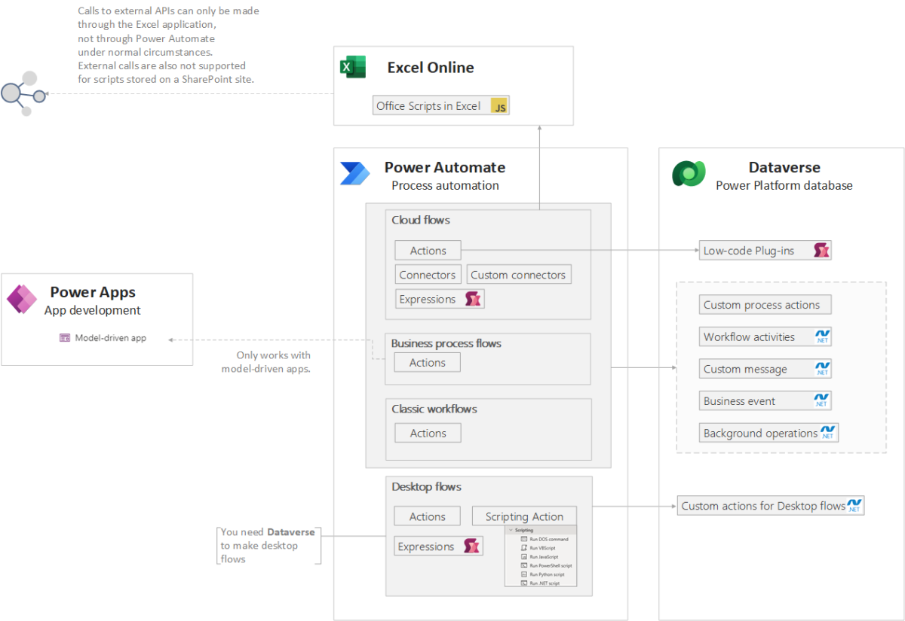

## Power Automate

### Contents

1. [Power Platform? I'm a developer!](index.md)
1. [Power Apps](powerApps.md)
1. **Power Automate**
1. [Dataverse](Dataverse.md)

Power Automate **[Cloud flows](https://powerautomate.microsoft.com/en-us/digital-process-automation/) are always asynchronous**, while **Classic workflows** may be **either background (asynchronous) or real-time (synchronous)** workflows. Microsoft recommends to use Cloud Flows instead of classic background workflows.

Power Automate supports **transactions through ChangeSets** which can be used with the **Dataverse** connector to perform atomic transactions. For transactions not related to Dataverse, custom rollback logic must be implemented.

Power Automate is great for [use cases](https://learn.microsoft.com/en-us/power-apps/guidance/planning/logic#power-automate-flows) where you need to run complex logic, need multiple connectors, or you don't want the user to wait for the action to finish. Consider it if:

- Logic needs to run across multiple connectors.
- You're creating an approval process.
Output is being produced in another format.
- You want to reduce dependency on device-side processing power.
- The process is well understood and consistent, runs frequently and there's a potential ROI
- High risk and/or impact of a failure could be mitigated through automation.

It's [recommended to build separate flows](https://learn.microsoft.com/en-us/power-automate/guidance/planning/separate-flows) instead of a single automation that covers the entire process.

> Key developer extensibility points
>
> - Create custom connectors to communicate to your external data sources and services. A custom connector is a wrapper around a REST API and can be created using tools like Azure Functions and Azure API Management
> - Use workflow definition functions to build complex expressions
>
>Source: [Introduction to Microsoft Power Platform for developers](https://learn.microsoft.com/en-us/power-platform/developer/get-started#power-apps)

## Summary of extensibility options in Power Automate

|||Cloud Flows|Desktop Flows|Business Process Flow|Classic workflows|
|-|-|-|-|-|-|
|[Formulas - Power Apps](https://learn.microsoft.com/en-us/power-platform/power-fx/formula-reference) |Power Fx|✅|✅Preview|❌|❌|
|[Low-code plugins](https://learn.microsoft.com/en-us/power-apps/maker/data-platform/low-code-plug-ins?tabs=instant) Preview|Power Fx, Connectors |✅|❌|❌|❌|
|[Custom process action](https://learn.microsoft.com/en-us/power-apps/maker/data-platform/create-actions)|declarative|✅|❌|✅*|✅|
|[Custom API](https://learn.microsoft.com/en-us/power-apps/developer/data-platform/custom-actions#compare-custom-process-action-and-custom-api) |.NET|✅|❌|❌|✅|
|[workflow activities/assemblies](https://learn.microsoft.com/en-us/power-apps/developer/data-platform/workflow/workflow-extensions)|.NET|✅|❌|✅|✅|
|[Custom connectors](https://learn.microsoft.com/en-us/connectors/custom-connectors/) |REST API|✅|✅|✅**|❌|
|[Office Scripts in Excel](https://learn.microsoft.com/en-us/office/dev/scripts/overview/excel)|TypeScript|✅|❌|❌|❌|
|[Custom actions for Power Automate for Desktop](https://learn.microsoft.com/en-us/power-automate/desktop-flows/create-custom-actions)|.NET|❌|✅|❌|❌|
|[Custom script](https://learn.microsoft.com/en-us/power-automate/desktop-flows/actions-reference/scripting) in Desktop flows|DOS command VBScript*** JavaScript PowerShell Python .NET |❌|✅|❌|❌|

* To allow business process flow execute the custom process action, define table entity and enable "As a Business Process Flow" in action properties 
** By using custom process action that uses custom connector 
*** VBScript is deprecated from Windows

<table border="1" cellpadding="0" cellspacing="0" valign="top" style="
 border-collapse:collapse;border-style:solid;border-color:#A3A3A3;border-width:
 1pt" >
 <tbody><tr>
  <td style="border-style:solid;border-color:#A3A3A3;border-width:1pt;
  vertical-align:top;padding:2.0pt 3.0pt 2.0pt 3.0pt">
  
Approach

  </td>
  <td style="border-style:solid;border-color:#A3A3A3;border-width:1pt;
  vertical-align:top;padding:2.0pt 3.0pt 2.0pt 3.0pt">
  
Programming
  language

  </td>
  <td style="border-style:solid;border-color:#A3A3A3;border-width:1pt;
  vertical-align:top;padding:2.0pt 3.0pt 2.0pt 3.0pt">
  
Description

  </td>
  <td style="border-style:solid;border-color:#A3A3A3;border-width:1pt;
  vertical-align:top;padding:2.0pt 3.0pt 2.0pt 3.0pt">
  
Constraints
  and Limitations

  </td>
 </tr>
 <tr>
  <td style="border-style:solid;border-color:#A3A3A3;border-width:1pt;
  vertical-align:top;padding:2.0pt 3.0pt 2.0pt 3.0pt">
  
<a href="https://learn.microsoft.com/en-us/power-platform/power-fx/formula-reference-overview">Formulas</a>

  </td>
  <td style="border-style:solid;border-color:#A3A3A3;border-width:1pt;
  vertical-align:top;padding:2.0pt 3.0pt 2.0pt 3.0pt">
  
PowerFx

  </td>
  <td style="border-style:solid;border-color:#A3A3A3;border-width:1pt;
  vertical-align:top;padding:2.0pt 3.0pt 2.0pt 3.0pt">
  
Formulas
  combine many elements, for example:

  <ul type="disc" style="direction:ltr;unicode-bidi:embed;margin-top:0in;
   margin-bottom:0in">
   <li style="margin-top:0;margin-bottom:0;vertical-align:middle" lang="en-US">Functions:&nbsp;take parameters,
       perform an operation, and return a value. Functions are modeled after
       Microsoft Excel functions. Some functions have side effects, such
       as&nbsp;SubmitForm, which are appropriate only in a&nbsp;<a href="https://learn.microsoft.com/en-us/power-apps/maker/canvas-apps/working-with-formulas-in-depth">behavior formula</a>&nbsp;such
       as&nbsp;Button.OnSelect.</li>
   <li style="margin-top:0;margin-bottom:0;vertical-align:middle" lang="en-US">Signals&nbsp;return information about the
       environment.
       For example,&nbsp;<a href="https://learn.microsoft.com/en-us/power-platform/power-fx/reference/signals">Location</a>&nbsp;returns the device's
       current GPS coordinates. Signals don't take parameters or have side
       effects.</li>
   <li style="margin-top:0;margin-bottom:0;vertical-align:middle" lang="en-US">Enumerations&nbsp;return a pre-defined
       constant value. For example,&nbsp;<a href="https://learn.microsoft.com/en-us/power-platform/power-fx/reference/function-colors">Color</a>&nbsp;is an enumeration
       that has pre-defined values for&nbsp;Color.Red,&nbsp;Color.Blue, and so
       forth. </li>
   <li style="margin-top:0;margin-bottom:0;vertical-align:middle" lang="en-US">Named
       operators,
       such as&nbsp;<a href="https://learn.microsoft.com/en-us/power-platform/power-fx/reference/operators#thisitem-thisrecord-and-as-operators">ThisItem</a>&nbsp;and&nbsp;<a href="https://learn.microsoft.com/en-us/power-platform/power-fx/reference/operators#self-and-parent-operators">Self</a>, provide access to
       information from within a container.</li>
  </ul>
  
&nbsp;

  </td>
  <td style="border-style:solid;border-color:#A3A3A3;border-width:1pt;
  vertical-align:top;padding:2.0pt 3.0pt 2.0pt 3.0pt">
  
Not all
  functions area available in all Power Platform components. For example <a href="https://learn.microsoft.com/en-us/power-platform/power-fx/reference/function-ismatch">regular
  expressions</a> like IsMatch, Match, and MatchAll
  are available in both, Canvas and Model-driven apps but not in Power Automate.

  
&nbsp;

  
&nbsp;

  </td>
 </tr>
 <tr>
  <td style="border-style:solid;border-color:#A3A3A3;border-width:1pt;
  vertical-align:top;padding:2.0pt 3.0pt 2.0pt 3.0pt">
  
<a href="https://learn.microsoft.com/en-us/power-apps/maker/data-platform/low-code-plug-ins?tabs=instant">Low-code
  Plug-ins</a>

  </td>
  <td style="border-style:solid;border-color:#A3A3A3;border-width:1pt;
  vertical-align:top;padding:2.0pt 3.0pt 2.0pt 3.0pt">
  
PowerFx

  </td>
  <td style="border-style:solid;border-color:#A3A3A3;border-width:1pt;
  vertical-align:top;padding:2.0pt 3.0pt 2.0pt 3.0pt">
  
With
  the low-code plug-ins, users can create plug-ins with minimal or no coding
  required, and without the need for compiling solution and manual
  registration.

  
Low-code
  plug-ins are stored within a Dataverse database and can be seamlessly
  integrated into Power Apps and Power Automate. The behavior of the workflow
  is defined using the Power Fx expression language and can directly connect
  with Dataverse business data and external data sources through Power Platform
  connectors

  
Idea: You may use low-code plugins as a way
  to execute <a href="https://learn.microsoft.com/en-us/power-platform/power-fx/reference/function-ismatch">regular
  expressions</a> in Power Automate.

  
&nbsp;

  
<a href="https://learn.microsoft.com/en-us/power-automate/desktop-flows/power-fx">Power
  Fx in desktop flows</a>

  </td>
  <td style="border-style:solid;border-color:#A3A3A3;border-width:1pt;
  vertical-align:top;padding:2.0pt 3.0pt 2.0pt 3.0pt">
  
Low-code
  plug-ins are stored within a Dataverse database and are created using <a href="https://learn.microsoft.com/en-us/power-apps/maker/data-platform/low-code-plug-ins?tabs=instant#prerequisites-for-creating-a-low-code-plug-in">Dataverse
  accelerator app</a>, which must be installed in the environment.&nbsp;

  
<cite style="margin:0in;font-family:Calibri;font-size:9.0pt;color:#595959" lang="en-US">&nbsp;</cite>

  
<a href="https://learn.microsoft.com/en-us/power-apps/maker/data-platform/low-code-plug-ins?tabs=instant#limitations">Limitations</a>

  </td>
 </tr>
 <tr>
  <td style="border-style:solid;border-color:#A3A3A3;border-width:1pt;
  vertical-align:top;padding:2.0pt 3.0pt 2.0pt 3.0pt">
  
<a href="https://learn.microsoft.com/en-us/power-apps/maker/data-platform/create-actions">Custom
  process action</a>

  
&nbsp;

  
&nbsp;

  </td>
  <td style="border-style:solid;border-color:#A3A3A3;border-width:1pt;
  vertical-align:top;padding:2.0pt 3.0pt 2.0pt 3.0pt">
  
declarative

  </td>
  <td style="border-style:solid;border-color:#A3A3A3;border-width:1pt;
  vertical-align:top;padding:2.0pt 3.0pt 2.0pt 3.0pt">
  
<a href="https://learn.microsoft.com/en-us/power-apps/developer/data-platform/workflow-custom-actions">Custom
  process actions</a>, also known as Custom actions, allow creating&nbsp;custom
  reusable actions&nbsp;that encapsulate specific business logic, and may be
  invoked directly from a workflow. 

  
The
  business logic of a custom process action is implemented using a workflow.
  When you create a custom process action, the associated real-time workflow is
  automatically registered to execute in the main operation stage of the
  message execution pipeline.

  
They
  are stored in Dataverse and may use a context of a table, or be defined as
  global.

  
&nbsp;

  
See
  Dataverse section for a more detailed description

  </td>
  <td style="border-style:solid;border-color:#A3A3A3;border-width:1pt;
  vertical-align:top;width:6.5368in;padding:2.0pt 3.0pt 2.0pt 3.0pt">
  
To
  allow business process flow execute the custom process action, define table
  entity and enable "As a Business Process Flow"&nbsp;in action
  properties 

  
&nbsp;

  </td>
 </tr>
 <tr>
  <td style="border-style:solid;border-color:#A3A3A3;border-width:1pt;
  vertical-align:top;padding:2.0pt 3.0pt 2.0pt 3.0pt">
  
<a href="https://learn.microsoft.com/en-us/power-apps/developer/data-platform/custom-api">Custom
  API</a> 

  </td>
  <td style="border-style:solid;border-color:#A3A3A3;border-width:1pt;
  vertical-align:top;padding:2.0pt 3.0pt 2.0pt 3.0pt">
  
.NET

  </td>
  <td style="border-style:solid;border-color:#A3A3A3;border-width:1pt;
  vertical-align:top;padding:2.0pt 3.0pt 2.0pt 3.0pt">
  
Custom
  API is a newer way to define custom messages with many advantages for
  developers. If you do not intend to use the no-code capabilities that custom
  process actions provide to configure business logic, custom API provides
  better capabilities for developers to create their own messages. 

  
&nbsp;

  
See
  Dataverse section for a more detailed description

  </td>
  <td style="border-style:solid;border-color:#A3A3A3;border-width:1pt;
  vertical-align:top;padding:2.0pt 3.0pt 2.0pt 3.0pt">
  
<a href="https://learn.microsoft.com/en-us/power-apps/developer/data-platform/custom-actions#compare-custom-process-action-and-custom-api">Compare
  Custom Process Action and custom API</a>

  </td>
 </tr>
 <tr>
  <td style="border-style:solid;border-color:#A3A3A3;border-width:1pt;
  vertical-align:top;padding:2.0pt 3.0pt 2.0pt 3.0pt">
  
<a href="https://learn.microsoft.com/en-us/power-apps/developer/data-platform/workflow/workflow-extensions">workflow
  activities/assemblies</a>

  </td>
  <td style="border-style:solid;border-color:#A3A3A3;border-width:1pt;
  vertical-align:top;padding:2.0pt 3.0pt 2.0pt 3.0pt">
  
.NET

  </td>
  <td style="border-style:solid;border-color:#A3A3A3;border-width:1pt;
  vertical-align:top;padding:2.0pt 3.0pt 2.0pt 3.0pt">
  
As
  reusable components, workflow extensions can be added to any workflow or
  custom action.&nbsp;

  
See
  Dataverse section for a more detailed description

  </td>
  <td style="border-style:solid;border-color:#A3A3A3;border-width:1pt;
  vertical-align:top;padding:2.0pt 3.0pt 2.0pt 3.0pt">
  
&nbsp;

  </td>
 </tr>
 <tr>
  <td style="border-style:solid;border-color:#A3A3A3;border-width:1pt;
  vertical-align:top;padding:2.0pt 3.0pt 2.0pt 3.0pt">
  
<a href="https://learn.microsoft.com/en-us/connectors/custom-connectors/">Custom
  connectors</a>

  </td>
  <td style="border-style:solid;border-color:#A3A3A3;border-width:1pt;
  vertical-align:top;padding:2.0pt 3.0pt 2.0pt 3.0pt">
  
REST
  API

  </td>
  <td style="border-style:solid;border-color:#A3A3A3;border-width:1pt;
  vertical-align:top;padding:2.0pt 3.0pt 2.0pt 3.0pt">
  
Use to
  communicate to your external data sources and services. A custom connector is
  a wrapper around a REST API and can be created using tools like Azure
  Functions and Azure API Management

  
&nbsp;

  
New
  connectors—both Mi
rosoft
  first party and third party—are
  added constantly, and as an administrator you should be aware of new
  connectors and ensure they are classified accordingly in your&nbsp;<a href="https://learn.microsoft.com/en-us/power-platform/admin/wp-data-loss-prevention">Data loss prevention (DLP) policies</a>

  </td>
  <td style="border-style:solid;border-color:#A3A3A3;border-width:1pt;
  vertical-align:top;padding:2.0pt 3.0pt 2.0pt 3.0pt">
  
Power Platform only supports REST API,
  while Logic Apps also supports SOAP APIs.

  
&nbsp;

  
Custom connectors are not supported
  in Power Pages. However, you can use Dataverse
  Dataflows to render data from a REST API to Power Pages. That data
  will then need to either be replicated to Dataverse, or presented as a
  Virtual Table.

  
&nbsp;

  
<a href="https://learn.microsoft.com/en-us/connectors/custom-connectors/faq">Custom
  connector FAQ for Azure Logic Apps, Power Automate, and Power Apps</a>

  
<a href="https://learn.microsoft.com/en-us/connectors/custom-connectors/customconnectorssolutions#known-limitations">Known
  limitations</a>

  </td>
 </tr>
 <tr>
  <td style="border-style:solid;border-color:#A3A3A3;border-width:1pt;
  vertical-align:top;padding:2.0pt 3.0pt 2.0pt 3.0pt">
  
<a href="https://learn.microsoft.com/en-us/office/dev/scripts/develop/power-automate-integration?tabs=run-script">Office
  Script in Excel</a>

  </td>
  <td style="border-style:solid;border-color:#A3A3A3;border-width:1pt;
  vertical-align:top;padding:2.0pt 3.0pt 2.0pt 3.0pt">
  
TypeScript

  </td>
  <td style="border-style:solid;border-color:#A3A3A3;border-width:1pt;
  vertical-align:top;padding:2.0pt 3.0pt 2.0pt 3.0pt">
  
Office
  Scripts in Excel let you automate your day-to-day tasks. You may record
  manual steps, or write your script on your own. 

  
&nbsp;

  
Although
  it's meant for editing workbook, you don't have to access Excel contents at
  all. Instead, you may use Office Script in Excel to execute your TypeScript
  functions, to execute any logic that is not available using Power Fx.

  
&nbsp;

  </td>
  <td style="border-style:solid;border-color:#A3A3A3;border-width:1pt;
  vertical-align:top;padding:2.0pt 3.0pt 2.0pt 3.0pt">
  
To use&nbsp;<a href="https://learn.microsoft.com/en-us/connectors/excelonlinebusiness">Excel
  Online (Business) connector</a> (standard) in Power Automate you must have a <a href="https://learn.microsoft.com/en-us/office/dev/scripts/develop/power-automate-integration?tabs=run-script#:~:text=on%20workbook%20comments.-,Important,-To%20use%20Office">business
  license of Microsoft 365</a>. 

  
Excel Scripts may be saved either in <a href="https://learn.microsoft.com/en-us/office/dev/scripts/overview/script-storage">OneDrive
  or in a SharePoint</a> site.

  
Requests and responses in Excel are limited
  to 5MB, and the maximum size of
  parameters passed to the Run script action is 30,000,000 bytes (28.6MB).

  
&nbsp;

  
No external calls from a script

  
&nbsp;

  
&nbsp;

  
&nbsp;

  
<a href="https://learn.microsoft.com/en-us/office/dev/scripts/develop/power-automate-integration?tabs=run-script#data-security-in-office-scripts-with-power-automate">Data
  security in Office Scripts with Power Automate</a>

  
<a href="https://learn.microsoft.com/en-us/power-automate/limits-and-config">Limits
  and configuration in Power Automate</a>

  
<a href="https://learn.microsoft.com/en-us/connectors/excelonlinebusiness/#known-issues-and-limitations">Known
  issues and limitations for the Excel Online (Business) connector</a>

  
<a href="https://learn.microsoft.com/en-us/office/dev/scripts/testing/platform-limits?tabs=business#power-automate-specific-restrictions">Power
  Automate specific restrictions</a>

  
<a href="https://learn.microsoft.com/en-us/office/dev/scripts/develop/typescript-restrictions">TypeScript
  restrictions in Office Scripts</a>

  </td>
 </tr>
 <tr>
  <td style="border-style:solid;border-color:#A3A3A3;border-width:1pt;
  vertical-align:top;padding:2.0pt 3.0pt 2.0pt 3.0pt">
  
<a href="https://learn.microsoft.com/en-us/power-automate/desktop-flows/custom-actions">Custom
  actions for Power Automate for Desktop</a>

  </td>
  <td style="border-style:solid;border-color:#A3A3A3;border-width:1pt;
  vertical-align:top;padding:2.0pt 3.0pt 2.0pt 3.0pt">
  
.NET

  </td>
  <td style="border-style:solid;border-color:#A3A3A3;border-width:1pt;
  vertical-align:top;padding:2.0pt 3.0pt 2.0pt 3.0pt">
  
Custom
  actions exist at the environment level.&nbsp;

  
Custom
  actions developed by your organization and uploaded to the respective
  environments can be included in desktop flows and utilized like actions that
  belong in the standard library of automation actions.

  </td>
  <td style="border-style:solid;border-color:#A3A3A3;border-width:1pt;
  vertical-align:top;padding:2.0pt 3.0pt 2.0pt 3.0pt">
  
.dll
  files describing Custom actions, their dependency .dll files, and the .cab
  files are properly signed with a digital certificate trusted by your
  organization. The certificate should also be installed on the device under
  the trusted root certificate authority where the desktop flow with custom
  action dependencies is modified and/or executed.

  
&nbsp;

  
<a href="https://learn.microsoft.com/en-us/power-automate/desktop-flows/custom-actions#known-limitations">Known
  limitations</a>

  </td>
 </tr>
 <tr>
  <td style="border-style:solid;border-color:#A3A3A3;border-width:1pt;
  vertical-align:top;padding:2.0pt 3.0pt 2.0pt 3.0pt">
  
<a href="https://learn.microsoft.com/en-us/power-automate/desktop-flows/actions-reference/scripting">Custom
  script</a> in Desktop flows

  </td>
  <td style="border-style:solid;border-color:#A3A3A3;border-width:1pt;
  vertical-align:top;padding:2.0pt 3.0pt 2.0pt 3.0pt">
  
DOS
  command

  
VBScript *

  
JavaScript

  
PowerShell

  
Python

  
.NET

  </td>
  <td style="border-style:solid;border-color:#A3A3A3;border-width:1pt;
  vertical-align:top;padding:2.0pt 3.0pt 2.0pt 3.0pt">
  
Scripting
  actions enable you to run blocks of code and implement custom behavior in
  your desktop flows.

  </td>
  <td style="border-style:solid;border-color:#A3A3A3;border-width:1pt;
  vertical-align:top;padding:2.0pt 3.0pt 2.0pt 3.0pt">
  
To prevent unauthorized access, Windows require administrator
  rights to access protected resources. To access protected resources (such as
  files) using the scripting actions, run Power Automate with administrator
  rights. 

  
VBScript is deprecated from Windows

  </td>
 </tr>
</tbody></table>

