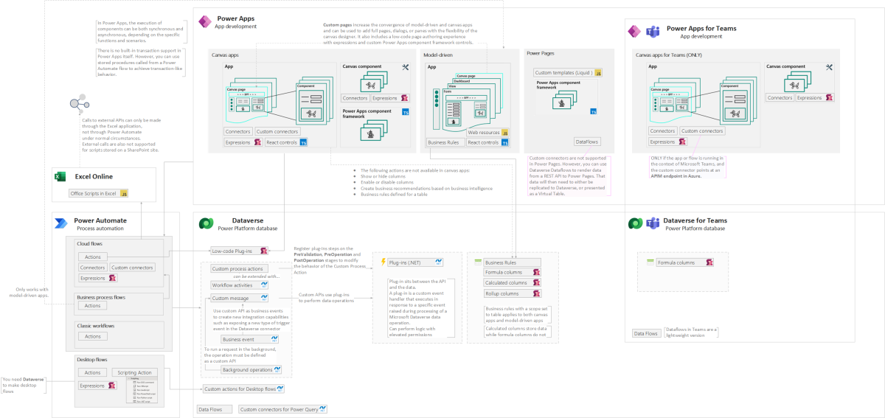

---
# this is the title
title: "Power Platform? I'm a developer!"
# this is the publishing date of your article, usually this should match "now"
date: 2024-02-08T00:00:00-04:00
# This is your name
author: "Kinga Kazala"
# This is your GitHub name
githubname: kkazala
# Don't change
categories: ["Community post"]
# Link to the thumbnail image for the post
images:
- images/myImage.png
# don't change
tags: []
# don't change
type: "regular"
---

## Power Platform? I'm a developer!

Microsoft makes it clear:  when building Power Platform solutions, we should first evaluate Platform capabilities and use as much of low-code as possible.
This means learning which controls are available, how to use PowerFx (if you ever wrote Excel formula, you will feel at home), deciding which logic should be executed client side and when it's time to use Power Automate or Dataverse capabilities instead.

Make sure you are familiar with [Where to place logic: Canvas apps, model-driven apps, Microsoft Dataverse, or Power Automate flows?](https://learn.microsoft.com/en-us/power-apps/guidance/planning/logic) and keep an eye on the [Release plans for Dynamics 365, Power Platform, and Cloud for Industry - Dynamics 365](https://learn.microsoft.com/en-us/dynamics365/release-plans/) to learn about new features as they are prepared for release.

>As a developer, you should approach apps on Microsoft Power Platform from the perspective that **writing code […] should be** considered as an **exception** to no-code and low-code approaches. […]
Microsoft Power Platform often implements something in a particular way that benefits the platform. This may be different if you're used to doing it in custom application code. It isn't uncommon for developers that are new to building Microsoft Power Platform solutions to try to customize the platform the way they used to build custom apps previously. This should be avoided when possible and you should try to take advantage of what the platform does well, rather than try to change it to what you are used to doing.
>
>Source: [Determine when to configure or when to code](https://learn.microsoft.com/en-us/training/modules/introduction-power-platform-extend/configure-code)

But what happens if after extensive evaluation, you see that existing controls or declarative process doesn't meet your requirements? As a developer you have several options.

Depending on [where you want to place your logic](https://learn.microsoft.com/en-us/power-apps/guidance/planning/logic), you may start coding using either Power Fx, Typescript or .NET.

Yes, I wrote "coding in Power Fx".  It's getting better and better, offering [error handling](https://learn.microsoft.com/en-us/power-platform/power-fx/error-handling) (preview feature at the time of this writing), [assertion](https://learn.microsoft.com/en-us/power-platform/power-fx/reference/function-assert), [regular expressions](https://learn.microsoft.com/en-us/power-platform/power-fx/reference/function-ismatch) etc.

There are some other reasons why involving professional developer from a start is a good idea. They:

- understand and adhere to principles of [well architected framework](https://learn.microsoft.com/en-us/industry/well-architected/overview) design principles, applying them from early stages of solution design
- Instinctively follow security best practices, not only enabling solution monitoring, but also ensuring that the solution is indeed "secure by design" by using service principals and understanding the [difference](https://learn.microsoft.com/en-us/power-platform/admin/security/connect-data-sources#authenticating-to-data-sources) between implicit (app maker) and explicit (user) connectors. That's important, because one day you may find that you have been [hacked by a Power App](https://dev.to/wyattdave/ive-just-been-hacked-by-a-power-app-1fj4). Pro Power Platform developers are also more likely to invest time in learning what's new and reading technical documentation, like [Secure Implicit Connections](https://learn.microsoft.com/en-us/power-apps/maker/canvas-apps/connections-list#shared-connections--secure-implicit-connections) for example.
- will accelerate the implementation and ensure adherence to best practices in terms of design, security and governance. In cases where the pro-developer will eventually hand over the application to the technical owner with business background, they enable the citizen developers to confidently develop and maintain the application without a need for continuous involvement of technical specialists.

### Keep in mind

The low-code tooling doesn't provide a line-by-line debug experience. To troubleshoot your app, you can use [error handling](https://learn.microsoft.com/en-us/power-platform/power-fx/error-handling), or view stream of events and [source expressions](https://learn.microsoft.com/en-us/power-apps/maker/monitor-canvasapps#setting-debug-published-app) from a user's session in [Monitor](https://learn.microsoft.com/en-us/power-apps/maker/monitor-overview).
If logic spans more than one screen or is hard to read, consider other approaches that would be more maintainable. One option is Git version control (still experimental as of time of this writing) which allows you editing the formulas in the code editor of your choice.

Apart from securely storing your code, it also enables more than one person to edit a canvas app at the same time. Use existing Git tools to see version history, create and manage pull requests, and do other version control tasks.

We still need to wait for the [VS Code extension for Power Fx](https://github.com/microsoft/Power-Fx/discussions/227), though.

## Extensibility options

The image below presents a summary of all currently available options for implementing custom logic. This includes low-code like custom canvas components or business rules, and pro-code like React components, add-ins etc.
The following sections will walk you through the available options, outlining differences and wherever applicable, the limitations.

### Power Apps

**In Power Apps, the execution of components can be both synchronous and asynchronous, depending on the specific functions and scenarios.**

**There is no built-in transaction support in Power Apps itself. However, you can use stored procedures called from a Power Automate flow to achieve transaction-like behavior.**

Placing business logic in the low-code application is simpler to build, test, and has a lower maintenance cost, but it provides **limited options for reuse or to enforce consistency** across apps and automations.
Generally, you should limit this approach to **non–mission-critical, simple logic** that other applications or automations **don’t need** to use. Evaluate canvas components first and then use code components only if there is a need for more complex and advanced customization.

>Key developer extensibility points: Canvas Apps
>
>- Build custom UI components using Power Apps component framework
>- Create custom connectors to communicate to your external data sources and services. A custom connector is a wrapper around a REST API and can be created using tools like Azure Functions and Azure API Management
>
>Key developer extensibility points: Model-driven apps
>
>- Build custom UI components using Power Apps component framework
>- Implement client business logic using JavaScript and the client API
>- Build HTML web resources
>
>Key developer extensibility points: Power Pages
>
>- Custom web page templates built with HTML, CSS, and Liquid
>- Extend site integration with Dataverse with the portals Web API
>- Use Visual Studio Code and the Power Platform CLI to enable metadata editing and CI/CD (Continuous Integration/Continuous Deployment) of site configurations
>
>Source: [Introduction to Microsoft Power Platform for developers](https://learn.microsoft.com/en-us/power-platform/developer/get-started#power-apps)

#### Summary of extensibility options in Power Apps

**Canvas app formulas, model-driven form script, business rules, and Power Apps component framework** logic happens **in the user interface (cient-side)** and the user will see the result immediately.

|||Canvas Apps|Model-driven Apps|[Custom Pages](https://learn.microsoft.com/en-us/power-apps/maker/model-driven-apps/design-page-for-model-app)|Power Pages|
|-|-|-|-|-|-|
|[Formulas - Power Apps](https://learn.microsoft.com/en-us/power-platform/power-fx/formula-reference) |Power Fx|✅|✅|✅|❌|
|[Script web resources](https://learn.microsoft.com/en-us/power-apps/developer/model-driven-apps/webpage-html-web-resources) |JavaScript |❌|✅|❌|❌|
|[Low-code canvas components](https://learn.microsoft.com/en-us/power-apps/maker/canvas-apps/create-component) with [behavior formulas](https://learn.microsoft.com/en-us/power-apps/maker/canvas-apps/component-behavior)* and [component properties](https://learn.microsoft.com/en-us/power-apps/maker/canvas-apps/component-properties)|Power Fx|✅|👉|✅|❌|
|[Low-code plugins](https://learn.microsoft.com/en-us/power-apps/maker/data-platform/low-code-plug-ins?tabs=instant) (preview)|Power Fx, Connectors|✅|👉|✅|❌|
|[PowerApps component framework](https://learn.microsoft.com/en-us/power-apps/developer/component-framework/overview) (PCF)|Typescript |✅|✅|✅|✅|
|[React controls & platform libraries](https://learn.microsoft.com/en-us/power-apps/developer/component-framework/react-controls-platform-libraries) (preview)|TypeScript |✅|✅|✅|❌|
|[Custom connectors](https://learn.microsoft.com/en-us/connectors/custom-connectors/) |openAPI  |✅|👉|✅|❌|
|[Custom webpage templates](https://learn.microsoft.com/en-us/power-pages/configure/web-templates)|HTML, CSS, Liquid  |❌|❌|❌|✅|

*Behavior formulas for components (experimental): The feature to create custom behavioral properties is currently experimental. However, you can use the default OnReset property that is available on all components in your production environment.

#### Formulas

**Programming language**: Power Fx

**Description**: [Formulas](https://learn.microsoft.com/en-us/power-platform/power-fx/formula-reference)

|Approach|Programming language|Description|Constraints and Limitations|
|-|-|-|-|
|[Formulas - Power Apps](https://learn.microsoft.com/en-us/power-platform/power-fx/formula-reference)|Power Fx|Formulas combine many elements, for example: <ul><li>**Functions**: take parameters, perform an operation, and return a value. Functions are modeled after Microsoft Excel functions. Some functions have side effects, such as `SubmitForm`, which are appropriate only in a [behavior formula](https://learn.microsoft.com/en-us/power-apps/maker/canvas-apps/working-with-formulas-in-depth) such as `Button.OnSelect`.</li><li>**Signals** return information **about the environment**. For example, `Location` returns the device's current GPS coordinates. Signals don't take parameters or have side effects.</li><li>**Enumerations** return a pre-defined constant value. For example, `Color` is an enumeration that has pre-defined values for `Color.Red`, `Color.Blue`, and so forth.</li><li>**Named operators**, such as `ThisItem` and `Self`, provide access to information from within a container.</li></ul>||
|||||
|||||
|||||
|||||
