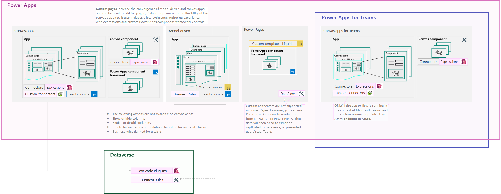

## Power Apps

### Contents

1. [Power Platform? I'm a developer!](index.md)
1. **Power Apps**
1. [Power Automate](./PowerAutomate.md)
1. [Dataverse](Dataverse.md)

**In Power Apps, the execution of components can be both synchronous and asynchronous, depending on the specific functions and scenarios.**

**There is no built-in transaction support in Power Apps itself. However, you can use stored procedures called from a Power Automate flow to achieve transaction-like behavior.**

Placing business logic in the low-code application is simpler to build, test, and has a lower maintenance cost, but it provides **limited options for reuse or to enforce consistency** across apps and automations.
Generally, you should limit this approach to **non–mission-critical, simple logic** that other applications or automations **don’t need** to use. Evaluate canvas components first and then use code components only if there is a need for more complex and advanced customization.

>Key developer extensibility points: Canvas Apps
>
>- Build custom UI components using Power Apps component framework
>- Create custom connectors to communicate to your external data sources and services. A custom connector is a wrapper around a REST API and can be created using tools like Azure Functions and Azure API Management
>
>Key developer extensibility points: Model-driven apps
>
>- Build custom UI components using Power Apps component framework
>- Implement client business logic using JavaScript and the client API
>- Build HTML web resources
>
>Key developer extensibility points: Power Pages
>
>- Custom web page templates built with HTML, CSS, and Liquid
>- Extend site integration with Dataverse with the portals Web API
>- Use Visual Studio Code and the Power Platform CLI to enable metadata editing and CI/CD (Continuous Integration/Continuous Deployment) of site configurations
>
>Source: [Introduction to Microsoft Power Platform for developers](https://learn.microsoft.com/en-us/power-platform/developer/get-started#power-apps)

## Summary of extensibility options in Power Apps

In **Canvas app formulas, model-driven form script, business rules, and Power Apps component framework**, logic happens **in the user interface (cient-side)** and the user will see the result immediately.

|||Canvas Apps|Model-driven Apps|[Custom Pages](https://learn.microsoft.com/en-us/power-apps/maker/model-driven-apps/design-page-for-model-app)|Power Pages|
|-|-|-|-|-|-|
|[Formulas - Power Apps](https://learn.microsoft.com/en-us/power-platform/power-fx/formula-reference) |Power Fx|✅|✅|✅|❌|
|[Script web resources](https://learn.microsoft.com/en-us/power-apps/developer/model-driven-apps/webpage-html-web-resources) |JavaScript |❌|✅|❌|❌|
|[Low-code canvas components](https://learn.microsoft.com/en-us/power-apps/maker/canvas-apps/create-component) with [behavior formulas](https://learn.microsoft.com/en-us/power-apps/maker/canvas-apps/component-behavior)* and [component properties](https://learn.microsoft.com/en-us/power-apps/maker/canvas-apps/component-properties)|Power Fx|✅|👉|✅|❌|
|[Low-code plugins](https://learn.microsoft.com/en-us/power-apps/maker/data-platform/low-code-plug-ins?tabs=instant) Preview|Power Fx, Connectors|✅|👉|✅|❌|
|[PowerApps component framework](https://learn.microsoft.com/en-us/power-apps/developer/component-framework/overview) (PCF)|Typescript |✅|✅|✅|✅|
|[React controls & platform libraries](https://learn.microsoft.com/en-us/power-apps/developer/component-framework/react-controls-platform-libraries) Preview|TypeScript |✅|✅|✅|❌|
|[Custom connectors](https://learn.microsoft.com/en-us/connectors/custom-connectors/) |openAPI  |✅|👉|✅|❌|
|[Custom webpage templates](https://learn.microsoft.com/en-us/power-pages/configure/web-templates)|HTML, CSS, Liquid  |❌|❌|❌|✅|

 *Behavior formulas for components (experimental): The feature to create custom behavioral properties is currently experimental. However, you can use the default OnReset property that is available on all components in your production environment.

<table >
 <tbody><tr>
  <td>Approach</td>
  <td>
  Programming language
  </td>
  <td>Description
  </td>
  <td>Constraints and limitations</td>
 </tr>
 <tr>
  <td><a href="https://learn.microsoft.com/en-us/power-platform/power-fx/formula-reference-overview">Formulas</a>
  </td>
  <td>Power Fx</td>
  <td>
  
Formulas combine many elements, for example:

  <ul>
   <li ><b>Functions:</b>take parameters, perform an operation, and return a value. Functions are modeled after Microsoft Excel functions. Some functions have side effects, such as SubmitForm, which are appropriate only in a <a href="https://learn.microsoft.com/en-us/power-apps/maker/canvas-apps/working-with-formulas-in-depth">behavior formula</a>such as Button.OnSelect.</li>
   <li><b>Signals</b> return information about the environment. For example, <a href="https://learn.microsoft.com/en-us/power-platform/power-fx/reference/signals">Location</a> returns the device's current GPS coordinates. Signals don't take parameters or have side effects.</li>
   <li ><b>Enumerations</b> return a pre-defined constant value. For example,<a href="https://learn.microsoft.com/en-us/power-platform/power-fx/reference/function-colors">Color</a> is an enumeration that has pre-defined values for Color.Red, Color.Blue, and so forth.</li>
   <li ><>Named operators</>, such as <a href="https://learn.microsoft.com/en-us/power-platform/power-fx/reference/operators#thisitem-thisrecord-and-as-operators">ThisItem</a> and<a href="https://learn.microsoft.com/en-us/power-platform/power-fx/reference/operators#self-and-parent-operators">Self</a>, provide access to information from within a container.</li>
  </ul>
  </td>
  <td>
  
Not all functions area available in all Power Platform components. See <a href="https://learn.microsoft.com/en-us/power-platform/power-fx/formula-reference">Formula reference - Power Apps - Power Platform | Microsoft Learn</a> for a list of formulas available in Power Apps.

  
In model-driven apps, Power Fx can be <a href="https://learn.microsoft.com/en-us/power-apps/maker/model-driven-apps/page-Power Fx-in-model-app">used in custom pages</a> to add notifications and navigate between pages. However,
  <b>some Power Fx functions are </b><a href="https://learn.microsoft.com/en-us/power-apps/maker/model-driven-apps/commanding-use-Power Fx#functions-not-supported"><b>not supported</b> with commanding</a> in model-driven apps. 

  </td>
 </tr>
 <tr>
  <td><a href="https://learn.microsoft.com/en-us/power-apps/developer/model-driven-apps/web-resources">Web resources</a></td>
  <td>JavaScript
  </td>
  <td>You can use JavaScript in the following areas of <b>Model-driven apps:</b>
  <ul>
   <li >Form Script event handlers: a form loads, data is changed in a column or an item within the form,
       data is saved in a form</li>
   <li >Command bar (ribbon) commands</li>
   <li >Table view/card view customization</li>
   <li >Web resources and IFRAMEs</li>
   <li >Sitemap</li>
  </ul>
  
<a href="https://learn.microsoft.com/en-us/power-apps/developer/model-driven-apps/client-scripting">Client scripting</a> should <b>NOT</b> be your first choice for applying custom business process logic in model-driven app forms. Consider using Business rules (described later in the <b>Dataverse</b> section) first because they are easy to understand and implement for a non-developer, and they can be included as part of a Dataverse solution for deployment in production.

  
Like all web resources, JavaScript web resources <a href="https://learn.microsoft.com/en-us/power-apps/developer/model-driven-apps/script-jscript-web-resources">use the model-driven apps security context</a>. Only licensed users who have the   necessary privileges can access them.

  </td>
  <td>
  
There is <b>no</b> type of<b> web resource</b> that <b>supports</b>  the capabilities of an <b>ASP.NET(.aspx)</b>  page to execute<b> code on the server</b>. Web resources are<b> limited to static files</b>  or files that are <b>processed in the browser</b>.
  A web resource <b>can contain code</b> that is  <b>processed in the browser</b> to<b> execute web service calls</b> to interact with  Dataverse data.

  
The maximum size of files that can be uploaded is determined by the  Organization.MaxUploadFileSize property. The default setting is 5 MB.

  
Source:  <a href="https://learn.microsoft.com/en-us/power-apps/developer/model-driven-apps/web-resources#limitations-of-web-resources">Limitations
  of web resources</a>

  </td>
 </tr>
 <tr>
  <td><a href="https://learn.microsoft.com/en-us/power-apps/maker/canvas-apps/create-component">Low-code canvas components</a>
  </td>
  <td>Power Fx</td>
  <td>
  
Components are reusable building blocks for canvas apps so that app makers can create custom controls to use inside an app, or across apps using a <a href="https://learn.microsoft.com/en-us/power-apps/maker/canvas-apps/component-library">component library</a>. Components can use advanced features such as custom properties  and enable complex capabilities. 

  
Canvas components can also be used in model-driven apps using custom pages and  component library: <a href="https://learn.microsoft.com/en-us/power-apps/maker/model-driven-apps/page-canvas-components">Add  canvas components to a custom page in a model-driven app</a>

  </td>
  <td>
  
<a href="https://learn.microsoft.com/en-us/power-apps/maker/canvas-apps/create-component#known-limitations">Known limitations</a>

  
Nested support: you can't add a low-code component inside another low-code component, even when using different types of components.

  
<a href="https://learn.microsoft.com/en-us/power-apps/maker/canvas-apps/component-properties">Component properties</a> like Function, Action and Event are still experimental at the time of writing.

  </td>
 </tr>
 <tr>
  <td><a href="https://learn.microsoft.com/en-us/power-apps/maker/data-platform/low-code-plug-ins?tabs=instant">Low-code Plug-ins</a>
  </td>
  <td>
  
Power Fx

  </td>
  <td>
  
With the low-code plug-ins, you can create plug-ins with minimal or no coding  required, and without the need for compiling solution and manual registration.

  
Low-code   plug-ins are stored within a Dataverse database and can be seamlessly  integrated into Power Apps and Power Automate. They are defined using the Power Fx expression language and can directly connect   with Dataverse business data and external data sources through Power Platform connectors. 

   
Running server-side, they reduce client-side workload

  
<a href="https://learn.microsoft.com/en-us/power-apps/maker/data-platform/low-code-plug-ins?tabs=instant#benefits-of-server-side-logic">Benefits of server-side logic</a>

  </td>
  <td>
  
Low-code plug-ins are stored within a Dataverse database and are created using <a href="https://learn.microsoft.com/en-us/power-apps/maker/data-platform/low-code-plug-ins?tabs=instant#prerequisites-for-creating-a-low-code-plug-in">Dataverse accelerator app</a>, which must be installed in the environment. All new environments have the Dataverse accelerator app automatically installed as of October 1st 2023.

   
Use of low-code plugins in your solution requires Premium licenses.

  
<a href="https://learn.microsoft.com/en-us/power-apps/maker/data-platform/low-code-plug-ins?tabs=instant#limitations">Limitations</a>

  </td>
 </tr>
 <tr>
  <td><a href="https://learn.microsoft.com/en-us/power-apps/developer/component-framework/overview">PowerApps component framework (PCF)</a></td>
  <td>TypeScript
  </td>
  <td>
  
Used to <b>enhance the user experience</b> in <b>forms, views, dashboards, and canvas app</b>  screens. For example:

  <ul>
   <li >replace a column on a form that displays a numeric text value with a dial or slider code component. (FIELD)</li>
   <li >transform a list into an entirely different visual experience bound to the dataset, like a Calendar or Map. (DATASET)</li>
  </ul>

The definition and implementation of code components using Power Apps component
  framework is same for both model-driven and canvas apps. The only difference between both is the configuration part.

  
Unlike HTML web resources, code components are <b>rendered
  as part of the same context and loaded at the same time</b> as any other components, providing a seamless experience for the user.

  
Developers can<b> bundle all the HTML, CSS, and TypeScript</b>
  files into a single <a href="https://learn.microsoft.com/en-us/power-apps/maker/data-platform/solutions-overview">solution</a> package file and move across environments, and also make it available via <a href="https://appsource.microsoft.com/marketplace/apps?page=1&amp;product=dynamics-365">AppSource</a>.

  
Code components can be classified into two types:

  <ul>
   <li >Code components that connect to external services or data directly via the user's browser       client and not through connectors are considered as premium. When these components are used in an app, <b>the app becomes premium</b>, and end-users are       required to have Power Apps licenses.</li>
    <li >Code components that don't       connect to external services or data are standard. When these components are used in an app that uses standard features, the app remains       standard, and end- users are required to be licensed at minimum for Office 365. </li>
   <li >Code components can be declared as premium components by adding       a `&lt;external-service-usage&gt;` node to the component's manifest file with all the external service domains this component is
       connecting to.</li>
  </ul>
  
<a href="https://learn.microsoft.com/en-us/power-apps/developer/component-framework/code-components-best-practices">Best practices and guidance for code components created using Power Apps component  framework</a>

  
<a href="https://learn.microsoft.com/en-us/powerapps/maker/model-driven-apps/page-code-components">add  code components to a custom page for your model-driven app.</a>

  </td>
  <td>
  
Microsoft  <b>Dataverse dependent APIs, including WebAPI,</b>  are <a href="https://learn.microsoft.com/en-us/power-apps/developer/component-framework/reference/"><b>not available</b></a> for Power Apps <b>canvas  applications </b>yet.

  
Code  components should <b>bundle all the code  including external library</b> content into the primary code bundle.

  
Code  components should not use the HTML web storage objects,

  
Data  stored locally on the user's browser or mobile client is not secure and not  guaranteed to be available reliably.

  
Source:  <a href="https://learn.microsoft.com/en-us/power-apps/developer/component-framework/limitations">Limitations  of Power Apps component framework - Power Apps | Microsoft Learn</a>

  </td>
 </tr>
 <tr>
  <td>
  
<a href="https://learn.microsoft.com/en-us/power-apps/developer/component-framework/react-controls-platform-libraries">React  controls &amp; platform libraries</a> (Preview)

  </td>
  <td>
  
TypeScript + React

  </td>
  <td>
  
React  controls use the same infrastructure as the Power Apps platform. This means  you do not have to package React and platform libraries individually for each   control. All controls share a common library instance and version to provide  a <b>seamless and consistent experience</b>.

  
By  re-using the existing platform React and Fluent libraries, you can expect the  following benefits:

  <ul >
   <li >Reduced control bundle size</li>
   <li >Optimized solution packaging</li>
   <li >Faster runtime       transfer, scripting and control rendering</li>
  </ul>
  
Microsoft  expects this approach to <b>become the preferred  way</b>, with all Power Apps code components being created this way after  this feature reaches general availability. 

  
<a href="https://learn.microsoft.com/en-us/power-apps/developer/component-framework/implementing-controls-using-typescript">Create  your first component</a>

  </td>
  <td>
  
React  controls &amp; platform libraries are <a href="https://learn.microsoft.com/en-us/power-apps/developer/component-framework/react-controls-platform-libraries#faq"><b>currently</b> only available</a> for canvas and  model-driven apps.

  </td>
 </tr>
 <tr>
  <td>
  
<a href="https://learn.microsoft.com/en-us/connectors/custom-connectors/">Custom  connectors</a>

  </td>
  <td>
  
REST API

  </td>
  <td>
  
Use to  communicate to your external data sources and services. A custom connector is  a wrapper around a REST API and can be created using tools like Azure  Functions and Azure API Management

  
New  connectors, both Mirosoft and third party, are  added constantly, and as an administrator you should be aware of new  connectors and ensure they are classified accordingly in your <a href="https://learn.microsoft.com/en-us/power-platform/admin/wp-data-loss-prevention">Data loss prevention (DLP) policies</a>

  </td>
  <td>
  
<b>Power Platform only supports REST API,  while </b>Logic Apps also supports SOAP APIs.

  
 

  
<b>Custom connectors are not supported</b>  in Power Pages. However, you can use <b>Dataverse  Dataflows</b> to render data from a REST API to Power Pages. That data  will then need to either be replicated to Dataverse, or presented as a  Virtual Table.

  
 

  
<a href="https://learn.microsoft.com/en-us/connectors/custom-connectors/faq">Custom  connector FAQ for Azure Logic Apps, Power Automate, and Power Apps</a>

  
<a href="https://learn.microsoft.com/en-us/connectors/custom-connectors/customconnectorssolutions#known-limitations">Known  limitations</a>

  </td>
 </tr>
</tbody></table>

