This topic is close to my heart, as it is key when working in a Power Platform CoE. 

> How can we centrally manage reusable components, such as Component Libraries, Custom Connectors, or Child Flows, and deploy them to multiple environments to further Empower Makers?

This is why I built the **Solution Deployer**!

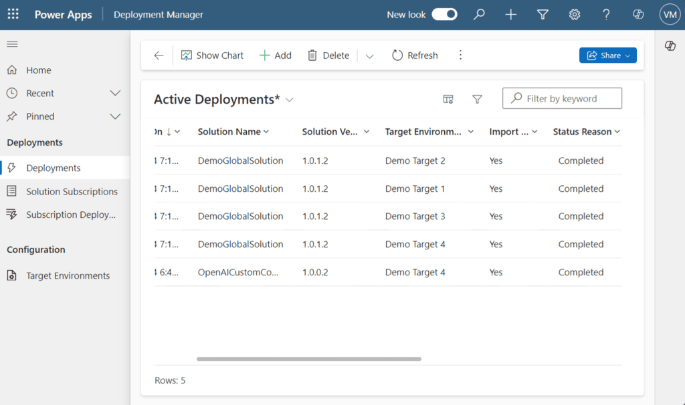

- [Acknowledgements](#acknowledgements)

- [What's already out there: Power Platform Catalog and Pipelines](#whats-already-out-there-power-platform-catalog-and-pipelines)

- [The Solution Deployer to Centrally Manage Reusable Components](#the-solution-deployer-to-centrally-manage-reusable-components)

- [Limitations and Next Steps](#limitations-and-next-steps)

## Acknowledgements

First things first, I want to share many thanks and kudos to [David Wyatt](https://dev.to/wyattdave). David wrote [this great article](https://dev.to/wyattdave/deploying-between-environments-with-power-automate-instead-of-pipelines-3fm0) about how to export/import solutions from Power Automate. I came across this article as I was just starting to focus on this topic, and have been heavily sourcing my inspiration and design from it.

## What's already out there: Power Platform Catalog and Pipelines

Being able to centrally maintain some solutions (such as a Component Libraries, Child Flows, Custom Connectors, etc...) and deploy them to several environments to accelerate Makers' productivity is not a new requirement. Many different companies and partners have been building their own solution for this, and since more recently Microsoft has been working on two promising products which can support in that direction:

- [Power Platform Catalog](https://learn.microsoft.com/power-platform/developer/catalog/?wt.mc_id=MVP_371015): this does pretty much what this post is about. It allows admins to centrally store and maintain artifacts and make them available to Makers, in-product.

- [Pipelines](https://learn.microsoft.com/power-platform/alm/pipelines/?wt.mc_id=MVP_371015): another exciting feature. Pipelines help Makers and Admins to easily deploy solutions from one environment to another, while remaining in Power Apps or Power Automate Portal.

So if Microsoft is on it and doing a pretty good job, why bother? Well, as we all anticipated, these two great features are premium and reserved to Managed Environments. You are only able to use Pipelines with managed environments, and the Catalog only allow item submissions from Managed Environments. In addition, the Catalog can only be used in a "pull" fashion: Makers have to download what they need from it. It cannot be used in a "push" way, where admins would launch the installation of solutions on multiple target environments. Regarding Pipelines, they are great for ALM, but not so adapted to deploy one solution to multiple environments at once (as far as I am aware).

From a CoE perspective, it is key to have access to global tools which can work across all environments in the tenant, whether they are managed or not.

## The Solution Deployer to Centrally Manage Reusable Components

So... What's in the box? 🎁😁🎁 This article will present the solution from a functional point of view. I share more technical information about how to set it up on my GitHub repository below.

[Download the Solution from GitHub](https://github.com/ValentinMaz/Power-Platform-Samples/tree/main/Solution%20Deployer)

I got the occasion to demo this solution in a former Power Platform community call, you can find the recording below:

### Solution Deployer Overview

The concept is simple: the Solution Deployer allows Admins to manage Solutions from a Central "Source Environment" and deploy them to multiple "Target Environments".

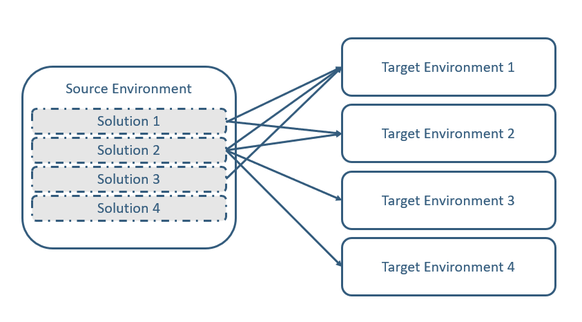

The Solution is composed of a Model Driven App, with a few Dataverse tables, cloud flows, custom pages and more. Admins using this Solution will therefore need a premium license, however there is no need for Managed Environments, making it a much cheaper option than the premium platform features.

### Configuring the Environment Variables

3 Environment Variables are essential to the Solution:

- **The Source Environment** ("SolDeployerDVSourceEnvironment"): this variable defines which Environment is used as source. Only the solutions from this environment will be available for deployment.

- **The list of Publisher Prefixes to consider** ("SolDeployerSourcePublishers"): several solutions are created by default and should not be deployed to target environments. To avoid human errors and easily filter out all the non-relevant solutions, Admins can configure this variable with a list of publisher prefixes. Only the solutions from these publishers will be available for deployments. If blank, all solutions of the Source environment will show.

- **The Notification Mailbox** ("SolDeployerEmailNotifyFrom"): this variable has to be configured with the mailbox from which the notifications will be sent. It can be the email address of the user importing the solution or the email address of a shared mailbox they have permissions over.

### Defining the Target Environments

The "Target Environments" table allows to configure the environments to which the admins should be able to deploy a solution. For each target environment, the admin should specify at least:

- A name for the Target Environment

- The Id of the Environment (showing from the Power Platform Admin Center)

- Whether this environment should receive solutions as Managed or Unmanaged

- The Target Owner: the user who will own the solution and underlying components on the target environment. They need to be a user of the target environment and will receive a notification after the solution import. It will be their role to then share the components with the relevant users on that environment.

- The Target Account Sign In: this is the user who should set up the connection references (if any) during the first import of the solution. This user can be the same as the Target Owner or different.

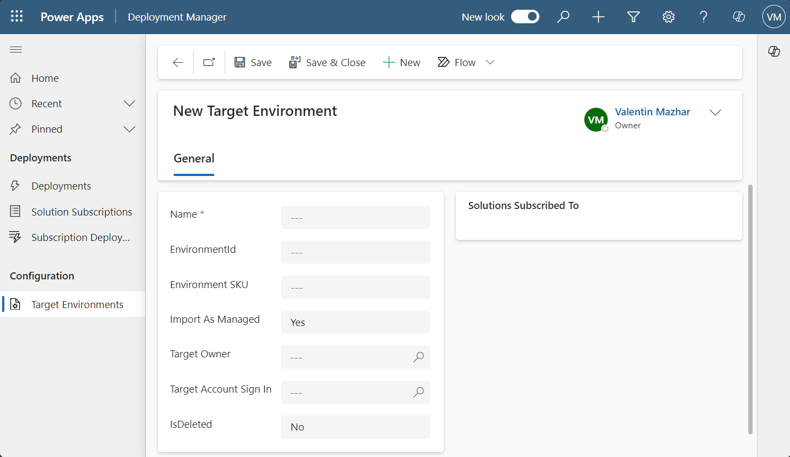

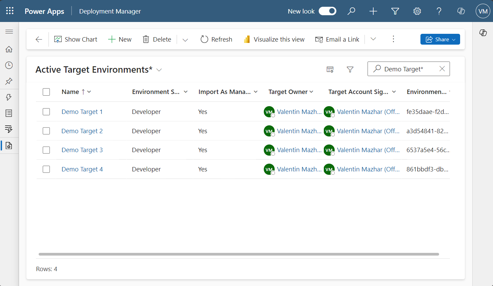

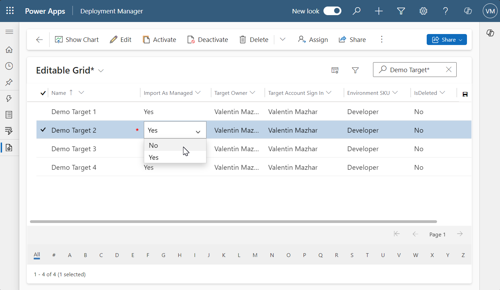

Although Admins can manually create these Target Environments from the App, this might be a tedious process for large tenants. As a more efficient alternative for the companies using the [CoE Starter Kit](https://powertricks.io/thoughts-on-the-coe-starter-kit/), I created a Dataflow which pulls the environments from the Environment table of the CoE Kit solution. This is optional as not everyone uses the CoE Kit, and I have included it in a separate solution also available on the same [GitHub Repository](https://github.com/ValentinMaz/Power-Platform-Samples/tree/main/Solution%20Deployer). Even with the Dataflow, the Admins will still need to configure the columns specific to the Solution Deployer.

### Requesting a Single Deployment

The "Deployments" table is a core table of the solution deployer to centrally manage reusable components. It comprises columns to define the Solution to export and the Target environment to import it to. Adding a row to this table automatically triggers the flows responsible for exporting and importing the solution, as well as notifying the target owner and account sign in user.

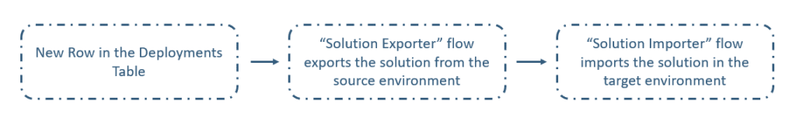

Form the Deployments view, a custom "Add" command opens a custom page on the side to request the deployment. This page allows the admins to select the solution they want to deploy, as well as the target environment they want to deploy it too.

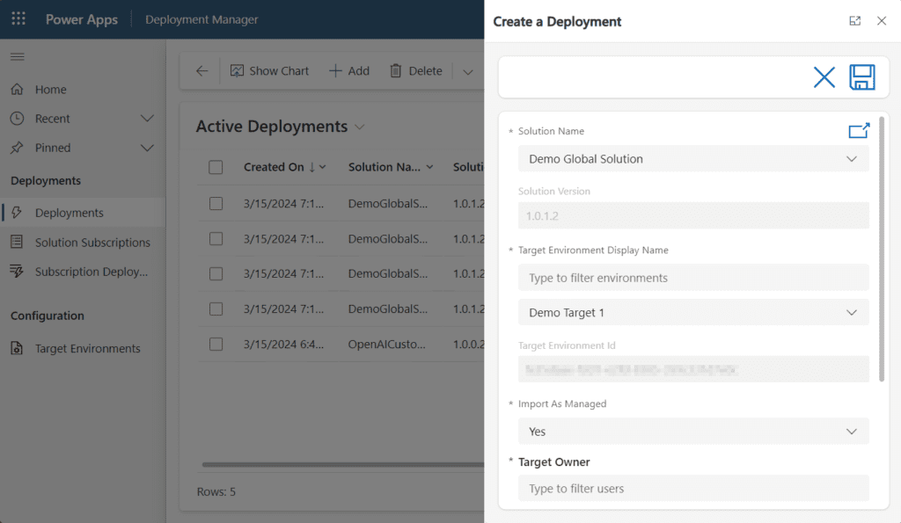

### The Flows Managing the Deployments

Once the Admin saves the entry, they land on the created deployment page. Different cloud flows will then manage the deployment and update the status at each stage:

1. **Solution Exporter**: the main function of this flow is to export the Solution as Managed and Unmanaged and attach the related packages and solution data to the record. This then updates the status reason to "Exported".

3. **Solution Importer**: this flow import the appropriate solution (managed or unmanaged according to the target environment configuration) into the target environment. After the import, the flow calls 4 child flows one after the other:
    - **Importer Child - Ownership Updater**: this child flows loop through each component in the imported solution and share them with the user selected as Target Owner
    
    - **Importer Child - Connection Checker:** this flow checks if there is any connection reference in the imported solution which does not have a connection in the target environment.
    
    - **Importer Child - Variable Checker**: same principle as for the connection references, but for the environment variable definitions mapping with environment variable values.
    
    - **Importer Child - Notifier**: this flows sends an email notification to the target owner and account sign in user to let them know that a solution was imported in the target environment. If there are any environment variables or connection references needing configuration, it will also let them know and provide them with the links and details to configure them. This would typically only be the case for the first import of a solution.

### The Concept of Solution Subscriptions

As we have seen above, the deployment table supports the deployment of a solution to one target environment. However in our case we are interested in deploying solutions to multiple environments, right? This is where the "Solution Subscriptions" table comes in. This table allows to associate a solution with multiple environments. Here again the Solution Subscription is created with a Custom Page and the "Add" command. Another custom command "Deploy" then allows to deploy the solution to all these environments.

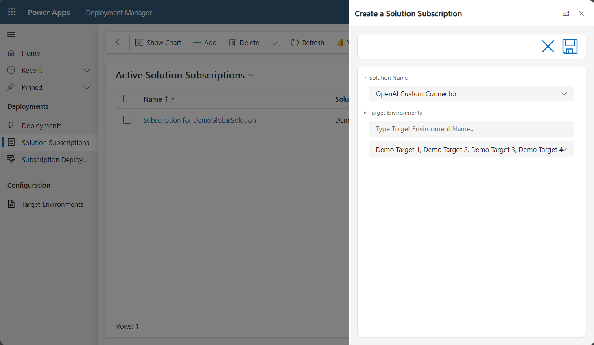

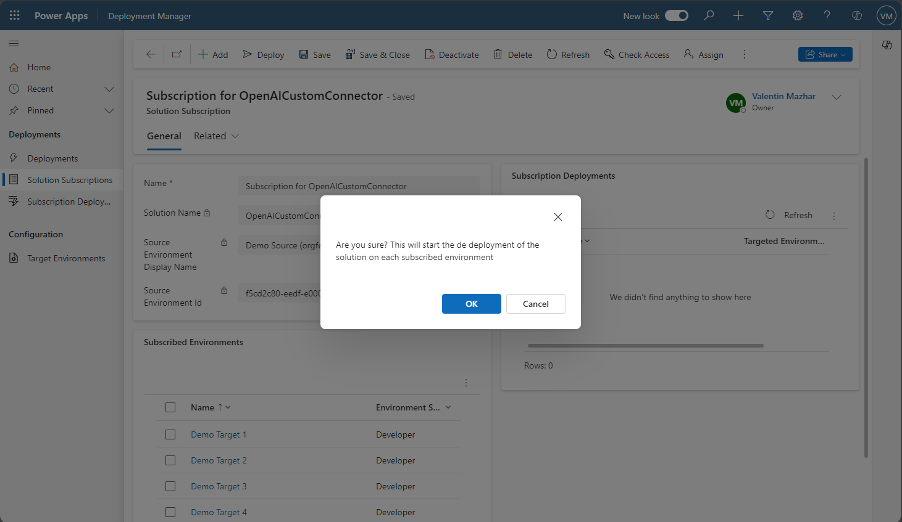

When the Admin presses the "Deploy" button, it creates a row in the "Subscription Deployments" table. This then triggers the Flow "Trigger Subscription Deployments" which will create a row in the Deployment table for each target environment associated to the subscription. This will in turn proceed to the deployment of the solution with the exporter and importer flows described above.

### The Navigation in the App

I configured the forms of the tables to be able to easily report on relevant information. For example:

- From a Target Environment, a subgrid allows to see all the Solutions the environment is subscribed to

- From a Solution Subscription, the subscribed environments are also showing in a subgrid, as well as the subscription deployments requested for this subscription

- The Subscription Deployment main form shows a subgrid of all related deployments to be able to track their status

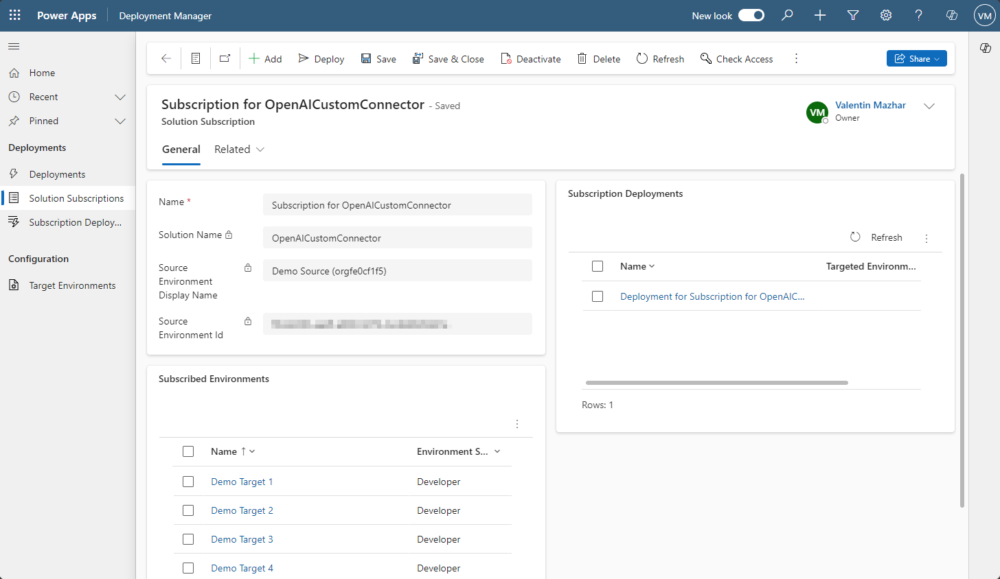

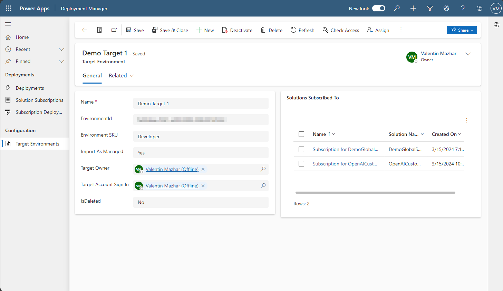

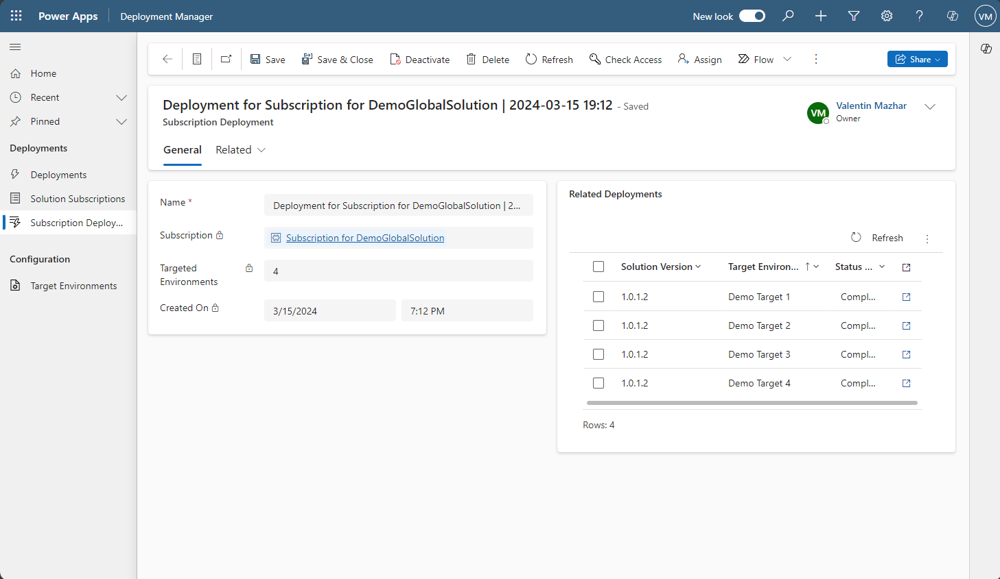

## Limitations and Next Steps

That's essentially what the Solution Deployer does, and how it can help CoEs to centrally manage reusable components! Now... There are a few limitations to keep in mind.

### Limitations

- I implemented the sharing of each solution component with the Target Owner / Account Sign In user for the Flows, Canvas Apps and Component Libraries, Custom Connectors, Environment Variable Definitions and Connection References. However:
    - There could be more component types not covered by the solution
    
    - So far I have not able to change the main owner of the custom connectors or the flows. They are only shared with the target owner as "co-owners".

- Admins will need to manually update the solution version prior to triggering a deployment to propagate the updates in the target environments. There could be an automatic increment as it is the case when exporting the solution from the platform.

- The Exporter and Importer Flows use the connection of a user who needs the Power Platform Tenant Administrator role. Using a Service Principle could be an alternative although each Target Environment would need need to have the related Application User.

- The Target Owner and Account Sign In fields are lookup columns to the Users table of the Solution Deployer Environment:
    - These users need to be present in the Environment hosting the Solution Deployer, but they do not need a security role
    
    - They also need to be present in the Target Environment or the Importer Flow will fail

- I am using the Modern Controls in the Custom Pages and they come with limitations. I had to add another text input field to filter the items of some comboboxes, since the control itself could not display all the items

- As often, this is a custom solution to workaround a platform limitation and a premium requirement. If Microsoft makes the Catalog and Pipelines more accessible for organizations, this Solution Deployer will no longer be relevant, and this would be a great thing!

Most of all, it is only a first version! Make sure to make the necessary checks prior to using on production environments.

### Next Steps

This is a first solution on this topic which can be reused and integrated with other internal processes. I tried to build it in a way which is easily adjustable and can be integrated with other solutions. Here are some ideas about what it could be used with:

- A backlog App for Makers to influence the roadmap of the CoE to create the most needed components

- A reference App for Makers to consult what solutions and components are available

- An Environment Request App so that Environment Owners can request solutions to be deploy on their Environments

- Approvals could be added in the deployment process in different ways

## Conclusion

Deploying reusable solutions and components widely is a common need for Power Platform CoEs, and it can be achieved within the platform itself, the Solution Deployer being one ready-to-use and low-cost way to do it. As always... Feedback is more than welcome!