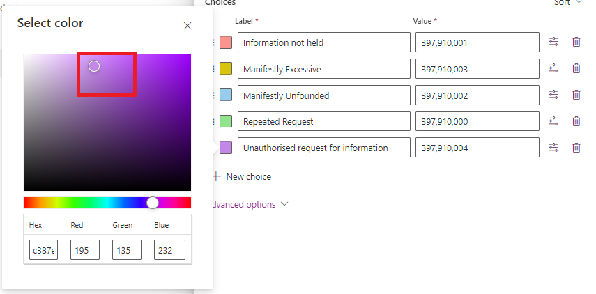
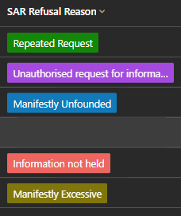

## Dark Mode

In my [earlier blog post on choice icons](https://pnp.github.io/blog/post/preparing-for-dark-mode-model-driven-app-icons/), for [dark mode in model-driven apps](https://hackingpowerplatform.com/dark-mode-for-microsoft-dataverse/), I explored how to change icon colours to suit both light and dark mode. It's not officially supported yet, but you can try it out by adding this URL flag to activate the new alternative appearance:

```text
&flags=themeOption%3Ddarkmode
```

## Caveat

Microsoft haven't revealed any details on how support for dark mode will be implemented, so the below is experimentation with how choice colours could be adjusted to work with dark mode with the current implementation in model-driven apps.

## Colour Readability and Choice Colours

[Megan Walker's blog post](https://meganvwalker.com/grid-components-in-model-driven-apps-d365/) shows how to configure and apply choice colours in model-driven app views. But what effect will dark mode have on this?

Contrast is an important factor for readability. With choice colours this is the contrast between the text colour and the choice colour.

The standard approach to readability and contrast is the WCAG AA and AAA standards, which specify  the minimum contrast between text and background for readability:

- AA: 4.5:1 or better
- AAA: 7:1 or better

The reason why pastel (light/pale) colours are favoured in the current light mode is that they enable the contrast ratios for choice colours to meet AAA level.

A contrast checker tool such as from [WebAIM](https://webaim.org/resources/contrastchecker/) can be used to check contrast ratios.

For example, the green in the below has the hex colour code #79f571, which has a contrast of 15.11:1, well above the 7:1 threshold for AAA.


## The Challenge for Dark Mode

This colour isn’t suitable for dark mode though. The contrast for #79f571 in dark mode, which works so well the light mode, is 1.38:1, well below the AA standard.


So, is it possible to select colours that suit both light and dark mode, providing enough contrast with the text colour in both modes?

### Bright Colours

The best balance I've found between light and dark modes, is to use bright colours, generally on the right, towards the top of the colour selection control in make.powerapps.



### Exceptions

There are some special cases that need to be taken into account:

- White text tends to disappear against a yellow background in dark mode. To address this, choose a darker shade of yellow. It ensures that the text remains visible:


- Conversely, black text can get lost against a blue background. Opt for a lighter shade of blue to maintain readability. Finding the right balance ensures that your content stands out regardless of the mode:


Striking the right balance between light and dark mode requires iteration, checking the colours carefully to make sure they are suitable for both situations.

The contrasts ratios for these colours are:

|Colour|Contrast ratio white|Contrast ratio black|
|--|:--:|:--:|
|Red #ED665F|4.51|4.65|
|Yellow #80760C|4.65|4.51|
|Blue #127ABA|4.51|4.64|
|Green #138808|4.61|4.55|
|Purple #A54ADE|4.53|4.63|

Just acceptable for the AA standard!

These give:



### The Gotcha

The bright colours look reasonable in dark mode, but not in light mode.

Using the browser developer tools to examine further reveals that the text colour for light mode is not black, but a dark grey - #242424. Black is #000000. (The current dark mode has white text colour #FFFFFF).

Sadly, this choice of dark grey text instead of black prevents the same colour from meeting AA standard in both light and dark mode. There are no viable colours I've found that work.

## Conclusions

In summary, the existing text colours for light and dark mode are incompatible with having one colour that is accessible in both modes.

It seems to me there are two possible ways forward:

1. Light mode is changed to use black text, allowing colour selection for WCAG AA
2. Introduce different choice colours for light and dark mode, allowing WCAG AAA

Changing the light mode text to black only just meets AA standard for a limited colour range, so it may be that the second option will need to be chosen - different choice colour selections for light and dark mode. We'll have to wait and see what Microsoft decides.
