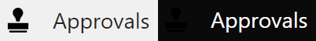

## Enabling Dark Mode

In my [previous blog post on choice colours](https://pnp.github.io/blog/post/preparing-for-dark-mode-model-driven-app-choices/), for [dark mode in model-driven apps](https://hackingpowerplatform.com/dark-mode-for-microsoft-dataverse/) I looked at how to adapt choice colours to work with both light and dark mode. While it's not officially available yet, you can experiment with it by adding a specific URL flag to enable the new alternative look:

```
&flags=themeOption%3Ddarkmode
```

## Icons and Dark Mode

The other immediate challenge is icons. When comparing light mode to dark mode in the sitemap navigation, we encounter issues with custom icons:



The standard guidance suggests using black as the icon colour (although command bar colours often vary). Unfortunately, in dark mode, these icons blend too closely with the background, making them hard to distinguish, whereas the out-of-the-box icons mostly display appropriately.

The secret lies in the fine details of Scalable Vector Graphics (SVGs). SVGs use XML syntax, allowing precise control over their properties. Let’s take a closer look at the example icon from above:


The XML for this icon is:

```XML
<?xml version="1.0" encoding="utf-8"?>
<svg xmlns="http://www.w3.org/2000/svg" height="32" width="32" viewBox="0 0 32 32">
  <g>
    <path id="path1" transform="rotate(0,16,16) translate(2.89099979400635,0) scale(1,1)  " fill="#000000" d="M1.8950181,29.607025L24.423994,29.607025 24.423994,31.103027C24.423994,31.601013,24.025009,32,23.526993,32L2.7920208,32C2.2929976,32,1.8950181,31.601013,1.8950181,31.103027z M0,19.838013L26.218001,19.838013 26.218001,27.813019 0,27.813019z M12.960014,0C16.549,0 19.538988,2.9909973 19.538988,6.57901 19.538988,8.0750122 19.041002,9.3710022 18.243,10.46701L18.043995,10.766022C17.345997,11.863007 16.647999,12.76001 16.647999,12.76001 15.052999,15.651001 15.253011,17.745026 15.253011,17.745026L10.667015,17.745026C10.667015,17.745026 10.866997,15.651001 9.2719967,12.76001 9.2719967,12.76001 8.5739996,11.863007 7.8760016,10.766022L7.6759898,10.46701 7.5769908,10.368011C6.7790176,9.3710022 6.3810074,7.9750061 6.3810074,6.57901 6.3810074,2.9909973 9.2719967,0 12.960014,0z" />
  </g>
</svg>
```

The critical element here is the fill colour inside the `<path>` tag:

```XML
<path fill="#000000">
```

This explicitly sets the fill colour to black, and whilst teh background in dark mode is a dark grey, rather than black, black doesn't give sufficient contrast.

## The Solution

Out-of-the-box icons in Dynamics apps handle both light and dark modes seamlessly. They achieve this by removing the fill colour altogether and adding a special style:

```XML
  <defs id="defs1">
    <style id="style1">.cls-1{fill:none;}</style>
  </defs>
```

To give in our example:

```XML
<?xml version="1.0" encoding="utf-8"?>
<svg xmlns="http://www.w3.org/2000/svg" height="32" width="32" viewBox="0 0 32 32">
  <defs id="defs1">
    <style id="style1">.cls-1{fill:none;}</style>
  </defs>
  <g>
    <path id="path1" transform="rotate(0,16,16) translate(2.89099979400635,0) scale(1,1)  " d="M1.8950181,29.607025L24.423994,29.607025 24.423994,31.103027C24.423994,31.601013,24.025009,32,23.526993,32L2.7920208,32C2.2929976,32,1.8950181,31.601013,1.8950181,31.103027z M0,19.838013L26.218001,19.838013 26.218001,27.813019 0,27.813019z M12.960014,0C16.549,0 19.538988,2.9909973 19.538988,6.57901 19.538988,8.0750122 19.041002,9.3710022 18.243,10.46701L18.043995,10.766022C17.345997,11.863007 16.647999,12.76001 16.647999,12.76001 15.052999,15.651001 15.253011,17.745026 15.253011,17.745026L10.667015,17.745026C10.667015,17.745026 10.866997,15.651001 9.2719967,12.76001 9.2719967,12.76001 8.5739996,11.863007 7.8760016,10.766022L7.6759898,10.46701 7.5769908,10.368011C6.7790176,9.3710022 6.3810074,7.9750061 6.3810074,6.57901 6.3810074,2.9909973 9.2719967,0 12.960014,0z" />
  </g>
</svg>
```

This modification ensures that the icons display appropriately regardless of the mode:


## Conclusion

Some users prefer to use dark mode, be it for eye comfort, battery life, or aesthetics, and although dark mode for model-driven apps isn’t officially supported yet, experimenting with it gives us a taste of what's to come. Remember to pay attention to icon colours and consider adopting the SVG technique to create a consistent and user-friendly experience.
