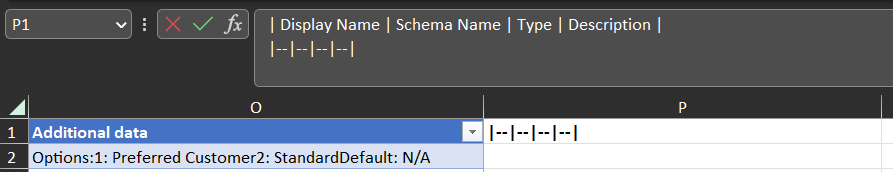

## TL;DR

This post shows how to produce Markdown or HTML documentation from an Excel file exported from the **Metadata Document Generator** XrmToolBox tool.

Adding **concat** columns in the exported spreadsheet gives content that can be included in Markdown or HTML documentation for the columns in Dataverse tables.

---

## Contents

- [Creating the Metadata spreadsheet](#creating-the-metadata-spreadsheet)  
- [Markdown Table](#markdown-table)  
- [Markdown List](#markdown-lst)  
- [HTML Table](#html-table)  
- [HTML List](#html-list)
- [Summary](#summary)
- [Acknowledgements](#acknowledgements)

---

### Creating the Metadata spreadsheet

The **Metadata Document Generator** an [XrmToolBox](https://www.xrmtoolbox.com/) tool that exports Dataverse schema / metadata to Excel spreadsheets or Word documents. 

This method of generating schema documentation uses Excel. The steps for doing this are:

Open the **Metadata Document Generator** XrmToolBox tool and select the following options:


If other options are chosen, the formulas below will need to be adjusted.

Provide the file path and select the tables you wish in include in the export - Account and Contact are selected in the examples below.


Select **Generate document** to export the file. 

Open the file when the export has completed and select the **Metadata tab**.

Select a cell that contains a value and **Ctrl-T** to create a table with the exported contents.  


Creating a table allows the contents to be filtered easily.

Tables automatically expand when contents is added in the adjacent column, and this feature is used below.

---

### Markdown Table

The [Markdown format for a table](https://www.markdownguide.org/extended-syntax/#tables) is:

``` 
| Header 1 | Header 2 |
|--|--|
| Row 1 Col 1 | Row 1 Col 2 |
| Row 2 Col 1 | Row 2 Col 2 |
```

To create a Markdown table from the spreadsheet:

Select **cell P1**, the table header cell, and **in the formula bar** paste the contents for the Markdown table header:

``` 
| Display Name | Schema Name | Type | Description |
|--|--|--|--|
```

The return between the first and second lines is important for the Markdown table as the header and '|--|--...' have to be on separate lines. This can also be typed into the formula bar using **Alt-Enter** to separate the rows.



This will add column P to the table.

Paste the following formula in **cell P2**:

```
=CONCAT("| ",E2," | ",D2," | ",F2," | ",G2," |")
```

The formula will be added to the whole of the column data cells automatically. The results are the cells included in the formula, separated by the pipe characters. These will form the rows of the table when copied and pasted into a Markdown document. 


The Excel table can then be filtered as desired. The Contact table and Schema Name begins with "address1_line" have been used to filter the contents here.

Then select the cells from column P to be added to the documentation, including P1, copy, and paste into a Markdown document such as for a DevOps Wiki:


Remove the double quotes around the table header:


And the result is:

| Display Name | Schema Name | Type | Description |
|--|--|--|--|
| Address 1: Street 1 | Address1_Line1 | Text | Type the first line of the primary address. |
| Address 1: Street 2 | Address1_Line2 | Text | Type the second line of the primary address. |
| Address 1: Street 3 | Address1_Line3 | Text | Type the third line of the primary address. |

---

### Markdown List

In some situations, a [Markdown list](https://www.markdownguide.org/basic-syntax/#unordered-lists) with just the Display Name and Description is better than a table, and a similar method can be used to the tables above. Firstly, select **cell Q2** (Q1 can be left blank for the Markdown list) and paste the formula:

```
=CONCAT("- **",E2,"** - ",G2)
```

This gives the following Markdown content (cell Q1 doesn't need to be included in the copy):


The result is:

- **Address 1: Street 1** - Type the first line of the primary address.
- **Address 1: Street 2** - Type the second line of the primary address.
- **Address 1: Street 3** - Type the third line of the primary address.

---

### HTML Table

For an [HTML table](https://www.w3schools.com/html/html_tables.asp), the table footer needs to be used as well as the table header. The table footer is turned on in the Table Design Tab:


Paste the following in **cell R1**:

``` html
<table><tr><th>Display Name</th><th>Schema Name</th><th>Type</th><th>Description</th></tr>
```

Paste in **cell R2**:

``` html
=CONCAT("<tr><td>",E2,"</td><td>",D2,"</td><td>",F2,"</td><td>",G2,"</td></tr>")
```

And in the **footer cell** of column R:

``` html
</table>
```

The copied text needs to include the table header and footer cells:

``` html
<table><tr><th>Display Name</th><th>Schema Name</th><th>Type</th><th>Description</th></tr>
<tr><td>Address 1: Street 1</td><td>Address1_Line1</td><td>Text</td><td>Type the first line of the primary address.</td></tr>
<tr><td>Address 1: Street 2</td><td>Address1_Line2</td><td>Text</td><td>Type the second line of the primary address.</td></tr>
<tr><td>Address 1: Street 3</td><td>Address1_Line3</td><td>Text</td><td>Type the third line of the primary address.</td></tr>
</table>
```

This can be inserted into a simple HTML document:

``` HTML
<html>
<head>
    <style>
        table {
            border-collapse: collapse;
            width: 100%;
        }
        th, td {
            border: 1px solid #ddd;
            padding: 8px;
            text-align: left;
            font-family: 'Segoe UI', Tahoma, Geneva, Verdana, sans-serif;
        }
        th {
            background-color: #444;
            color: #fff;
        }
    </style>
</head>
<body>

<!--Paste the table contents below -->

<table><tr><th>Display Name</th><th>Schema Name</th><th>Type</th><th>Description</th></tr>
<tr><td>Address 1: Street 1</td><td>Address1_Line1</td><td>Text</td><td>Type the first line of the primary address.</td></tr>
<tr><td>Address 1: Street 2</td><td>Address1_Line2</td><td>Text</td><td>Type the second line of the primary address.</td></tr>
<tr><td>Address 1: Street 3</td><td>Address1_Line3</td><td>Text</td><td>Type the third line of the primary address.</td></tr>
</table>

<!-- -->

</body>    
</html>
```

To give:

<html>
<head>
    <style>
        table {
            border-collapse: collapse;
            width: 100%;
        }
        th, td {
            border: 1px solid #ddd;
            padding: 8px;
            text-align: left;
            font-family: 'Segoe UI', Tahoma, Geneva, Verdana, sans-serif;
        }
        th {
            background-color: #444;
            color: #fff;
        }
    </style>
</head>
<body>

<!--Paste the table contents below -->

<table><tr><th>Display Name</th><th>Schema Name</th><th>Type</th><th>Description</th></tr>
<tr><td>Address 1: Street 1</td><td>Address1_Line1</td><td>Text</td><td>Type the first line of the primary address.</td></tr>
<tr><td>Address 1: Street 2</td><td>Address1_Line2</td><td>Text</td><td>Type the second line of the primary address.</td></tr>
<tr><td>Address 1: Street 3</td><td>Address1_Line3</td><td>Text</td><td>Type the third line of the primary address.</td></tr>
</table>

<!-- -->

</body>    
</html>

---

### HTML List

For an [HTML list](https://www.w3schools.com/html/html_lists_unordered.asp), paste into **cell S1**:

``` HTML
<ul>
```

Paste into **cell S2** the formula:

``` HTML
=CONCAT("<li><strong>",E2,"</strong> - ",G2,"</li>")
```

And into the **footer cell** in column S:

``` HTML
</ul>
```

Which gives:

<ul>
<li><strong>Address 1: Street 1</strong> - Type the first line of the primary address.</li>
<li><strong>Address 1: Street 2</strong> - Type the second line of the primary address.</li>
<li><strong>Address 1: Street 3</strong> - Type the third line of the primary address.</li>
</ul>

---

### Summary

By adding columns with formulas to the output of the Metadata Document Generator, documentation can be produced from the column metadata, including the column descriptions.

In this post, the columns used are Display Name, Schema Name, Type, and Description. The formulas can be adjusted to include other columns from the Metadata spreadsheet.

The knowledge that descriptions will be used in Documentation is a further encouragement the configuration team to add description to columns, as well as [providing help to Model-Driven App users](https://meganvwalker.com/tips-tricks-in-model-driven-power-apps/#bonus_tip_1) and improving maintainability.

---

## Acknowledgements

* [Tanguy Touzard](https://twitter.com/TanguyTOUZARD) for the invaluable XrmToolBox and for adding the feature to  [export to a single Excel sheet](https://github.com/MscrmTools/MsCrmTools.MetadataDocumentGenerator/issues/14) to the Metadata Document Generator.

* PnP for hosting this blog platform.
