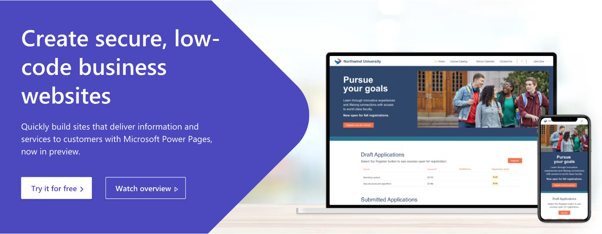
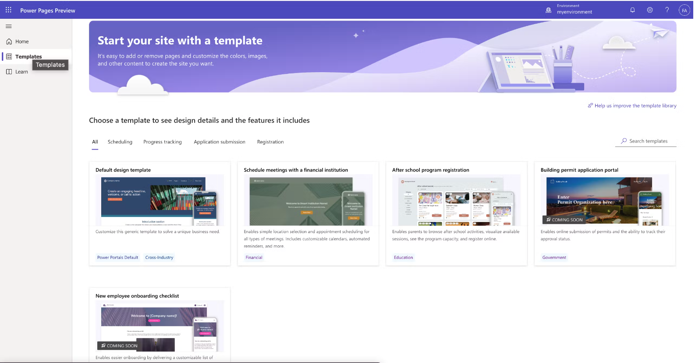
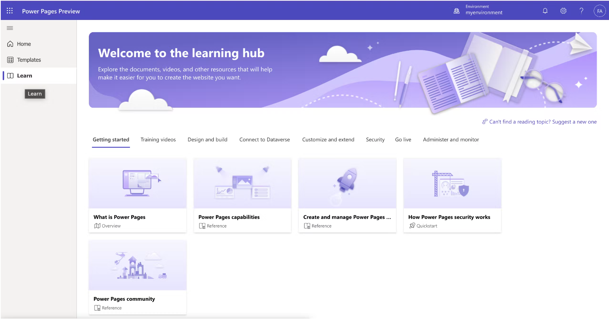

## Quick Overview of Microsoft Power Pages

Hi there,in this article, I will be introducing you to the new member of the new Microsoft Power Platform Family - Power Pages.

So let's get started!

## What is Power Pages?

In previous times we have made use of Power Apps portals to build customized web pages, layouts, and contents.

As a new standalone Product, Power Pages is a secure, enterprise-grade, low-code software as a service (SaaS) platform, that empowers you to create, host, and administer modern external-facing business websites quickly and easily, that seamlessly work across web browsers and devices.

Extending beyond portals capabilities, Power Pages empowers anyone, regardless of their technical background, with an effective platform to create data-powered, modern, and secure websites.

With new and exciting features added to this new product, businesses can now have a modern and secure website, which is built on a low-code platform that is business-centric in nature.

## Features and capabilities available in Power Pages

As announced during the Microsoft Build event, some of the exciting features and capabilities available in Power Pages include:

1. The Design Studio:
The Design Studio makes it easy to design, style, configure and publish modern business websites. Start from scratch or use one of the ready-to-use templates to design your site pages with text, video, images, business data forms and lists, and more.

2. The Templates Hub:
The Templates Hub hosts full-featured websites with demo data, so you can jumpstart your journey to managing scheduling, registration, application submission, and more, with these amazing built templates.

3.Learn Hub:
With the Learn Hub, you can explore guides, tutorials, and quick videos to learn how to build websites, model and visualize business data, work with code components, and of course, configure sites.
This will help you get started if you are just about building your first website or not quite familiar with building websites using a low-code tool.

Another amazing reason to try out Power Pages is that Power Pages runs on Microsoft Azure and connects with Dataverse to provide critical security capabilities that include advanced encryption, rich role-based access controls (RBAC), and support for Microsoft Azure Front Door and other web application firewalls. Microsoft Azure DDoS Protection addresses top web security vulnerabilities.

Also, Visual Studio Code is integrated into Power Pages, using Visual Studio Code in Power Pages, professional developers can code advanced capabilities using JavaScript, Liquid templates, code components, and web APIs. With these tools, you build and can securely interact with underlying business data and implement custom business logic, all without leaving the surface of your favorite developer tools.

Microsoft Power Platform command line interface also helps developers easily download and upload their customized projects.

## Getting Started with Power Pages

To quickly try out Power Pages, sign up for a [trial of Power Pages](https://powerpages.microsoft.com/?wt.mc_ID=Build2022_fld_us_bl_oo_bl_PowerPlatform).

Also, learn more about Power Pages capabilities, by going through the [Power Pages documentation](https://powerpages.microsoft.com/capabilities).

You can also go through the [Power Pages Preview documentation](https://learn.microsoft.com/power-pages/), for tutorial contents and official documentation on working with Power Pages.

Thank You for taking out time to read this article.
