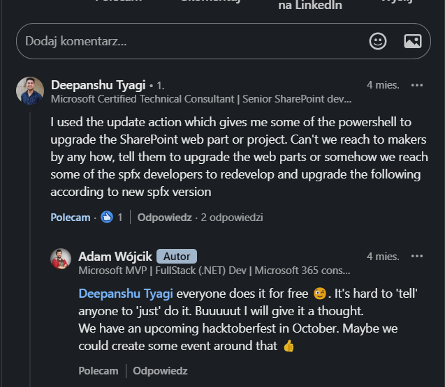
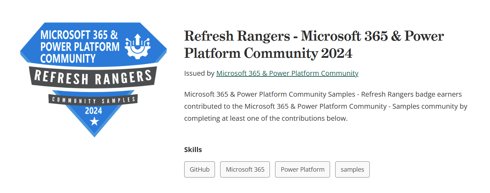
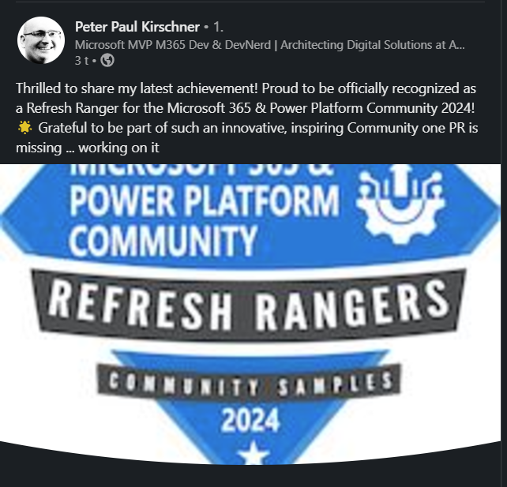
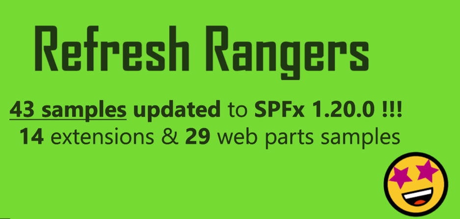

## 💬 It all starts with feedback

- Do you know what is the most common thing I usually say?
- "You Rock" ...?
- Well yes, but I also always ask to "Please, provide feedback 🙏"

And this is for a good reason. Feedback may come in many ways and it may not always be positive but it doesn't mean that it is not a good thing. In my opinion having negative feedback is better than no feedback at all. Thanks to that authors or maintainers know if we are on the right track and where we may improve our product or project. In a larger and open community like ours, [Microsoft 365 and Power Platform Community (PnP)](https://pnp.github.io/), in which we maintain many events and products and sites and forums and ... the list may go on and on, gathering feedback is a must have and our decisions and activities is driven based on it.

In this case it started exactly like that. When promoting one of the features of [SPFx Toolkit VS Code extension](https://marketplace.visualstudio.com/items?itemName=m365pnp.viva-connections-toolkit) which allows you to create a new project based on one of 400+ samples from our [SPFx Web parts, extensions and ACEs sample repositories](https://pnp.github.io/sp-dev-fx-webparts/). The feedback that I got was that this feature is problematic as many samples are out of date and in older versions of SPFx and there is an additional cost of first upgrading the sample to the latest version of SPFx if you want to extend it for your needs. For very old versions of SPFx this may be really hard and may introduce a lot of refactoring.

This feedback sparked and idea in my head: "What if, we created an event to update most popular and most used SPFx samples to the current latest version of SharePoint Framework"

## 😍 In a community you are never alone

What was just a simple idea in my head got shaped to an actuall event thanks to my teammates from the PnP Core team. In a matter of couple of days we were ready to kick off and boy we were extremly happy the community kicked off as well. We wanted to make it short, like one month long and we picked October, which means hacktoberfest, which is the most active month for every repo maintainer 🙂. Our initial plan was to create a couple of issues for the most popular SPFx Web parts and extensions with tips what is the best approach to perform the update of the sample but it turned out all of them were taken in first week of the event and we had to quickly extend the list with additional issues. Event better some contributors didn't wait for us to create issues but stepped in and just picked a sample they wanted and openned a PR with the update!
From our side we made it tripple sure that we will try recognize our contributors and we usually do that with [Credly badges](https://pnp.github.io/recognitionprogram/). When contributing towards this event you could get the:

- Hacktoberfest badge
- SPFx sample contributor badge
- and a brand new Refresh Ranger badge 🤩

Credly badges will prove that your actions make a difference in the community and that you helped out others. It is an awesome way to show of your skills and engagement which may be and additional boost for your career! And we were extremely happy seeing how the community promoted their work and achievemnts

During the event some really amaizing achievemnts were made but also some really awesome stories were born. It's impossible to mention it all but let's look at the issue to [upgrade RSS Reader web part](https://github.com/pnp/sp-dev-fx-webparts/issues/5254). This is a perfect example of how the community will try to help each other to move toward a common goal. Upgrading this SPFx project did prove very problematic 

## 🏆 Sum up

What was an initial aim to update 10-15 samples resulted in 43 samples 🤯.
When considering that this all was done only within 30 days the outcome is amaizing and it is impossible to thank you enough 👏👏👏👏.

Huge congrats to all Refresh Rangers that helped us out:
Aimery THOMAS
Alberto Perez
Dinesh Girase
Ervin Gayle
Gretchun Kim
Harminder Singh
Luccas Castro
Michał Romiszewski
Mohammed Amer
Nello D'Andrea
Nicolas Kheirallah
Nishkalank Bezawada
Peter Paul Kirschner
Reshmee Auckloo
Sandeep P S
Thomas Daly
Tobias Maestrini
Valeras Narbutas
You ALL Rock 🤩

## 🔮 Future plans

As always, we are only starting! Microsoft 365 and Power Platform Community mainain many sample repositories like script samples or Power Platform samples and there are still any SPFx samples which require and refresh 🤩. The first eddition has finished and it is time for a well deserved recharge but be on the look out for more updates. We Will Be Back 😎!