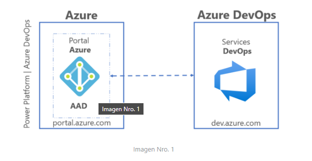
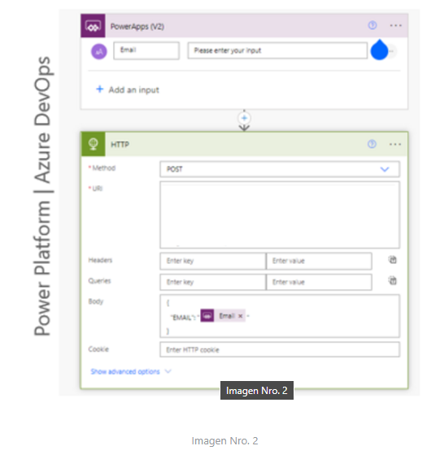
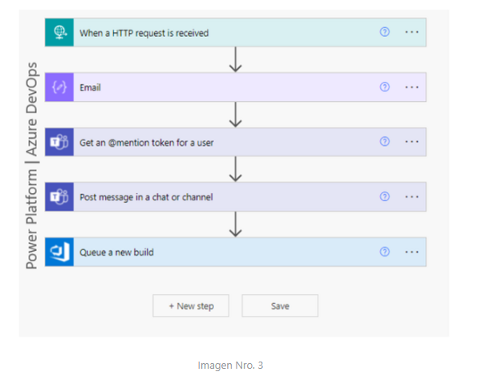
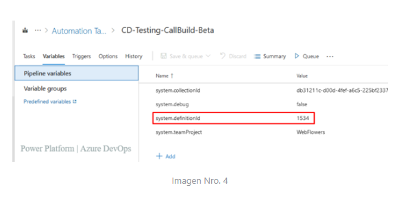
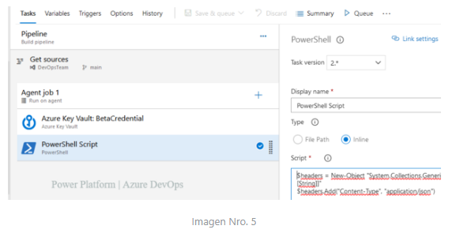
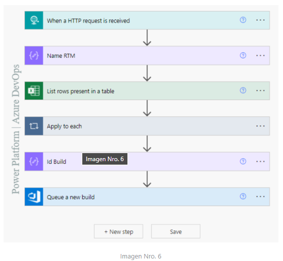

## Run Azure DevOps Pipelines by uninvited users to projects from Power Platform

 We will make use of Premium connectors (Azure DevOps, when a HTTP request is received, HTTP) and the standard Excel for Business and Microsoft Team connectors.

**Build** - It is the stage where the application will be compiled and will not delete any existing binary files, it will replace assemblies by updating the bin folder

**Release** - This is the stage where the code is released from the existing repository

**Deploy** - It is the stage where the code is deployed to different environments

## Why does this Process?

Imagine that at the tenant level there is a certain number of users, but at the organization level in an Azure DevOps project there is not even the same amount or due to the nature of the role, it is considered necessary that some users do not access the CI / CD pipelines at the level of DevOps services.

To achieve this, we will make use of the System.DefinitionId variable at the Build level.

Through a button in Power App, we will send as a parameter through the OnSelect event, the email of the user who executes the action.

`Invoke_Build_Beta.Run(User (). Email)
And
Notify ("Mensaje de alerta", NotificationType.Information,8000)`

Now once the action is executed from power Apps, in the HTTP connector it will make a POST request to the public URL of a second connector in the detonator when a http request is received and as the body of the message a JSON object will be sent which contains an email.

In the URI section of image No. 2, you are pointing to the public URL of a new connector, for the description of this content the value was omitted.

Now we will call the connector when a http request is received which will receive the value in JSON format, where an email will be related

I share an example of the JSON object to send

`{
  "EMAIL": "duvan.baena@dominio.com"
}`

Important, once the JSON is received we must extract only the characters that make up the email, remember that there are email addresses with more or less number of characters, for this we can make use of the workflow expression functions for Azure Logic Apps and Power Automate

`substring(string(triggerBody()), add(indexOf(string(triggerBody()), ':'), 2), sub(lastIndexOf(substring(string(triggerBody()), add(indexOf(string(triggerBody()), ':'), 2)), '}'), 1))`

The result obtained once the function is applied is ***duvan.baena@dominio.com***

Now the compose object has a value that represents an email address, like this: duvan.baena@dominio.com

This same previous output will be used in the other two (02) Get an @mention token connectors for a user and Post message in a chat or channel, which require a valid email at the tenant level to be used in the mention through a message to a Microsoft Team channel from Power Automate.

We will make use of the premium connector Queue a new build, which requires a previous connection.
Here's a question. How do you generate connection to a connector for a user who does not exist as a guest in Azure DevOps?

The answer is you can't, an alternate way would be to generate said connection by a user with permissions is through (email and pass) in the connector, there we select the Organization, the project and the Build Definition Id, these values exist at the azure DevOps level.

Today's goal is to learn about a new way to run CI/CD processes by a user with limited permissions in Azure DevOps from Power Platform.

What does is build definition Id? In the variable ***system.definitionId*** is a build agent-level variable responsible for Identifying the internal build pipeline of the DevOps services tool.

From Power Platform we have managed to execute a single build at the level of azure services, it is common to use different builds to comply with certain processes.

Today we will run an automatic code pipeline dynamically.

This CD profile has a source which points to a branch within a code repository.

Another ***PowerShell*** task responsible for executing a POST request to a public URL of another connector ***when a http request is received*** and sending it a value of type string in the body of the request.

We will use an object of type compose identified as Name RTM where we will also apply a workflow expression function, to obtain only the desired value.

`concat('V',string(substring(string(triggerBody()), add(int(indexOf(string(triggerBody()),'v')),1),6)))`

The body that traveled in the post request once the expression is applied, a value formed will be obtained, as well as***V220401***

Which will be an on-premises variable at the build level in Azure DevOps.

Let's talk a little bit about the definition of variables: By defining the same variable in several places with the same name, the variable with local scope wins. Therefore, a variable defined at the work level can override a set of variables at the phase level.

Let's go back to Image No. 4 there in the existing variables of the profile we will make use of two (02) at the local level

* Variable Local RTM V220401
* Variable Local system.definitionId 1534

the goal continues to be, from Power Platform to run a build according to the changing values of the local variables (RTM and system.definitionId)

## How does to achieve that?

Making use of the Connector List rows present in a table where we will select an excel table previously created with two (02) columns (Name, Id).

The columns will contain the name of the RTM variable which corresponds to a defined pattern and the Id field a number of four (4) digits with which the previously existing builds in Azure DevOps are identified.

In the filter query connector field we will search by the name eq 'outputs column of the compose name rtm

In this way it will only bring a single result in array format

But now from the array we must extract the result in a variable of type Int of four (04) digits.

the action ***Apply to each*** in this case is mandatory because from excel we can extract one or more records.

Internally apply to each we create a new component of type compose where we will get the value of the ID field. ! The required data !

Then we create a new compose identified ***Id Build*** which is applied an expression, seeking to obtain the result of the internal variable of the apply to each in Int format of four (4) digits corresponding to the variable system.definitionId of the build to be executed.

`int(substring(string(outputs('IdBuildBeta')), 2, 4))`

Now we will use the connector ***Queue a new build*** which will have a connection with a user with permissions to list the fields (Organization Name, Project Name and Build Definition Id)

In the Definition Id field, we will call the compose identified as ***Id Build***

Another parameter could be the one identified as Source Branch, there we can make a call to the nesting level of the branch from where we want to obtain the source code.

$/Main/QA/Feature_Login/ compose Name RTM
