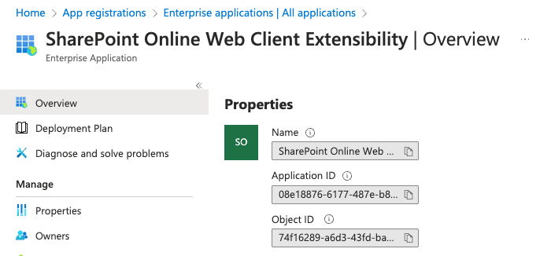

> This article originally appeared on Andrew Connell's site, **[Secure SPFx Solutions in a Post Isolated Web Part Retirement](https://www.voitanos.io/blog/secure-spfx-solutions-post-domain-isolated-webpart-retirement/?utm_medium=website&utm_source=pnpblog&utm_campaign=blog&utm_content=Secure+SPFx+Solutions+in+a+Post+Isolated+Web+Part+Retirement)**.

In my article **[SharePoint Framework Domain Isolated Web Part Retirement](https://www.voitanos.io/blog/sharepoint-framework-domain-isolated-webpart-retirement)**, I shared that Microsoft announced the [upcoming retirement of the SharePoint Framework (SPFx) domain-isolated web parts](https://learn.microsoft.com/sharepoint/dev/spfx/web-parts/isolated-web-parts-retirement/?WT.mc_id=M365-MVP-21083). It appears they’re doing this to get rid of `iframes` in SharePoint pages - an unfortunate development because it was one of the ways to better secure your SPFx solutions.

**Why?**

When an SPFx solution requests an access token from SharePoint Online (SPO) using either the Microsoft Graph or Microsoft Entra ID, SPO has no idea what app the request was sent from - it only knows it came from a client-side call. That means the permission grant applies to the entire tenant, not to a specific application in the tenant.

While Microsoft’s guidance is that you should only use delegated permissions in SPFx solutions so the employee who’s using the application must also have the permission the application is requesting, this isn’t enough for some organizations.

### How Domain-Isolated Web Parts Addressed this Issue

Domain-isolated web parts address this issue in two ways.

First, they create a Microsoft Entra ID application just for your SPFx solution.

Second, the web part was loaded within an `iframe` on its custom dynamic domain. The Entra application was configured to only accept requests from that domain. This way, **you could be assured that only your application was granted the permissions it needed, not the entire SPO tenant.**

While this concern may not be a big deal to many organizations, to some, it was a huge issue. I recently worked with a very large ($10B+ market cap) organization that was only going to allow SPFx solutions that needed to access Microsoft Graph or Microsoft Entra ID-secured endpoints. However, once they learned of this deprecation, **they banned deployment of all SPFx solutions that use the SPFx APIs for Microsoft Graph or Azure AD**. 😳

With the upcoming retirement of SPFx web parts, what options do you have if you want to have a more secure option in calling secured endpoints? So far, [Microsoft has only said](https://learn.microsoft.com/sharepoint/dev/spfx/web-parts/isolated-web-parts-retirement/?WT.mc_id=M365-MVP-21083): "*Microsoft is working on to be announced features that offer an alternative strategy for domain isolated web parts, but we strongly recommend to move away from domain isolated web parts.*"

### Options for Hardening SPFx Solutions

If you’re using the SPFx’s API for Microsoft Graph, there’s nothing you can do because your app is making a direct call to Microsoft Graph.

But, if you’re calling a Microsoft Entra ID-secured endpoint, there are some things you can do.

When your Microsoft Entra ID-secured endpoint receives the request from your SPFx app, it will include the access token your app obtained using the SPFx’s API for Microsoft Entra ID. You can then validate the access token to ensure that:

- **The token in the request is for your SPO tenant.** This can be found in the `iss` or `tid` claim in the JWT token. These will include the ID (GUID) of your Microsoft 365 tenant.
- **The received request is for the SPO app.** You can do this by checking the `appid` claim in the JWT token for the special SPO Entra application’s ID. Find the ID by logging into the [Microsoft Entra admin center](https://entra.microsoft.com), select **Identity > Applications > Enterprise applications** & find the one named **SharePoint Online Web Client Extensibility**. You’re looking for its **application ID** or **client ID** property.

- **The received request is from a specific user you expect.** You can do this by inspecting the `oid` claim in the JWT token (which is the user’s object ID property in your Microsoft Entra ID tenant) or the `upn` claim which is the user principal name. The `oid` is preferred as it never changes for a user, whereas the `upn` can be changed in the future.

You should only check the contents of the requested access token once you’ve validated it from Microsoft Entra ID, as I demonstrate in my article **[Validating Microsoft Entra ID generated OAuth tokens](https://www.voitanos.io/blog/validating-entra-id-generated-oauth-tokens)**.


If you’re a student of my **[Mastering the SharePoint Framework](https://www.voitanos.io/course-master-sharepoint-framework)** course, I show how to do this within the following lesson in the Fundamentals bundle: [Leveraging External APIs in SPFx Solutions > Calling Existing AzureAD Secured APIs with AadHttpClient](https://courses.voitanos.io/products/mastering-the-sharepoint-framework-fundamentals/categories/1125706/posts/3735426).


This pattern can also be used to secure calls to Microsoft Graph by using a Microsoft Entra ID-secured endpoint as a middle-man, or proxy, to call Microsoft Graph.

### What do you think?

I frequently come across SPFx developers who don’t realize the details of how SPFx solutions that require additional permissions work. But once they realize it, they sort of have that “uh-oh” moment.

**😳 Is that you?**

**🤷‍♂️ Is the retirement of the SPFx domain-isolated web parts going to impact your organization, or are you not concerned about this?**

**🙋‍♂️ Would you like to see how to implement a more secure SPFx solution like I explained above?**

Let me know and share your concerns or questions about what I propose above in the comments below!
